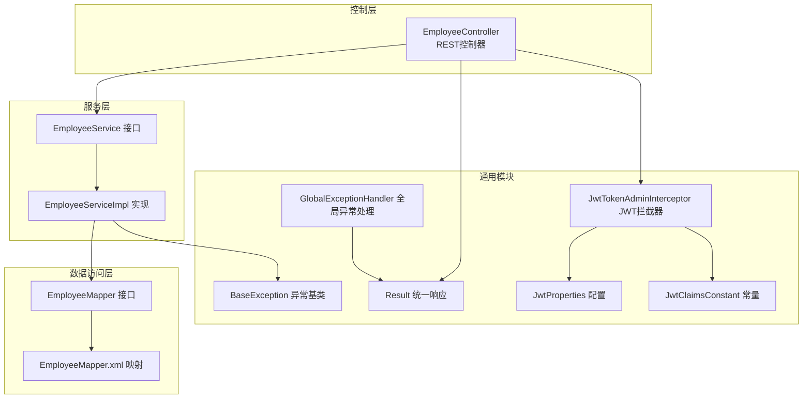
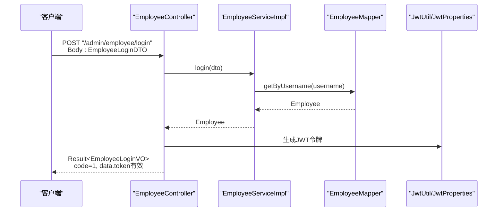
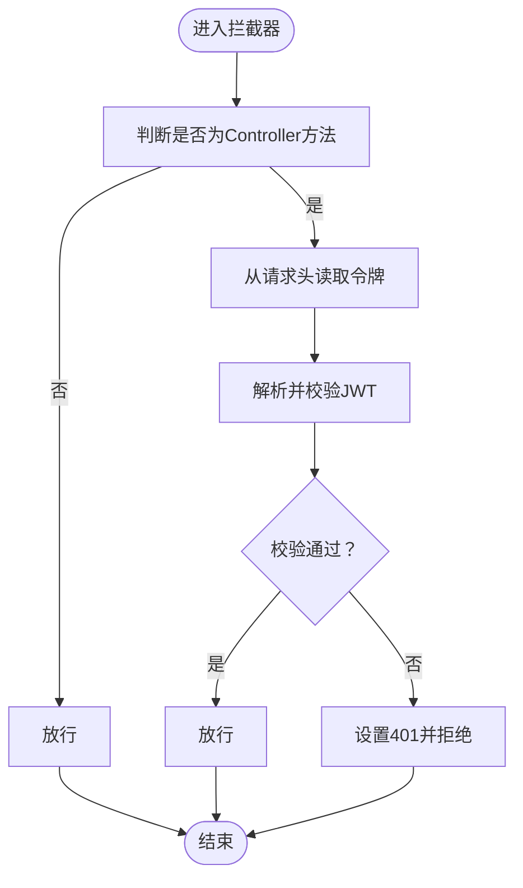
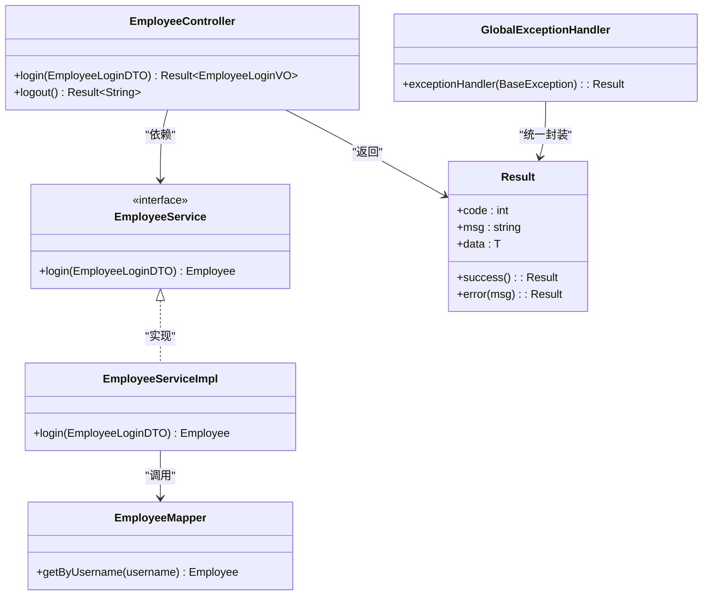
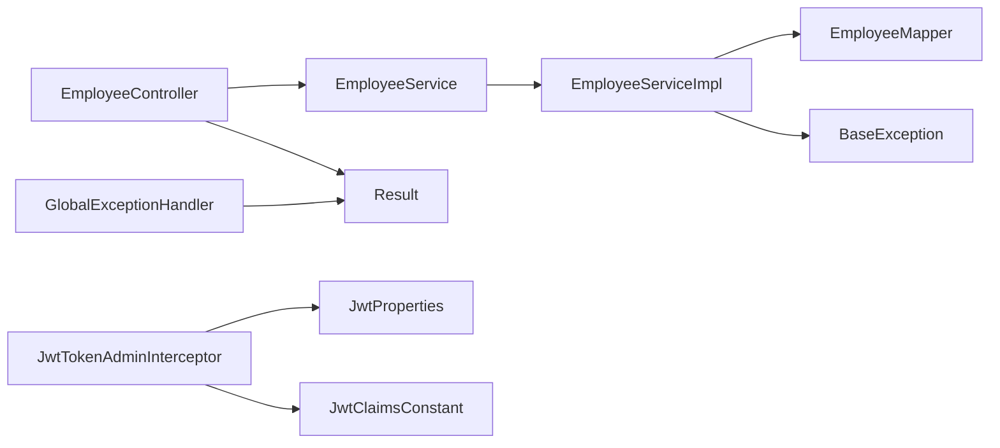

# API接口文档

<cite>
**本文引用的文件**
- [EmployeeController.java](file://sky-server/src/main/java/com/sky/controller/admin/EmployeeController.java)
- [EmployeeService.java](file://sky-server/src/main/java/com/sky/service/EmployeeService.java)
- [EmployeeServiceImpl.java](file://sky-server/src/main/java/com/sky/service/impl/EmployeeServiceImpl.java)
- [EmployeeMapper.java](file://sky-server/src/main/java/com/sky/mapper/EmployeeMapper.java)
- [EmployeeMapper.xml](file://sky-server/src/main/resources/mapper/EmployeeMapper.xml)
- [Result.java](file://sky-common/src/main/java/com/sky/result/Result.java)
- [BaseException.java](file://sky-common/src/main/java/com/sky/exception/BaseException.java)
- [GlobalExceptionHandler.java](file://sky-server/src/main/java/com/sky/handler/GlobalExceptionHandler.java)
- [JwtTokenAdminInterceptor.java](file://sky-server/src/main/java/com/sky/interceptor/JwtTokenAdminInterceptor.java)
- [JwtClaimsConstant.java](file://sky-common/src/main/java/com/sky/constant/JwtClaimsConstant.java)
- [JwtProperties.java](file://sky-common/src/main/java/com/sky/properties/JwtProperties.java)
- [EmployeeLoginDTO.java](file://sky-pojo/src/main/java/com/sky/dto/EmployeeLoginDTO.java)
- [EmployeeLoginVO.java](file://sky-pojo/src/main/java/com/sky/vo/EmployeeLoginVO.java)
</cite>

## 目录
1. [简介](#简介)
2. [项目结构](#项目结构)
3. [核心组件](#核心组件)
4. [架构总览](#架构总览)
5. [详细组件分析](#详细组件分析)
6. [依赖分析](#依赖分析)
7. [性能考虑](#性能考虑)
8. [故障排查指南](#故障排查指南)
9. [结论](#结论)
10. [附录](#附录)

## 简介
本文件为“苍穹外卖点餐系统”的管理员端员工管理API接口文档，覆盖员工登录与登出流程，以及基于JWT的认证与权限控制机制。文档提供接口规范、请求与响应格式、错误码与异常处理、状态码说明、认证与权限要求、测试工具与调试指南等内容，帮助开发者快速集成与验证。

## 项目结构
系统采用分层架构，主要模块包括：
- 控制层：负责接收HTTP请求、封装响应
- 服务层：实现业务逻辑
- 数据访问层：MyBatis映射数据库操作
- 通用模块：统一响应包装、异常体系、JWT工具与常量
- 配置与拦截：全局异常处理、JWT拦截器

图表来源
- [EmployeeController.java:1-75](file://sky-server/src/main/java/com/sky/controller/admin/EmployeeController.java#L1-75)
- [EmployeeService.java:1-16](file://sky-server/src/main/java/com/sky/service/EmployeeService.java#L1-16)
- [EmployeeServiceImpl.java:1-58](file://sky-server/src/main/java/com/sky/service/impl/EmployeeServiceImpl.java#L1-58)
- [EmployeeMapper.java:1-19](file://sky-server/src/main/java/com/sky/mapper/EmployeeMapper.java#L1-19)
- [EmployeeMapper.xml:1-6](file://sky-server/src/main/resources/mapper/EmployeeMapper.xml#L1-6)
- [Result.java:1-39](file://sky-common/src/main/java/com/sky/result/Result.java#L1-39)
- [BaseException.java:1-16](file://sky-common/src/main/java/com/sky/exception/BaseException.java#L1-16)
- [GlobalExceptionHandler.java:1-28](file://sky-server/src/main/java/com/sky/handler/GlobalExceptionHandler.java#L1-28)
- [JwtTokenAdminInterceptor.java:1-59](file://sky-server/src/main/java/com/sky/interceptor/JwtTokenAdminInterceptor.java#L1-59)
- [JwtProperties.java:1-27](file://sky-common/src/main/java/com/sky/properties/JwtProperties.java#L1-27)
- [JwtClaimsConstant.java:1-12](file://sky-common/src/main/java/com/sky/constant/JwtClaimsConstant.java#L1-12)

章节来源
- [EmployeeController.java:1-75](file://sky-server/src/main/java/com/sky/controller/admin/EmployeeController.java#L1-75)
- [EmployeeService.java:1-16](file://sky-server/src/main/java/com/sky/service/EmployeeService.java#L1-16)
- [EmployeeServiceImpl.java:1-58](file://sky-server/src/main/java/com/sky/service/impl/EmployeeServiceImpl.java#L1-58)
- [EmployeeMapper.java:1-19](file://sky-server/src/main/java/com/sky/mapper/EmployeeMapper.java#L1-19)
- [EmployeeMapper.xml:1-6](file://sky-server/src/main/resources/mapper/EmployeeMapper.xml#L1-6)
- [Result.java:1-39](file://sky-common/src/main/java/com/sky/result/Result.java#L1-39)
- [BaseException.java:1-16](file://sky-common/src/main/java/com/sky/exception/BaseException.java#L1-16)
- [GlobalExceptionHandler.java:1-28](file://sky-server/src/main/java/com/sky/handler/GlobalExceptionHandler.java#L1-28)
- [JwtTokenAdminInterceptor.java:1-59](file://sky-server/src/main/java/com/sky/interceptor/JwtTokenAdminInterceptor.java#L1-59)
- [JwtProperties.java:1-27](file://sky-common/src/main/java/com/sky/properties/JwtProperties.java#L1-27)
- [JwtClaimsConstant.java:1-12](file://sky-common/src/main/java/com/sky/constant/JwtClaimsConstant.java#L1-12)

## 核心组件
- 统一响应包装：Result 提供成功与失败两种返回形态，约定code=1表示成功，其他值为失败；msg用于携带消息；data承载业务数据。
- 全局异常处理：GlobalExceptionHandler捕获业务异常，统一返回Result.error(msg)，便于前端一致处理。
- JWT拦截器：JwtTokenAdminInterceptor从请求头读取令牌，解析并校验，失败返回401未授权。
- DTO/VO：EmployeeLoginDTO用于登录请求体，EmployeeLoginVO用于登录响应体。

章节来源
- [Result.java:11-39](file://sky-common/src/main/java/com/sky/result/Result.java#L11-L39)
- [GlobalExceptionHandler.java:21-27](file://sky-server/src/main/java/com/sky/handler/GlobalExceptionHandler.java#L21-L27)
- [JwtTokenAdminInterceptor.java:34-57](file://sky-server/src/main/java/com/sky/interceptor/JwtTokenAdminInterceptor.java#L34-L57)
- [EmployeeLoginDTO.java:9-20](file://sky-pojo/src/main/java/com/sky/dto/EmployeeLoginDTO.java#L9-L20)
- [EmployeeLoginVO.java:12-32](file://sky-pojo/src/main/java/com/sky/vo/EmployeeLoginVO.java#L12-L32)

## 架构总览
管理员端员工管理API遵循REST风格，使用JSON作为传输格式。登录流程通过JWT生成令牌，后续请求需在请求头携带令牌以完成鉴权。

图表来源
- [EmployeeController.java:40-62](file://sky-server/src/main/java/com/sky/controller/admin/EmployeeController.java#L40-L62)
- [EmployeeServiceImpl.java:28-55](file://sky-server/src/main/java/com/sky/service/impl/EmployeeServiceImpl.java#L28-L55)
- [EmployeeMapper.java:15-16](file://sky-server/src/main/java/com/sky/mapper/EmployeeMapper.java#L15-L16)
- [JwtProperties.java:15-17](file://sky-common/src/main/java/com/sky/properties/JwtProperties.java#L15-L17)

## 详细组件分析

### 员工登录接口
- 请求方法：POST
- URL：/admin/employee/login
- 功能：员工凭用户名与密码登录，成功后返回包含JWT令牌的登录信息。
- 请求体：EmployeeLoginDTO
  - 字段：username（字符串）、password（字符串）
- 响应体：Result<EmployeeLoginVO>
  - 成功时：code=1，data包含id、userName、name、token
  - 失败时：code=0，msg描述错误信息
- 认证机制：登录成功后由服务端生成JWT令牌，客户端随后在请求头携带令牌进行鉴权。

请求示例
- 方法与路径：POST /admin/employee/login
- 请求头：Content-Type: application/json
- 请求体示例（字段名与类型）：{"username":"string","password":"string"}

响应示例
- 成功响应（简化）：{"code":1,"data":{"id":1,"userName":"string","name":"string","token":"<JWT令牌>"}}
- 失败响应（简化）：{"code":0,"msg":"错误信息"}

章节来源
- [EmployeeController.java:40-62](file://sky-server/src/main/java/com/sky/controller/admin/EmployeeController.java#L40-L62)
- [EmployeeLoginDTO.java:11-20](file://sky-pojo/src/main/java/com/sky/dto/EmployeeLoginDTO.java#L11-L20)
- [EmployeeLoginVO.java:17-31](file://sky-pojo/src/main/java/com/sky/vo/EmployeeLoginVO.java#L17-L31)
- [Result.java:18-29](file://sky-common/src/main/java/com/sky/result/Result.java#L18-L29)

### 员工登出接口
- 请求方法：POST
- URL：/admin/employee/logout
- 功能：员工登出，服务端返回统一成功响应。
- 请求体：无
- 响应体：Result<String>
  - 成功时：code=1，msg为空或默认提示
  - 失败时：code=0，msg描述错误信息

请求示例
- 方法与路径：POST /admin/employee/logout
- 请求头：Content-Type: application/json
- 请求体：无

响应示例
- 成功响应（简化）：{"code":1,"msg":"success"}
- 失败响应（简化）：{"code":0,"msg":"错误信息"}

章节来源
- [EmployeeController.java:69-72](file://sky-server/src/main/java/com/sky/controller/admin/EmployeeController.java#L69-L72)
- [Result.java:18-29](file://sky-common/src/main/java/com/sky/result/Result.java#L18-L29)

### 认证与权限控制
- 请求头参数：从请求头读取令牌名称（来自配置），令牌内容为JWT字符串。
- 校验流程：拦截器解析JWT，提取员工标识，校验通过则放行，否则返回401未授权。
- 权限要求：除登录接口外，其他管理员端接口均需携带有效JWT令牌。

图表来源
- [JwtTokenAdminInterceptor.java:34-57](file://sky-server/src/main/java/com/sky/interceptor/JwtTokenAdminInterceptor.java#L34-L57)
- [JwtProperties.java:15-17](file://sky-common/src/main/java/com/sky/properties/JwtProperties.java#L15-L17)
- [JwtClaimsConstant.java:5-9](file://sky-common/src/main/java/com/sky/constant/JwtClaimsConstant.java#L5-L9)

章节来源
- [JwtTokenAdminInterceptor.java:34-57](file://sky-server/src/main/java/com/sky/interceptor/JwtTokenAdminInterceptor.java#L34-L57)
- [JwtProperties.java:15-17](file://sky-common/src/main/java/com/sky/properties/JwtProperties.java#L15-L17)
- [JwtClaimsConstant.java:5-9](file://sky-common/src/main/java/com/sky/constant/JwtClaimsConstant.java#L5-L9)

### 业务流程与数据流
- 登录流程：控制器接收请求，调用服务层执行登录校验，成功后生成JWT并返回；失败抛出业务异常，由全局异常处理器统一包装。
- 数据访问：服务层通过Mapper按用户名查询员工，再进行密码与状态校验。

图表来源
- [EmployeeController.java:27-72](file://sky-server/src/main/java/com/sky/controller/admin/EmployeeController.java#L27-L72)
- [EmployeeService.java:6-15](file://sky-server/src/main/java/com/sky/service/EmployeeService.java#L6-L15)
- [EmployeeServiceImpl.java:17-55](file://sky-server/src/main/java/com/sky/service/impl/EmployeeServiceImpl.java#L17-L55)
- [EmployeeMapper.java:8-16](file://sky-server/src/main/java/com/sky/mapper/EmployeeMapper.java#L8-L16)
- [Result.java:12-39](file://sky-common/src/main/java/com/sky/result/Result.java#L12-L39)
- [GlobalExceptionHandler.java:21-25](file://sky-server/src/main/java/com/sky/handler/GlobalExceptionHandler.java#L21-L25)

章节来源
- [EmployeeController.java:27-72](file://sky-server/src/main/java/com/sky/controller/admin/EmployeeController.java#L27-L72)
- [EmployeeService.java:6-15](file://sky-server/src/main/java/com/sky/service/EmployeeService.java#L6-L15)
- [EmployeeServiceImpl.java:17-55](file://sky-server/src/main/java/com/sky/service/impl/EmployeeServiceImpl.java#L17-L55)
- [EmployeeMapper.java:8-16](file://sky-server/src/main/java/com/sky/mapper/EmployeeMapper.java#L8-L16)
- [Result.java:12-39](file://sky-common/src/main/java/com/sky/result/Result.java#L12-L39)
- [GlobalExceptionHandler.java:21-25](file://sky-server/src/main/java/com/sky/handler/GlobalExceptionHandler.java#L21-L25)

## 依赖分析
- 控制器依赖服务接口与JWT配置；服务实现依赖Mapper与异常类型；全局异常处理器依赖统一响应包装。
- 拦截器依赖JWT工具与配置常量，实现对管理员端接口的统一鉴权。

图表来源
- [EmployeeController.java:29-32](file://sky-server/src/main/java/com/sky/controller/admin/EmployeeController.java#L29-L32)
- [EmployeeServiceImpl.java:19-20](file://sky-server/src/main/java/com/sky/service/impl/EmployeeServiceImpl.java#L19-L20)
- [GlobalExceptionHandler.java:21-25](file://sky-server/src/main/java/com/sky/handler/GlobalExceptionHandler.java#L21-L25)
- [JwtTokenAdminInterceptor.java:22-23](file://sky-server/src/main/java/com/sky/interceptor/JwtTokenAdminInterceptor.java#L22-L23)

章节来源
- [EmployeeController.java:29-32](file://sky-server/src/main/java/com/sky/controller/admin/EmployeeController.java#L29-L32)
- [EmployeeServiceImpl.java:19-20](file://sky-server/src/main/java/com/sky/service/impl/EmployeeServiceImpl.java#L19-L20)
- [GlobalExceptionHandler.java:21-25](file://sky-server/src/main/java/com/sky/handler/GlobalExceptionHandler.java#L21-L25)
- [JwtTokenAdminInterceptor.java:22-23](file://sky-server/src/main/java/com/sky/interceptor/JwtTokenAdminInterceptor.java#L22-L23)

## 性能考虑
- 登录接口仅进行用户名查询与简单密码比较，复杂度近似O(1)；建议在数据库为username建立索引以提升查询效率。
- JWT解析为轻量级操作，通常毫秒级开销；建议合理设置令牌有效期，避免过长导致安全风险。
- 全局异常处理统一返回，减少重复逻辑，有利于降低响应时间与提高一致性。

## 故障排查指南
- 401未授权：检查请求头是否正确携带令牌，令牌名称与密钥配置是否匹配。
- 登录失败：确认用户名是否存在、密码是否正确、账户状态是否正常。
- 统一错误响应：所有业务异常将被全局异常处理器捕获并以Result.error(msg)返回，前端可据此展示友好提示。

章节来源
- [JwtTokenAdminInterceptor.java:52-56](file://sky-server/src/main/java/com/sky/interceptor/JwtTokenAdminInterceptor.java#L52-L56)
- [EmployeeServiceImpl.java:36-51](file://sky-server/src/main/java/com/sky/service/impl/EmployeeServiceImpl.java#L36-L51)
- [GlobalExceptionHandler.java:21-25](file://sky-server/src/main/java/com/sky/handler/GlobalExceptionHandler.java#L21-L25)
- [Result.java:31-36](file://sky-common/src/main/java/com/sky/result/Result.java#L31-L36)

## 结论
本API文档梳理了管理员端员工登录与登出的完整流程，明确了认证机制、权限控制、统一响应与异常处理策略。建议在生产环境中严格配置JWT密钥与令牌有效期，并在客户端妥善存储与传递令牌，确保系统安全与稳定运行。

## 附录

### 错误码与状态码说明
- 统一响应码
  - code=1：请求成功
  - code=0：请求失败，msg携带错误信息
- HTTP状态码
  - 200：请求成功
  - 401：未授权（JWT校验失败）
  - 500：服务器内部错误（未覆盖的异常）

章节来源
- [Result.java:14-16](file://sky-common/src/main/java/com/sky/result/Result.java#L14-L16)
- [GlobalExceptionHandler.java:21-25](file://sky-server/src/main/java/com/sky/handler/GlobalExceptionHandler.java#L21-L25)
- [JwtTokenAdminInterceptor.java:52-56](file://sky-server/src/main/java/com/sky/interceptor/JwtTokenAdminInterceptor.java#L52-L56)

### API测试工具与调试指南
- 推荐工具：Postman、curl
- 测试步骤
  - 使用登录接口获取token
  - 在后续请求的请求头添加令牌（令牌名称来自配置），例如Authorization: <JWT令牌>
  - 观察响应码与响应体，若出现401，请检查令牌有效性与配置
- 调试要点
  - 关注全局异常处理器的日志输出，定位业务异常原因
  - 核对数据库中员工状态与密码字段，确保与登录逻辑一致