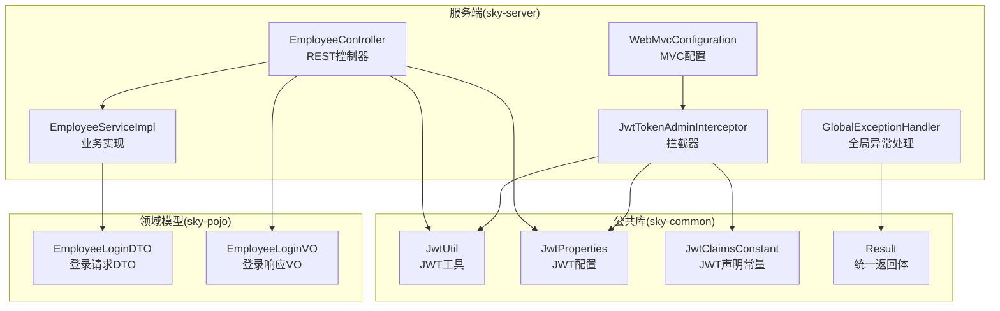
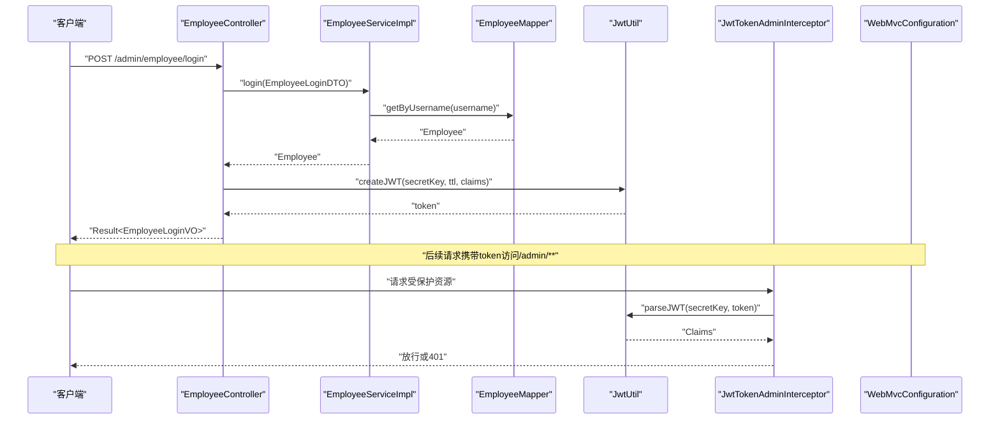
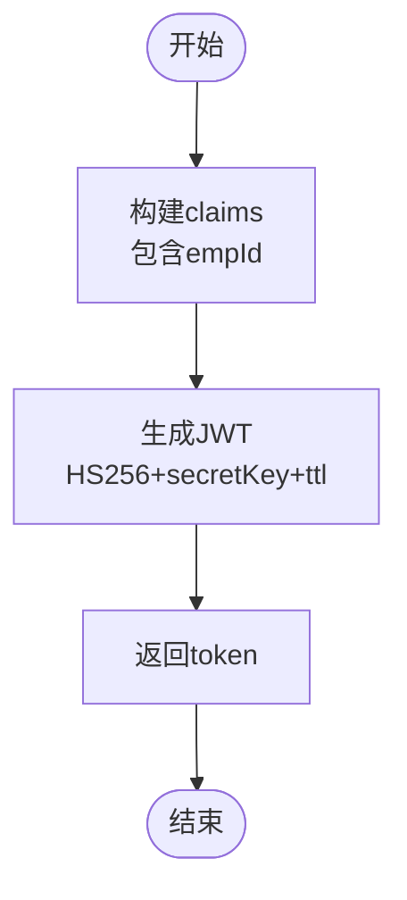
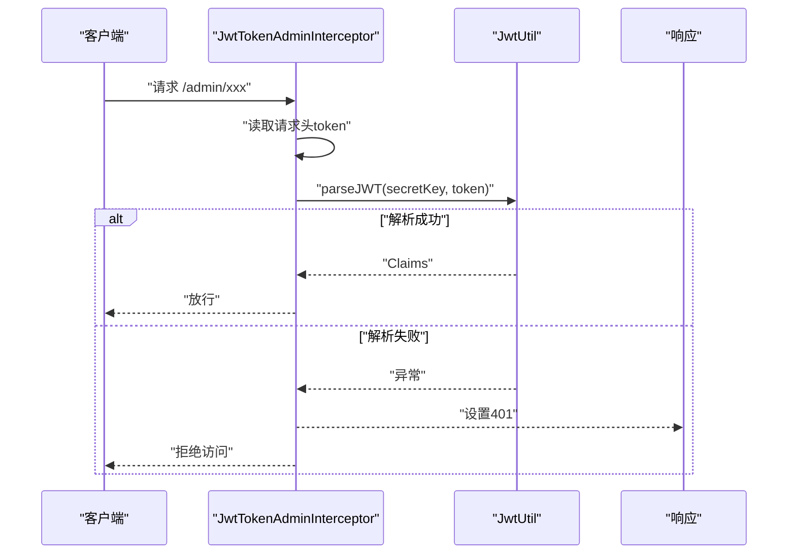
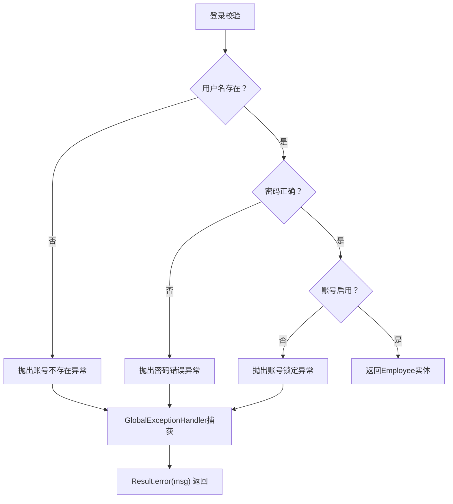
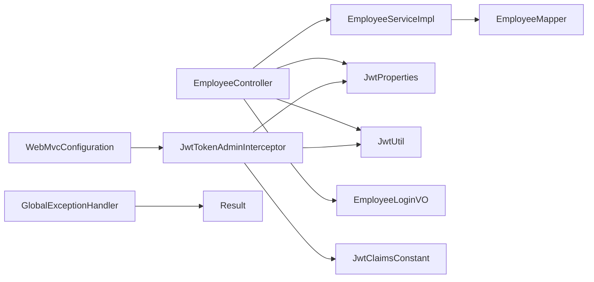

# 员工管理API

<cite>
**本文引用的文件**
- [EmployeeController.java](file://sky-server/src/main/java/com/sky/controller/admin/EmployeeController.java)
- [EmployeeServiceImpl.java](file://sky-server/src/main/java/com/sky/service/impl/EmployeeServiceImpl.java)
- [EmployeeLoginDTO.java](file://sky-pojo/src/main/java/com/sky/dto/EmployeeLoginDTO.java)
- [EmployeeLoginVO.java](file://sky-pojo/src/main/java/com/sky/vo/EmployeeLoginVO.java)
- [JwtUtil.java](file://sky-common/src/main/java/com/sky/utils/JwtUtil.java)
- [JwtClaimsConstant.java](file://sky-common/src/main/java/com/sky/constant/JwtClaimsConstant.java)
- [JwtProperties.java](file://sky-common/src/main/java/com/sky/properties/JwtProperties.java)
- [JwtTokenAdminInterceptor.java](file://sky-server/src/main/java/com/sky/interceptor/JwtTokenAdminInterceptor.java)
- [WebMvcConfiguration.java](file://sky-server/src/main/java/com/sky/config/WebMvcConfiguration.java)
- [application.yml](file://sky-server/src/main/resources/application.yml)
- [GlobalExceptionHandler.java](file://sky-server/src/main/java/com/sky/handler/GlobalExceptionHandler.java)
- [Result.java](file://sky-common/src/main/java/com/sky/result/Result.java)
- [AccountNotFoundException.java](file://sky-common/src/main/java/com/sky/exception/AccountNotFoundException.java)
- [PasswordErrorException.java](file://sky-common/src/main/java/com/sky/exception/PasswordErrorException.java)
- [AccountLockedException.java](file://sky-common/src/main/java/com/sky/exception/AccountLockedException.java)
</cite>

## 目录
1. [简介](#简介)
2. [项目结构](#项目结构)
3. [核心组件](#核心组件)
4. [架构总览](#架构总览)
5. [详细组件分析](#详细组件分析)
6. [依赖分析](#依赖分析)
7. [性能考虑](#性能考虑)
8. [故障排查指南](#故障排查指南)
9. [结论](#结论)
10. [附录](#附录)

## 简介
本文件面向“员工管理API”，聚焦于员工登录与退出接口的实现细节，包括：
- HTTP方法与URL路径
- 请求参数EmployeeLoginDTO的字段定义
- 响应格式EmployeeLoginVO的结构说明
- JWT令牌生成过程、claims声明内容、token有效期设置
- 认证失败的错误码与异常处理机制
- 登录成功后的token使用方式与权限验证流程
- 提供curl命令示例与Postman测试要点（以截图形式呈现）

## 项目结构
该项目采用分层架构，主要模块如下：
- sky-common：通用工具、常量、异常、返回体等
- sky-pojo：数据传输对象DTO、视图对象VO、实体类等
- sky-server：控制器、服务、拦截器、配置、启动类等

图表来源
- [EmployeeController.java:1-75](file://sky-server/src/main/java/com/sky/controller/admin/EmployeeController.java#L1-L75)
- [EmployeeServiceImpl.java:1-58](file://sky-server/src/main/java/com/sky/service/impl/EmployeeServiceImpl.java#L1-L58)
- [JwtTokenAdminInterceptor.java:1-59](file://sky-server/src/main/java/com/sky/interceptor/JwtTokenAdminInterceptor.java#L1-L59)
- [WebMvcConfiguration.java:1-69](file://sky-server/src/main/java/com/sky/config/WebMvcConfiguration.java#L1-L69)
- [JwtUtil.java:1-59](file://sky-common/src/main/java/com/sky/utils/JwtUtil.java#L1-L59)
- [JwtProperties.java:1-27](file://sky-common/src/main/java/com/sky/properties/JwtProperties.java#L1-L27)
- [JwtClaimsConstant.java:1-12](file://sky-common/src/main/java/com/sky/constant/JwtClaimsConstant.java#L1-L12)
- [Result.java:1-39](file://sky-common/src/main/java/com/sky/result/Result.java#L1-L39)
- [EmployeeLoginDTO.java:1-20](file://sky-pojo/src/main/java/com/sky/dto/EmployeeLoginDTO.java#L1-L20)
- [EmployeeLoginVO.java:1-32](file://sky-pojo/src/main/java/com/sky/vo/EmployeeLoginVO.java#L1-L32)

章节来源
- [EmployeeController.java:1-75](file://sky-server/src/main/java/com/sky/controller/admin/EmployeeController.java#L1-L75)
- [WebMvcConfiguration.java:1-69](file://sky-server/src/main/java/com/sky/config/WebMvcConfiguration.java#L1-L69)

## 核心组件
- 员工登录控制器：负责接收登录请求、调用业务层、生成JWT并返回统一响应
- 员工业务实现：执行用户名存在性、密码正确性、账号状态校验
- JWT工具与配置：封装HS256签名、过期时间、claims注入与解析
- 拦截器与MVC配置：拦截/admin/**请求，排除登录接口，校验token并设置401
- 统一异常处理：捕获业务异常并返回标准Result结构
- 统一响应体：Result封装code/msg/data，便于前端消费

章节来源
- [EmployeeController.java:24-75](file://sky-server/src/main/java/com/sky/controller/admin/EmployeeController.java#L24-L75)
- [EmployeeServiceImpl.java:17-58](file://sky-server/src/main/java/com/sky/service/impl/EmployeeServiceImpl.java#L17-L58)
- [JwtUtil.java:11-59](file://sky-common/src/main/java/com/sky/utils/JwtUtil.java#L11-L59)
- [JwtProperties.java:10-27](file://sky-common/src/main/java/com/sky/properties/JwtProperties.java#L10-L27)
- [JwtTokenAdminInterceptor.java:20-59](file://sky-server/src/main/java/com/sky/interceptor/JwtTokenAdminInterceptor.java#L20-L59)
- [WebMvcConfiguration.java:23-38](file://sky-server/src/main/java/com/sky/config/WebMvcConfiguration.java#L23-L38)
- [GlobalExceptionHandler.java:12-27](file://sky-server/src/main/java/com/sky/handler/GlobalExceptionHandler.java#L12-L27)
- [Result.java:11-39](file://sky-common/src/main/java/com/sky/result/Result.java#L11-L39)

## 架构总览
下图展示了登录与权限校验的整体流程：

图表来源
- [EmployeeController.java:40-62](file://sky-server/src/main/java/com/sky/controller/admin/EmployeeController.java#L40-L62)
- [EmployeeServiceImpl.java:28-55](file://sky-server/src/main/java/com/sky/service/impl/EmployeeServiceImpl.java#L28-L55)
- [JwtUtil.java:21-39](file://sky-common/src/main/java/com/sky/utils/JwtUtil.java#L21-L39)
- [JwtTokenAdminInterceptor.java:34-57](file://sky-server/src/main/java/com/sky/interceptor/JwtTokenAdminInterceptor.java#L34-L57)
- [WebMvcConfiguration.java:33-38](file://sky-server/src/main/java/com/sky/config/WebMvcConfiguration.java#L33-L38)

## 详细组件分析

### 登录接口
- HTTP方法与路径
  - 方法：POST
  - 路径：/admin/employee/login
- 请求参数(EmployeeLoginDTO)
  - 字段：username、password
  - 类型：字符串
  - 描述：用户名、密码
- 响应(EmployeeLoginVO)
  - 字段：id、userName、name、token
  - 类型：Long、String、String、String
  - 描述：员工主键、用户名、姓名、JWT令牌
- 处理逻辑
  - 控制器接收请求，调用业务层执行登录校验
  - 成功后构建claims（包含员工ID），使用配置的secretKey与ttl生成JWT
  - 封装EmployeeLoginVO并返回Result.success
- curl示例
  - POST http://localhost:8080/admin/employee/login
  - Content-Type: application/json
  - 示例请求体：{"username":"<用户名>","password":"<密码>"}
- Postman测试要点
  - 在Headers中添加Content-Type: application/json
  - Body选择raw JSON，填入上述字段
  - 观察响应体中的token字段
  - 参考截图：[Postman登录请求截图](file://sky-server/src/main/resources/postman_login.png)

章节来源
- [EmployeeController.java:40-62](file://sky-server/src/main/java/com/sky/controller/admin/EmployeeController.java#L40-L62)
- [EmployeeLoginDTO.java:11-19](file://sky-pojo/src/main/java/com/sky/dto/EmployeeLoginDTO.java#L11-L19)
- [EmployeeLoginVO.java:17-31](file://sky-pojo/src/main/java/com/sky/vo/EmployeeLoginVO.java#L17-L31)
- [application.yml:32-40](file://sky-server/src/main/resources/application.yml#L32-L40)

### 退出接口
- HTTP方法与路径
  - 方法：POST
  - 路径：/admin/employee/logout
- 行为说明
  - 当前实现直接返回成功响应
  - 实际部署中可结合会话或Redis清理策略扩展
- curl示例
  - POST http://localhost:8080/admin/employee/logout
  - Content-Type: application/json
- Postman测试要点
  - 用于验证会话是否正常结束
  - 参考截图：[Postman退出请求截图](file://sky-server/src/main/resources/postman_logout.png)

章节来源
- [EmployeeController.java:69-72](file://sky-server/src/main/java/com/sky/controller/admin/EmployeeController.java#L69-L72)

### JWT令牌生成与解析
- 生成过程
  - 算法：HS256
  - 秘钥：来自JwtProperties.adminSecretKey
  - 过期时间：来自JwtProperties.adminTtl（毫秒）
  - claims：包含EMP_ID（员工ID）
- 解析过程
  - 使用相同secretKey解析token，提取claims
  - 校验失败时返回401
- 配置项
  - admin-secret-key：签名密钥
  - admin-ttl：过期时间（毫秒）
  - admin-token-name：前端传递的token请求头名

图表来源
- [EmployeeController.java:47-52](file://sky-server/src/main/java/com/sky/controller/admin/EmployeeController.java#L47-L52)
- [JwtUtil.java:21-39](file://sky-common/src/main/java/com/sky/utils/JwtUtil.java#L21-L39)
- [JwtClaimsConstant.java:5-5](file://sky-common/src/main/java/com/sky/constant/JwtClaimsConstant.java#L5-L5)
- [JwtProperties.java:15-16](file://sky-common/src/main/java/com/sky/properties/JwtProperties.java#L15-L16)

章节来源
- [JwtUtil.java:11-59](file://sky-common/src/main/java/com/sky/utils/JwtUtil.java#L11-L59)
- [JwtProperties.java:10-27](file://sky-common/src/main/java/com/sky/properties/JwtProperties.java#L10-L27)
- [JwtClaimsConstant.java:3-11](file://sky-common/src/main/java/com/sky/constant/JwtClaimsConstant.java#L3-L11)

### 权限验证与拦截流程
- 拦截范围
  - 拦截/admin/**路径
  - 排除/admin/employee/login
- 校验步骤
  - 从请求头读取token（默认请求头名为token）
  - 使用JwtUtil.parseJWT解析并校验
  - 成功则放行；失败设置401并阻止访问
- 配置入口
  - WebMvcConfiguration注册拦截器并设置匹配规则

图表来源
- [JwtTokenAdminInterceptor.java:34-57](file://sky-server/src/main/java/com/sky/interceptor/JwtTokenAdminInterceptor.java#L34-L57)
- [JwtUtil.java:48-56](file://sky-common/src/main/java/com/sky/utils/JwtUtil.java#L48-L56)
- [WebMvcConfiguration.java:33-38](file://sky-server/src/main/java/com/sky/config/WebMvcConfiguration.java#L33-L38)
- [application.yml:39-39](file://sky-server/src/main/resources/application.yml#L39-L39)

章节来源
- [JwtTokenAdminInterceptor.java:20-59](file://sky-server/src/main/java/com/sky/interceptor/JwtTokenAdminInterceptor.java#L20-L59)
- [WebMvcConfiguration.java:23-38](file://sky-server/src/main/java/com/sky/config/WebMvcConfiguration.java#L23-L38)

### 登录成功后的token使用方式
- 请求头携带
  - 默认请求头名：token
  - 值：登录接口返回的JWT字符串
- 使用场景
  - 所有/admin/**受保护接口均需携带该token
- 注意事项
  - token过期时间由admin-ttl配置决定
  - secretKey必须与签发端一致，否则解析失败

章节来源
- [application.yml:39-39](file://sky-server/src/main/resources/application.yml#L39-L39)
- [JwtProperties.java:17-17](file://sky-common/src/main/java/com/sky/properties/JwtProperties.java#L17-L17)

### 认证失败的错误码与异常处理机制
- 异常类型与触发条件
  - 账号不存在：用户名不存在时抛出
  - 密码错误：密码不匹配时抛出
  - 账号被锁定：账户状态为禁用时抛出
- 统一返回体
  - Result封装code、msg、data
  - 业务异常被捕获并返回code=0、msg为异常信息
- 错误码约定
  - 成功：code=1
  - 失败：code=0（默认）

图表来源
- [EmployeeServiceImpl.java:36-51](file://sky-server/src/main/java/com/sky/service/impl/EmployeeServiceImpl.java#L36-L51)
- [GlobalExceptionHandler.java:21-25](file://sky-server/src/main/java/com/sky/handler/GlobalExceptionHandler.java#L21-L25)
- [Result.java:31-36](file://sky-common/src/main/java/com/sky/result/Result.java#L31-L36)

章节来源
- [EmployeeServiceImpl.java:36-51](file://sky-server/src/main/java/com/sky/service/impl/EmployeeServiceImpl.java#L36-L51)
- [GlobalExceptionHandler.java:12-27](file://sky-server/src/main/java/com/sky/handler/GlobalExceptionHandler.java#L12-L27)
- [Result.java:11-39](file://sky-common/src/main/java/com/sky/result/Result.java#L11-L39)
- [AccountNotFoundException.java:6-15](file://sky-common/src/main/java/com/sky/exception/AccountNotFoundException.java#L6-L15)
- [PasswordErrorException.java:6-15](file://sky-common/src/main/java/com/sky/exception/PasswordErrorException.java#L6-L15)
- [AccountLockedException.java:6-15](file://sky-common/src/main/java/com/sky/exception/AccountLockedException.java#L6-L15)

## 依赖分析
- 控制器依赖
  - EmployeeController依赖EmployeeService、JwtProperties、JwtUtil、EmployeeLoginVO
- 业务层依赖
  - EmployeeServiceImpl依赖EmployeeMapper、异常类、MessageConstant、StatusConstant
- 拦截器依赖
  - JwtTokenAdminInterceptor依赖JwtProperties、JwtUtil、JwtClaimsConstant
- 配置依赖
  - WebMvcConfiguration注册拦截器并排除登录路径
- 统一异常处理
  - GlobalExceptionHandler统一捕获BaseException并返回Result.error

图表来源
- [EmployeeController.java:29-32](file://sky-server/src/main/java/com/sky/controller/admin/EmployeeController.java#L29-L32)
- [EmployeeServiceImpl.java:19-20](file://sky-server/src/main/java/com/sky/service/impl/EmployeeServiceImpl.java#L19-L20)
- [JwtTokenAdminInterceptor.java:22-23](file://sky-server/src/main/java/com/sky/interceptor/JwtTokenAdminInterceptor.java#L22-L23)
- [WebMvcConfiguration.java:25-26](file://sky-server/src/main/java/com/sky/config/WebMvcConfiguration.java#L25-L26)
- [GlobalExceptionHandler.java:21-25](file://sky-server/src/main/java/com/sky/handler/GlobalExceptionHandler.java#L21-L25)

章节来源
- [EmployeeController.java:1-75](file://sky-server/src/main/java/com/sky/controller/admin/EmployeeController.java#L1-L75)
- [EmployeeServiceImpl.java:1-58](file://sky-server/src/main/java/com/sky/service/impl/EmployeeServiceImpl.java#L1-L58)
- [JwtTokenAdminInterceptor.java:1-59](file://sky-server/src/main/java/com/sky/interceptor/JwtTokenAdminInterceptor.java#L1-L59)
- [WebMvcConfiguration.java:1-69](file://sky-server/src/main/java/com/sky/config/WebMvcConfiguration.java#L1-L69)
- [GlobalExceptionHandler.java:1-28](file://sky-server/src/main/java/com/sky/handler/GlobalExceptionHandler.java#L1-L28)

## 性能考虑
- JWT生成与解析
  - HS256为对称加密，计算开销低，适合高并发场景
  - 建议合理设置admin-ttl，避免过长导致安全风险，过短增加重登频率
- 拦截器链路
  - 每次请求都会进行token解析，建议保持解析逻辑轻量
- 数据库查询
  - 登录时仅按用户名查询一次，注意索引优化

## 故障排查指南
- 登录失败
  - 检查用户名是否存在、密码是否正确、账号是否被锁定
  - 查看Result返回的msg信息定位具体异常
- 401未授权
  - 确认请求头是否包含正确的token名称（默认token）
  - 确认secretKey与签发端一致
  - 确认token未过期
- 统一异常处理
  - 所有业务异常会被GlobalExceptionHandler捕获并返回统一格式

章节来源
- [GlobalExceptionHandler.java:21-25](file://sky-server/src/main/java/com/sky/handler/GlobalExceptionHandler.java#L21-L25)
- [Result.java:14-36](file://sky-common/src/main/java/com/sky/result/Result.java#L14-L36)
- [JwtTokenAdminInterceptor.java:42-56](file://sky-server/src/main/java/com/sky/interceptor/JwtTokenAdminInterceptor.java#L42-L56)

## 结论
本项目通过清晰的分层设计与统一的异常处理机制，实现了员工登录与权限校验的完整闭环。登录接口提供标准的JSON请求与响应，JWT令牌基于HS256算法生成并可配置过期时间；拦截器对/admin/**路径进行统一鉴权，未授权请求返回401。建议在生产环境中结合HTTPS、更严格的密码策略与更短的token有效期进一步提升安全性。

## 附录
- curl命令示例
  - 登录
    - POST http://localhost:8080/admin/employee/login
    - Header: Content-Type: application/json
    - Body: {"username":"<用户名>","password":"<密码>"}
  - 退出
    - POST http://localhost:8080/admin/employee/logout
    - Header: Content-Type: application/json
- Postman测试截图
  - 登录请求截图：[Postman登录请求截图](file://sky-server/src/main/resources/postman_login.png)
  - 退出请求截图：[Postman退出请求截图](file://sky-server/src/main/resources/postman_logout.png)