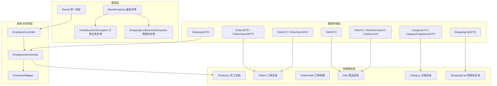
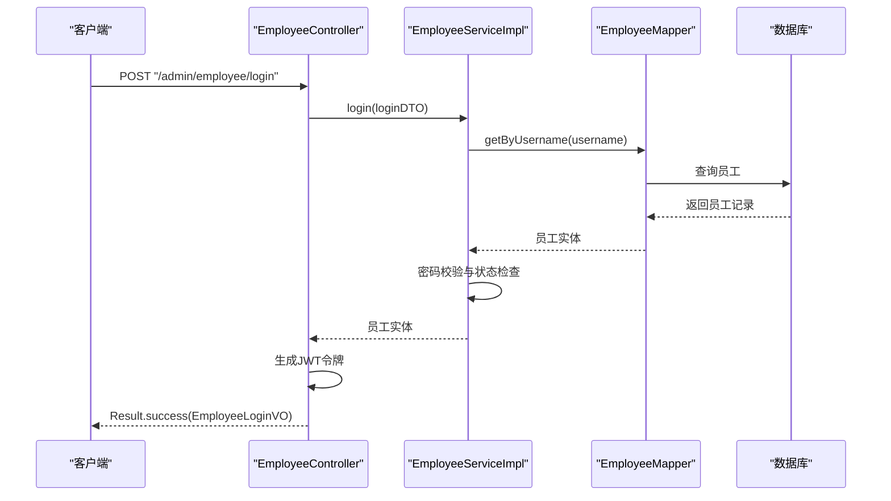
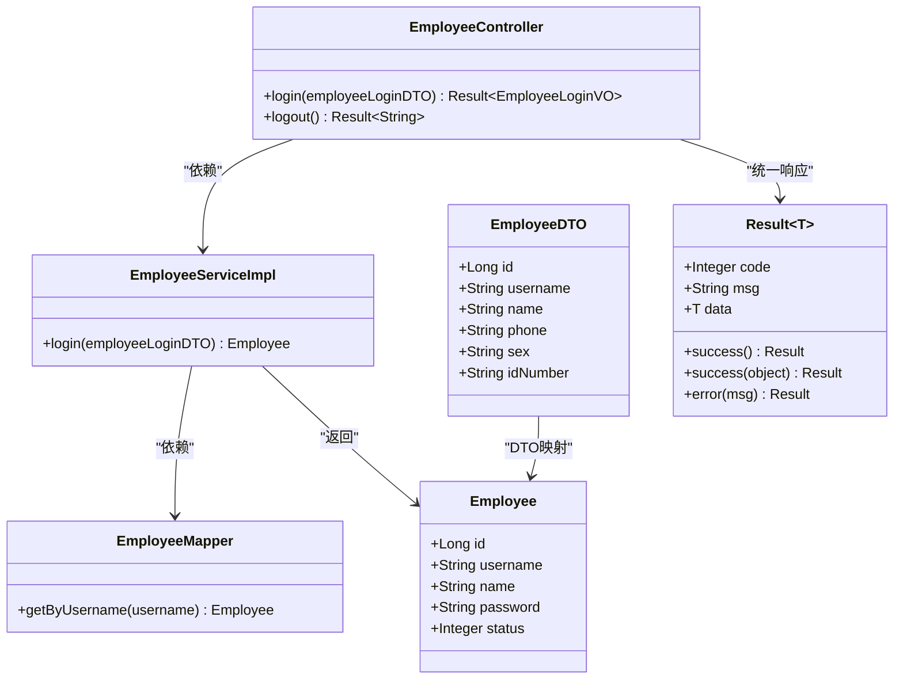
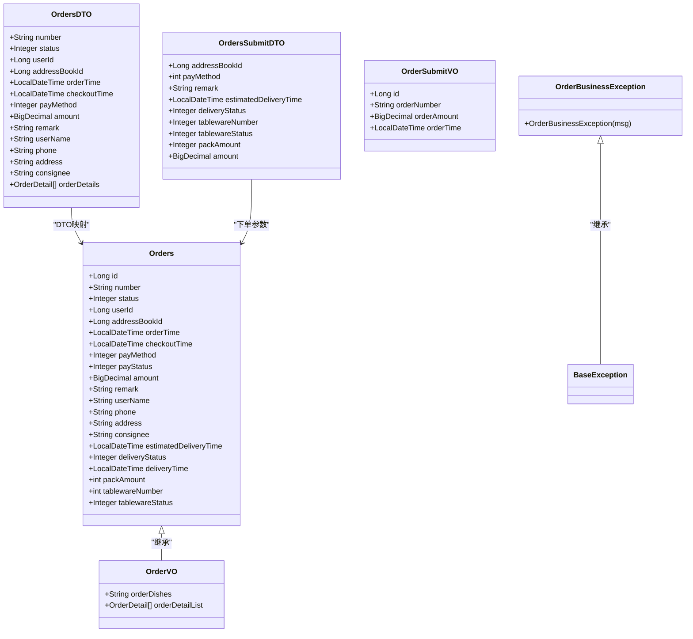
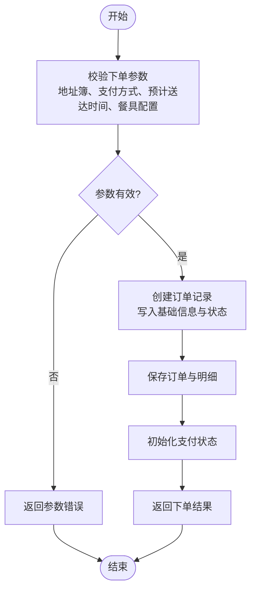
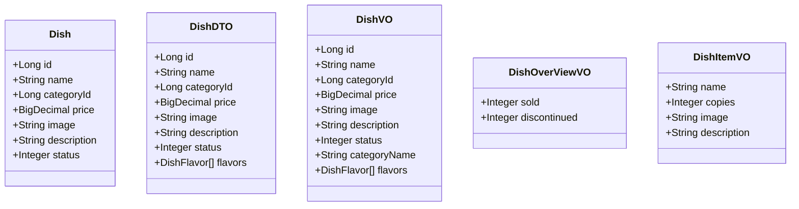
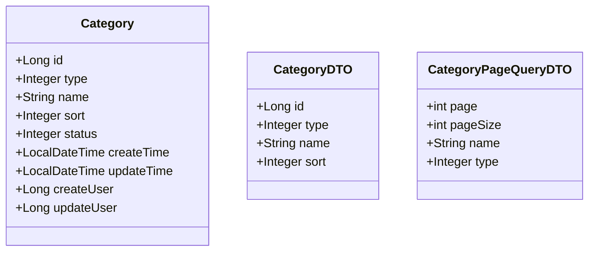
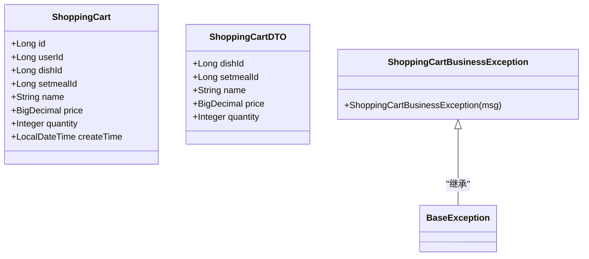
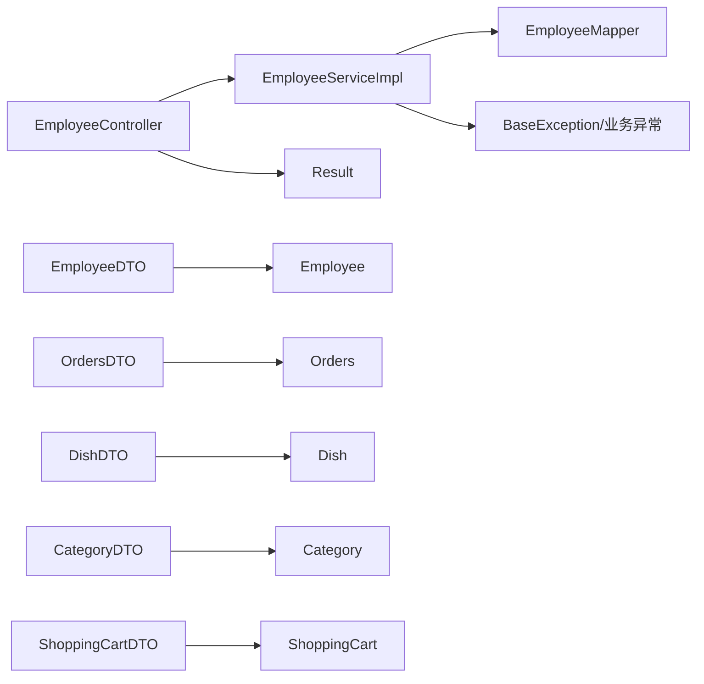

# 业务功能

<cite>
**本文引用的文件**
- [EmployeeController.java](file://sky-server/src/main/java/com/sky/controller/admin/EmployeeController.java)
- [EmployeeServiceImpl.java](file://sky-server/src/main/java/com/sky/service/impl/EmployeeServiceImpl.java)
- [EmployeeMapper.java](file://sky-server/src/main/java/com/sky/mapper/EmployeeMapper.java)
- [Employee.java](file://sky-pojo/src/main/java/com/sky/entity/Employee.java)
- [EmployeeDTO.java](file://sky-pojo/src/main/java/com/sky/dto/EmployeeDTO.java)
- [Result.java](file://sky-common/src/main/java/com/sky/result/Result.java)
- [BaseException.java](file://sky-common/src/main/java/com/sky/exception/BaseException.java)
- [OrderBusinessException.java](file://sky-common/src/main/java/com/sky/exception/OrderBusinessException.java)
- [OrdersSubmitDTO.java](file://sky-pojo/src/main/java/com/sky/dto/OrdersSubmitDTO.java)
- [OrdersDTO.java](file://sky-pojo/src/main/java/com/sky/dto/OrdersDTO.java)
- [OrderVO.java](file://sky-pojo/src/main/java/com/sky/vo/OrderVO.java)
- [OrderSubmitVO.java](file://sky-pojo/src/main/java/com/sky/vo/OrderSubmitVO.java)
- [Dish.java](file://sky-pojo/src/main/java/com/sky/entity/Dish.java)
- [DishDTO.java](file://sky-pojo/src/main/java/com/sky/dto/DishDTO.java)
- [DishVO.java](file://sky-pojo/src/main/java/com/sky/vo/DishVO.java)
- [Category.java](file://sky-pojo/src/main/java/com/sky/entity/Category.java)
- [CategoryDTO.java](file://sky-pojo/src/main/java/com/sky/dto/CategoryDTO.java)
- [CategoryPageQueryDTO.java](file://sky-pojo/src/main/java/com/sky/dto/CategoryPageQueryDTO.java)
- [DishOverViewVO.java](file://sky-pojo/src/main/java/com/sky/vo/DishOverViewVO.java)
- [DishItemVO.java](file://sky-pojo/src/main/java/com/sky/vo/DishItemVO.java)
- [ShoppingCartBusinessException.java](file://sky-common/src/main/java/com/sky/exception/ShoppingCartBusinessException.java)
- [ShoppingCartDTO.java](file://sky-pojo/src/main/java/com/sky/dto/ShoppingCartDTO.java)
- [ShoppingCart.java](file://sky-pojo/src/main/java/com/sky/entity/ShoppingCart.java)
</cite>

## 目录
1. 引言
2. 项目结构
3. 核心组件
4. 架构总览
5. 详细组件分析
6. 依赖分析
7. 性能考虑
8. 故障排查指南
9. 结论
10. 附录

## 引言
本文件面向“苍穹外卖点餐系统”的业务功能，围绕核心业务模块展开：员工管理、订单处理、菜品管理与分类管理、购物车与下单流程。文档从系统架构、数据模型、控制流、异常处理到接口规范与使用示例进行全面说明，帮助开发者与产品人员快速理解与落地业务。

## 项目结构
系统采用分层架构与模块化组织：
- sky-common：通用工具与异常体系、统一响应封装
- sky-pojo：领域模型、DTO/VO、分页查询参数
- sky-server：控制器、服务、持久层、拦截器与全局异常处理

图表来源
- [Result.java:11-38](file://sky-common/src/main/java/com/sky/result/Result.java#L11-L38)
- [BaseException.java:6-15](file://sky-common/src/main/java/com/sky/exception/BaseException.java#L6-L15)
- [OrderBusinessException.java:3-9](file://sky-common/src/main/java/com/sky/exception/OrderBusinessException.java#L3-L9)
- [ShoppingCartBusinessException.java](file://sky-common/src/main/java/com/sky/exception/ShoppingCartBusinessException.java)
- [Employee.java:15-45](file://sky-pojo/src/main/java/com/sky/entity/Employee.java#L15-L45)
- [Orders.java:1-110](file://sky-pojo/src/main/java/com/sky/entity/Orders.java#L1-L110)
- [OrderDetail.java](file://sky-pojo/src/main/java/com/sky/entity/OrderDetail.java)
- [Dish.java:14-50](file://sky-pojo/src/main/java/com/sky/entity/Dish.java#L14-L50)
- [Category.java:14-43](file://sky-pojo/src/main/java/com/sky/entity/Category.java#L14-L43)
- [ShoppingCart.java](file://sky-pojo/src/main/java/com/sky/entity/ShoppingCart.java)
- [EmployeeDTO.java:8-22](file://sky-pojo/src/main/java/com/sky/dto/EmployeeDTO.java#L8-L22)
- [OrdersDTO.java:11-56](file://sky-pojo/src/main/java/com/sky/dto/OrdersDTO.java#L11-L56)
- [OrdersSubmitDTO.java:11-31](file://sky-pojo/src/main/java/com/sky/dto/OrdersSubmitDTO.java#L11-L31)
- [DishDTO.java:11-28](file://sky-pojo/src/main/java/com/sky/dto/DishDTO.java#L11-L28)
- [CategoryDTO.java:8-22](file://sky-pojo/src/main/java/com/sky/dto/CategoryDTO.java#L8-L22)
- [CategoryPageQueryDTO.java:8-22](file://sky-pojo/src/main/java/com/sky/dto/CategoryPageQueryDTO.java#L8-L22)
- [ShoppingCartDTO.java](file://sky-pojo/src/main/java/com/sky/dto/ShoppingCartDTO.java)
- [OrderVO.java:14-22](file://sky-pojo/src/main/java/com/sky/vo/OrderVO.java#L14-L22)
- [OrderSubmitVO.java:16-25](file://sky-pojo/src/main/java/com/sky/vo/OrderSubmitVO.java#L16-L25)
- [DishVO.java:18-41](file://sky-pojo/src/main/java/com/sky/vo/DishVO.java#L18-L41)
- [DishOverViewVO.java:17-23](file://sky-pojo/src/main/java/com/sky/vo/DishOverViewVO.java#L17-L23)
- [DishItemVO.java:14-27](file://sky-pojo/src/main/java/com/sky/vo/DishItemVO.java#L14-L27)
- [EmployeeController.java:27-74](file://sky-server/src/main/java/com/sky/controller/admin/EmployeeController.java#L27-L74)
- [EmployeeServiceImpl.java:17-57](file://sky-server/src/main/java/com/sky/service/impl/EmployeeServiceImpl.java#L17-L57)
- [EmployeeMapper.java:8-18](file://sky-server/src/main/java/com/sky/mapper/EmployeeMapper.java#L8-L18)

章节来源
- [EmployeeController.java:27-74](file://sky-server/src/main/java/com/sky/controller/admin/EmployeeController.java#L27-L74)
- [EmployeeServiceImpl.java:17-57](file://sky-server/src/main/java/com/sky/service/impl/EmployeeServiceImpl.java#L17-L57)
- [EmployeeMapper.java:8-18](file://sky-server/src/main/java/com/sky/mapper/EmployeeMapper.java#L8-L18)
- [Result.java:11-38](file://sky-common/src/main/java/com/sky/result/Result.java#L11-L38)
- [BaseException.java:6-15](file://sky-common/src/main/java/com/sky/exception/BaseException.java#L6-L15)

## 核心组件
- 员工管理：提供登录、登出能力，基于用户名密码校验与状态检查，成功后签发令牌
- 订单处理：定义订单状态流转、支付方式与金额、收货信息、配送与餐具配置等
- 菜品管理：菜品实体与视图模型，支持启售/停售状态与口味扩展
- 分类管理：菜品与套餐两类分类，支持分页查询与状态控制
- 购物车与下单：购物车实体与下单DTO，支撑下单提交与后续订单视图

章节来源
- [EmployeeController.java:40-72](file://sky-server/src/main/java/com/sky/controller/admin/EmployeeController.java#L40-L72)
- [EmployeeServiceImpl.java:28-55](file://sky-server/src/main/java/com/sky/service/impl/EmployeeServiceImpl.java#L28-L55)
- [OrdersDTO.java:11-56](file://sky-pojo/src/main/java/com/sky/dto/OrdersDTO.java#L11-L56)
- [OrdersSubmitDTO.java:11-31](file://sky-pojo/src/main/java/com/sky/dto/OrdersSubmitDTO.java#L11-L31)
- [Dish.java:18-50](file://sky-pojo/src/main/java/com/sky/entity/Dish.java#L18-L50)
- [DishDTO.java:11-28](file://sky-pojo/src/main/java/com/sky/dto/DishDTO.java#L11-L28)
- [DishVO.java:18-41](file://sky-pojo/src/main/java/com/sky/vo/DishVO.java#L18-L41)
- [Category.java:14-43](file://sky-pojo/src/main/java/com/sky/entity/Category.java#L14-L43)
- [CategoryDTO.java:8-22](file://sky-pojo/src/main/java/com/sky/dto/CategoryDTO.java#L8-L22)
- [CategoryPageQueryDTO.java:8-22](file://sky-pojo/src/main/java/com/sky/dto/CategoryPageQueryDTO.java#L8-L22)
- [ShoppingCart.java](file://sky-pojo/src/main/java/com/sky/entity/ShoppingCart.java)
- [ShoppingCartDTO.java](file://sky-pojo/src/main/java/com/sky/dto/ShoppingCartDTO.java)

## 架构总览
系统采用前后端分离，后端通过REST接口提供业务能力，统一返回结构与异常体系，服务层负责业务编排与校验，持久层通过MyBatis映射数据库。

图表来源
- [EmployeeController.java:40-62](file://sky-server/src/main/java/com/sky/controller/admin/EmployeeController.java#L40-L62)
- [EmployeeServiceImpl.java:28-55](file://sky-server/src/main/java/com/sky/service/impl/EmployeeServiceImpl.java#L28-L55)
- [EmployeeMapper.java:15-16](file://sky-server/src/main/java/com/sky/mapper/EmployeeMapper.java#L15-L16)
- [Result.java:24-29](file://sky-common/src/main/java/com/sky/result/Result.java#L24-L29)

## 详细组件分析

### 员工管理模块
- 控制器职责：接收登录请求，调用服务层完成认证，成功后签发JWT令牌并返回统一响应
- 服务层职责：按用户名查询员工，执行密码与状态校验，抛出相应业务异常
- 持久层职责：基于用户名查询员工记录
- 数据模型：员工实体包含基础字段与状态位；DTO用于传输

图表来源
- [EmployeeController.java:27-74](file://sky-server/src/main/java/com/sky/controller/admin/EmployeeController.java#L27-L74)
- [EmployeeServiceImpl.java:17-57](file://sky-server/src/main/java/com/sky/service/impl/EmployeeServiceImpl.java#L17-L57)
- [EmployeeMapper.java:8-18](file://sky-server/src/main/java/com/sky/mapper/EmployeeMapper.java#L8-L18)
- [Employee.java:15-45](file://sky-pojo/src/main/java/com/sky/entity/Employee.java#L15-L45)
- [EmployeeDTO.java:8-22](file://sky-pojo/src/main/java/com/sky/dto/EmployeeDTO.java#L8-L22)
- [Result.java:12-38](file://sky-common/src/main/java/com/sky/result/Result.java#L12-L38)

业务流程与规则
- 登录流程：输入用户名与密码 → 查询员工 → 校验密码 → 校验状态 → 生成JWT → 返回结果
- 异常处理：账户不存在、密码错误、账号被锁定分别抛出对应业务异常
- 统一响应：成功时返回Result.success(data)，失败时由全局异常处理器转换为统一格式

接口文档（员工登录）
- 请求路径：POST /admin/employee/login
- 请求体：EmployeeLoginDTO（包含用户名与密码）
- 成功响应：Result<EmployeeLoginVO>，data包含员工id、用户名、姓名与token
- 失败响应：Result.error(msg)，由全局异常处理器统一包装

使用示例
- 客户端发送登录请求携带用户名与密码
- 服务端返回包含token的登录结果，前端存储token并用于后续接口鉴权

章节来源
- [EmployeeController.java:40-62](file://sky-server/src/main/java/com/sky/controller/admin/EmployeeController.java#L40-L62)
- [EmployeeServiceImpl.java:28-55](file://sky-server/src/main/java/com/sky/service/impl/EmployeeServiceImpl.java#L28-L55)
- [EmployeeMapper.java:15-16](file://sky-server/src/main/java/com/sky/mapper/EmployeeMapper.java#L15-L16)
- [Result.java:18-36](file://sky-common/src/main/java/com/sky/result/Result.java#L18-L36)

### 订单处理模块
- 订单实体：包含下单用户、支付方式、支付状态、实收金额、收货人与地址、预计送达时间、配送状态、餐具数量与状态等
- 订单视图：OrderVO在Orders基础上扩展订单菜品文本与明细列表
- 下单DTO：OrdersSubmitDTO承载下单所需字段，如地址簿id、支付方式、预计送达时间、配送状态、餐具配置与总金额

图表来源
- [Orders.java:1-110](file://sky-pojo/src/main/java/com/sky/entity/Orders.java#L1-L110)
- [OrdersDTO.java:11-56](file://sky-pojo/src/main/java/com/sky/dto/OrdersDTO.java#L11-L56)
- [OrdersSubmitDTO.java:11-31](file://sky-pojo/src/main/java/com/sky/dto/OrdersSubmitDTO.java#L11-L31)
- [OrderVO.java:14-22](file://sky-pojo/src/main/java/com/sky/vo/OrderVO.java#L14-L22)
- [OrderSubmitVO.java:16-25](file://sky-pojo/src/main/java/com/sky/vo/OrderSubmitVO.java#L16-L25)
- [OrderBusinessException.java:3-9](file://sky-common/src/main/java/com/sky/exception/OrderBusinessException.java#L3-L9)

业务流程与规则
- 订单状态：1待付款，2待派送，3已派送，4已完成，5已取消
- 支付状态：0未支付，1已支付，2退款
- 配送状态：1立即送出，0选择具体时间
- 餐具状态：1按餐量提供，0选择具体数量
- 异常处理：订单相关业务异常统一由OrderBusinessException表示

下单流程（概念）

接口文档（订单相关）
- 提交订单（示例）：POST /xxx/order/submit
  - 请求体：OrdersSubmitDTO
  - 成功响应：Result<OrderSubmitVO>
- 查询订单列表（示例）：GET /xxx/order/list
  - 查询参数：OrdersPageQueryDTO
  - 成功响应：Result<List<OrderVO>>

使用示例
- 客户端传入地址簿id、支付方式、预计送达时间、餐具数量与状态、总金额
- 服务端创建订单并返回订单号与金额，后续可对接支付与配送流程

章节来源
- [OrdersDTO.java:11-56](file://sky-pojo/src/main/java/com/sky/dto/OrdersDTO.java#L11-L56)
- [OrdersSubmitDTO.java:11-31](file://sky-pojo/src/main/java/com/sky/dto/OrdersSubmitDTO.java#L11-L31)
- [OrderVO.java:14-22](file://sky-pojo/src/main/java/com/sky/vo/OrderVO.java#L14-L22)
- [OrderBusinessException.java:3-9](file://sky-common/src/main/java/com/sky/exception/OrderBusinessException.java#L3-L9)

### 菜品管理模块
- 实体与视图：Dish定义菜品基础属性与状态；DishDTO用于编辑/新增；DishVO在菜品基础上附加分类名与口味列表
- 视图模型：DishOverViewVO提供菜品启售/停售概览；DishItemVO用于展示菜品条目信息

图表来源
- [Dish.java:18-50](file://sky-pojo/src/main/java/com/sky/entity/Dish.java#L18-L50)
- [DishDTO.java:11-28](file://sky-pojo/src/main/java/com/sky/dto/DishDTO.java#L11-L28)
- [DishVO.java:18-41](file://sky-pojo/src/main/java/com/sky/vo/DishVO.java#L18-L41)
- [DishOverViewVO.java:17-23](file://sky-pojo/src/main/java/com/sky/vo/DishOverViewVO.java#L17-L23)
- [DishItemVO.java:14-27](file://sky-pojo/src/main/java/com/sky/vo/DishItemVO.java#L14-L27)

业务流程与规则
- 启售/停售：status=1为起售，status=0为停售
- 口味扩展：DishFlavor与菜品多对多关联（实体中体现），视图层聚合展示
- 概览统计：DishOverViewVO统计已售与停售数量

接口文档（菜品相关）
- 新增/修改菜品：POST/PUT /xxx/dish
  - 请求体：DishDTO
  - 成功响应：Result<Void>
- 菜品分页：GET /xxx/dish/page
  - 查询参数：DishPageQueryDTO（仓库中未见该类，按DTO命名规范推断）
  - 成功响应：Result<PageResult<DishVO>>
- 菜品启售/停售：POST /xxx/dish/status
  - 请求体：Long（菜品id）
  - 成功响应：Result<Void>

使用示例
- 管理端提交菜品信息与口味列表，系统返回成功
- 前端展示菜品列表与启售/停售按钮，点击后调用状态切换接口

章节来源
- [Dish.java:18-50](file://sky-pojo/src/main/java/com/sky/entity/Dish.java#L18-L50)
- [DishDTO.java:11-28](file://sky-pojo/src/main/java/com/sky/dto/DishDTO.java#L11-L28)
- [DishVO.java:18-41](file://sky-pojo/src/main/java/com/sky/vo/DishVO.java#L18-L41)
- [DishOverViewVO.java:17-23](file://sky-pojo/src/main/java/com/sky/vo/DishOverViewVO.java#L17-L23)

### 分类管理模块
- 实体：Category支持菜品与套餐两类分类，含type、name、sort、status等字段
- DTO：CategoryDTO用于编辑/新增；CategoryPageQueryDTO用于分页查询

图表来源
- [Category.java:14-43](file://sky-pojo/src/main/java/com/sky/entity/Category.java#L14-L43)
- [CategoryDTO.java:8-22](file://sky-pojo/src/main/java/com/sky/dto/CategoryDTO.java#L8-L22)
- [CategoryPageQueryDTO.java:8-22](file://sky-pojo/src/main/java/com/sky/dto/CategoryPageQueryDTO.java#L8-L22)

业务流程与规则
- 类型区分：type=1为菜品分类，type=2为套餐分类
- 状态控制：status=1启用，status=0禁用
- 分页查询：结合name与type过滤，支持分页

接口文档（分类相关）
- 新增/修改分类：POST/PUT /xxx/category
  - 请求体：CategoryDTO
  - 成功响应：Result<Void>
- 分类分页：GET /xxx/category/page
  - 查询参数：CategoryPageQueryDTO
  - 成功响应：Result<PageResult<Category>>

使用示例
- 管理端维护菜品与套餐分类，按需启用或禁用

章节来源
- [Category.java:14-43](file://sky-pojo/src/main/java/com/sky/entity/Category.java#L14-L43)
- [CategoryDTO.java:8-22](file://sky-pojo/src/main/java/com/sky/dto/CategoryDTO.java#L8-L22)
- [CategoryPageQueryDTO.java:8-22](file://sky-pojo/src/main/java/com/sky/dto/CategoryPageQueryDTO.java#L8-L22)

### 购物车与下单模块
- 购物车实体：ShoppingCart记录用户、菜品/套餐、数量等
- 购物车DTO：ShoppingCartDTO作为前端提交参数载体
- 下单流程：购物车聚合→生成订单参数→创建订单→返回下单结果

图表来源
- [ShoppingCart.java](file://sky-pojo/src/main/java/com/sky/entity/ShoppingCart.java)
- [ShoppingCartDTO.java](file://sky-pojo/src/main/java/com/sky/dto/ShoppingCartDTO.java)
- [ShoppingCartBusinessException.java](file://sky-common/src/main/java/com/sky/exception/ShoppingCartBusinessException.java)

业务流程与规则
- 购物车操作：添加、修改数量、清空等（接口路径与参数以实际为准）
- 下单参数：OrdersSubmitDTO承载下单所需字段
- 异常处理：购物车相关业务异常统一由ShoppingCartBusinessException表示

接口文档（购物车与下单）
- 添加到购物车：POST /xxx/shopping-cart/add
  - 请求体：ShoppingCartDTO
  - 成功响应：Result<Void>
- 查看购物车：GET /xxx/shopping-cart
  - 成功响应：Result<List<ShoppingCart>>
- 清空购物车：DELETE /xxx/shopping-cart
  - 成功响应：Result<Void>
- 提交订单：POST /xxx/order/submit
  - 请求体：OrdersSubmitDTO
  - 成功响应：Result<OrderSubmitVO>

使用示例
- 用户在菜品详情页加入购物车，结算时提交订单参数，系统创建订单并返回结果

章节来源
- [ShoppingCart.java](file://sky-pojo/src/main/java/com/sky/entity/ShoppingCart.java)
- [ShoppingCartDTO.java](file://sky-pojo/src/main/java/com/sky/dto/ShoppingCartDTO.java)
- [OrdersSubmitDTO.java:11-31](file://sky-pojo/src/main/java/com/sky/dto/OrdersSubmitDTO.java#L11-L31)
- [OrderSubmitVO.java:16-25](file://sky-pojo/src/main/java/com/sky/vo/OrderSubmitVO.java#L16-L25)

## 依赖分析
- 控制器依赖服务层，服务层依赖持久层
- 统一响应Result与异常体系贯穿各层
- DTO/VO与实体之间存在一一映射关系，便于解耦

图表来源
- [EmployeeController.java:27-74](file://sky-server/src/main/java/com/sky/controller/admin/EmployeeController.java#L27-L74)
- [EmployeeServiceImpl.java:17-57](file://sky-server/src/main/java/com/sky/service/impl/EmployeeServiceImpl.java#L17-L57)
- [EmployeeMapper.java:8-18](file://sky-server/src/main/java/com/sky/mapper/EmployeeMapper.java#L8-L18)
- [Result.java:12-38](file://sky-common/src/main/java/com/sky/result/Result.java#L12-L38)
- [BaseException.java:6-15](file://sky-common/src/main/java/com/sky/exception/BaseException.java#L6-L15)
- [EmployeeDTO.java:8-22](file://sky-pojo/src/main/java/com/sky/dto/EmployeeDTO.java#L8-L22)
- [Employee.java:15-45](file://sky-pojo/src/main/java/com/sky/entity/Employee.java#L15-L45)
- [OrdersDTO.java:11-56](file://sky-pojo/src/main/java/com/sky/dto/OrdersDTO.java#L11-L56)
- [Orders.java:1-110](file://sky-pojo/src/main/java/com/sky/entity/Orders.java#L1-L110)
- [DishDTO.java:11-28](file://sky-pojo/src/main/java/com/sky/dto/DishDTO.java#L11-L28)
- [Dish.java:18-50](file://sky-pojo/src/main/java/com/sky/entity/Dish.java#L18-L50)
- [CategoryDTO.java:8-22](file://sky-pojo/src/main/java/com/sky/dto/CategoryDTO.java#L8-L22)
- [Category.java:14-43](file://sky-pojo/src/main/java/com/sky/entity/Category.java#L14-L43)
- [ShoppingCartDTO.java](file://sky-pojo/src/main/java/com/sky/dto/ShoppingCartDTO.java)
- [ShoppingCart.java](file://sky-pojo/src/main/java/com/sky/entity/ShoppingCart.java)

## 性能考虑
- 登录流程：用户名查询应建立索引；密码校验建议使用安全散列算法（当前代码注释提示后期需MD5加密）
- 订单分页：查询条件应覆盖常用过滤字段，避免全表扫描
- 菜品与分类：分页查询建议结合name/type与sort排序，提升检索效率
- 购物车：按用户维度缓存热门商品，减少重复查询

## 故障排查指南
- 登录失败
  - 账户不存在：检查用户名是否正确
  - 密码错误：确认密码比对逻辑与加密策略
  - 账号被锁定：检查status字段
- 订单异常
  - 订单业务异常：根据异常消息定位状态流转问题
- 购物车异常
  - 购物车业务异常：检查数量与库存一致性

章节来源
- [EmployeeServiceImpl.java:36-51](file://sky-server/src/main/java/com/sky/service/impl/EmployeeServiceImpl.java#L36-L51)
- [OrderBusinessException.java:3-9](file://sky-common/src/main/java/com/sky/exception/OrderBusinessException.java#L3-L9)
- [ShoppingCartBusinessException.java](file://sky-common/src/main/java/com/sky/exception/ShoppingCartBusinessException.java)

## 结论
本系统通过清晰的分层架构与统一的异常/响应体系，实现了员工登录、订单处理、菜品与分类管理以及购物车下单等核心业务。建议在后续版本中完善密码加密、订单状态机与日志追踪，持续优化性能与用户体验。

## 附录
- 统一响应结构
  - 成功：code=1，msg为空，data为业务数据
  - 失败：code=0，msg为错误信息，data为空
- 常用业务异常
  - BaseException：业务异常基类
  - OrderBusinessException：订单相关异常
  - ShoppingCartBusinessException：购物车相关异常