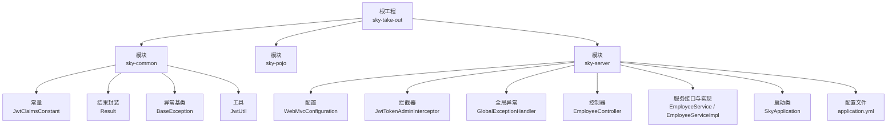
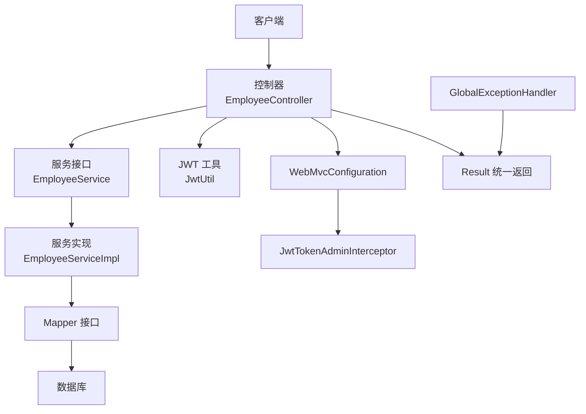
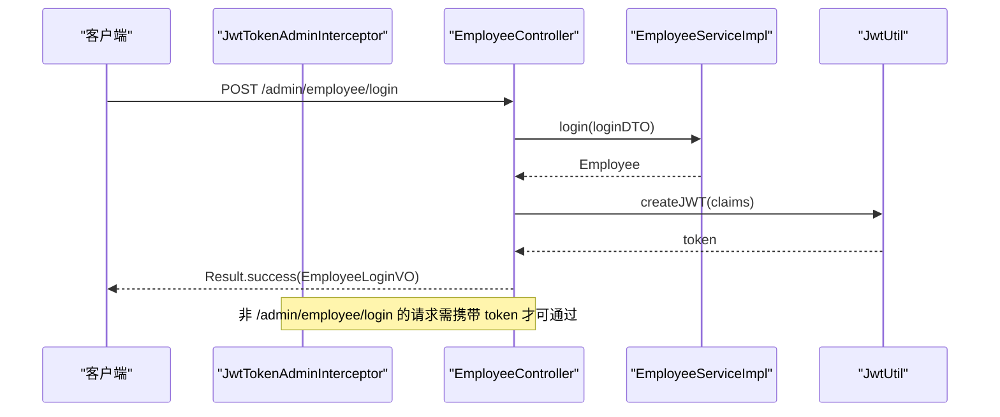
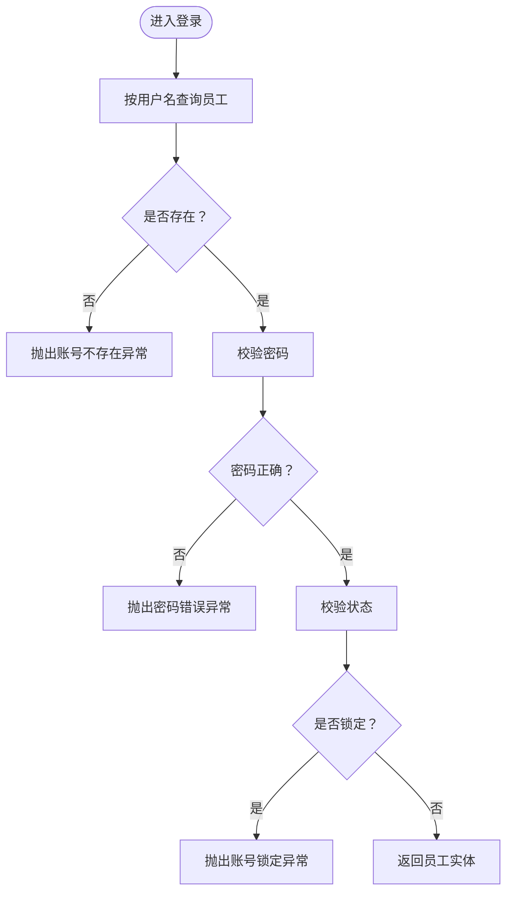
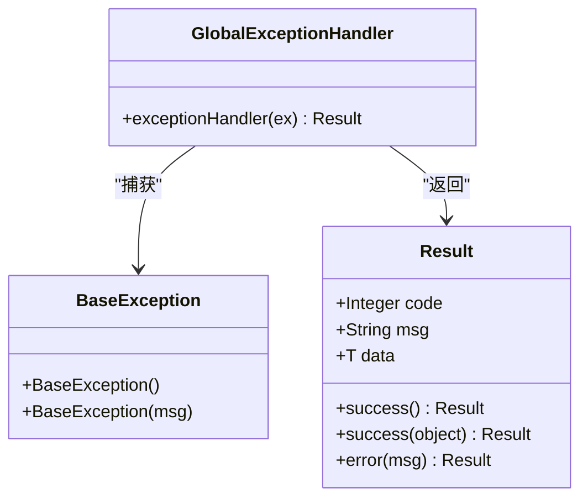
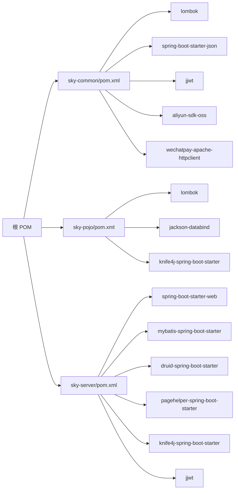

# 开发指南

<cite>
**本文引用的文件**
- [pom.xml](file://pom.xml)
- [SkyApplication.java](file://sky-server/src/main/java/com/sky/SkyApplication.java)
- [application.yml](file://sky-server/src/main/resources/application.yml)
- [WebMvcConfiguration.java](file://sky-server/src/main/java/com/sky/config/WebMvcConfiguration.java)
- [GlobalExceptionHandler.java](file://sky-server/src/main/java/com/sky/handler/GlobalExceptionHandler.java)
- [JwtTokenAdminInterceptor.java](file://sky-server/src/main/java/com/sky/interceptor/JwtTokenAdminInterceptor.java)
- [EmployeeService.java](file://sky-server/src/main/java/com/sky/service/EmployeeService.java)
- [EmployeeServiceImpl.java](file://sky-server/src/main/java/com/sky/service/impl/EmployeeServiceImpl.java)
- [EmployeeController.java](file://sky-server/src/main/java/com/sky/controller/admin/EmployeeController.java)
- [JwtClaimsConstant.java](file://sky-common/src/main/java/com/sky/constant/JwtClaimsConstant.java)
- [Result.java](file://sky-common/src/main/java/com/sky/result/Result.java)
- [BaseException.java](file://sky-common/src/main/java/com/sky/exception/BaseException.java)
- [JwtUtil.java](file://sky-common/src/main/java/com/sky/utils/JwtUtil.java)
- [sky-common/pom.xml](file://sky-common/pom.xml)
- [sky-pojo/pom.xml](file://sky-pojo/pom.xml)
</cite>

## 目录
1. [引言](#引言)
2. [项目结构](#项目结构)
3. [核心组件](#核心组件)
4. [架构总览](#架构总览)
5. [详细组件分析](#详细组件分析)
6. [依赖分析](#依赖分析)
7. [性能考虑](#性能考虑)
8. [故障排查指南](#故障排查指南)
9. [结论](#结论)
10. [附录](#附录)

## 引言
本开发指南面向“苍穹外卖点餐系统”的开发者与维护者，目标是提供一套完整、可落地的编码规范、最佳实践与开发流程，涵盖：
- Java 编码规范、命名约定与注释标准
- 项目结构组织原则与模块划分策略
- 新功能开发标准流程与代码审查要点
- 单元测试与集成测试策略
- 性能优化技巧与调试方法
- 常见问题与经验总结

## 项目结构
项目采用多模块 Maven 结构，按职责分层：
- sky-common：通用能力与工具（常量、异常、结果封装、工具类、配置属性等）
- sky-pojo：领域模型与 DTO/VO（实体、传输对象、视图对象）
- sky-server：服务端应用（Spring Boot 启动类、配置、拦截器、全局异常、控制器、服务、Mapper）

图表来源
- [pom.xml:15-19](file://pom.xml#L15-L19)
- [SkyApplication.java:1-17](file://sky-server/src/main/java/com/sky/SkyApplication.java#L1-L17)
- [WebMvcConfiguration.java:21-68](file://sky-server/src/main/java/com/sky/config/WebMvcConfiguration.java#L21-L68)
- [JwtTokenAdminInterceptor.java:18-59](file://sky-server/src/main/java/com/sky/interceptor/JwtTokenAdminInterceptor.java#L18-L59)
- [GlobalExceptionHandler.java:12-27](file://sky-server/src/main/java/com/sky/handler/GlobalExceptionHandler.java#L12-L27)
- [EmployeeController.java:24-75](file://sky-server/src/main/java/com/sky/controller/admin/EmployeeController.java#L24-L75)
- [EmployeeService.java:6-15](file://sky-server/src/main/java/com/sky/service/EmployeeService.java#L6-L15)
- [EmployeeServiceImpl.java:17-58](file://sky-server/src/main/java/com/sky/service/impl/EmployeeServiceImpl.java#L17-L58)
- [JwtClaimsConstant.java:3-11](file://sky-common/src/main/java/com/sky/constant/JwtClaimsConstant.java#L3-L11)
- [Result.java:11-39](file://sky-common/src/main/java/com/sky/result/Result.java#L11-L39)
- [BaseException.java:6-15](file://sky-common/src/main/java/com/sky/exception/BaseException.java#L6-L15)
- [JwtUtil.java:11-59](file://sky-common/src/main/java/com/sky/utils/JwtUtil.java#L11-L59)

章节来源
- [pom.xml:15-19](file://pom.xml#L15-L19)
- [sky-common/pom.xml:12-52](file://sky-common/pom.xml#L12-L52)
- [sky-pojo/pom.xml:12-26](file://sky-pojo/pom.xml#L12-L26)

## 核心组件
- 统一返回体 Result：所有接口返回统一格式，便于前端消费与调试
- 全局异常处理器 GlobalExceptionHandler：集中捕获业务异常并返回统一格式
- JWT 认证链路：拦截器校验令牌，控制器签发令牌，工具类生成/解析
- 登录流程：控制器接收参数，服务层校验用户状态，返回 VO 并携带令牌
- 配置与文档：WebMvcConfiguration 注册拦截器与 Knife4j 文档

章节来源
- [Result.java:11-39](file://sky-common/src/main/java/com/sky/result/Result.java#L11-L39)
- [GlobalExceptionHandler.java:12-27](file://sky-server/src/main/java/com/sky/handler/GlobalExceptionHandler.java#L12-L27)
- [JwtTokenAdminInterceptor.java:18-59](file://sky-server/src/main/java/com/sky/interceptor/JwtTokenAdminInterceptor.java#L18-L59)
- [JwtUtil.java:11-59](file://sky-common/src/main/java/com/sky/utils/JwtUtil.java#L11-L59)
- [EmployeeController.java:24-75](file://sky-server/src/main/java/com/sky/controller/admin/EmployeeController.java#L24-L75)
- [WebMvcConfiguration.java:21-68](file://sky-server/src/main/java/com/sky/config/WebMvcConfiguration.java#L21-L68)

## 架构总览
系统采用经典的分层架构：表现层（Controller）- 业务层（Service）- 数据访问层（Mapper），配合 Spring Boot 自动装配与 MyBatis。

图表来源
- [EmployeeController.java:24-75](file://sky-server/src/main/java/com/sky/controller/admin/EmployeeController.java#L24-L75)
- [EmployeeServiceImpl.java:17-58](file://sky-server/src/main/java/com/sky/service/impl/EmployeeServiceImpl.java#L17-L58)
- [JwtUtil.java:11-59](file://sky-common/src/main/java/com/sky/utils/JwtUtil.java#L11-L59)
- [WebMvcConfiguration.java:21-68](file://sky-server/src/main/java/com/sky/config/WebMvcConfiguration.java#L21-L68)
- [JwtTokenAdminInterceptor.java:18-59](file://sky-server/src/main/java/com/sky/interceptor/JwtTokenAdminInterceptor.java#L18-L59)
- [Result.java:11-39](file://sky-common/src/main/java/com/sky/result/Result.java#L11-L39)
- [GlobalExceptionHandler.java:12-27](file://sky-server/src/main/java/com/sky/handler/GlobalExceptionHandler.java#L12-L27)

## 详细组件分析

### 组件一：认证与拦截链
- 拦截器 JwtTokenAdminInterceptor：仅对 /admin/** 路径生效，排除登录接口；从请求头读取令牌并解析，失败返回 401
- 控制器 EmployeeController：登录成功后基于 JwtUtil 生成令牌，返回 Result.success
- WebMvcConfiguration：注册拦截器与 Knife4j 文档，暴露 /doc.html 与 /webjars/**
- 全局异常：统一捕获 BaseException 子类并返回 Result.error

图表来源
- [JwtTokenAdminInterceptor.java:34-57](file://sky-server/src/main/java/com/sky/interceptor/JwtTokenAdminInterceptor.java#L34-L57)
- [EmployeeController.java:40-62](file://sky-server/src/main/java/com/sky/controller/admin/EmployeeController.java#L40-L62)
- [EmployeeServiceImpl.java:28-55](file://sky-server/src/main/java/com/sky/service/impl/EmployeeServiceImpl.java#L28-L55)
- [JwtUtil.java:21-39](file://sky-common/src/main/java/com/sky/utils/JwtUtil.java#L21-L39)
- [WebMvcConfiguration.java:33-38](file://sky-server/src/main/java/com/sky/config/WebMvcConfiguration.java#L33-L38)

章节来源
- [JwtTokenAdminInterceptor.java:18-59](file://sky-server/src/main/java/com/sky/interceptor/JwtTokenAdminInterceptor.java#L18-L59)
- [EmployeeController.java:24-75](file://sky-server/src/main/java/com/sky/controller/admin/EmployeeController.java#L24-L75)
- [WebMvcConfiguration.java:21-68](file://sky-server/src/main/java/com/sky/config/WebMvcConfiguration.java#L21-L68)
- [GlobalExceptionHandler.java:12-27](file://sky-server/src/main/java/com/sky/handler/GlobalExceptionHandler.java#L12-L27)

### 组件二：登录与状态校验
- 输入：EmployeeLoginDTO（用户名、密码）
- 流程：查库 -> 校验账户存在 -> 校对明文密码 -> 校验状态 -> 返回实体
- 异常：AccountNotFoundException、PasswordErrorException、AccountLockedException
- 输出：EmployeeLoginVO（含 token）

图表来源
- [EmployeeServiceImpl.java:28-55](file://sky-server/src/main/java/com/sky/service/impl/EmployeeServiceImpl.java#L28-L55)
- [BaseException.java:6-15](file://sky-common/src/main/java/com/sky/exception/BaseException.java#L6-L15)

章节来源
- [EmployeeService.java:6-15](file://sky-server/src/main/java/com/sky/service/EmployeeService.java#L6-L15)
- [EmployeeServiceImpl.java:17-58](file://sky-server/src/main/java/com/sky/service/impl/EmployeeServiceImpl.java#L17-L58)

### 组件三：统一返回与异常处理
- Result：success()/error() 提供统一返回结构
- GlobalExceptionHandler：捕获 BaseException，记录日志并返回 Result.error

图表来源
- [Result.java:11-39](file://sky-common/src/main/java/com/sky/result/Result.java#L11-L39)
- [BaseException.java:6-15](file://sky-common/src/main/java/com/sky/exception/BaseException.java#L6-L15)
- [GlobalExceptionHandler.java:12-27](file://sky-server/src/main/java/com/sky/handler/GlobalExceptionHandler.java#L12-L27)

章节来源
- [Result.java:11-39](file://sky-common/src/main/java/com/sky/result/Result.java#L11-L39)
- [GlobalExceptionHandler.java:12-27](file://sky-server/src/main/java/com/sky/handler/GlobalExceptionHandler.java#L12-L27)

## 依赖分析
- 根 POM 管理版本与依赖范围，子模块按需引入
- sky-common：引入 JSON、JWT、OSS、微信支付等通用依赖
- sky-pojo：引入 Lombok、Jackson、Knife4j
- sky-server：Spring Boot 启动类、MyBatis、Druid、PageHelper、Knife4j、JWT

图表来源
- [pom.xml:34-126](file://pom.xml#L34-L126)
- [sky-common/pom.xml:12-52](file://sky-common/pom.xml#L12-L52)
- [sky-pojo/pom.xml:12-26](file://sky-pojo/pom.xml#L12-L26)

章节来源
- [pom.xml:34-126](file://pom.xml#L34-L126)
- [sky-common/pom.xml:12-52](file://sky-common/pom.xml#L12-L52)
- [sky-pojo/pom.xml:12-26](file://sky-pojo/pom.xml#L12-L26)

## 性能考虑
- 日志级别：已针对 mapper/service/controller 设置不同日志级别，便于生产环境控制开销
- MyBatis：开启驼峰映射，减少字段映射成本
- 分页：使用 PageHelper，避免一次性加载大结果集
- 缓存：建议在高频读场景引入 Redis 缓存热点数据（如字典、配置）
- 线程池：异步任务与第三方调用使用独立线程池，避免阻塞主线程
- 监控：结合 Actuator 与 APM 工具，关注慢 SQL、接口耗时与异常率

章节来源
- [application.yml:24-30](file://sky-server/src/main/resources/application.yml#L24-L30)
- [application.yml:20-22](file://sky-server/src/main/resources/application.yml#L20-L22)

## 故障排查指南
- 登录失败
  - 检查用户名是否存在与状态是否正常
  - 核对密码是否匹配（当前明文对比，后续需 MD5 加盐）
  - 查看全局异常日志定位具体异常类型
- 401 未授权
  - 确认请求头是否携带正确的 token 名称
  - 校验签名密钥与 TTL 是否一致
  - 检查拦截器路径规则是否覆盖目标接口
- 接口文档不可用
  - 确认 Knife4j 配置与静态资源映射
  - 访问 /doc.html 与 /webjars/**
- 数据库连接
  - 检查环境变量与 JDBC URL、驱动、账号密码
  - 关注 Druid 连接池监控指标

章节来源
- [EmployeeServiceImpl.java:36-51](file://sky-server/src/main/java/com/sky/service/impl/EmployeeServiceImpl.java#L36-L51)
- [GlobalExceptionHandler.java:21-25](file://sky-server/src/main/java/com/sky/handler/GlobalExceptionHandler.java#L21-L25)
- [JwtTokenAdminInterceptor.java:42-56](file://sky-server/src/main/java/com/sky/interceptor/JwtTokenAdminInterceptor.java#L42-L56)
- [WebMvcConfiguration.java:44-67](file://sky-server/src/main/java/com/sky/config/WebMvcConfiguration.java#L44-L67)
- [application.yml:9-14](file://sky-server/src/main/resources/application.yml#L9-L14)

## 结论
本指南提供了从架构、模块、组件到编码规范与测试策略的全栈开发指引。建议在新功能开发中严格遵循统一返回、异常处理、JWT 认证与拦截链的约定，并结合日志与监控持续优化性能与稳定性。

## 附录

### 编码规范与最佳实践
- 包与目录
  - 控制器：com.sky.controller.admin
  - 服务接口与实现：com.sky.service 与 com.sky.service.impl
  - 拦截器：com.sky.interceptor
  - 全局异常：com.sky.handler
  - 配置：com.sky.config
  - 通用常量/结果/异常/工具：com.sky.constant/com.sky.result/com.sky.exception/com.sky.utils
- 类命名
  - 接口以 I 前缀或以动词短语描述能力（如 EmployeeService）
  - 实现类以 Impl 结尾（如 EmployeeServiceImpl）
  - DTO/VO/Entity 使用名词短语（如 EmployeeLoginDTO、EmployeeLoginVO、Employee）
- 方法命名
  - 动宾结构（如 login、getByUsername）
  - 布尔方法以 is/has/can 前缀
- 注释
  - 类与公共方法必须有简要说明
  - 复杂分支与边界条件补充注释
- 返回体
  - 统一使用 Result.success()/Result.error()
- 异常
  - 业务异常继承 BaseException
  - 全局异常处理器集中处理 BaseException 子类
- 安全
  - 密码校验应使用 MD5 加盐
  - JWT 密钥与 TTL 在配置文件中集中管理
- 配置
  - 数据源、MyBatis、日志、JWT 参数集中在 application.yml
  - 开启驼峰映射与 Knife4j 文档

章节来源
- [EmployeeController.java:24-75](file://sky-server/src/main/java/com/sky/controller/admin/EmployeeController.java#L24-L75)
- [EmployeeService.java:6-15](file://sky-server/src/main/java/com/sky/service/EmployeeService.java#L6-L15)
- [EmployeeServiceImpl.java:17-58](file://sky-server/src/main/java/com/sky/service/impl/EmployeeServiceImpl.java#L17-L58)
- [Result.java:11-39](file://sky-common/src/main/java/com/sky/result/Result.java#L11-L39)
- [BaseException.java:6-15](file://sky-common/src/main/java/com/sky/exception/BaseException.java#L6-L15)
- [application.yml:32-40](file://sky-server/src/main/resources/application.yml#L32-L40)

### 新功能开发标准流程
- 需求评审与设计
  - 明确输入输出、边界条件与异常场景
  - 设计 DTO/VO 与 Entity 字段映射
- 接口设计
  - 控制器层定义 REST 接口，使用统一返回体
  - 服务层定义接口契约，实现类完成业务逻辑
- 安全与鉴权
  - 如为后台接口，确保拦截器生效且登录接口例外
  - JWT 令牌生成与解析使用统一工具类
- 测试
  - 单测：覆盖正常/异常/边界分支
  - 集成测：Mock 外部依赖，验证端到端流程
- 文档
  - 更新 Knife4j 文档，完善接口说明
- 上线与监控
  - 关注慢查询与异常率，逐步放开缓存与限流

### 单元测试与集成测试策略
- 单元测试
  - 使用 JUnit 与 Mockito，隔离外部依赖
  - 覆盖登录、状态校验、异常分支
- 集成测试
  - 使用 @SpringBootTest 或嵌入式容器
  - Mock 数据库与第三方服务，验证拦截器与全局异常处理
- 测试数据
  - 使用测试专用数据库或内存数据库（如 H2）
  - 清洗测试数据，保证幂等性

### 性能优化技巧
- SQL 优化：索引、分页、避免 N+1 查询
- 缓存：热点数据缓存，合理设置过期时间
- 异步：耗时操作异步化，使用线程池
- 监控：接入 APM，关注接口耗时、错误率与资源占用

### 调试方法
- 日志：按包设置日志级别，定位问题快速收敛
- 断点：在拦截器、控制器、服务层关键节点断点
- 抓包：使用 Postman 或 curl 验证请求头与响应体
- 文档：通过 Knife4j 快速核对接口行为