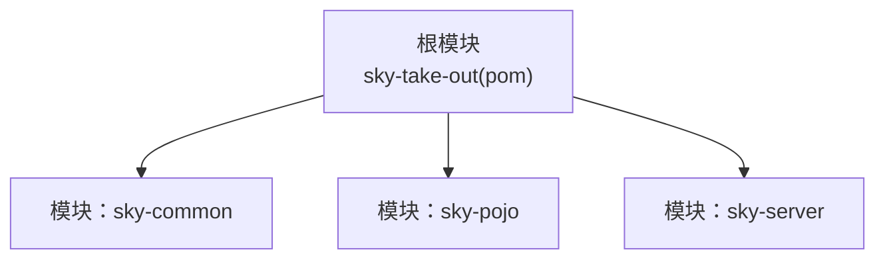
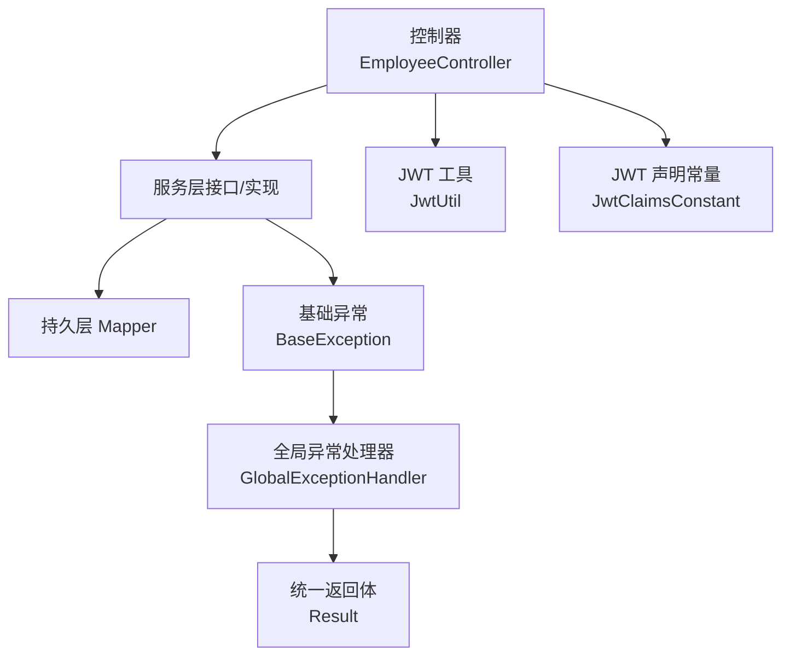
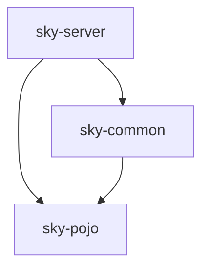

# 编码规范

<cite>
**本文引用的文件**   
- [JwtClaimsConstant.java](file://sky-common/src/main/java/com/sky/constant/JwtClaimsConstant.java)
- [BaseException.java](file://sky-common/src/main/java/com/sky/exception/BaseException.java)
- [Result.java](file://sky-common/src/main/java/com/sky/result/Result.java)
- [GlobalExceptionHandler.java](file://sky-server/src/main/java/com/sky/handler/GlobalExceptionHandler.java)
- [SkyApplication.java](file://sky-server/src/main/java/com/sky/SkyApplication.java)
- [JwtUtil.java](file://sky-common/src/main/java/com/sky/utils/JwtUtil.java)
- [EmployeeController.java](file://sky-server/src/main/java/com/sky/controller/admin/EmployeeController.java)
- [AutoFillConstant.java](file://sky-common/src/main/java/com/sky/constant/AutoFillConstant.java)
- [MessageConstant.java](file://sky-common/src/main/java/com/sky/constant/MessageConstant.java)
- [StatusConstant.java](file://sky-common/src/main/java/com/sky/constant/StatusConstant.java)
- [Employee.java](file://sky-pojo/src/main/java/com/sky/entity/Employee.java)
- [EmployeeLoginDTO.java](file://sky-pojo/src/main/java/com/sky/dto/EmployeeLoginDTO.java)
- [EmployeeLoginVO.java](file://sky-pojo/src/main/java/com/sky/vo/EmployeeLoginVO.java)
- [BaseContext.java](file://sky-common/src/main/java/com/sky/context/BaseContext.java)
- [pom.xml](file://pom.xml)
</cite>

## 目录
1. 引言
2. 项目结构
3. 核心组件
4. 架构总览
5. 详细组件分析
6. 依赖分析
7. 性能考虑
8. 故障排查指南
9. 结论
10. 附录

## 引言
本文件旨在为“苍穹外卖点餐系统”提供一套统一、可执行的 Java 编码规范，覆盖命名约定、注释规范、代码格式化、异常与日志处理、Lombok 注解使用、代码审查清单与质量标准，并通过具体文件路径示例展示正确与错误的编码方式，帮助团队提升一致性、可读性与可维护性。

## 项目结构
系统采用多模块 Maven 结构，核心模块如下：
- sky-common：通用常量、异常、工具、返回体等基础能力
- sky-pojo：领域模型（实体、DTO、VO）与查询参数
- sky-server：Spring Boot 应用入口、控制器、拦截器、全局异常处理等
- 顶层 pom：聚合模块与依赖版本管理

图表来源
- [pom.xml:15-19](file://pom.xml#L15-L19)

章节来源
- [pom.xml:1-128](file://pom.xml#L1-L128)

## 核心组件
- 统一返回体 Result：封装响应码、消息与数据，提供 success/error 工厂方法
- 全局异常处理器 GlobalExceptionHandler：集中捕获业务异常并返回统一格式
- 基础异常 BaseException：所有业务异常的父类
- 常量类：JwtClaimsConstant、MessageConstant、StatusConstant、AutoFillConstant
- JWT 工具 JwtUtil：生成与解析 JWT
- 控制器 EmployeeController：演示登录流程与统一返回体使用
- Lombok 数据模型：Employee、EmployeeLoginDTO、EmployeeLoginVO
- 线程上下文 BaseContext：基于 ThreadLocal 的当前用户 ID 存取

章节来源
- [Result.java:11-38](file://sky-common/src/main/java/com/sky/result/Result.java#L11-L38)
- [GlobalExceptionHandler.java:21-25](file://sky-server/src/main/java/com/sky/handler/GlobalExceptionHandler.java#L21-L25)
- [BaseException.java:6-15](file://sky-common/src/main/java/com/sky/exception/BaseException.java#L6-L15)
- [JwtClaimsConstant.java:5-9](file://sky-common/src/main/java/com/sky/constant/JwtClaimsConstant.java#L5-L9)
- [MessageConstant.java:8-26](file://sky-common/src/main/java/com/sky/constant/MessageConstant.java#L8-L26)
- [StatusConstant.java:9-12](file://sky-common/src/main/java/com/sky/constant/StatusConstant.java#L9-L12)
- [AutoFillConstant.java:10-13](file://sky-common/src/main/java/com/sky/constant/AutoFillConstant.java#L10-L13)
- [JwtUtil.java:21-56](file://sky-common/src/main/java/com/sky/utils/JwtUtil.java#L21-L56)
- [EmployeeController.java:40-62](file://sky-server/src/main/java/com/sky/controller/admin/EmployeeController.java#L40-L62)
- [Employee.java:11-45](file://sky-pojo/src/main/java/com/sky/entity/Employee.java#L11-L45)
- [EmployeeLoginDTO.java:9-19](file://sky-pojo/src/main/java/com/sky/dto/EmployeeLoginDTO.java#L9-L19)
- [EmployeeLoginVO.java:12-31](file://sky-pojo/src/main/java/com/sky/vo/EmployeeLoginVO.java#L12-L31)
- [BaseContext.java:7-17](file://sky-common/src/main/java/com/sky/context/BaseContext.java#L7-L17)

## 架构总览
系统遵循分层架构：控制层接收请求，调用服务层，持久层访问数据库；异常统一由全局处理器捕获并转换为统一返回体；日志通过 SLF4J 记录。

图表来源
- [EmployeeController.java:27-62](file://sky-server/src/main/java/com/sky/controller/admin/EmployeeController.java#L27-L62)
- [GlobalExceptionHandler.java:21-25](file://sky-server/src/main/java/com/sky/handler/GlobalExceptionHandler.java#L21-L25)
- [Result.java:11-38](file://sky-common/src/main/java/com/sky/result/Result.java#L11-L38)
- [BaseException.java:6-15](file://sky-common/src/main/java/com/sky/exception/BaseException.java#L6-L15)
- [JwtUtil.java:21-56](file://sky-common/src/main/java/com/sky/utils/JwtUtil.java#L21-L56)
- [JwtClaimsConstant.java:5-9](file://sky-common/src/main/java/com/sky/constant/JwtClaimsConstant.java#L5-L9)

## 详细组件分析

### 统一返回体 Result
- 设计目标：前后端一致的响应结构，简化控制器返回逻辑
- 关键点：
  - 静态工厂方法 success()/success(T)/error(String)
  - 字段 code=1 表示成功，其他值表示失败
  - 泛型支持任意数据类型
- 使用建议：
  - 控制器统一返回 Result<T>
  - 失败场景仅传入 msg，不携带 data
  - 成功场景优先使用 Result.success(data)

章节来源
- [Result.java:11-38](file://sky-common/src/main/java/com/sky/result/Result.java#L11-L38)

### 全局异常处理器 GlobalExceptionHandler
- 设计目标：集中处理业务异常，屏蔽底层细节，统一返回
- 关键点：
  - 使用 @RestControllerAdvice + @ExceptionHandler 捕获 BaseException
  - 日志记录异常信息
  - 返回 Result.error(msg)
- 使用建议：
  - 所有业务异常应继承 BaseException
  - 不要吞掉异常，确保日志可追踪

章节来源
- [GlobalExceptionHandler.java:21-25](file://sky-server/src/main/java/com/sky/handler/GlobalExceptionHandler.java#L21-L25)

### 基础异常 BaseException
- 设计目标：作为业务异常的基类，提供构造函数重载
- 关键点：
  - 支持无参与带消息构造
  - 继承 RuntimeException，便于在服务层抛出
- 使用建议：
  - 业务分支明确抛出具体子异常或直接抛出 BaseException(msg)

章节来源
- [BaseException.java:6-15](file://sky-common/src/main/java/com/sky/exception/BaseException.java#L6-L15)

### JWT 工具 JwtUtil
- 设计目标：提供生成与解析 JWT 的静态方法
- 关键点：
  - createJWT(secretKey, ttlMillis, claims)
  - parseJWT(secretKey, token)
- 使用建议：
  - secretKey 与 TTL 在配置中管理
  - claims 中使用 JwtClaimsConstant 定义的键

章节来源
- [JwtUtil.java:21-56](file://sky-common/src/main/java/com/sky/utils/JwtUtil.java#L21-L56)
- [JwtClaimsConstant.java:5-9](file://sky-common/src/main/java/com/sky/constant/JwtClaimsConstant.java#L5-L9)

### 控制器 EmployeeController
- 设计目标：演示登录流程与统一返回体使用
- 关键点：
  - POST /admin/employee/login：登录校验、生成 JWT、返回 Result.success(...)
  - 日志记录输入参数
- 使用建议：
  - 控制器只做编排，不做复杂业务
  - DTO 参数使用 @RequestBody 接收

章节来源
- [EmployeeController.java:40-62](file://sky-server/src/main/java/com/sky/controller/admin/EmployeeController.java#L40-L62)

### Lombok 数据模型
- Employee、EmployeeLoginDTO、EmployeeLoginVO 使用 Lombok 简化样板代码
- 关键点：
  - @Data、@Builder、@NoArgsConstructor、@AllArgsConstructor
  - VO/DTO 建议配合 Swagger 注解@ApiModel/@ApiModelProperty
- 使用建议：
  - 遵循“实体不对外”的原则，DTO/VO 用于接口传输
  - 避免在实体上添加过多注解

章节来源
- [Employee.java:11-45](file://sky-pojo/src/main/java/com/sky/entity/Employee.java#L11-L45)
- [EmployeeLoginDTO.java:9-19](file://sky-pojo/src/main/java/com/sky/dto/EmployeeLoginDTO.java#L9-L19)
- [EmployeeLoginVO.java:12-31](file://sky-pojo/src/main/java/com/sky/vo/EmployeeLoginVO.java#L12-L31)

### 线程上下文 BaseContext
- 设计目标：在请求链路中安全地传递当前用户 ID
- 关键点：
  - ThreadLocal 存储 Long 类型的用户标识
  - 提供 set/get/remove 方法
- 使用建议：
  - 在拦截器中设置当前用户 ID
  - 在业务层读取，避免跨线程误用

章节来源
- [BaseContext.java:7-17](file://sky-common/src/main/java/com/sky/context/BaseContext.java#L7-L17)

## 依赖分析
- 模块间依赖：sky-server 依赖 sky-common/sky-pojo；sky-common 与 sky-pojo 之间无循环依赖
- 第三方依赖：Lombok、Jackson、MyBatis、PageHelper、Knife4j、JWT、阿里 OSS、微信支付等
- 版本管理：通过根 pom 的 dependencyManagement 统一管理

图表来源
- [pom.xml:15-19](file://pom.xml#L15-L19)

章节来源
- [pom.xml:34-126](file://pom.xml#L34-L126)

## 性能考虑
- DTO/VO 层尽量扁平化，避免深层嵌套导致序列化开销
- 控制器返回 Result 时，避免携带大对象或敏感信息
- JWT TTL 合理设置，避免频繁刷新与过期风暴
- 线程上下文 BaseContext 使用后及时清理，防止内存泄漏

## 故障排查指南
- 统一异常排查
  - 确认是否抛出了 BaseException 或其子类
  - 检查全局异常处理器是否生效
  - 查看日志输出，定位异常栈
- 返回体排查
  - 确认 code 是否为 1（成功）
  - 确认 msg 是否包含有意义的错误信息
- JWT 排查
  - 检查 secretKey 与 TTL 配置
  - 校验 claims 键是否来自 JwtClaimsConstant
- 控制器排查
  - 确认是否使用 @RequestBody 接收 DTO
  - 确认是否返回 Result<T>

章节来源
- [GlobalExceptionHandler.java:21-25](file://sky-server/src/main/java/com/sky/handler/GlobalExceptionHandler.java#L21-L25)
- [Result.java:11-38](file://sky-common/src/main/java/com/sky/result/Result.java#L11-L38)
- [JwtUtil.java:21-56](file://sky-common/src/main/java/com/sky/utils/JwtUtil.java#L21-L56)
- [JwtClaimsConstant.java:5-9](file://sky-common/src/main/java/com/sky/constant/JwtClaimsConstant.java#L5-L9)
- [EmployeeController.java:40-62](file://sky-server/src/main/java/com/sky/controller/admin/EmployeeController.java#L40-L62)

## 结论
本规范以现有代码为依据，总结了命名、注释、格式、异常与日志、Lombok 使用与质量标准。建议在团队内推广并持续演进，结合代码审查与自动化检查工具，确保一致性与高质量交付。

## 附录

### 命名约定
- 包名：全部小写，如 com.sky.constant
- 类名：帕斯卡命名，如 EmployeeController、GlobalExceptionHandler
- 方法名：驼峰命名，如 login、exceptionHandler
- 变量名：驼峰命名，如 employeeLoginDTO、jwtProperties
- 常量：全大写+下划线，如 ENABLE、DISABLE、EMP_ID
- DTO/VO：以 DTO/VO 结尾，如 EmployeeLoginDTO、EmployeeLoginVO
- 实体类：单数名词，如 Employee、Orders

章节来源
- [JwtClaimsConstant.java:5-9](file://sky-common/src/main/java/com/sky/constant/JwtClaimsConstant.java#L5-L9)
- [StatusConstant.java:9-12](file://sky-common/src/main/java/com/sky/constant/StatusConstant.java#L9-L12)
- [EmployeeController.java:27-27](file://sky-server/src/main/java/com/sky/controller/admin/EmployeeController.java#L27-L27)
- [EmployeeLoginDTO.java:9-19](file://sky-pojo/src/main/java/com/sky/dto/EmployeeLoginDTO.java#L9-L19)
- [EmployeeLoginVO.java:12-31](file://sky-pojo/src/main/java/com/sky/vo/EmployeeLoginVO.java#L12-L31)
- [Employee.java:11-45](file://sky-pojo/src/main/java/com/sky/entity/Employee.java#L11-L45)

### 注释规范
- 类注释：简述职责，如“全局异常处理器，处理项目中抛出的业务异常”
- 方法注释：说明入参、返回值、异常情况
- 字段注释：必要时补充说明含义
- 常量注释：说明用途，如“公共字段自动填充相关常量”

章节来源
- [GlobalExceptionHandler.java:9-11](file://sky-server/src/main/java/com/sky/handler/GlobalExceptionHandler.java#L9-L11)
- [AutoFillConstant.java:3-6](file://sky-common/src/main/java/com/sky/constant/AutoFillConstant.java#L3-L6)

### 代码格式化规则
- 缩进：统一使用 4 空格
- 大括号：控制块与类体独占一行
- 行宽：建议不超过 120 列
- 导入顺序：第三方库在前，项目内包在后
- 空行：方法之间空一行，逻辑分组空一行

### 异常处理规范
- 业务异常：继承 BaseException，抛出时提供明确 msg
- 全局异常：由 GlobalExceptionHandler 捕获并返回 Result.error
- 日志记录：异常发生时记录日志，包含异常信息与上下文

章节来源
- [BaseException.java:6-15](file://sky-common/src/main/java/com/sky/exception/BaseException.java#L6-L15)
- [GlobalExceptionHandler.java:21-25](file://sky-server/src/main/java/com/sky/handler/GlobalExceptionHandler.java#L21-L25)

### 日志记录标准
- 控制器：记录请求入参与关键业务动作
- 应用启动：记录启动完成日志
- 全局异常：记录异常信息

章节来源
- [EmployeeController.java:42-42](file://sky-server/src/main/java/com/sky/controller/admin/EmployeeController.java#L42-L42)
- [SkyApplication.java:14-14](file://sky-server/src/main/java/com/sky/SkyApplication.java#L14-L14)
- [GlobalExceptionHandler.java:23-23](file://sky-server/src/main/java/com/sky/handler/GlobalExceptionHandler.java#L23-L23)

### Lombok 注解使用规范与最佳实践
- 实体类：@Data + @Builder + @NoArgsConstructor + @AllArgsConstructor
- DTO/VO：@Data + @Builder + @NoArgsConstructor + @AllArgsConstructor + Swagger 注解
- 避免在实体上添加过多注解（如 JSON 序列化注解），保持清晰职责
- 注意 Lombok 生成的方法与 equals/hashCode 的一致性

章节来源
- [Employee.java:11-14](file://sky-pojo/src/main/java/com/sky/entity/Employee.java#L11-L14)
- [EmployeeLoginDTO.java:9-10](file://sky-pojo/src/main/java/com/sky/dto/EmployeeLoginDTO.java#L9-L10)
- [EmployeeLoginVO.java:12-16](file://sky-pojo/src/main/java/com/sky/vo/EmployeeLoginVO.java#L12-L16)

### 代码审查检查清单
- 命名是否符合约定
- 注释是否完整、准确
- 是否存在魔法数与魔法字符串（优先使用常量类）
- 是否使用统一返回体 Result
- 是否存在全局异常处理兜底
- 是否使用 Lombok 简化样板代码且合理
- 是否遵循 DTO/VO/Entity 分层
- 是否记录必要的日志
- 是否存在潜在的线程安全问题（如 ThreadLocal 使用）

章节来源
- [MessageConstant.java:8-26](file://sky-common/src/main/java/com/sky/constant/MessageConstant.java#L8-L26)
- [Result.java:11-38](file://sky-common/src/main/java/com/sky/result/Result.java#L11-L38)
- [GlobalExceptionHandler.java:21-25](file://sky-server/src/main/java/com/sky/handler/GlobalExceptionHandler.java#L21-L25)
- [Employee.java:11-45](file://sky-pojo/src/main/java/com/sky/entity/Employee.java#L11-L45)
- [BaseContext.java:7-17](file://sky-common/src/main/java/com/sky/context/BaseContext.java#L7-L17)

### 质量标准
- 单元测试覆盖率：关键业务路径达到 80%+
- 代码重复率：同类逻辑抽取为工具或抽象，避免重复
- 循环依赖：模块间禁止循环依赖
- 依赖冲突：通过 dependencyManagement 统一版本，避免冲突

章节来源
- [pom.xml:34-126](file://pom.xml#L34-L126)

### 示例：正确与错误的编码方式（以路径代替代码内容）
- 正确：使用统一返回体返回结果
  - [EmployeeController.java:61-61](file://sky-server/src/main/java/com/sky/controller/admin/EmployeeController.java#L61-L61)
- 错误：直接返回原始对象而非 Result
  - 反例：未使用 Result 的控制器返回
- 正确：业务异常继承 BaseException 并提供明确消息
  - [BaseException.java:6-15](file://sky-common/src/main/java/com/sky/exception/BaseException.java#L6-L15)
- 错误：抛出非业务异常或不提供消息
  - 反例：抛出 RuntimeException 但无消息
- 正确：使用常量类定义键与消息
  - [JwtClaimsConstant.java:5-9](file://sky-common/src/main/java/com/sky/constant/JwtClaimsConstant.java#L5-L9)
  - [MessageConstant.java:8-26](file://sky-common/src/main/java/com/sky/constant/MessageConstant.java#L8-L26)
- 错误：硬编码键与消息
  - 反例：直接使用字符串常量
- 正确：使用 Lombok 简化样板代码
  - [Employee.java:11-14](file://sky-pojo/src/main/java/com/sky/entity/Employee.java#L11-L14)
  - [EmployeeLoginDTO.java:9-10](file://sky-pojo/src/main/java/com/sky/dto/EmployeeLoginDTO.java#L9-L10)
  - [EmployeeLoginVO.java:12-16](file://sky-pojo/src/main/java/com/sky/vo/EmployeeLoginVO.java#L12-L16)
- 错误：在实体上滥用注解或过度注解
  - 反例：实体上添加过多 JSON/ORM 注解
- 正确：全局异常处理统一返回
  - [GlobalExceptionHandler.java:21-25](file://sky-server/src/main/java/com/sky/handler/GlobalExceptionHandler.java#L21-L25)
- 错误：未捕获业务异常导致 500
  - 反例：未继承 BaseException 的异常