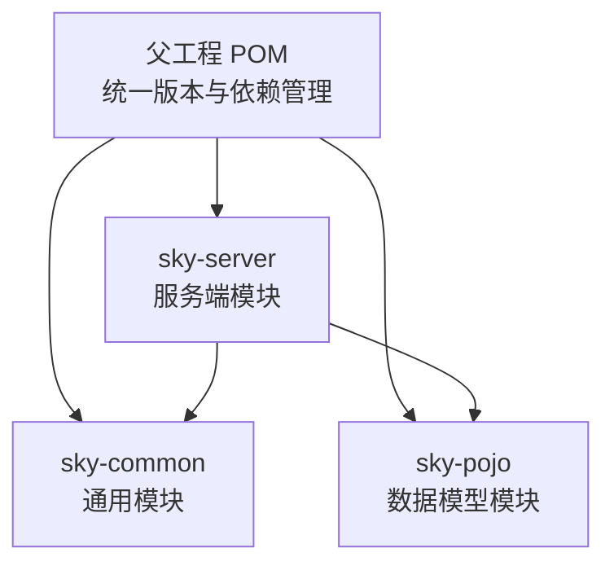
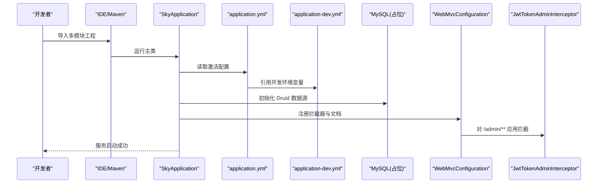
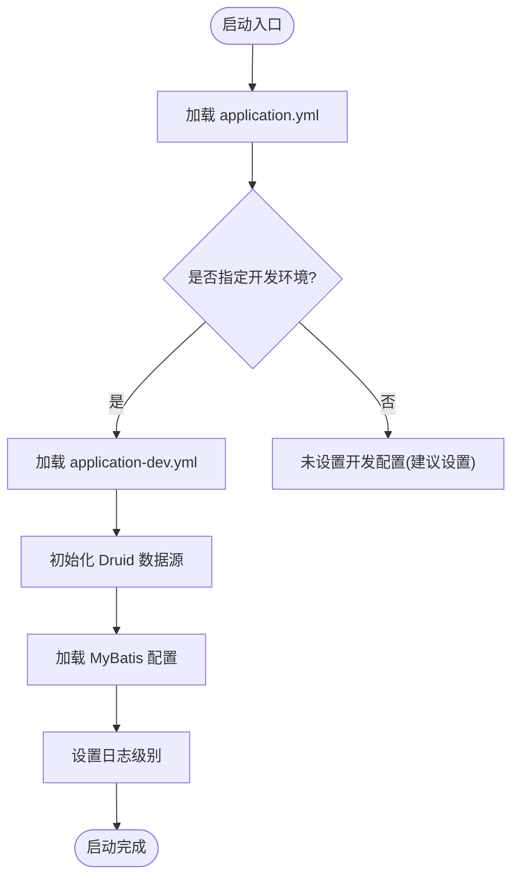
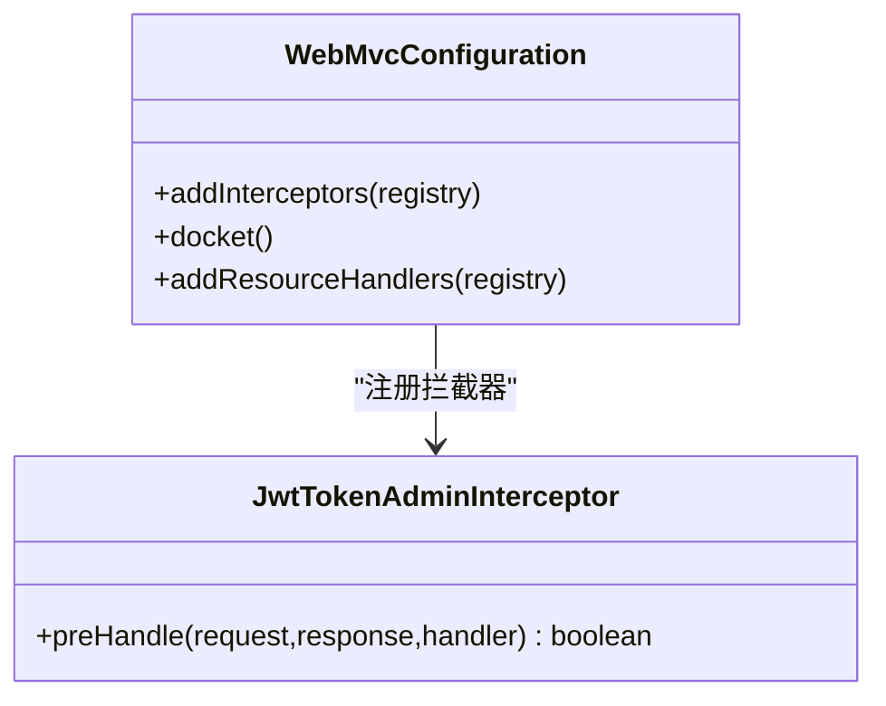
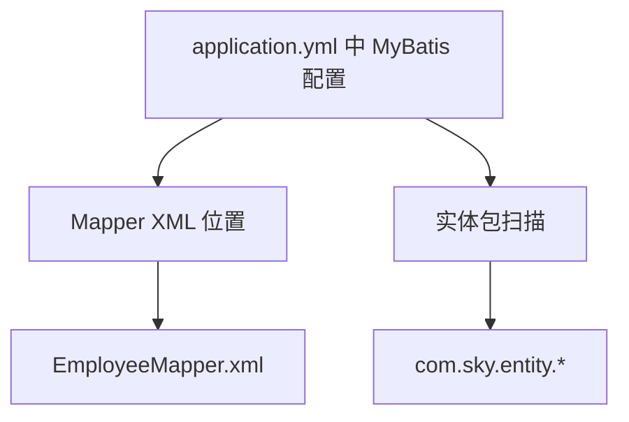
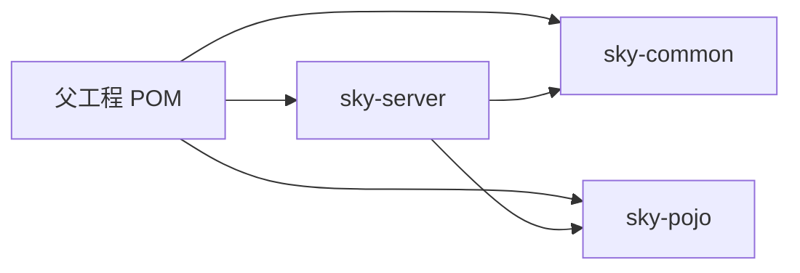

# 快速开始

<cite>
**本文引用的文件**
- [根 POM（父工程）](file://pom.xml)
- [服务端模块 POM](file://sky-server/pom.xml)
- [公共模块 POM](file://sky-common/pom.xml)
- [实体与 DTO 模块 POM](file://sky-pojo/pom.xml)
- [应用入口类](file://sky-server/src/main/java/com/sky/SkyApplication.java)
- [主配置文件](file://sky-server/src/main/resources/application.yml)
- [开发环境配置文件](file://sky-server/src/main/resources/application-dev.yml)
- [MyBatis 映射示例](file://sky-server/src/main/resources/mapper/EmployeeMapper.xml)
- [Web MVC 配置与 Knife4j 文档](file://sky-server/src/main/java/com/sky/config/WebMvcConfiguration.java)
- [管理员 JWT 拦截器](file://sky-server/src/main/java/com/sky/interceptor/JwtTokenAdminInterceptor.java)
- [.gitignore 忽略规则](file://.gitignore)
</cite>

## 目录
1. [简介](#简介)
2. [项目结构](#项目结构)
3. [核心组件](#核心组件)
4. [架构总览](#架构总览)
5. [详细组件分析](#详细组件分析)
6. [依赖关系分析](#依赖关系分析)
7. [性能注意事项](#性能注意事项)
8. [故障排查指南](#故障排查指南)
9. [结论](#结论)
10. [附录：安装清单与验证步骤](#附录安装清单与验证步骤)

## 简介
本指南面向首次接触“苍穹外卖点餐系统”的开发者，帮助你在最短时间内完成本地开发环境搭建与项目启动。内容覆盖 JDK 版本要求、MySQL 数据库准备、Maven 多模块工程导入、基础配置与启动流程，并提供常见问题排查与环境检查清单，确保你能在本地快速跑通系统。

## 项目结构
该仓库采用 Maven 多模块结构，核心模块如下：
- 父工程 POM：统一版本与依赖管理
- sky-common：通用工具、常量、异常、配置属性等
- sky-pojo：领域模型、DTO、VO 等数据对象
- sky-server：后端服务模块，包含 Spring Boot 启动类、配置、拦截器、Knife4j 文档与 MyBatis Mapper 示例

图表来源
- [根 POM（父工程）:1-128](file://pom.xml#L1-L128)
- [服务端模块 POM:1-130](file://sky-server/pom.xml#L1-L130)
- [公共模块 POM:1-54](file://sky-common/pom.xml#L1-L54)
- [实体与 DTO 模块 POM:1-28](file://sky-pojo/pom.xml#L1-L28)

章节来源
- [根 POM（父工程）:1-128](file://pom.xml#L1-L128)
- [服务端模块 POM:1-130](file://sky-server/pom.xml#L1-L130)
- [公共模块 POM:1-54](file://sky-common/pom.xml#L1-L54)
- [实体与 DTO 模块 POM:1-28](file://sky-pojo/pom.xml#L1-L28)

## 核心组件
- 应用入口类：负责启动 Spring Boot 应用
- 主配置文件：定义端口、数据源占位符、MyBatis 基础配置、日志级别与 JWT 默认参数
- 开发环境配置文件：提供默认的数据库连接参数（localhost:3306）
- Web MVC 配置：注册拦截器与 Knife4j 接口文档
- 管理员 JWT 拦截器：对 /admin/** 路径进行登录态校验
- MyBatis Mapper 示例：演示命名空间与 XML 映射

章节来源
- [应用入口类:1-17](file://sky-server/src/main/java/com/sky/SkyApplication.java#L1-L17)
- [主配置文件:1-40](file://sky-server/src/main/resources/application.yml#L1-L40)
- [开发环境配置文件:1-9](file://sky-server/src/main/resources/application-dev.yml#L1-L9)
- [Web MVC 配置与 Knife4j 文档:1-69](file://sky-server/src/main/java/com/sky/config/WebMvcConfiguration.java#L1-L69)
- [管理员 JWT 拦截器:1-59](file://sky-server/src/main/java/com/sky/interceptor/JwtTokenAdminInterceptor.java#L1-L59)
- [MyBatis 映射示例:1-6](file://sky-server/src/main/resources/mapper/EmployeeMapper.xml#L1-L6)

## 架构总览
下图展示了启动流程与关键配置之间的关系：

图表来源
- [应用入口类:1-17](file://sky-server/src/main/java/com/sky/SkyApplication.java#L1-L17)
- [主配置文件:1-40](file://sky-server/src/main/resources/application.yml#L1-L40)
- [开发环境配置文件:1-9](file://sky-server/src/main/resources/application-dev.yml#L1-L9)
- [Web MVC 配置与 Knife4j 文档:1-69](file://sky-server/src/main/java/com/sky/config/WebMvcConfiguration.java#L1-L69)
- [管理员 JWT 拦截器:1-59](file://sky-server/src/main/java/com/sky/interceptor/JwtTokenAdminInterceptor.java#L1-L59)

## 详细组件分析

### 组件一：应用启动与配置加载
- 启动类位于服务端模块，使用 Spring Boot 自动装配
- 主配置文件定义了端口、激活的 profile、数据源占位符、MyBatis 基础配置与日志级别
- 开发环境配置文件提供默认的数据库连接信息（主机、端口、库名、账号、密码）

图表来源
- [主配置文件:1-40](file://sky-server/src/main/resources/application.yml#L1-L40)
- [开发环境配置文件:1-9](file://sky-server/src/main/resources/application-dev.yml#L1-L9)

章节来源
- [应用入口类:1-17](file://sky-server/src/main/java/com/sky/SkyApplication.java#L1-L17)
- [主配置文件:1-40](file://sky-server/src/main/resources/application.yml#L1-L40)
- [开发环境配置文件:1-9](file://sky-server/src/main/resources/application-dev.yml#L1-L9)

### 组件二：Web 层配置与接口文档
- 注册拦截器，对 /admin/** 路径生效，排除登录接口
- 通过 Knife4j 生成 Swagger 文档，默认访问路径为 /doc.html
- 提供静态资源映射，便于文档页面访问

图表来源
- [Web MVC 配置与 Knife4j 文档:1-69](file://sky-server/src/main/java/com/sky/config/WebMvcConfiguration.java#L1-L69)
- [管理员 JWT 拦截器:1-59](file://sky-server/src/main/java/com/sky/interceptor/JwtTokenAdminInterceptor.java#L1-L59)

章节来源
- [Web MVC 配置与 Knife4j 文档:1-69](file://sky-server/src/main/java/com/sky/config/WebMvcConfiguration.java#L1-L69)
- [管理员 JWT 拦截器:1-59](file://sky-server/src/main/java/com/sky/interceptor/JwtTokenAdminInterceptor.java#L1-L59)

### 组件三：MyBatis Mapper 与实体包扫描
- 主配置文件声明了 MyBatis 的 Mapper XML 位置与实体包扫描路径
- 示例 Mapper 文件提供了命名空间占位，便于后续扩展

图表来源
- [主配置文件:16-22](file://sky-server/src/main/resources/application.yml#L16-L22)
- [MyBatis 映射示例:1-6](file://sky-server/src/main/resources/mapper/EmployeeMapper.xml#L1-L6)

章节来源
- [主配置文件:16-22](file://sky-server/src/main/resources/application.yml#L16-L22)
- [MyBatis 映射示例:1-6](file://sky-server/src/main/resources/mapper/EmployeeMapper.xml#L1-L6)

## 依赖关系分析
- 父工程统一管理版本与依赖范围，子模块按需引入
- 服务端模块依赖公共模块与数据模型模块，并引入 Web、MyBatis、Redis、缓存、WebSocket、Knife4j 等生态组件
- 公共模块提供通用工具、JSON、JWT、阿里 OSS、微信支付等能力
- 实体与 DTO 模块提供领域对象与接口传输对象

图表来源
- [根 POM（父工程）:1-128](file://pom.xml#L1-L128)
- [服务端模块 POM:1-130](file://sky-server/pom.xml#L1-L130)
- [公共模块 POM:1-54](file://sky-common/pom.xml#L1-L54)
- [实体与 DTO 模块 POM:1-28](file://sky-pojo/pom.xml#L1-L28)

章节来源
- [根 POM（父工程）:1-128](file://pom.xml#L1-L128)
- [服务端模块 POM:1-130](file://sky-server/pom.xml#L1-L130)
- [公共模块 POM:1-54](file://sky-common/pom.xml#L1-L54)
- [实体与 DTO 模块 POM:1-28](file://sky-pojo/pom.xml#L1-L28)

## 性能注意事项
- 使用 Druid 连接池与分页插件提升数据库访问效率
- 启用 MyBatis 驼峰命名映射，减少字段映射开销
- 合理设置日志级别，避免在生产环境输出过多调试日志
- Redis 与缓存模块可用于热点数据缓存，降低数据库压力

## 故障排查指南
- 启动失败：确认已正确设置开发环境配置文件中的数据库连接参数
- 访问 401：管理员接口需要携带正确的 Token，拦截器会校验签名与有效期
- 文档无法打开：确认 Knife4j 已启用并访问 /doc.html
- 日志级别：可通过配置文件调整日志级别以定位问题

章节来源
- [开发环境配置文件:1-9](file://sky-server/src/main/resources/application-dev.yml#L1-L9)
- [管理员 JWT 拦截器:1-59](file://sky-server/src/main/java/com/sky/interceptor/JwtTokenAdminInterceptor.java#L1-L59)
- [Web MVC 配置与 Knife4j 文档:1-69](file://sky-server/src/main/java/com/sky/config/WebMvcConfiguration.java#L1-L69)
- [主配置文件:24-31](file://sky-server/src/main/resources/application.yml#L24-L31)

## 结论
通过本指南，你可以基于 Maven 多模块工程快速完成本地环境搭建与系统启动。建议在完成数据库初始化后，先验证接口文档可用性与基础登录流程，再逐步完善业务模块。

## 附录：安装清单与验证步骤

### 环境要求
- JDK：请使用与 Spring Boot 2.7.3 兼容的 JDK 版本（建议 JDK 8 或 11）
- MySQL：5.7 及以上版本，推荐 8.0；字符集使用 utf8mb4
- Maven：3.6+（用于构建与依赖管理）
- IDE：IntelliJ IDEA 或 Eclipse（建议 IDEA，便于多模块导入与调试）

章节来源
- [根 POM（父工程）:1-128](file://pom.xml#L1-L128)
- [服务端模块 POM:1-130](file://sky-server/pom.xml#L1-L130)

### 数据库准备
- 创建数据库：名称建议为 sky_take_out
- 字符集：utf8mb4，排序规则：utf8mb4_unicode_ci
- 初始化脚本：请在数据库中执行项目提供的 SQL 脚本（如存在），或根据实体表结构自行初始化
- 连接参数：确保 application-dev.yml 中的 host、port、database、username、password 与本地数据库一致

章节来源
- [开发环境配置文件:1-9](file://sky-server/src/main/resources/application-dev.yml#L1-L9)

### Maven 工程导入与编译
- 在 IDE 中选择“Open”或“Import”，指向根目录下的 pom.xml
- 等待依赖下载与模块解析完成
- 执行编译命令（mvn clean compile），确保无编译错误

章节来源
- [根 POM（父工程）:1-128](file://pom.xml#L1-L128)
- [.gitignore 忽略规则:1-6](file://.gitignore#L1-L6)

### 开发环境配置
- profile 激活：主配置文件已激活 dev 环境
- 数据源：主配置文件引用了 sky.datasource.* 占位符，开发配置文件提供默认值
- MyBatis：已配置 Mapper XML 位置与实体包扫描

章节来源
- [主配置文件:1-40](file://sky-server/src/main/resources/application.yml#L1-L40)
- [开发环境配置文件:1-9](file://sky-server/src/main/resources/application-dev.yml#L1-L9)

### 项目启动流程
- 运行服务端模块的启动类 SkyApplication
- 服务启动后，访问 /doc.html 查看 Knife4j 接口文档
- 若为管理员功能，需先登录获取 Token 并在请求头中携带

章节来源
- [应用入口类:1-17](file://sky-server/src/main/java/com/sky/SkyApplication.java#L1-L17)
- [Web MVC 配置与 Knife4j 文档:1-69](file://sky-server/src/main/java/com/sky/config/WebMvcConfiguration.java#L1-L69)
- [管理员 JWT 拦截器:1-59](file://sky-server/src/main/java/com/sky/interceptor/JwtTokenAdminInterceptor.java#L1-L59)

### 常见问题与解决
- 数据库连接失败：核对 application-dev.yml 中的 host、port、database、username、password
- 启动报错找不到 Mapper XML：确认 application.yml 中的 mapper-locations 配置正确
- 接口返回 401：确认请求头携带了正确的 Token 名称与值
- 文档页面空白：确认 Knife4j 已启用且静态资源映射正常

章节来源
- [开发环境配置文件:1-9](file://sky-server/src/main/resources/application-dev.yml#L1-L9)
- [主配置文件:16-22](file://sky-server/src/main/resources/application.yml#L16-L22)
- [Web MVC 配置与 Knife4j 文档:1-69](file://sky-server/src/main/java/com/sky/config/WebMvcConfiguration.java#L1-L69)
- [管理员 JWT 拦截器:1-59](file://sky-server/src/main/java/com/sky/interceptor/JwtTokenAdminInterceptor.java#L1-L59)

### 环境检查清单
- [ ] JDK 版本满足要求
- [ ] MySQL 正常运行，数据库已创建
- [ ] Maven 依赖下载完成，无编译错误
- [ ] application-dev.yml 中数据库连接参数正确
- [ ] 服务端启动成功，端口 8080 可访问
- [ ] /doc.html 接口文档可打开
- [ ] 管理员登录接口可调用，返回 Token

章节来源
- [根 POM（父工程）:1-128](file://pom.xml#L1-L128)
- [服务端模块 POM:1-130](file://sky-server/pom.xml#L1-L130)
- [开发环境配置文件:1-9](file://sky-server/src/main/resources/application-dev.yml#L1-L9)
- [主配置文件:1-40](file://sky-server/src/main/resources/application.yml#L1-L40)
- [应用入口类:1-17](file://sky-server/src/main/java/com/sky/SkyApplication.java#L1-L17)
- [Web MVC 配置与 Knife4j 文档:1-69](file://sky-server/src/main/java/com/sky/config/WebMvcConfiguration.java#L1-L69)