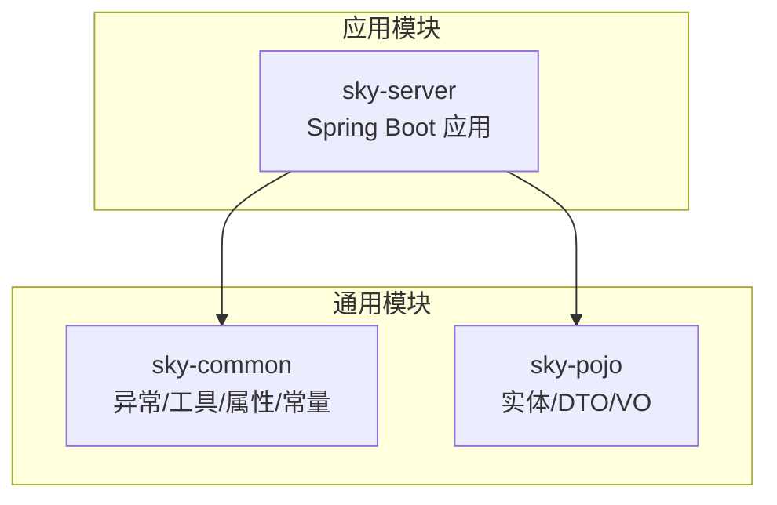
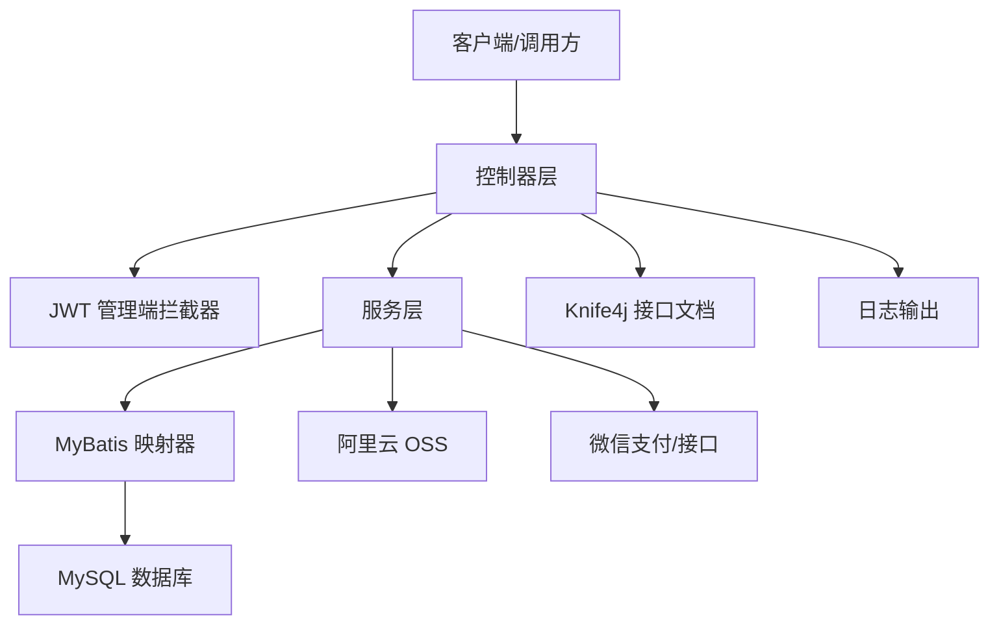
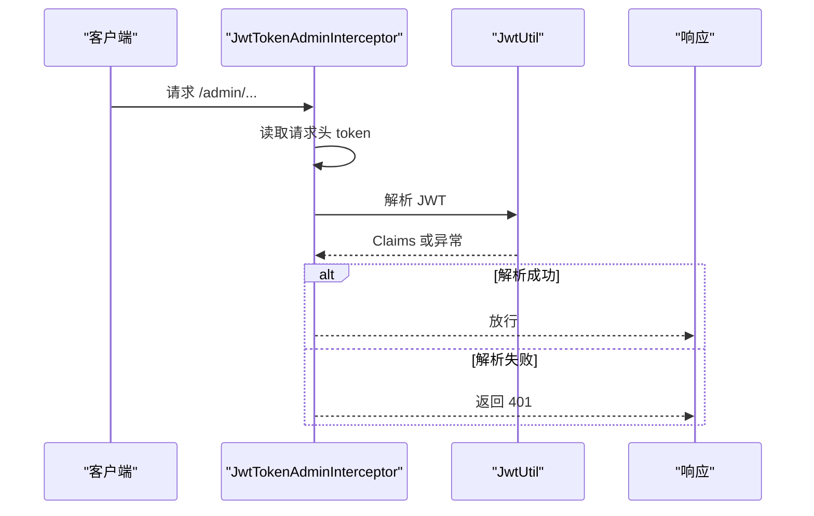
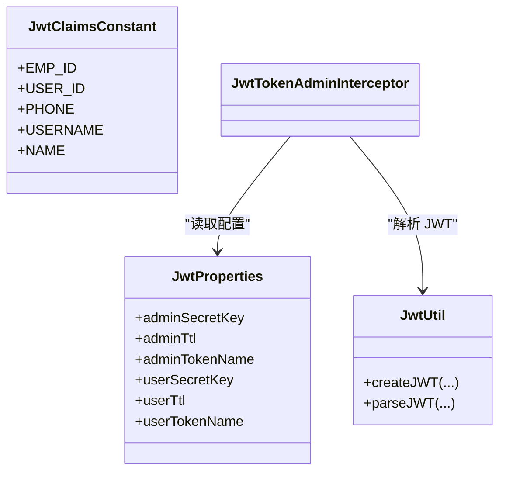
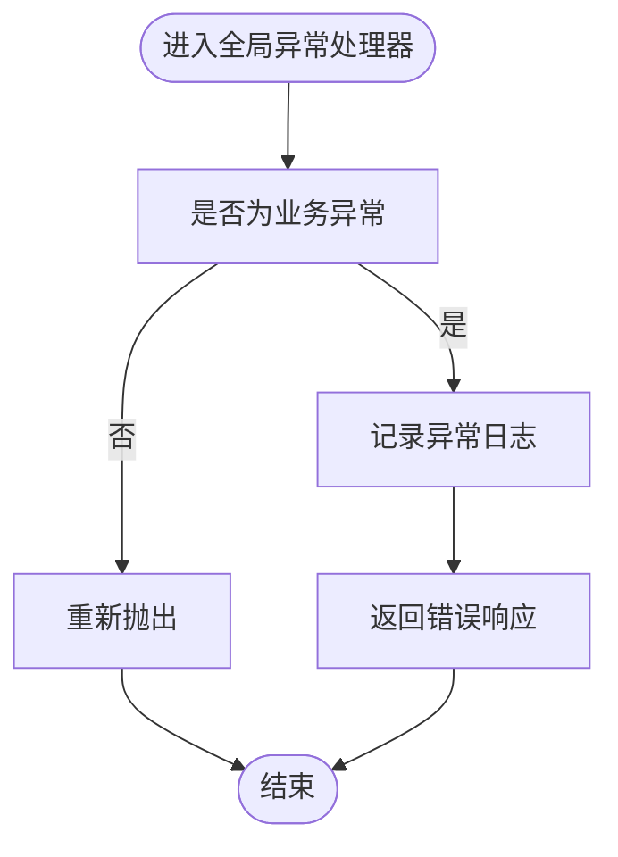
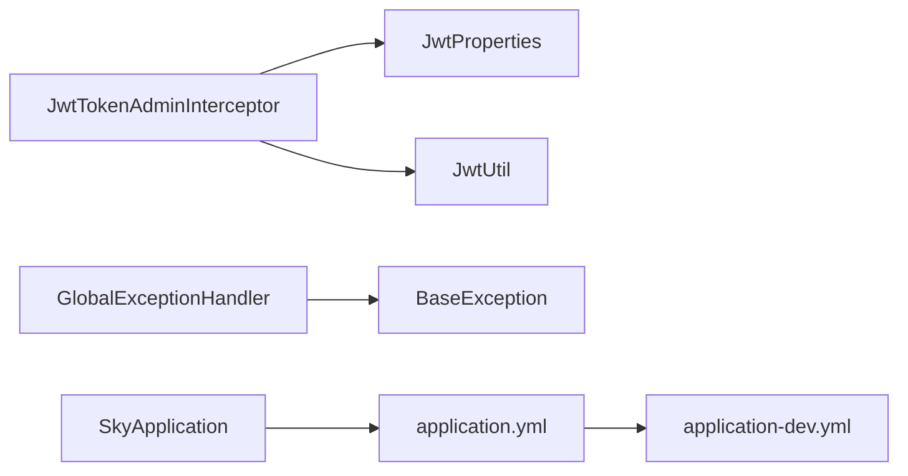

# 故障排查

<cite>
**本文引用的文件**
- [SkyApplication.java](file://sky-server/src/main/java/com/sky/SkyApplication.java)
- [WebMvcConfiguration.java](file://sky-server/src/main/java/com/sky/config/WebMvcConfiguration.java)
- [JwtTokenAdminInterceptor.java](file://sky-server/src/main/java/com/sky/interceptor/JwtTokenAdminInterceptor.java)
- [GlobalExceptionHandler.java](file://sky-server/src/main/java/com/sky/handler/GlobalExceptionHandler.java)
- [application.yml](file://sky-server/src/main/resources/application.yml)
- [application-dev.yml](file://sky-server/src/main/resources/application-dev.yml)
- [JwtProperties.java](file://sky-common/src/main/java/com/sky/properties/JwtProperties.java)
- [JwtClaimsConstant.java](file://sky-common/src/main/java/com/sky/constant/JwtClaimsConstant.java)
- [JwtUtil.java](file://sky-common/src/main/java/com/sky/utils/JwtUtil.java)
- [BaseException.java](file://sky-common/src/main/java/com/sky/exception/BaseException.java)
- [AliOssProperties.java](file://sky-common/src/main/java/com/sky/properties/AliOssProperties.java)
- [WeChatProperties.java](file://sky-common/src/main/java/com/sky/properties/WeChatProperties.java)
- [AliOssUtil.java](file://sky-common/src/main/java/com/sky/utils/AliOssUtil.java)
- [HttpClientUtil.java](file://sky-common/src/main/java/com/sky/utils/HttpClientUtil.java)
</cite>

## 目录
1. [简介](#简介)
2. [项目结构](#项目结构)
3. [核心组件](#核心组件)
4. [架构总览](#架构总览)
5. [详细组件分析](#详细组件分析)
6. [依赖分析](#依赖分析)
7. [性能考虑](#性能考虑)
8. [故障排查指南](#故障排查指南)
9. [结论](#结论)
10. [附录](#附录)

## 简介
本指南面向“苍穹外卖”点餐系统运维与开发人员，聚焦于系统运行中的常见故障场景，提供可操作的诊断流程与解决方案。内容涵盖启动失败、数据库连接异常、JWT认证失败、全局异常处理、日志分析、性能问题、网络连接与第三方服务（OSS、微信）集成问题，以及预防与应急处理建议。

## 项目结构
系统采用多模块分层组织：
- sky-common：通用能力（异常、工具、配置属性、常量）
- sky-pojo：实体与DTO/VO模型
- sky-server：Spring Boot应用入口与Web层配置、拦截器、全局异常处理

图示来源
- [SkyApplication.java:1-17](file://sky-server/src/main/java/com/sky/SkyApplication.java#L1-L17)
- [WebMvcConfiguration.java:1-69](file://sky-server/src/main/java/com/sky/config/WebMvcConfiguration.java#L1-L69)

章节来源
- [SkyApplication.java:1-17](file://sky-server/src/main/java/com/sky/SkyApplication.java#L1-L17)
- [WebMvcConfiguration.java:1-69](file://sky-server/src/main/java/com/sky/config/WebMvcConfiguration.java#L1-L69)

## 核心组件
- 应用入口与启动日志：负责应用启动与启动完成日志输出
- Web MVC 配置：注册拦截器、Knife4j 文档、静态资源映射
- JWT 认证拦截器：校验管理端 JWT 并注入上下文
- 全局异常处理器：统一捕获业务异常并返回标准结果
- 配置中心：数据库连接、MyBatis、日志级别、JWT 参数
- 工具与第三方集成：OSS、微信支付、HTTP 客户端

章节来源
- [SkyApplication.java:10-16](file://sky-server/src/main/java/com/sky/SkyApplication.java#L10-L16)
- [WebMvcConfiguration.java:23-38](file://sky-server/src/main/java/com/sky/config/WebMvcConfiguration.java#L23-L38)
- [JwtTokenAdminInterceptor.java:20-58](file://sky-server/src/main/java/com/sky/interceptor/JwtTokenAdminInterceptor.java#L20-L58)
- [GlobalExceptionHandler.java:12-27](file://sky-server/src/main/java/com/sky/handler/GlobalExceptionHandler.java#L12-L27)
- [application.yml:1-40](file://sky-server/src/main/resources/application.yml#L1-L40)
- [application-dev.yml:1-9](file://sky-server/src/main/resources/application-dev.yml#L1-L9)

## 架构总览
系统采用 Spring MVC + MyBatis 的典型后端架构，配合 Knife4j 提供接口文档；JWT 用于管理端鉴权；全局异常处理保证对外一致的错误响应；日志按包级别输出便于定位问题。

图示来源
- [WebMvcConfiguration.java:33-38](file://sky-server/src/main/java/com/sky/config/WebMvcConfiguration.java#L33-L38)
- [JwtTokenAdminInterceptor.java:34-56](file://sky-server/src/main/java/com/sky/interceptor/JwtTokenAdminInterceptor.java#L34-L56)
- [application.yml:16-22](file://sky-server/src/main/resources/application.yml#L16-L22)
- [AliOssUtil.java:29-67](file://sky-common/src/main/java/com/sky/utils/AliOssUtil.java#L29-L67)
- [HttpClientUtil.java:36-74](file://sky-common/src/main/java/com/sky/utils/HttpClientUtil.java#L36-L74)

## 详细组件分析

### 启动与应用入口
- 启动流程：Spring Boot 应用启动后记录启动完成日志
- 常见问题：端口占用、配置加载失败、依赖冲突
- 诊断要点：查看启动日志中“server started”是否出现；检查配置文件路径与环境变量

章节来源
- [SkyApplication.java:12-16](file://sky-server/src/main/java/com/sky/SkyApplication.java#L12-L16)
- [application.yml:1-40](file://sky-server/src/main/resources/application.yml#L1-L40)

### Web MVC 与拦截器
- 拦截器注册：对 /admin/** 路径启用 JWT 校验，排除登录接口
- 文档与静态资源：Knife4j 文档与静态资源映射
- 诊断要点：确认拦截器注册顺序与排除路径；验证登录接口未被拦截

图示来源
- [WebMvcConfiguration.java:33-38](file://sky-server/src/main/java/com/sky/config/WebMvcConfiguration.java#L33-L38)
- [JwtTokenAdminInterceptor.java:34-56](file://sky-server/src/main/java/com/sky/interceptor/JwtTokenAdminInterceptor.java#L34-L56)
- [JwtUtil.java:48-56](file://sky-common/src/main/java/com/sky/utils/JwtUtil.java#L48-L56)

章节来源
- [WebMvcConfiguration.java:23-38](file://sky-server/src/main/java/com/sky/config/WebMvcConfiguration.java#L23-L38)
- [JwtTokenAdminInterceptor.java:20-58](file://sky-server/src/main/java/com/sky/interceptor/JwtTokenAdminInterceptor.java#L20-L58)

### JWT 认证与配置
- 配置项：密钥、过期时间、请求头名
- Claims 常量：员工ID、用户名等
- 解析逻辑：基于密钥与算法解析，失败返回 401
- 诊断要点：核对请求头名与密钥一致性；检查过期时间与服务端时间同步

图示来源
- [JwtProperties.java:10-26](file://sky-common/src/main/java/com/sky/properties/JwtProperties.java#L10-L26)
- [JwtClaimsConstant.java:3-11](file://sky-common/src/main/java/com/sky/constant/JwtClaimsConstant.java#L3-L11)
- [JwtUtil.java:21-56](file://sky-common/src/main/java/com/sky/utils/JwtUtil.java#L21-L56)
- [JwtTokenAdminInterceptor.java:22-56](file://sky-server/src/main/java/com/sky/interceptor/JwtTokenAdminInterceptor.java#L22-L56)

章节来源
- [JwtProperties.java:10-26](file://sky-common/src/main/java/com/sky/properties/JwtProperties.java#L10-L26)
- [JwtClaimsConstant.java:3-11](file://sky-common/src/main/java/com/sky/constant/JwtClaimsConstant.java#L3-L11)
- [JwtUtil.java:21-56](file://sky-common/src/main/java/com/sky/utils/JwtUtil.java#L21-L56)
- [JwtTokenAdminInterceptor.java:34-56](file://sky-server/src/main/java/com/sky/interceptor/JwtTokenAdminInterceptor.java#L34-L56)

### 全局异常处理
- 统一捕获业务异常，记录日志并返回标准错误响应
- 诊断要点：关注异常日志消息；区分业务异常与系统异常

图示来源
- [GlobalExceptionHandler.java:21-25](file://sky-server/src/main/java/com/sky/handler/GlobalExceptionHandler.java#L21-L25)
- [BaseException.java:6-15](file://sky-common/src/main/java/com/sky/exception/BaseException.java#L6-L15)

章节来源
- [GlobalExceptionHandler.java:12-27](file://sky-server/src/main/java/com/sky/handler/GlobalExceptionHandler.java#L12-L27)
- [BaseException.java:6-15](file://sky-common/src/main/java/com/sky/exception/BaseException.java#L6-L15)

### 数据库连接与 MyBatis
- 数据源：Druid 连接池，支持环境变量注入
- MyBatis：驼峰映射、XML 映射文件位置、实体包扫描
- 诊断要点：核对数据库主机、端口、库名、账号密码；检查驱动类名与网络连通性

章节来源
- [application.yml:9-22](file://sky-server/src/main/resources/application.yml#L9-L22)
- [application-dev.yml:2-8](file://sky-server/src/main/resources/application-dev.yml#L2-L8)

### 日志与日志级别
- 日志级别：按包设置，mapper/service/controller 分别为 debug/info/info
- 诊断要点：在排查 SQL 与业务逻辑时临时提升级别；关注异常堆栈与业务日志

章节来源
- [application.yml:24-30](file://sky-server/src/main/resources/application.yml#L24-L30)

### 第三方服务集成
- 阿里云 OSS：endpoint、accessKeyId、accessKeySecret、bucketName
- 微信支付：appid、secret、mchid、证书与回调地址等
- HTTP 客户端：超时配置、GET/POST 方法封装

章节来源
- [AliOssProperties.java:10-17](file://sky-common/src/main/java/com/sky/properties/AliOssProperties.java#L10-L17)
- [WeChatProperties.java:11-22](file://sky-common/src/main/java/com/sky/properties/WeChatProperties.java#L11-L22)
- [AliOssUtil.java:29-67](file://sky-common/src/main/java/com/sky/utils/AliOssUtil.java#L29-L67)
- [HttpClientUtil.java:28-177](file://sky-common/src/main/java/com/sky/utils/HttpClientUtil.java#L28-L177)

## 依赖分析
- 组件耦合：拦截器依赖 JWT 配置与工具；全局异常处理器依赖业务异常基类
- 外部依赖：数据库、OSS、微信支付、HTTP 客户端
- 配置契约：application.yml 与 application-dev.yml 的键空间需保持一致

图示来源
- [JwtTokenAdminInterceptor.java:22-23](file://sky-server/src/main/java/com/sky/interceptor/JwtTokenAdminInterceptor.java#L22-L23)
- [JwtProperties.java:10-26](file://sky-common/src/main/java/com/sky/properties/JwtProperties.java#L10-L26)
- [JwtUtil.java:48-56](file://sky-common/src/main/java/com/sky/utils/JwtUtil.java#L48-L56)
- [GlobalExceptionHandler.java:21-25](file://sky-server/src/main/java/com/sky/handler/GlobalExceptionHandler.java#L21-L25)
- [BaseException.java:6-15](file://sky-common/src/main/java/com/sky/exception/BaseException.java#L6-L15)
- [SkyApplication.java:12-14](file://sky-server/src/main/java/com/sky/SkyApplication.java#L12-L14)
- [application.yml:1-40](file://sky-server/src/main/resources/application.yml#L1-L40)
- [application-dev.yml:1-9](file://sky-server/src/main/resources/application-dev.yml#L1-L9)

## 性能考虑
- 连接池与超时：数据库连接池与 HTTP 客户端超时配置需结合业务峰值评估
- 日志级别：生产环境建议降低 debug 输出，避免 IO 抖动
- 缓存与降级：对热点接口可引入缓存与限流降级策略（建议在服务层扩展）

## 故障排查指南

### 启动失败
- 现象：应用无法启动或启动后立即退出
- 诊断步骤
  - 查看启动日志是否出现“server started”
  - 检查端口占用与防火墙
  - 校验配置文件路径与环境变量是否正确加载
- 关联文件
  - [SkyApplication.java:12-16](file://sky-server/src/main/java/com/sky/SkyApplication.java#L12-L16)
  - [application.yml:1-40](file://sky-server/src/main/resources/application.yml#L1-L40)

章节来源
- [SkyApplication.java:12-16](file://sky-server/src/main/java/com/sky/SkyApplication.java#L12-L16)
- [application.yml:1-40](file://sky-server/src/main/resources/application.yml#L1-L40)

### 数据库连接问题
- 现象：启动时报数据库连接异常、SQL 执行失败
- 诊断步骤
  - 核对数据库主机、端口、库名、账号、密码
  - 检查驱动类名与网络连通性
  - 查看 MyBatis 映射文件与实体包扫描配置
- 关联文件
  - [application.yml:9-22](file://sky-server/src/main/resources/application.yml#L9-L22)
  - [application-dev.yml:2-8](file://sky-server/src/main/resources/application-dev.yml#L2-L8)

章节来源
- [application.yml:9-22](file://sky-server/src/main/resources/application.yml#L9-L22)
- [application-dev.yml:2-8](file://sky-server/src/main/resources/application-dev.yml#L2-L8)

### JWT 认证异常
- 现象：管理端接口返回 401，或日志提示解析失败
- 诊断步骤
  - 确认请求头名称与服务端配置一致
  - 核对密钥与过期时间
  - 检查 Claims 中的员工ID是否正确解析
- 关联文件
  - [WebMvcConfiguration.java:33-38](file://sky-server/src/main/java/com/sky/config/WebMvcConfiguration.java#L33-L38)
  - [JwtTokenAdminInterceptor.java:34-56](file://sky-server/src/main/java/com/sky/interceptor/JwtTokenAdminInterceptor.java#L34-L56)
  - [JwtProperties.java:10-26](file://sky-common/src/main/java/com/sky/properties/JwtProperties.java#L10-L26)
  - [JwtClaimsConstant.java:3-11](file://sky-common/src/main/java/com/sky/constant/JwtClaimsConstant.java#L3-L11)
  - [JwtUtil.java:48-56](file://sky-common/src/main/java/com/sky/utils/JwtUtil.java#L48-L56)

章节来源
- [WebMvcConfiguration.java:33-38](file://sky-server/src/main/java/com/sky/config/WebMvcConfiguration.java#L33-L38)
- [JwtTokenAdminInterceptor.java:34-56](file://sky-server/src/main/java/com/sky/interceptor/JwtTokenAdminInterceptor.java#L34-L56)
- [JwtProperties.java:10-26](file://sky-common/src/main/java/com/sky/properties/JwtProperties.java#L10-L26)
- [JwtClaimsConstant.java:3-11](file://sky-common/src/main/java/com/sky/constant/JwtClaimsConstant.java#L3-L11)
- [JwtUtil.java:48-56](file://sky-common/src/main/java/com/sky/utils/JwtUtil.java#L48-L56)

### 全局异常处理与业务异常
- 现象：接口返回统一错误响应，但日志中未见业务异常堆栈
- 诊断步骤
  - 检查是否抛出了业务异常基类
  - 查看异常日志消息，定位具体业务场景
- 关联文件
  - [GlobalExceptionHandler.java:21-25](file://sky-server/src/main/java/com/sky/handler/GlobalExceptionHandler.java#L21-L25)
  - [BaseException.java:6-15](file://sky-common/src/main/java/com/sky/exception/BaseException.java#L6-L15)

章节来源
- [GlobalExceptionHandler.java:21-25](file://sky-server/src/main/java/com/sky/handler/GlobalExceptionHandler.java#L21-L25)
- [BaseException.java:6-15](file://sky-common/src/main/java/com/sky/exception/BaseException.java#L6-L15)

### 日志分析方法与关键信息
- 日志级别：mapper/service/controller 分别为 debug/info/info
- 关键信息
  - 启动完成日志：确认应用已成功启动
  - 异常日志：业务异常消息与堆栈
  - JWT 校验日志：请求头 token 与解析结果
- 关联文件
  - [application.yml:24-30](file://sky-server/src/main/resources/application.yml#L24-L30)
  - [SkyApplication.java:14-14](file://sky-server/src/main/java/com/sky/SkyApplication.java#L14-L14)
  - [GlobalExceptionHandler.java:23-23](file://sky-server/src/main/java/com/sky/handler/GlobalExceptionHandler.java#L23-L23)
  - [JwtTokenAdminInterceptor.java:46-49](file://sky-server/src/main/java/com/sky/interceptor/JwtTokenAdminInterceptor.java#L46-L49)

章节来源
- [application.yml:24-30](file://sky-server/src/main/resources/application.yml#L24-L30)
- [SkyApplication.java:14-14](file://sky-server/src/main/java/com/sky/SkyApplication.java#L14-L14)
- [GlobalExceptionHandler.java:23-23](file://sky-server/src/main/java/com/sky/handler/GlobalExceptionHandler.java#L23-L23)
- [JwtTokenAdminInterceptor.java:46-49](file://sky-server/src/main/java/com/sky/interceptor/JwtTokenAdminInterceptor.java#L46-L49)

### 网络连接问题
- 现象：HTTP 请求超时、第三方服务调用失败
- 诊断步骤
  - 检查 HTTP 客户端超时配置
  - 校验目标域名可达性与证书
  - 对比 GET/POST 请求参数与 Content-Type
- 关联文件
  - [HttpClientUtil.java:28-177](file://sky-common/src/main/java/com/sky/utils/HttpClientUtil.java#L28-L177)

章节来源
- [HttpClientUtil.java:28-177](file://sky-common/src/main/java/com/sky/utils/HttpClientUtil.java#L28-L177)

### 权限配置错误
- 现象：OSS 上传失败、微信支付回调异常
- 诊断步骤
  - 核对 OSS endpoint、accessKeyId、accessKeySecret、bucketName
  - 校验微信支付相关配置（appid、secret、mchid、证书路径与回调地址）
- 关联文件
  - [AliOssProperties.java:10-17](file://sky-common/src/main/java/com/sky/properties/AliOssProperties.java#L10-L17)
  - [WeChatProperties.java:11-22](file://sky-common/src/main/java/com/sky/properties/WeChatProperties.java#L11-L22)
  - [AliOssUtil.java:29-67](file://sky-common/src/main/java/com/sky/utils/AliOssUtil.java#L29-L67)

章节来源
- [AliOssProperties.java:10-17](file://sky-common/src/main/java/com/sky/properties/AliOssProperties.java#L10-L17)
- [WeChatProperties.java:11-22](file://sky-common/src/main/java/com/sky/properties/WeChatProperties.java#L11-L22)
- [AliOssUtil.java:29-67](file://sky-common/src/main/java/com/sky/utils/AliOssUtil.java#L29-L67)

### 第三方服务集成问题
- 现象：OSS 上传报错、微信支付回调未触发
- 诊断步骤
  - 捕获 OSSException 与 ClientException 并查看错误码与请求ID
  - 核对微信支付回调地址与证书配置
- 关联文件
  - [AliOssUtil.java:37-53](file://sky-common/src/main/java/com/sky/utils/AliOssUtil.java#L37-L53)
  - [WeChatProperties.java:11-22](file://sky-common/src/main/java/com/sky/properties/WeChatProperties.java#L11-L22)

章节来源
- [AliOssUtil.java:37-53](file://sky-common/src/main/java/com/sky/utils/AliOssUtil.java#L37-L53)
- [WeChatProperties.java:11-22](file://sky-common/src/main/java/com/sky/properties/WeChatProperties.java#L11-L22)

### 性能问题排查与优化建议
- 排查步骤
  - 观察慢查询日志与 SQL 执行时间
  - 检查线程池与连接池使用率
  - 评估日志级别对性能的影响
- 优化建议
  - 合理设置数据库连接池大小与超时
  - 在热点接口引入缓存与限流
  - 生产环境降低 debug 输出

章节来源
- [application.yml:24-30](file://sky-server/src/main/resources/application.yml#L24-L30)
- [application.yml:9-22](file://sky-server/src/main/resources/application.yml#L9-L22)

### 故障预防与应急处理预案
- 预防措施
  - 健康检查与端到端链路监控
  - 配置集中化与灰度发布
  - 定期演练与备份恢复
- 应急处理
  - 快速隔离问题模块，回滚最近变更
  - 临时调整日志级别以获取更多信息
  - 优先保障核心路径可用

## 结论
通过明确启动流程、拦截器链、异常处理、配置契约与第三方集成点，可以系统化地定位与解决“苍穹外卖”系统运行中的各类故障。建议在生产环境中持续完善监控与告警，并定期进行演练以缩短故障恢复时间。

## 附录
- 常用排查清单
  - 启动日志：确认“server started”
  - 数据库：连通性、驱动、凭据
  - JWT：请求头名、密钥、过期时间
  - 日志：级别、异常消息、关键流程日志
  - 网络：超时、域名、证书
  - 第三方：配置项齐全、回调地址有效