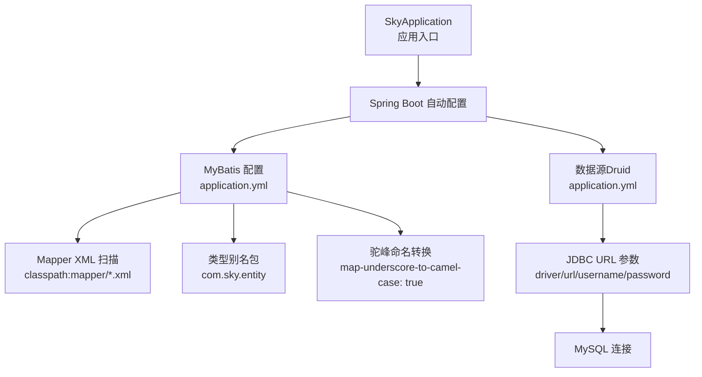
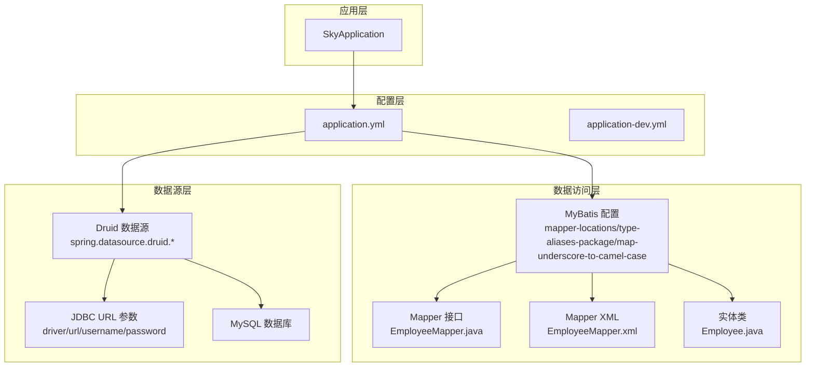
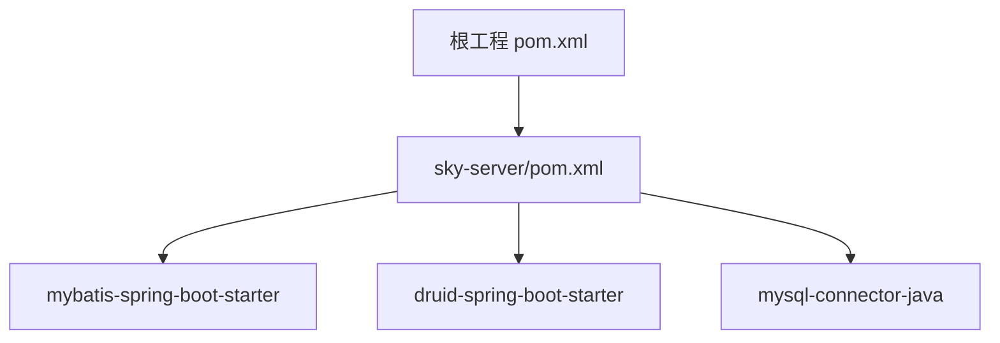

# MyBatis配置

<cite>
**本文引用的文件**
- [application.yml](file://sky-server/src/main/resources/application.yml)
- [application-dev.yml](file://sky-server/src/main/resources/application-dev.yml)
- [SkyApplication.java](file://sky-server/src/main/java/com/sky/SkyApplication.java)
- [EmployeeMapper.java](file://sky-server/src/main/java/com/sky/mapper/EmployeeMapper.java)
- [EmployeeMapper.xml](file://sky-server/src/main/resources/mapper/EmployeeMapper.xml)
- [pom.xml（根工程）](file://pom.xml)
- [pom.xml（sky-server）](file://sky-server/pom.xml)
- [Employee.java](file://sky-pojo/src/main/java/com/sky/entity/Employee.java)
</cite>

## 目录
1. [简介](#简介)
2. [项目结构](#项目结构)
3. [核心组件](#核心组件)
4. [架构总览](#架构总览)
5. [详细组件分析](#详细组件分析)
6. [依赖分析](#依赖分析)
7. [性能考虑](#性能考虑)
8. [故障排查指南](#故障排查指南)
9. [结论](#结论)
10. [附录：完整配置示例与最佳实践](#附录完整配置示例与最佳实践)

## 简介
本文件围绕 MyBatis 在本项目的配置进行系统性说明，重点覆盖以下方面：
- 数据源与连接池：基于 Druid 的 Spring Boot 自动配置与参数来源
- 连接参数与 JDBC URL 组成
- Mapper 映射文件位置与扫描
- 类型别名包与驼峰命名转换
- SQL 日志输出与性能调优建议
- 配置项含义与调优方法
- 完整配置示例与最佳实践

## 项目结构
本项目采用多模块结构，MyBatis 相关配置集中在 sky-server 模块的资源文件中，并通过 Maven 依赖引入 MyBatis Starter 与 Druid Starter。

图表来源
- [SkyApplication.java:1-17](file://sky-server/src/main/java/com/sky/SkyApplication.java#L1-L17)
- [application.yml:1-40](file://sky-server/src/main/resources/application.yml#L1-L40)
- [application-dev.yml:1-9](file://sky-server/src/main/resources/application-dev.yml#L1-L9)

章节来源
- [SkyApplication.java:1-17](file://sky-server/src/main/java/com/sky/SkyApplication.java#L1-L17)
- [application.yml:1-40](file://sky-server/src/main/resources/application.yml#L1-L40)
- [application-dev.yml:1-9](file://sky-server/src/main/resources/application-dev.yml#L1-L9)

## 核心组件
- 数据源与连接池
  - 使用 Druid 连接池，通过 spring.datasource.druid.* 配置项进行设置
  - JDBC 驱动、URL、用户名、密码由外部占位符注入，开发环境在 application-dev.yml 中提供具体值
- MyBatis 配置
  - Mapper XML 文件扫描路径：classpath:mapper/*.xml
  - 类型别名包：com.sky.entity
  - 驼峰命名转换：开启 map-underscore-to-camel-case
- 日志输出
  - 针对 com.sky.mapper 包设置 debug 级别日志，便于观察 SQL 执行情况

章节来源
- [application.yml:9-22](file://sky-server/src/main/resources/application.yml#L9-L22)
- [application-dev.yml:1-9](file://sky-server/src/main/resources/application-dev.yml#L1-L9)

## 架构总览
下图展示 MyBatis 在本项目中的配置与运行关系：

图表来源
- [SkyApplication.java:1-17](file://sky-server/src/main/java/com/sky/SkyApplication.java#L1-L17)
- [application.yml:1-40](file://sky-server/src/main/resources/application.yml#L1-L40)
- [application-dev.yml:1-9](file://sky-server/src/main/resources/application-dev.yml#L1-L9)
- [EmployeeMapper.java:1-19](file://sky-server/src/main/java/com/sky/mapper/EmployeeMapper.java#L1-L19)
- [EmployeeMapper.xml:1-6](file://sky-server/src/main/resources/mapper/EmployeeMapper.xml#L1-L6)
- [Employee.java:1-45](file://sky-pojo/src/main/java/com/sky/entity/Employee.java#L1-L45)

## 详细组件分析

### 数据源与连接池（Druid）
- 配置要点
  - 驱动类名、URL、用户名、密码通过 spring.datasource.druid.* 注入
  - JDBC URL 包含时区、字符集、SSL、时区行为等参数
  - 开发环境使用 application-dev.yml 提供占位符的具体值
- 关键参数说明
  - driver-class-name：数据库驱动类名
  - url：JDBC 连接字符串，包含主机、端口、数据库名及连接参数
  - username/password：数据库账号与密码
- 最佳实践
  - 生产环境建议将敏感信息放入环境变量或配置中心，避免硬编码
  - 合理设置连接池大小与超时参数，结合业务并发量评估
  - 开启监控与慢查询日志，便于定位性能瓶颈

章节来源
- [application.yml:9-14](file://sky-server/src/main/resources/application.yml#L9-L14)
- [application-dev.yml:1-9](file://sky-server/src/main/resources/application-dev.yml#L1-L9)

### JDBC URL 参数详解
- 组成要素
  - 主机与端口：${sky.datasource.host} 与 ${sky.datasource.port}
  - 数据库名：${sky.datasource.database}
  - 连接参数：serverTimezone、useUnicode、characterEncoding、zeroDateTimeBehavior、useSSL、allowPublicKeyRetrieval
- 参数作用
  - serverTimezone：统一时区，避免时差问题
  - useUnicode 与 characterEncoding：确保字符集正确
  - zeroDateTimeBehavior：控制非法日期的处理策略
  - useSSL 与 allowPublicKeyRetrieval：根据 MySQL 版本与安全策略调整

章节来源
- [application.yml:11-14](file://sky-server/src/main/resources/application.yml#L11-L14)
- [application-dev.yml:2-8](file://sky-server/src/main/resources/application-dev.yml#L2-L8)

### Mapper 映射文件位置与扫描
- 配置项
  - mybatis.mapper-locations：指定 Mapper XML 文件扫描路径
  - 本项目使用 classpath:mapper/*.xml
- 实际映射
  - Mapper 接口：EmployeeMapper.java
  - Mapper XML：EmployeeMapper.xml
  - 命名空间需与接口全限定名一致（见 EmployeeMapper.xml）

章节来源
- [application.yml:16-18](file://sky-server/src/main/resources/application.yml#L16-L18)
- [EmployeeMapper.java:1-19](file://sky-server/src/main/java/com/sky/mapper/EmployeeMapper.java#L1-L19)
- [EmployeeMapper.xml:1-6](file://sky-server/src/main/resources/mapper/EmployeeMapper.xml#L1-L6)

### 类型别名包与实体类
- 配置项
  - mybatis.type-aliases-package：设置类型别名包，简化 XML 中的类型引用
- 实体类
  - Employee.java 等位于 com.sky.entity 包下，可被 MyBatis 自动识别为类型别名

章节来源
- [application.yml:18-19](file://sky-server/src/main/resources/application.yml#L18-L19)
- [Employee.java:1-45](file://sky-pojo/src/main/java/com/sky/entity/Employee.java#L1-L45)

### 驼峰命名转换
- 配置项
  - mybatis.configuration.map-underscore-to-camel-case：开启下划线到驼峰的自动映射
- 效果
  - 数据库字段如 create_time 将自动映射到实体属性 createTime

章节来源
- [application.yml:20-22](file://sky-server/src/main/resources/application.yml#L20-L22)

### SQL 日志输出
- 配置项
  - logging.level.com.sky.mapper：设置为 debug，可输出 SQL 语句与参数
- 观察点
  - 结合 Druid 监控面板，可进一步查看连接池状态与慢查询

章节来源
- [application.yml:24-30](file://sky-server/src/main/resources/application.yml#L24-L30)

## 依赖分析
- MyBatis Starter
  - 引入 mybatis-spring-boot-starter，实现 MyBatis 的自动配置
- Druid Starter
  - 引入 druid-spring-boot-starter，提供 Druid 数据源的自动配置能力
- MySQL 驱动
  - mysql-connector-java 作为运行时依赖，用于连接 MySQL

图表来源
- [pom.xml（根工程）:34-126](file://pom.xml#L34-L126)
- [pom.xml（sky-server）:49-67](file://sky-server/pom.xml#L49-L67)

章节来源
- [pom.xml（根工程）:34-126](file://pom.xml#L34-L126)
- [pom.xml（sky-server）:49-67](file://sky-server/pom.xml#L49-L67)

## 性能考虑
- 连接池参数（建议项）
  - 初始化大小、最小/最大连接数、获取连接超时、空闲回收窗口等应结合业务峰值并发与数据库承载能力设定
  - 启用 Druid 的监控页面，观察活跃连接数、平均等待时间、慢查询统计
- SQL 优化
  - 使用日志定位慢查询，配合索引设计与分页策略
  - 避免 N+1 查询，合理使用延迟加载与批量查询
- 缓存策略
  - 结合二级缓存与本地缓存，减少重复查询
- 线程与事务
  - 控制单次事务时长，避免长时间持有连接
- 监控与告警
  - 建议接入 APM 或数据库性能监控工具，建立阈值告警

## 故障排查指南
- 无法连接数据库
  - 检查 spring.datasource.druid.* 配置是否正确
  - 确认 application-dev.yml 中占位符已正确注入
  - 校验 JDBC URL 参数（主机、端口、数据库名、字符集、SSL 等）
- Mapper 未生效
  - 确认 mybatis.mapper-locations 路径存在且匹配
  - 确认 Mapper XML 的命名空间与接口全限定名一致
- 字段映射失败
  - 若未开启驼峰命名转换，需在 XML 中显式指定列名映射
- SQL 日志未输出
  - 确认 logging.level.com.sky.mapper 已设置为 debug

章节来源
- [application.yml:9-22](file://sky-server/src/main/resources/application.yml#L9-L22)
- [application-dev.yml:1-9](file://sky-server/src/main/resources/application-dev.yml#L1-L9)
- [EmployeeMapper.xml:1-6](file://sky-server/src/main/resources/mapper/EmployeeMapper.xml#L1-L6)

## 结论
本项目基于 Spring Boot 与 MyBatis Starter 快速搭建了数据访问层，通过 Druid 连接池与合理的 MyBatis 配置实现了稳定的数据访问能力。建议在生产环境中进一步完善连接池参数、SQL 监控与性能优化策略，并持续关注慢查询与连接池健康状况。

## 附录：完整配置示例与最佳实践
- 完整配置示例（路径参考）
  - 数据源与连接池：[application.yml:9-14](file://sky-server/src/main/resources/application.yml#L9-L14)，[application-dev.yml:1-9](file://sky-server/src/main/resources/application-dev.yml#L1-L9)
  - MyBatis 基础配置：[application.yml:16-22](file://sky-server/src/main/resources/application.yml#L16-L22)
  - 日志级别：[application.yml:24-30](file://sky-server/src/main/resources/application.yml#L24-L30)
- 最佳实践清单
  - 将敏感配置置于环境变量或配置中心
  - 启用并定期审查 Druid 监控与慢查询日志
  - 合理设置连接池参数，按业务峰值评估
  - 使用分页插件与索引优化 SQL
  - 保持 Mapper XML 与实体类命名规范一致