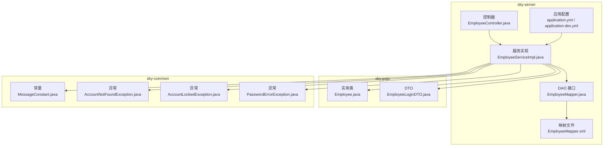
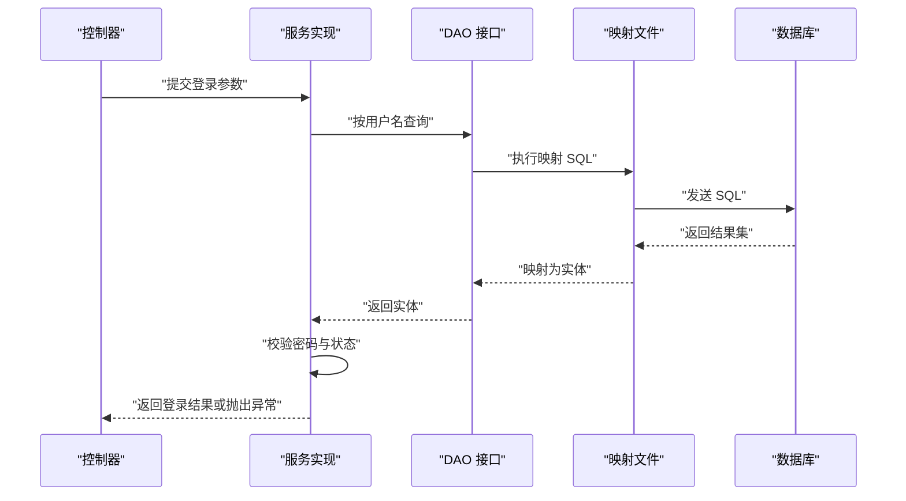
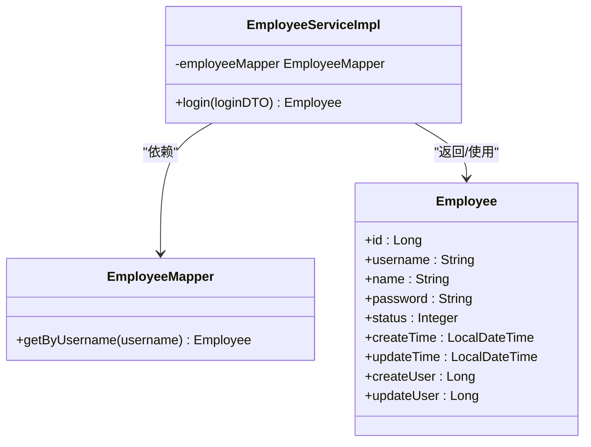
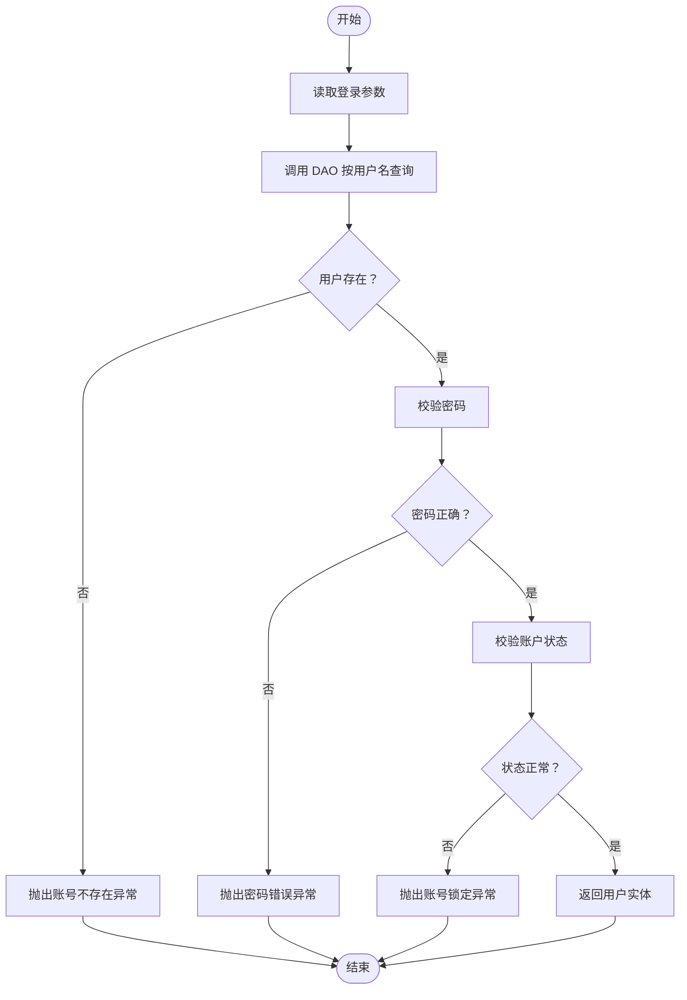
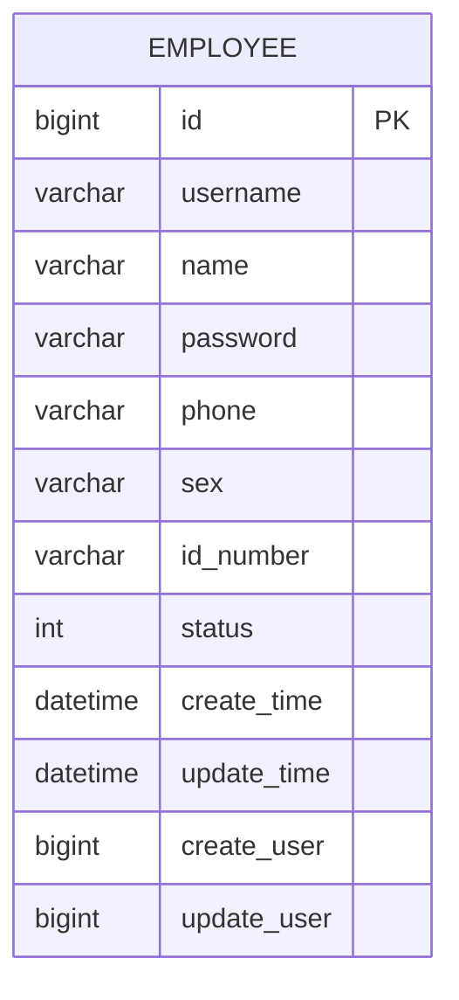
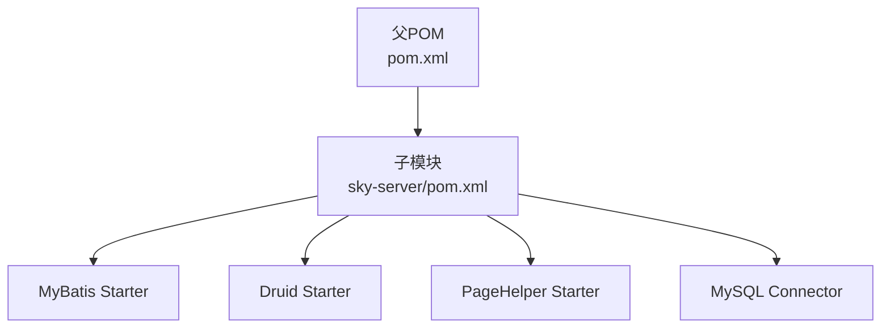

# 数据访问层

<cite>
**本文引用的文件**   
- [application.yml](file://sky-server/src/main/resources/application.yml)
- [application-dev.yml](file://sky-server/src/main/resources/application-dev.yml)
- [pom.xml](file://pom.xml)
- [sky-server/pom.xml](file://sky-server/pom.xml)
- [EmployeeMapper.java](file://sky-server/src/main/java/com/sky/mapper/EmployeeMapper.java)
- [EmployeeMapper.xml](file://sky-server/src/main/resources/mapper/EmployeeMapper.xml)
- [EmployeeServiceImpl.java](file://sky-server/src/main/java/com/sky/service/impl/EmployeeServiceImpl.java)
- [Employee.java](file://sky-pojo/src/main/java/com/sky/entity/Employee.java)
- [EmployeeLoginDTO.java](file://sky-pojo/src/main/java/com/sky/dto/EmployeeLoginDTO.java)
- [MessageConstant.java](file://sky-common/src/main/java/com/sky/constant/MessageConstant.java)
- [AccountNotFoundException.java](file://sky-common/src/main/java/com/sky/exception/AccountNotFoundException.java)
- [AccountLockedException.java](file://sky-common/src/main/java/com/sky/exception/AccountLockedException.java)
- [PasswordErrorException.java](file://sky-common/src/main/java/com/sky/exception/PasswordErrorException.java)
</cite>

## 目录
1. [简介](#简介)
2. [项目结构](#项目结构)
3. [核心组件](#核心组件)
4. [架构总览](#架构总览)
5. [组件详解](#组件详解)
6. [依赖分析](#依赖分析)
7. [性能与优化](#性能与优化)
8. [故障排查指南](#故障排查指南)
9. [结论](#结论)
10. [附录](#附录)

## 简介
本章节面向“苍穹外卖点餐系统”的数据访问层，聚焦于基于 Spring Boot 的 MyBatis 集成方案，系统性阐述数据源配置、映射文件管理、SQL 语句设计与优化、DAO 接口设计模式与实现方式，并给出数据访问层的整体架构图与 ORM 映射关系。同时，结合现有配置与代码，给出连接池、日志级别、类型别名包、驼峰映射等关键配置说明，以及常见查询场景的最佳实践建议。

## 项目结构
数据访问层位于 sky-server 模块中，采用典型的分层结构：控制器调用服务层，服务层通过 DAO 接口访问数据库，MyBatis 负责 SQL 执行与结果映射。配置集中在 application.yml 与 application-dev.yml 中，依赖通过 Maven 管理。

**图表来源**
- [application.yml:1-40](file://sky-server/src/main/resources/application.yml#L1-L40)
- [application-dev.yml:1-9](file://sky-server/src/main/resources/application-dev.yml#L1-L9)
- [EmployeeMapper.java:1-19](file://sky-server/src/main/java/com/sky/mapper/EmployeeMapper.java#L1-L19)
- [EmployeeMapper.xml:1-6](file://sky-server/src/main/resources/mapper/EmployeeMapper.xml#L1-L6)
- [EmployeeServiceImpl.java:1-58](file://sky-server/src/main/java/com/sky/service/impl/EmployeeServiceImpl.java#L1-L58)
- [Employee.java:1-46](file://sky-pojo/src/main/java/com/sky/entity/Employee.java#L1-L46)
- [EmployeeLoginDTO.java:1-20](file://sky-pojo/src/main/java/com/sky/dto/EmployeeLoginDTO.java#L1-L20)
- [MessageConstant.java:1-28](file://sky-common/src/main/java/com/sky/constant/MessageConstant.java#L1-L28)
- [AccountNotFoundException.java:1-16](file://sky-common/src/main/java/com/sky/exception/AccountNotFoundException.java#L1-L16)
- [AccountLockedException.java:1-16](file://sky-common/src/main/java/com/sky/exception/AccountLockedException.java#L1-L16)
- [PasswordErrorException.java:1-16](file://sky-common/src/main/java/com/sky/exception/PasswordErrorException.java#L1-L16)

**章节来源**
- [application.yml:1-40](file://sky-server/src/main/resources/application.yml#L1-L40)
- [application-dev.yml:1-9](file://sky-server/src/main/resources/application-dev.yml#L1-L9)
- [EmployeeMapper.java:1-19](file://sky-server/src/main/java/com/sky/mapper/EmployeeMapper.java#L1-L19)
- [EmployeeMapper.xml:1-6](file://sky-server/src/main/resources/mapper/EmployeeMapper.xml#L1-L6)
- [EmployeeServiceImpl.java:1-58](file://sky-server/src/main/java/com/sky/service/impl/EmployeeServiceImpl.java#L1-L58)
- [Employee.java:1-46](file://sky-pojo/src/main/java/com/sky/entity/Employee.java#L1-L46)
- [EmployeeLoginDTO.java:1-20](file://sky-pojo/src/main/java/com/sky/dto/EmployeeLoginDTO.java#L1-L20)
- [MessageConstant.java:1-28](file://sky-common/src/main/java/com/sky/constant/MessageConstant.java#L1-L28)
- [AccountNotFoundException.java:1-16](file://sky-common/src/main/java/com/sky/exception/AccountNotFoundException.java#L1-L16)
- [AccountLockedException.java:1-16](file://sky-common/src/main/java/com/sky/exception/AccountLockedException.java#L1-L16)
- [PasswordErrorException.java:1-16](file://sky-common/src/main/java/com/sky/exception/PasswordErrorException.java#L1-L16)

## 核心组件
- 数据源与 MyBatis 配置
  - 数据源：通过 Druid 连接池，驱动、URL、用户名、密码由环境变量注入，开发环境在 application-dev.yml 中配置。
  - MyBatis：mapper 文件位置 classpath:mapper/*.xml，类型别名包 com.sky.entity，开启下划线到驼峰映射。
  - 日志：mapper 包 debug 级别，便于调试 SQL 与参数绑定。
- DAO 接口与映射
  - EmployeeMapper 接口使用 @Mapper 注解，声明基于注解的 SQL 查询方法。
  - 对应的 EmployeeMapper.xml 使用命名空间指向该接口，当前为空标签，实际 SQL 可放置于 XML 中。
- 实体与 DTO
  - Employee 实体用于映射数据库表字段，支持 Lombok 注解简化代码。
  - EmployeeLoginDTO 作为登录请求参数载体。
- 服务层与异常
  - EmployeeServiceImpl 调用 DAO 获取用户并进行业务校验（存在性、密码、状态），抛出自定义异常。
  - 异常与提示信息来自 sky-common 模块的常量与异常类。

**章节来源**
- [application.yml:9-23](file://sky-server/src/main/resources/application.yml#L9-L23)
- [application-dev.yml:1-9](file://sky-server/src/main/resources/application-dev.yml#L1-L9)
- [EmployeeMapper.java:1-19](file://sky-server/src/main/java/com/sky/mapper/EmployeeMapper.java#L1-L19)
- [EmployeeMapper.xml:1-6](file://sky-server/src/main/resources/mapper/EmployeeMapper.xml#L1-L6)
- [Employee.java:1-46](file://sky-pojo/src/main/java/com/sky/entity/Employee.java#L1-L46)
- [EmployeeLoginDTO.java:1-20](file://sky-pojo/src/main/java/com/sky/dto/EmployeeLoginDTO.java#L1-L20)
- [EmployeeServiceImpl.java:1-58](file://sky-server/src/main/java/com/sky/service/impl/EmployeeServiceImpl.java#L1-L58)
- [MessageConstant.java:1-28](file://sky-common/src/main/java/com/sky/constant/MessageConstant.java#L1-L28)
- [AccountNotFoundException.java:1-16](file://sky-common/src/main/java/com/sky/exception/AccountNotFoundException.java#L1-L16)
- [AccountLockedException.java:1-16](file://sky-common/src/main/java/com/sky/exception/AccountLockedException.java#L1-L16)
- [PasswordErrorException.java:1-16](file://sky-common/src/main/java/com/sky/exception/PasswordErrorException.java#L1-L16)

## 架构总览
下图展示从控制器到数据库的完整调用链路，体现 DAO 设计模式与 MyBatis 的集成方式。

**图表来源**
- [EmployeeServiceImpl.java:28-55](file://sky-server/src/main/java/com/sky/service/impl/EmployeeServiceImpl.java#L28-L55)
- [EmployeeMapper.java:15-16](file://sky-server/src/main/java/com/sky/mapper/EmployeeMapper.java#L15-L16)
- [EmployeeMapper.xml:4-5](file://sky-server/src/main/resources/mapper/EmployeeMapper.xml#L4-L5)

## 组件详解

### 数据源与 MyBatis 配置
- 数据源
  - 使用 Druid 连接池，驱动、URL、用户名、密码通过环境变量注入，开发环境默认本地 MySQL。
  - 支持 profile 切换与外部化配置。
- MyBatis
  - mapper-locations 指向 classpath:mapper/*.xml，便于集中管理 SQL。
  - type-aliases-package 指向实体包，减少 XML 中全限定类名书写。
  - map-underscore-to-camel-case 开启后，数据库下划线字段可自动映射到实体驼峰属性。
- 日志
  - mapper 包 debug 级别，有助于定位 SQL 与参数绑定问题。

**章节来源**
- [application.yml:9-23](file://sky-server/src/main/resources/application.yml#L9-L23)
- [application-dev.yml:1-9](file://sky-server/src/main/resources/application-dev.yml#L1-L9)

### DAO 接口设计与实现
- 设计模式
  - DAO 接口以方法声明 SQL 行为，配合 XML 或注解实现具体 SQL。
  - 通过 @Mapper 标识接口，交由 MyBatis 动态代理生成实现。
- 当前实现
  - EmployeeMapper 使用 @Select 注解完成按用户名查询，返回 Employee 实体。
  - EmployeeMapper.xml 以命名空间绑定接口，当前为空标签，后续可在其中编写 SQL。
- 最佳实践
  - 将复杂 SQL 放入 XML，保持接口简洁；简单 SQL 可用注解。
  - 使用参数对象（DTO）封装查询条件，提升可读性与扩展性。
  - 对于批量操作与分页，结合 PageHelper 使用。

**图表来源**
- [EmployeeMapper.java:1-19](file://sky-server/src/main/java/com/sky/mapper/EmployeeMapper.java#L1-L19)
- [EmployeeServiceImpl.java:1-58](file://sky-server/src/main/java/com/sky/service/impl/EmployeeServiceImpl.java#L1-L58)
- [Employee.java:1-46](file://sky-pojo/src/main/java/com/sky/entity/Employee.java#L1-L46)

**章节来源**
- [EmployeeMapper.java:1-19](file://sky-server/src/main/java/com/sky/mapper/EmployeeMapper.java#L1-L19)
- [EmployeeMapper.xml:1-6](file://sky-server/src/main/resources/mapper/EmployeeMapper.xml#L1-L6)
- [EmployeeServiceImpl.java:1-58](file://sky-server/src/main/java/com/sky/service/impl/EmployeeServiceImpl.java#L1-L58)
- [Employee.java:1-46](file://sky-pojo/src/main/java/com/sky/entity/Employee.java#L1-L46)

### 服务层与异常处理
- 登录流程
  - 从 DTO 提取用户名与密码，调用 DAO 查询用户。
  - 校验用户是否存在、密码是否正确、账户状态是否正常。
  - 返回实体或抛出对应异常。
- 异常与提示
  - 使用 sky-common 中的常量与异常类，保证统一的错误语义与国际化基础。

**图表来源**
- [EmployeeServiceImpl.java:28-55](file://sky-server/src/main/java/com/sky/service/impl/EmployeeServiceImpl.java#L28-L55)
- [MessageConstant.java:8-10](file://sky-common/src/main/java/com/sky/constant/MessageConstant.java#L8-L10)
- [AccountNotFoundException.java:1-16](file://sky-common/src/main/java/com/sky/exception/AccountNotFoundException.java#L1-L16)
- [AccountLockedException.java:1-16](file://sky-common/src/main/java/com/sky/exception/AccountLockedException.java#L1-L16)
- [PasswordErrorException.java:1-16](file://sky-common/src/main/java/com/sky/exception/PasswordErrorException.java#L1-L16)

**章节来源**
- [EmployeeServiceImpl.java:28-55](file://sky-server/src/main/java/com/sky/service/impl/EmployeeServiceImpl.java#L28-L55)
- [MessageConstant.java:1-28](file://sky-common/src/main/java/com/sky/constant/MessageConstant.java#L1-L28)
- [AccountNotFoundException.java:1-16](file://sky-common/src/main/java/com/sky/exception/AccountNotFoundException.java#L1-L16)
- [AccountLockedException.java:1-16](file://sky-common/src/main/java/com/sky/exception/AccountLockedException.java#L1-L16)
- [PasswordErrorException.java:1-16](file://sky-common/src/main/java/com/sky/exception/PasswordErrorException.java#L1-L16)

### ORM 映射关系
- 类与表字段映射
  - Employee 实体的属性与数据库列一一对应，开启驼峰映射后，下划线字段可自动映射到驼峰属性。
- 类型别名
  - MyBatis 通过 type-aliases-package 自动注册实体别名，XML 中可直接使用短名。

**图表来源**
- [Employee.java:19-43](file://sky-pojo/src/main/java/com/sky/entity/Employee.java#L19-L43)
- [application.yml:19-22](file://sky-server/src/main/resources/application.yml#L19-L22)

**章节来源**
- [Employee.java:1-46](file://sky-pojo/src/main/java/com/sky/entity/Employee.java#L1-L46)
- [application.yml:19-22](file://sky-server/src/main/resources/application.yml#L19-L22)

## 依赖分析
- 依赖管理
  - 父 POM 统一管理 MyBatis、Druid、PageHelper、Knife4j 等版本。
  - sky-server 子模块引入 spring-boot-starter-web、mybatis-spring-boot-starter、druid-spring-boot-starter、pagehelper-spring-boot-starter 等。
- 运行时依赖
  - MySQL Connector/J 仅在运行时生效。
  - Redis、缓存、WebSocket 等可选依赖按需启用。

**图表来源**
- [pom.xml:34-125](file://pom.xml#L34-L125)
- [sky-server/pom.xml:44-87](file://sky-server/pom.xml#L44-L87)

**章节来源**
- [pom.xml:34-125](file://pom.xml#L34-L125)
- [sky-server/pom.xml:44-87](file://sky-server/pom.xml#L44-L87)

## 性能与优化
- 连接池与数据源
  - 使用 Druid 连接池，建议结合监控页面观察连接数、慢查询与 SQL 预热。
  - 在 application.yml 中可进一步细化连接池参数（最大活跃、最小空闲、超时等）。
- SQL 优化
  - 为高频查询字段建立索引（如 username）。
  - 避免 SELECT *，明确指定列名，减少网络与解析开销。
  - 复杂查询拆分为多步或使用缓存，降低单次查询负载。
- 分页与缓存
  - 使用 PageHelper 实现分页，避免一次性加载大量数据。
  - 对不频繁变动的数据使用 Redis 缓存，结合缓存穿透与击穿防护。
- 日志与监控
  - mapper 包 debug 级别便于定位问题，生产环境建议调整为 warn/info。
  - 结合 AOP 与拦截器记录请求耗时与异常，辅助性能分析。

[本节为通用指导，无需特定文件来源]

## 故障排查指南
- SQL 未生效或参数绑定异常
  - 检查命名空间与方法名是否匹配，确认 XML 与接口在同一包路径且命名一致。
  - 确认 type-aliases-package 是否包含实体类，避免 XML 中使用全限定类名。
- 连接失败或驱动异常
  - 核对 application-dev.yml 中的数据库连接参数，确保主机、端口、库名、账号、密码正确。
  - 确认 MySQL Connector/J 版本与数据库兼容。
- 登录异常
  - 若抛出账号不存在、密码错误、账号锁定等异常，检查 DAO 查询逻辑与服务层校验分支。
  - 关注密码比对逻辑，当前示例中为明文比对，生产环境需使用安全加密算法。

**章节来源**
- [application.yml:19-22](file://sky-server/src/main/resources/application.yml#L19-L22)
- [application-dev.yml:1-9](file://sky-server/src/main/resources/application-dev.yml#L1-L9)
- [EmployeeMapper.java:15-16](file://sky-server/src/main/java/com/sky/mapper/EmployeeMapper.java#L15-L16)
- [EmployeeServiceImpl.java:36-51](file://sky-server/src/main/java/com/sky/service/impl/EmployeeServiceImpl.java#L36-L51)

## 结论
本数据访问层以 Spring Boot + MyBatis 为核心，结合 Druid 连接池与 PageHelper，实现了清晰的分层与可维护的 SQL 管理。通过类型别名与驼峰映射，降低了实体与数据库字段的映射成本；通过注解与 XML 的组合，兼顾了灵活性与可读性。建议在生产环境中完善连接池参数、SQL 索引与缓存策略，并加强密码安全与日志监控，持续提升系统稳定性与性能。

[本节为总结，无需特定文件来源]

## 附录

### 常用查询与最佳实践
- 按用户名查询
  - 接口方法：EmployeeMapper.getByUsername
  - 建议：为 username 建唯一索引；避免 SELECT *，仅查询必要字段。
- 登录校验
  - 服务层：EmployeeServiceImpl.login
  - 建议：密码使用安全加密算法；对异常进行统一处理与日志记录。
- 分页查询
  - 依赖：PageHelper Starter
  - 建议：在查询前设置分页参数，避免一次性加载过多数据。
- 缓存策略
  - 依赖：Spring Cache / Redis
  - 建议：热点数据加缓存，注意缓存一致性与失效策略。

**章节来源**
- [EmployeeMapper.java:15-16](file://sky-server/src/main/java/com/sky/mapper/EmployeeMapper.java#L15-L16)
- [EmployeeServiceImpl.java:28-55](file://sky-server/src/main/java/com/sky/service/impl/EmployeeServiceImpl.java#L28-L55)
- [sky-server/pom.xml:69-72](file://sky-server/pom.xml#L69-L72)