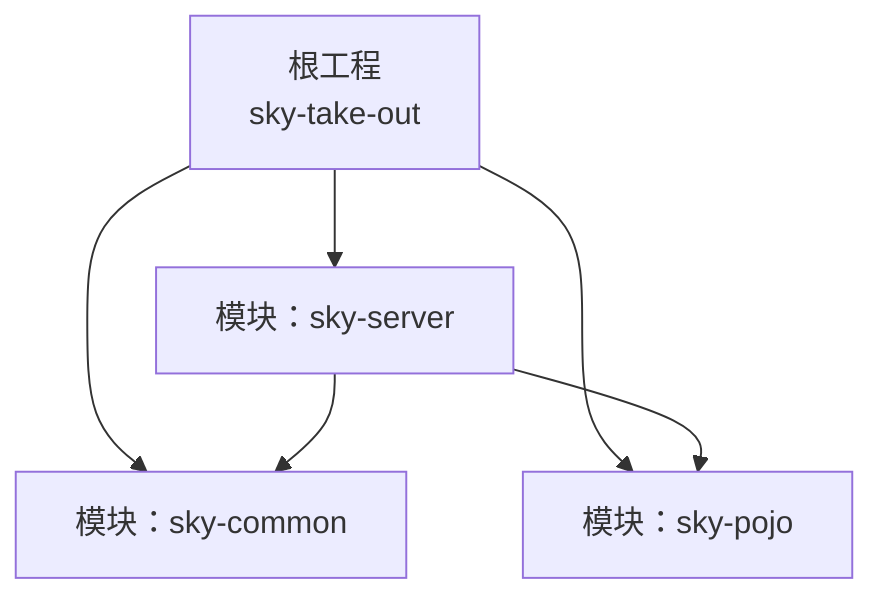
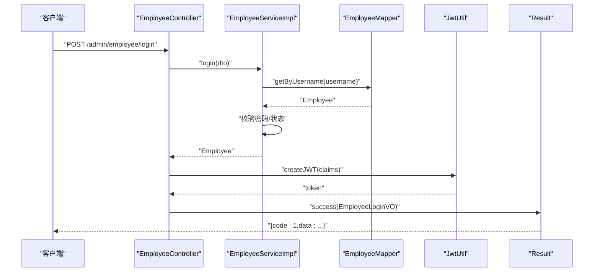
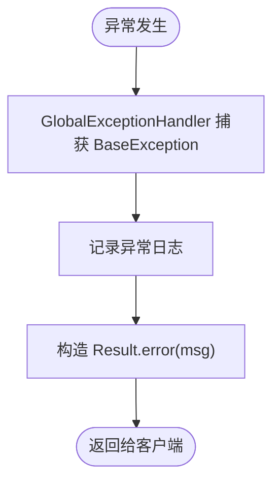
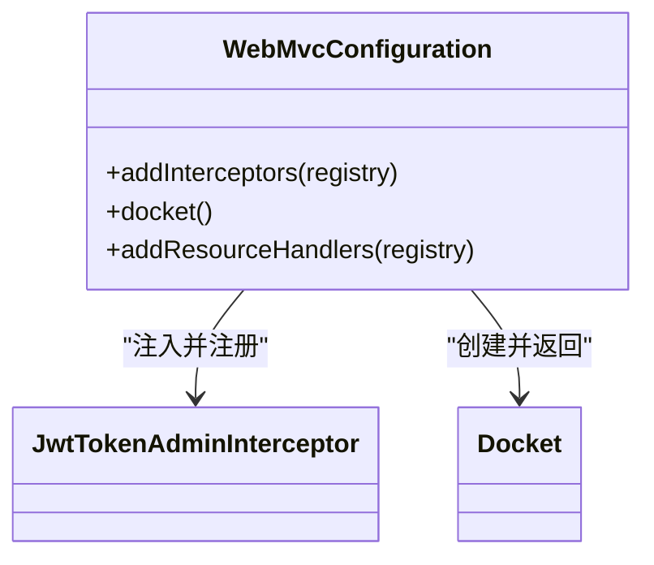
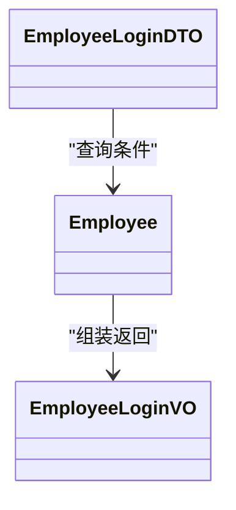
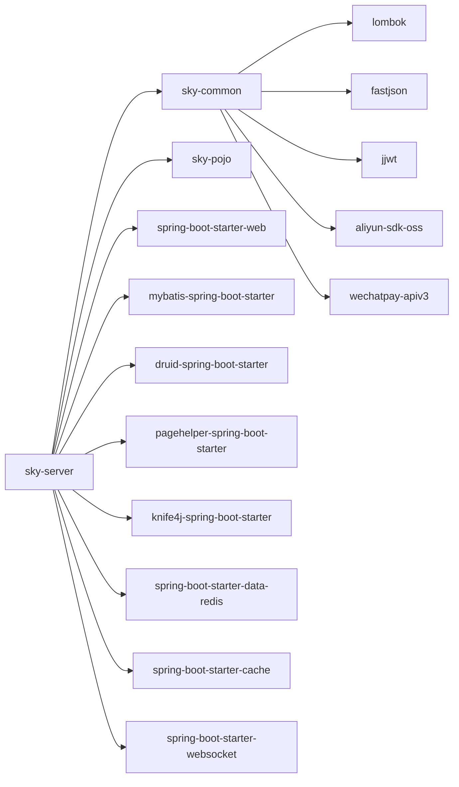
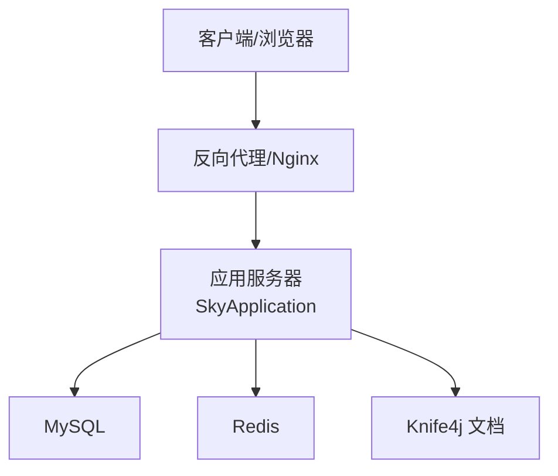

# 架构设计

<cite>
**本文引用的文件**
- [pom.xml](file://pom.xml)
- [sky-server/pom.xml](file://sky-server/pom.xml)
- [sky-common/pom.xml](file://sky-common/pom.xml)
- [sky-pojo/pom.xml](file://sky-pojo/pom.xml)
- [SkyApplication.java](file://sky-server/src/main/java/com/sky/SkyApplication.java)
- [WebMvcConfiguration.java](file://sky-server/src/main/java/com/sky/config/WebMvcConfiguration.java)
- [EmployeeController.java](file://sky-server/src/main/java/com/sky/controller/admin/EmployeeController.java)
- [EmployeeService.java](file://sky-server/src/main/java/com/sky/service/EmployeeService.java)
- [EmployeeServiceImpl.java](file://sky-server/src/main/java/com/sky/service/impl/EmployeeServiceImpl.java)
- [application.yml](file://sky-server/src/main/resources/application.yml)
- [BaseException.java](file://sky-common/src/main/java/com/sky/exception/BaseException.java)
- [Result.java](file://sky-common/src/main/java/com/sky/result/Result.java)
- [JwtClaimsConstant.java](file://sky-common/src/main/java/com/sky/constant/JwtClaimsConstant.java)
- [JwtUtil.java](file://sky-common/src/main/java/com/sky/utils/JwtUtil.java)
- [GlobalExceptionHandler.java](file://sky-server/src/main/java/com/sky/handler/GlobalExceptionHandler.java)
</cite>

## 目录
1. [引言](#引言)
2. [项目结构](#项目结构)
3. [核心组件](#核心组件)
4. [架构总览](#架构总览)
5. [详细组件分析](#详细组件分析)
6. [依赖分析](#依赖分析)
7. [性能考虑](#性能考虑)
8. [故障排查指南](#故障排查指南)
9. [结论](#结论)
10. [附录](#附录)

## 引言
本文件为“苍穹外卖点餐系统”的架构设计文档，聚焦于系统的整体架构模式、分层与模块化组织、组件交互关系以及技术选型依据。系统采用多模块聚合工程（Maven）组织，包含 sky-common、sky-pojo、sky-server 三大模块，分别承担通用能力、领域模型与服务端业务实现。本文将从架构视角出发，结合实际代码文件，给出系统架构图、数据流图与部署拓扑图，并对架构优势、约束与扩展性进行深入分析。

## 项目结构
系统采用 Maven 聚合工程，顶层 POM 定义了三个子模块：
- sky-common：通用工具、常量、异常、结果封装、配置属性与第三方工具集成（如 JWT、阿里 OSS、微信支付等）
- sky-pojo：领域模型（实体、DTO、VO）与序列化依赖
- sky-server：Spring Boot 应用入口、Web 层控制器、业务服务、MyBatis Mapper、全局异常处理与 Web MVC 配置



图表来源
- [pom.xml:15-19](file://pom.xml#L15-L19)
- [sky-server/pom.xml:14-24](file://sky-server/pom.xml#L14-L24)

章节来源
- [pom.xml:1-128](file://pom.xml#L1-L128)
- [sky-server/pom.xml:1-130](file://sky-server/pom.xml#L1-L130)
- [sky-common/pom.xml:1-54](file://sky-common/pom.xml#L1-L54)
- [sky-pojo/pom.xml:1-28](file://sky-pojo/pom.xml#L1-L28)

## 核心组件
- 统一返回包装 Result：用于前后端一致的响应格式，简化调用方处理
- 业务异常基类 BaseException：统一业务异常体系，配合全局异常处理器输出标准化错误
- JWT 工具与常量：提供登录鉴权所需的令牌生成与解析能力
- Web MVC 配置：注册拦截器、Knife4j 文档与静态资源映射
- 控制器 EmployeeController：对外提供管理员登录接口，返回带令牌的登录结果
- 服务 EmployeeServiceImpl：实现登录校验逻辑，调用 Mapper 查询用户并做状态判断
- Spring Boot 启动类 SkyApplication：应用入口，启用事务管理

章节来源
- [Result.java:1-39](file://sky-common/src/main/java/com/sky/result/Result.java#L1-L39)
- [BaseException.java:1-16](file://sky-common/src/main/java/com/sky/exception/BaseException.java#L1-L16)
- [JwtUtil.java:1-59](file://sky-common/src/main/java/com/sky/utils/JwtUtil.java#L1-L59)
- [JwtClaimsConstant.java:1-12](file://sky-common/src/main/java/com/sky/constant/JwtClaimsConstant.java#L1-L12)
- [WebMvcConfiguration.java:1-69](file://sky-server/src/main/java/com/sky/config/WebMvcConfiguration.java#L1-L69)
- [EmployeeController.java:1-75](file://sky-server/src/main/java/com/sky/controller/admin/EmployeeController.java#L1-L75)
- [EmployeeServiceImpl.java:1-58](file://sky-server/src/main/java/com/sky/service/impl/EmployeeServiceImpl.java#L1-L58)
- [SkyApplication.java:1-17](file://sky-server/src/main/java/com/sky/SkyApplication.java#L1-L17)

## 架构总览
系统采用典型的分层架构与模块化组织：
- 表现层（Web）：基于 Spring MVC 的控制器，负责请求接入与响应封装
- 业务层（Service）：面向用例的服务接口与实现，处理业务规则与流程编排
- 数据访问层（Mapper/MyBatis）：与数据库交互，完成持久化操作
- 领域模型层（POJO）：以 DTO/VO/Entity 形式表达业务实体与传输对象
- 通用能力层（Common）：提供工具、常量、异常、配置与第三方集成能力
- 配置与启动：Spring Boot 自动装配、MyBatis 配置、日志与数据源配置

```mermaid
graph TB
subgraph "表现层(Web)"
Ctl["EmployeeController"]
end
subgraph "业务层(Service)"
SvcI["EmployeeService 接口"]
SvcImpl["EmployeeServiceImpl 实现"]
end
subgraph "数据访问层(Mapper)"
Mapper["EmployeeMapper"]
end
subgraph "领域模型(POJO)"
DTO["EmployeeLoginDTO"]
VO["EmployeeLoginVO"]
Entity["Employee"]
end
subgraph "通用能力(Common)"
Res["Result"]
Ex["BaseException"]
JwtU["JwtUtil"]
JwtC["JwtClaimsConstant"]
end
subgraph "配置与启动"
Boot["SkyApplication"]
WebCfg["WebMvcConfiguration"]
Yml["application.yml"]
end
Ctl --> SvcI
SvcI < --> SvcImpl
SvcImpl --> Mapper
Ctl --> Res
Ctl --> JwtU
Ctl --> JwtC
SvcImpl --> Ex
Boot --> WebCfg
Boot --> Yml
DTO --> Ctl
VO --> Ctl
Entity --> Mapper
```

图表来源
- [EmployeeController.java:1-75](file://sky-server/src/main/java/com/sky/controller/admin/EmployeeController.java#L1-L75)
- [EmployeeService.java:1-16](file://sky-server/src/main/java/com/sky/service/EmployeeService.java#L1-L16)
- [EmployeeServiceImpl.java:1-58](file://sky-server/src/main/java/com/sky/service/impl/EmployeeServiceImpl.java#L1-L58)
- [EmployeeMapper.java](file://sky-server/src/main/java/com/sky/mapper/EmployeeMapper.java)
- [Result.java:1-39](file://sky-common/src/main/java/com/sky/result/Result.java#L1-L39)
- [BaseException.java:1-16](file://sky-common/src/main/java/com/sky/exception/BaseException.java#L1-L16)
- [JwtUtil.java:1-59](file://sky-common/src/main/java/com/sky/utils/JwtUtil.java#L1-L59)
- [JwtClaimsConstant.java:1-12](file://sky-common/src/main/java/com/sky/constant/JwtClaimsConstant.java#L1-L12)
- [SkyApplication.java:1-17](file://sky-server/src/main/java/com/sky/SkyApplication.java#L1-L17)
- [WebMvcConfiguration.java:1-69](file://sky-server/src/main/java/com/sky/config/WebMvcConfiguration.java#L1-L69)
- [application.yml:1-40](file://sky-server/src/main/resources/application.yml#L1-L40)

## 详细组件分析

### 组件一：登录流程（控制器-服务-异常-结果）
该流程展示了从请求进入、业务处理、异常捕获到统一返回的完整链路。



图表来源
- [EmployeeController.java:40-62](file://sky-server/src/main/java/com/sky/controller/admin/EmployeeController.java#L40-L62)
- [EmployeeServiceImpl.java:28-55](file://sky-server/src/main/java/com/sky/service/impl/EmployeeServiceImpl.java#L28-L55)
- [JwtUtil.java:21-39](file://sky-common/src/main/java/com/sky/utils/JwtUtil.java#L21-L39)
- [Result.java:18-29](file://sky-common/src/main/java/com/sky/result/Result.java#L18-L29)

章节来源
- [EmployeeController.java:1-75](file://sky-server/src/main/java/com/sky/controller/admin/EmployeeController.java#L1-L75)
- [EmployeeServiceImpl.java:1-58](file://sky-server/src/main/java/com/sky/service/impl/EmployeeServiceImpl.java#L1-L58)
- [Result.java:1-39](file://sky-common/src/main/java/com/sky/result/Result.java#L1-L39)
- [JwtUtil.java:1-59](file://sky-common/src/main/java/com/sky/utils/JwtUtil.java#L1-L59)

### 组件二：全局异常处理
系统通过全局异常处理器捕获业务异常，统一返回 Result.error，避免异常信息泄露到前端。



图表来源
- [GlobalExceptionHandler.java:21-25](file://sky-server/src/main/java/com/sky/handler/GlobalExceptionHandler.java#L21-L25)
- [BaseException.java:1-16](file://sky-common/src/main/java/com/sky/exception/BaseException.java#L1-L16)
- [Result.java:31-36](file://sky-common/src/main/java/com/sky/result/Result.java#L31-L36)

章节来源
- [GlobalExceptionHandler.java:1-28](file://sky-server/src/main/java/com/sky/handler/GlobalExceptionHandler.java#L1-L28)
- [BaseException.java:1-16](file://sky-common/src/main/java/com/sky/exception/BaseException.java#L1-L16)
- [Result.java:1-39](file://sky-common/src/main/java/com/sky/result/Result.java#L1-L39)

### 组件三：Web MVC 配置与拦截器
WebMvcConfiguration 注册自定义拦截器与 Knife4j 文档，设置静态资源映射，保证接口文档可访问。



图表来源
- [WebMvcConfiguration.java:23-68](file://sky-server/src/main/java/com/sky/config/WebMvcConfiguration.java#L23-L68)

章节来源
- [WebMvcConfiguration.java:1-69](file://sky-server/src/main/java/com/sky/config/WebMvcConfiguration.java#L1-L69)

### 组件四：数据模型与传输对象
- DTO：用于接收前端参数（如 EmployeeLoginDTO）
- VO：用于向客户端返回的数据载体（如 EmployeeLoginVO）
- Entity：数据库映射实体（如 Employee）



图表来源
- [EmployeeController.java:3-10](file://sky-server/src/main/java/com/sky/controller/admin/EmployeeController.java#L3-L10)
- [EmployeeServiceImpl.java:5-11](file://sky-server/src/main/java/com/sky/service/impl/EmployeeServiceImpl.java#L5-L11)

章节来源
- [EmployeeController.java:1-75](file://sky-server/src/main/java/com/sky/controller/admin/EmployeeController.java#L1-L75)
- [EmployeeServiceImpl.java:1-58](file://sky-server/src/main/java/com/sky/service/impl/EmployeeServiceImpl.java#L1-L58)

## 依赖分析
- sky-server 依赖 sky-common 与 sky-pojo，形成“服务端”对“通用能力”和“领域模型”的复用
- sky-common 与 sky-pojo 之间无直接依赖，保持高内聚低耦合
- 技术栈层面：Spring Boot、MyBatis、Druid、PageHelper、Knife4j、JWT、Redis、WebSocket 等



图表来源
- [pom.xml:34-126](file://pom.xml#L34-L126)
- [sky-server/pom.xml:12-118](file://sky-server/pom.xml#L12-L118)
- [sky-common/pom.xml:12-52](file://sky-common/pom.xml#L12-L52)
- [sky-pojo/pom.xml:12-26](file://sky-pojo/pom.xml#L12-L26)

章节来源
- [pom.xml:1-128](file://pom.xml#L1-L128)
- [sky-server/pom.xml:1-130](file://sky-server/pom.xml#L1-L130)
- [sky-common/pom.xml:1-54](file://sky-common/pom.xml#L1-L54)
- [sky-pojo/pom.xml:1-28](file://sky-pojo/pom.xml#L1-L28)

## 性能考虑
- 连接池与分页：使用 Druid 作为连接池，PageHelper 提供分页能力，建议结合 SQL 监控与索引优化
- 缓存与会话：引入 Redis 与缓存 Starter，适合热点数据与会话存储；需注意缓存一致性策略
- 序列化与文档：FastJSON 与 Knife4j 提升开发效率，但需关注序列化开销与接口文档维护成本
- 日志与监控：MyBatis 映射日志级别已配置，建议结合 AOP 切面与指标埋点完善全链路可观测性

## 故障排查指南
- 登录失败：检查用户名是否存在、密码是否匹配、账户状态是否正常
- 令牌无效：确认签名密钥、过期时间与前端传参一致
- 接口异常：查看全局异常处理器日志，定位业务异常类型
- 数据库连接：核对 application.yml 中的数据库连接参数与环境变量

章节来源
- [EmployeeServiceImpl.java:36-51](file://sky-server/src/main/java/com/sky/service/impl/EmployeeServiceImpl.java#L36-L51)
- [GlobalExceptionHandler.java:21-25](file://sky-server/src/main/java/com/sky/handler/GlobalExceptionHandler.java#L21-L25)
- [application.yml:9-14](file://sky-server/src/main/resources/application.yml#L9-L14)

## 结论
本系统通过清晰的模块划分与分层架构，实现了通用能力复用、领域模型稳定与业务逻辑可演进。sky-common 提供横切能力，sky-pojo 承载领域模型，sky-server 聚焦业务实现与对外接口。技术栈选择兼顾易用性与生态成熟度，具备良好的扩展性与可维护性。后续可在缓存策略、安全加固、可观测性与自动化测试方面持续增强。

## 附录
- 部署拓扑（概念示意）
