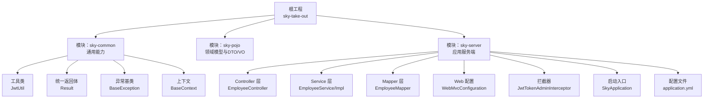
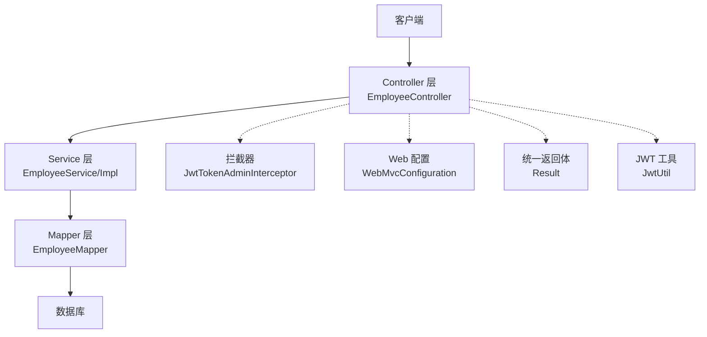
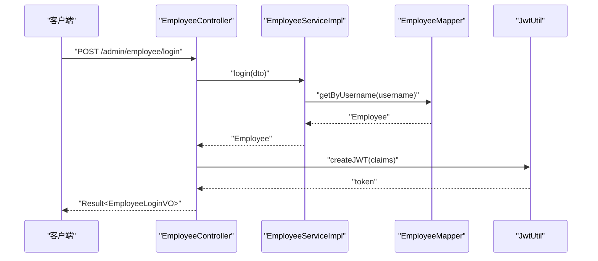
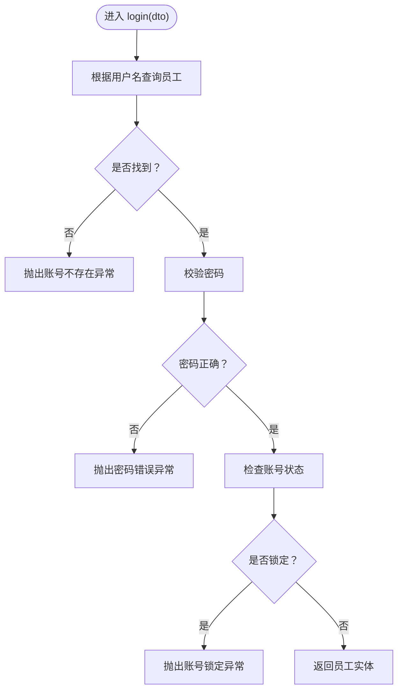
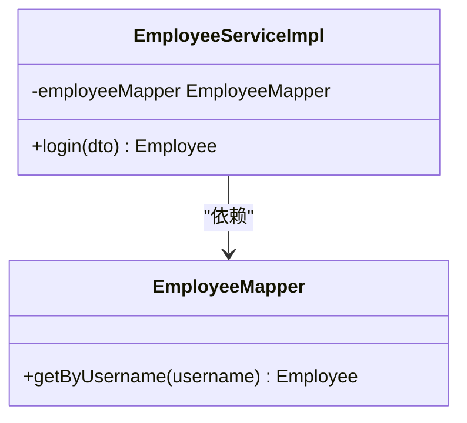
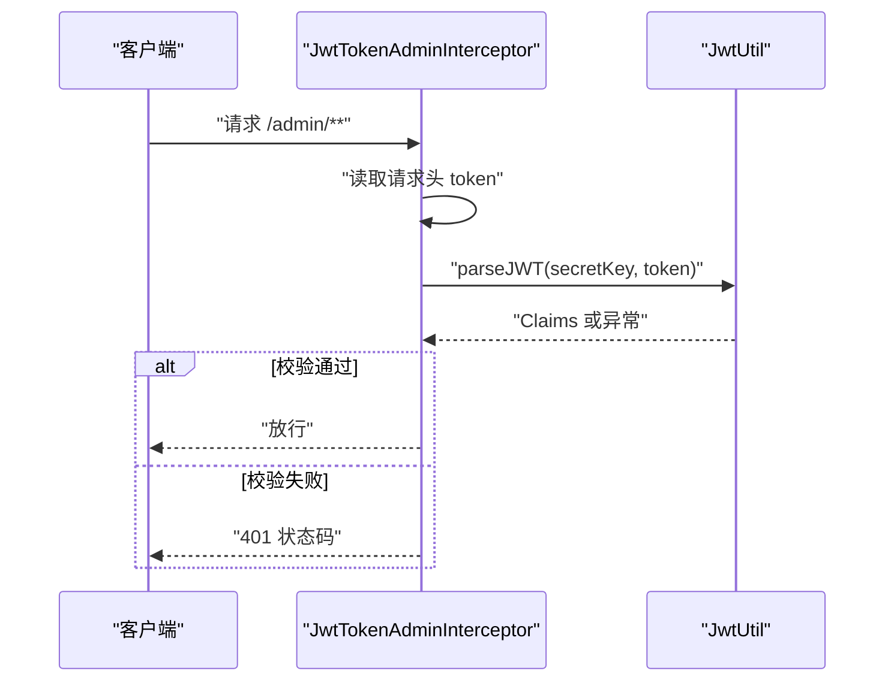
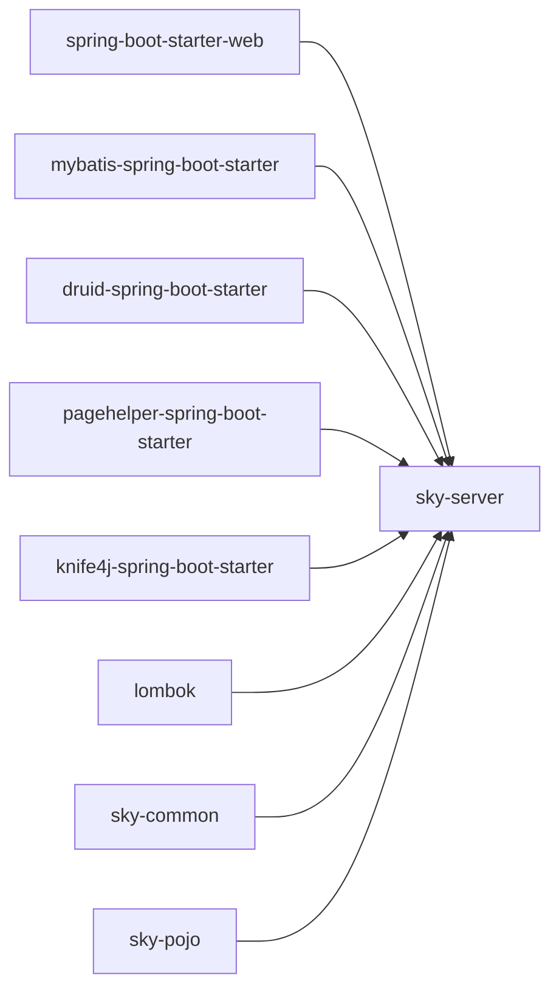

# 系统架构概览

<cite>
**本文引用的文件**
- [pom.xml](file://pom.xml)
- [sky-server/pom.xml](file://sky-server/pom.xml)
- [SkyApplication.java](file://sky-server/src/main/java/com/sky/SkyApplication.java)
- [application.yml](file://sky-server/src/main/resources/application.yml)
- [WebMvcConfiguration.java](file://sky-server/src/main/java/com/sky/config/WebMvcConfiguration.java)
- [EmployeeController.java](file://sky-server/src/main/java/com/sky/controller/admin/EmployeeController.java)
- [EmployeeService.java](file://sky-server/src/main/java/com/sky/service/EmployeeService.java)
- [EmployeeServiceImpl.java](file://sky-server/src/main/java/com/sky/service/impl/EmployeeServiceImpl.java)
- [EmployeeMapper.java](file://sky-server/src/main/java/com/sky/mapper/EmployeeMapper.java)
- [EmployeeMapper.xml](file://sky-server/src/main/resources/mapper/EmployeeMapper.xml)
- [JwtTokenAdminInterceptor.java](file://sky-server/src/main/java/com/sky/interceptor/JwtTokenAdminInterceptor.java)
- [JwtUtil.java](file://sky-common/src/main/java/com/sky/utils/JwtUtil.java)
- [Result.java](file://sky-common/src/main/java/com/sky/result/Result.java)
- [BaseException.java](file://sky-common/src/main/java/com/sky/exception/BaseException.java)
- [BaseContext.java](file://sky-common/src/main/java/com/sky/context/BaseContext.java)
</cite>

## 目录
1. [引言](#引言)
2. [项目结构](#项目结构)
3. [核心组件](#核心组件)
4. [架构总览](#架构总览)
5. [详细组件分析](#详细组件分析)
6. [依赖分析](#依赖分析)
7. [性能考虑](#性能考虑)
8. [故障排查指南](#故障排查指南)
9. [结论](#结论)
10. [附录](#附录)

## 引言
本文件为“苍穹外卖点餐系统”的系统架构概览文档，聚焦于整体架构模式、分层设计与模块化组织，以及 Spring Boot + MyBatis 技术栈的选择理由。通过对表现层（Controller）、业务层（Service）、数据访问层（Mapper）的职责划分与交互流程进行深入剖析，并结合统一返回体、全局异常处理、JWT 拦截器等横切能力，形成完整的架构视图。同时，讨论单体架构在该场景下的优势与后续向微服务演进的可能性。

## 项目结构
项目采用 Maven 多模块聚合结构，顶层 POM 负责版本与依赖管理，子模块按领域与关注点拆分：
- sky-common：通用工具、常量、异常、返回体、上下文等横切能力
- sky-pojo：领域模型、DTO、VO 及其映射实体
- sky-server：应用服务端，包含启动入口、Web MVC 配置、拦截器、控制器、服务与 Mapper

图表来源
- [pom.xml:15-19](file://pom.xml#L15-L19)
- [sky-server/pom.xml:14-24](file://sky-server/pom.xml#L14-L24)
- [SkyApplication.java:8-16](file://sky-server/src/main/java/com/sky/SkyApplication.java#L8-L16)
- [WebMvcConfiguration.java:21-68](file://sky-server/src/main/java/com/sky/config/WebMvcConfiguration.java#L21-L68)
- [EmployeeController.java:24-74](file://sky-server/src/main/java/com/sky/controller/admin/EmployeeController.java#L24-L74)
- [EmployeeService.java:6-15](file://sky-server/src/main/java/com/sky/service/EmployeeService.java#L6-L15)
- [EmployeeServiceImpl.java:16-57](file://sky-server/src/main/java/com/sky/service/impl/EmployeeServiceImpl.java#L16-L57)
- [EmployeeMapper.java:7-18](file://sky-server/src/main/java/com/sky/mapper/EmployeeMapper.java#L7-L18)
- [JwtTokenAdminInterceptor.java:18-58](file://sky-server/src/main/java/com/sky/interceptor/JwtTokenAdminInterceptor.java#L18-L58)
- [JwtUtil.java:11-58](file://sky-common/src/main/java/com/sky/utils/JwtUtil.java#L11-L58)
- [Result.java:12-38](file://sky-common/src/main/java/com/sky/result/Result.java#L12-L38)
- [BaseException.java:6-15](file://sky-common/src/main/java/com/sky/exception/BaseException.java#L6-L15)
- [BaseContext.java:3-19](file://sky-common/src/main/java/com/sky/context/BaseContext.java#L3-L19)

章节来源
- [pom.xml:15-19](file://pom.xml#L15-L19)
- [sky-server/pom.xml:14-24](file://sky-server/pom.xml#L14-L24)

## 核心组件
- 应用启动与事务管理：通过启动类启用 Spring Boot 自动装配与注解式事务管理，保证业务一致性。
- Web 层：基于 Spring MVC 的 REST 控制器，负责接收请求、参数绑定与响应封装。
- 业务层：面向用例的服务接口与实现，封装业务规则与流程编排。
- 数据访问层：MyBatis Mapper 接口与 XML 映射，完成数据库 CRUD 与复杂查询。
- 安全与认证：JWT 工具与拦截器，统一校验管理员令牌，控制访问权限。
- 统一返回体与异常：Result 统一响应格式，BaseException 提供业务异常基类，配合全局异常处理实现一致的错误反馈。
- 上下文：BaseContext 以线程本地变量承载当前用户标识，贯穿请求链路。

章节来源
- [SkyApplication.java:8-16](file://sky-server/src/main/java/com/sky/SkyApplication.java#L8-L16)
- [EmployeeController.java:24-74](file://sky-server/src/main/java/com/sky/controller/admin/EmployeeController.java#L24-L74)
- [EmployeeService.java:6-15](file://sky-server/src/main/java/com/sky/service/EmployeeService.java#L6-L15)
- [EmployeeServiceImpl.java:16-57](file://sky-server/src/main/java/com/sky/service/impl/EmployeeServiceImpl.java#L16-L57)
- [EmployeeMapper.java:7-18](file://sky-server/src/main/java/com/sky/mapper/EmployeeMapper.java#L7-L18)
- [JwtTokenAdminInterceptor.java:18-58](file://sky-server/src/main/java/com/sky/interceptor/JwtTokenAdminInterceptor.java#L18-L58)
- [JwtUtil.java:11-58](file://sky-common/src/main/java/com/sky/utils/JwtUtil.java#L11-L58)
- [Result.java:12-38](file://sky-common/src/main/java/com/sky/result/Result.java#L12-L38)
- [BaseException.java:6-15](file://sky-common/src/main/java/com/sky/exception/BaseException.java#L6-L15)
- [BaseContext.java:3-19](file://sky-common/src/main/java/com/sky/context/BaseContext.java#L3-L19)

## 架构总览
系统采用经典的三层架构与多模块分层组织：
- 表现层（Controller）：接收 HTTP 请求，调用服务层，封装统一返回体。
- 业务层（Service）：实现业务逻辑，协调数据访问与外部依赖，处理异常。
- 数据访问层（Mapper）：通过 MyBatis 访问数据库，支持注解与 XML 映射。
- 配置与横切：WebMvcConfiguration 注册拦截器与 Knife4j 文档；JwtTokenAdminInterceptor 进行 JWT 校验；application.yml 配置数据源、MyBatis、日志级别等。

图表来源
- [EmployeeController.java:40-62](file://sky-server/src/main/java/com/sky/controller/admin/EmployeeController.java#L40-L62)
- [EmployeeServiceImpl.java:28-55](file://sky-server/src/main/java/com/sky/service/impl/EmployeeServiceImpl.java#L28-L55)
- [EmployeeMapper.java:15-16](file://sky-server/src/main/java/com/sky/mapper/EmployeeMapper.java#L15-L16)
- [JwtTokenAdminInterceptor.java:34-56](file://sky-server/src/main/java/com/sky/interceptor/JwtTokenAdminInterceptor.java#L34-L56)
- [WebMvcConfiguration.java:33-58](file://sky-server/src/main/java/com/sky/config/WebMvcConfiguration.java#L33-L58)
- [Result.java:18-36](file://sky-common/src/main/java/com/sky/result/Result.java#L18-L36)
- [JwtUtil.java:21-39](file://sky-common/src/main/java/com/sky/utils/JwtUtil.java#L21-L39)

## 详细组件分析

### 表现层（Controller）
- 职责：接收登录请求，调用服务层执行业务，生成 JWT 并返回统一结果。
- 关键点：路径前缀、请求体参数绑定、返回 Result 封装、日志记录。
- 示例路径：[登录接口实现:40-62](file://sky-server/src/main/java/com/sky/controller/admin/EmployeeController.java#L40-L62)

图表来源
- [EmployeeController.java:40-62](file://sky-server/src/main/java/com/sky/controller/admin/EmployeeController.java#L40-L62)
- [EmployeeServiceImpl.java:28-55](file://sky-server/src/main/java/com/sky/service/impl/EmployeeServiceImpl.java#L28-L55)
- [EmployeeMapper.java:15-16](file://sky-server/src/main/java/com/sky/mapper/EmployeeMapper.java#L15-L16)
- [JwtUtil.java:21-39](file://sky-common/src/main/java/com/sky/utils/JwtUtil.java#L21-L39)

章节来源
- [EmployeeController.java:24-74](file://sky-server/src/main/java/com/sky/controller/admin/EmployeeController.java#L24-L74)

### 业务层（Service）
- 职责：执行登录校验逻辑，处理账户不存在、密码错误、账号锁定等异常，返回实体对象。
- 关键点：依赖注入 Mapper、异常抛出、业务规则集中处理。
- 示例路径：[登录业务实现:28-55](file://sky-server/src/main/java/com/sky/service/impl/EmployeeServiceImpl.java#L28-L55)

图表来源
- [EmployeeServiceImpl.java:28-55](file://sky-server/src/main/java/com/sky/service/impl/EmployeeServiceImpl.java#L28-L55)

章节来源
- [EmployeeService.java:6-15](file://sky-server/src/main/java/com/sky/service/EmployeeService.java#L6-L15)
- [EmployeeServiceImpl.java:16-57](file://sky-server/src/main/java/com/sky/service/impl/EmployeeServiceImpl.java#L16-L57)

### 数据访问层（Mapper）
- 职责：通过注解 SQL 查询员工信息，配合 MyBatis XML 扩展复杂映射。
- 关键点：@Mapper 注解、@Select 注解、XML 命名空间与扩展。
- 示例路径：[Mapper 接口:15-16](file://sky-server/src/main/java/com/sky/mapper/EmployeeMapper.java#L15-L16)，[Mapper XML:4-5](file://sky-server/src/main/resources/mapper/EmployeeMapper.xml#L4-L5)

图表来源
- [EmployeeMapper.java:7-18](file://sky-server/src/main/java/com/sky/mapper/EmployeeMapper.java#L7-L18)
- [EmployeeServiceImpl.java:19-20](file://sky-server/src/main/java/com/sky/service/impl/EmployeeServiceImpl.java#L19-L20)

章节来源
- [EmployeeMapper.java:7-18](file://sky-server/src/main/java/com/sky/mapper/EmployeeMapper.java#L7-L18)
- [EmployeeMapper.xml:4-5](file://sky-server/src/main/resources/mapper/EmployeeMapper.xml#L4-L5)

### 安全与认证（JWT 拦截器）
- 职责：拦截管理员相关请求，从请求头读取令牌，解析并校验 JWT，失败返回 401。
- 关键点：拦截路径、令牌头名、异常处理、放行策略。
- 示例路径：[拦截器实现:34-56](file://sky-server/src/main/java/com/sky/interceptor/JwtTokenAdminInterceptor.java#L34-L56)

图表来源
- [JwtTokenAdminInterceptor.java:34-56](file://sky-server/src/main/java/com/sky/interceptor/JwtTokenAdminInterceptor.java#L34-L56)
- [JwtUtil.java:48-56](file://sky-common/src/main/java/com/sky/utils/JwtUtil.java#L48-L56)

章节来源
- [WebMvcConfiguration.java:33-38](file://sky-server/src/main/java/com/sky/config/WebMvcConfiguration.java#L33-L38)
- [JwtTokenAdminInterceptor.java:18-58](file://sky-server/src/main/java/com/sky/interceptor/JwtTokenAdminInterceptor.java#L18-L58)

### 统一返回体与异常处理
- 统一返回体：Result 提供 success/error 静态方法，约定 code/msg/data 字段，便于前端统一处理。
- 异常基类：BaseException 作为业务异常基类，结合全局异常处理器可实现一致的错误响应。
- 示例路径：[统一返回体:18-36](file://sky-common/src/main/java/com/sky/result/Result.java#L18-L36)，[异常基类:6-15](file://sky-common/src/main/java/com/sky/exception/BaseException.java#L6-L15)

章节来源
- [Result.java:12-38](file://sky-common/src/main/java/com/sky/result/Result.java#L12-L38)
- [BaseException.java:6-15](file://sky-common/src/main/java/com/sky/exception/BaseException.java#L6-L15)

### 配置与横切能力
- Web 配置：注册拦截器、Knife4j 文档、静态资源映射。
- 应用配置：端口、数据源、MyBatis 映射、日志级别、JWT 参数等。
- 示例路径：[Web 配置:33-67](file://sky-server/src/main/java/com/sky/config/WebMvcConfiguration.java#L33-L67)，[应用配置:1-40](file://sky-server/src/main/resources/application.yml#L1-L40)

章节来源
- [WebMvcConfiguration.java:21-68](file://sky-server/src/main/java/com/sky/config/WebMvcConfiguration.java#L21-L68)
- [application.yml:1-40](file://sky-server/src/main/resources/application.yml#L1-L40)

## 依赖分析
- 技术栈选择
  - Spring Boot：简化配置与自动装配，提供启动器与插件化生态。
  - MyBatis：轻量级 ORM，注解与 XML 结合，适合中小规模业务与快速迭代。
  - Druid：连接池与监控，便于性能观测与问题定位。
  - PageHelper：分页插件，提升列表查询体验。
  - Knife4j：在线接口文档，提升联调效率。
  - Lombok：减少样板代码，提高开发效率。
- 模块依赖
  - sky-server 依赖 sky-common 与 sky-pojo，体现横切能力与领域模型的复用。
  - 顶层 POM 管理公共依赖版本，避免重复与冲突。

图表来源
- [sky-server/pom.xml:26-118](file://sky-server/pom.xml#L26-L118)
- [pom.xml:34-126](file://pom.xml#L34-L126)

章节来源
- [pom.xml:20-126](file://pom.xml#L20-L126)
- [sky-server/pom.xml:12-118](file://sky-server/pom.xml#L12-L118)

## 性能考虑
- 连接池与 SQL 优化：使用 Druid 连接池，结合慢查询日志与监控，定期审查 SQL 性能。
- 分页与缓存：PageHelper 提升分页体验；Redis 缓存热点数据，降低数据库压力。
- 序列化与网络：FastJSON 提升 JSON 序列化性能，合理控制返回字段大小。
- 日志与追踪：合理设置日志级别，避免生产环境过度打印；必要时引入链路追踪。
- 并发与锁：业务层注意并发控制，避免脏读与超卖；事务边界清晰，减少长事务。

## 故障排查指南
- 登录失败
  - 检查用户名是否存在、密码是否匹配、账号是否被锁定。
  - 查看服务端日志与异常栈，确认异常类型与提示信息。
  - 示例路径：[登录异常处理:36-51](file://sky-server/src/main/java/com/sky/service/impl/EmployeeServiceImpl.java#L36-L51)
- JWT 校验失败
  - 确认请求头携带的令牌名称与密钥配置一致。
  - 检查令牌是否过期或被篡改。
  - 示例路径：[拦截器校验:42-56](file://sky-server/src/main/java/com/sky/interceptor/JwtTokenAdminInterceptor.java#L42-L56)
- 数据库连接问题
  - 校验数据源配置、驱动类名与连接串。
  - 查看 Druid 监控面板，定位连接泄漏或慢查询。
  - 示例路径：[数据源配置:9-14](file://sky-server/src/main/resources/application.yml#L9-L14)
- 接口文档不可用
  - 确认 Knife4j 配置与静态资源映射。
  - 示例路径：[文档配置:44-67](file://sky-server/src/main/java/com/sky/config/WebMvcConfiguration.java#L44-L67)

章节来源
- [EmployeeServiceImpl.java:36-51](file://sky-server/src/main/java/com/sky/service/impl/EmployeeServiceImpl.java#L36-L51)
- [JwtTokenAdminInterceptor.java:42-56](file://sky-server/src/main/java/com/sky/interceptor/JwtTokenAdminInterceptor.java#L42-L56)
- [application.yml:9-14](file://sky-server/src/main/resources/application.yml#L9-L14)
- [WebMvcConfiguration.java:44-67](file://sky-server/src/main/java/com/sky/config/WebMvcConfiguration.java#L44-L67)

## 结论
本系统采用 Spring Boot + MyBatis 的成熟技术组合，结合多模块分层与三层架构，实现了清晰的职责分离与良好的可维护性。在当前业务规模下，单体架构具备快速迭代与部署简便的优势；随着业务增长与团队扩大，可逐步引入网关、服务拆分与分布式治理，向微服务演进。统一返回体、JWT 拦截与 Knife4j 文档等横切能力，进一步提升了开发效率与运维可观测性。

## 附录
- 启动入口与事务管理：[启动类:8-16](file://sky-server/src/main/java/com/sky/SkyApplication.java#L8-L16)
- 全局异常处理：可在 sky-server 中新增全局异常处理器，结合 Result 与 BaseException 实现统一错误响应。
- 上下文使用：BaseContext 在拦截器或业务层设置当前用户 ID，便于审计与日志关联。
  - 示例路径：[上下文工具:7-17](file://sky-common/src/main/java/com/sky/context/BaseContext.java#L7-L17)