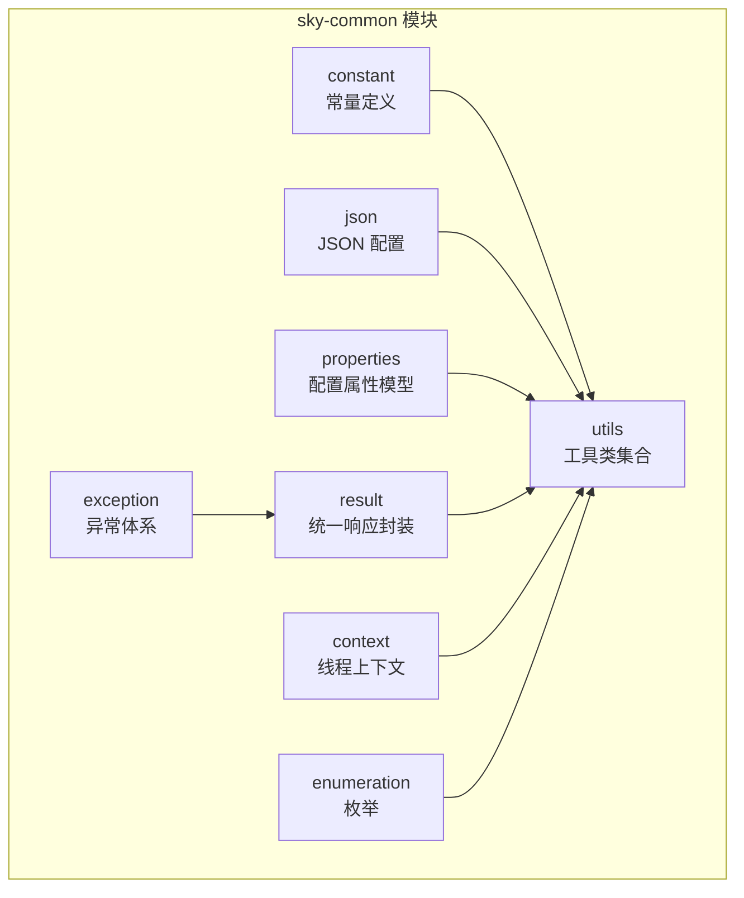
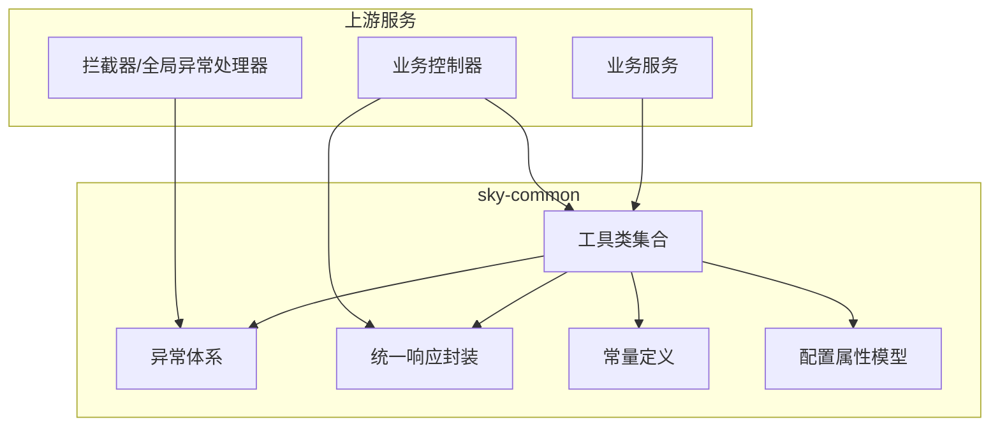
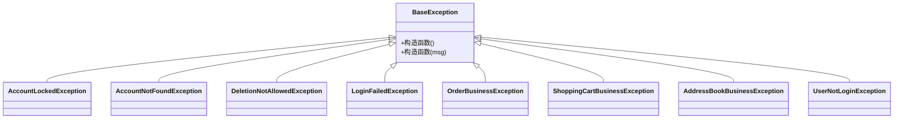
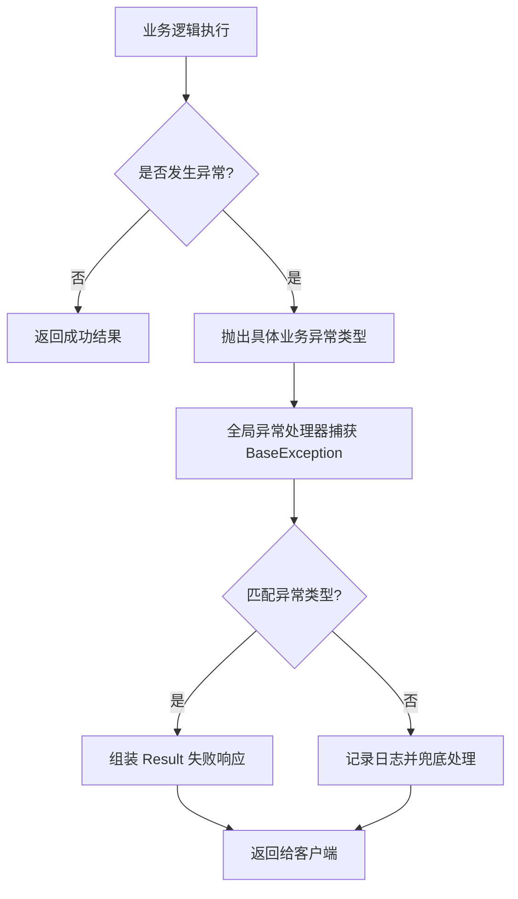
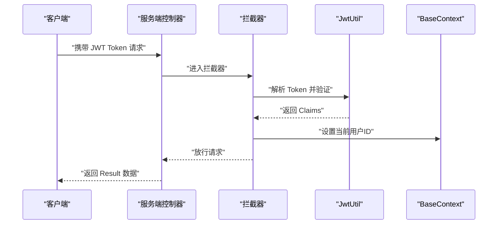
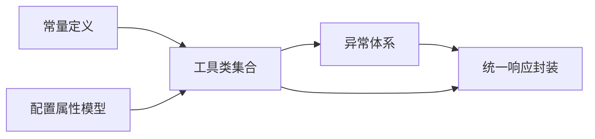

# sky-common 通用工具模块

<cite>
**本文引用的文件**
- [AutoFillConstant.java](file://sky-common/src/main/java/com/sky/constant/AutoFillConstant.java)
- [JwtClaimsConstant.java](file://sky-common/src/main/java/com/sky/constant/JwtClaimsConstant.java)
- [MessageConstant.java](file://sky-common/src/main/java/com/sky/constant/MessageConstant.java)
- [PasswordConstant.java](file://sky-common/src/main/java/com/sky/constant/PasswordConstant.java)
- [StatusConstant.java](file://sky-common/src/main/java/com/sky/constant/StatusConstant.java)
- [BaseException.java](file://sky-common/src/main/java/com/sky/exception/BaseException.java)
- [AccountLockedException.java](file://sky-common/src/main/java/com/sky/exception/AccountLockedException.java)
- [AccountNotFoundException.java](file://sky-common/src/main/java/com/sky/exception/AccountNotFoundException.java)
- [DeletionNotAllowedException.java](file://sky-common/src/main/java/com/sky/exception/DeletionNotAllowedException.java)
- [LoginFailedException.java](file://sky-common/src/main/java/com/sky/exception/LoginFailedException.java)
- [OrderBusinessException.java](file://sky-common/src/main/java/com/sky/exception/OrderBusinessException.java)
- [ShoppingCartBusinessException.java](file://sky-common/src/main/java/com/sky/exception/ShoppingCartBusinessException.java)
- [AddressBookBusinessException.java](file://sky-common/src/main/java/com/sky/exception/AddressBookBusinessException.java)
- [UserNotLoginException.java](file://sky-common/src/main/java/com/sky/exception/UserNotLoginException.java)
- [JacksonObjectMapper.java](file://sky-common/src/main/java/com/sky/json/JacksonObjectMapper.java)
- [AliOssProperties.java](file://sky-common/src/main/java/com/sky/properties/AliOssProperties.java)
- [JwtProperties.java](file://sky-common/src/main/java/com/sky/properties/JwtProperties.java)
- [WeChatProperties.java](file://sky-common/src/main/java/com/sky/properties/WeChatProperties.java)
- [PageResult.java](file://sky-common/src/main/java/com/sky/result/PageResult.java)
- [Result.java](file://sky-common/src/main/java/com/sky/result/Result.java)
- [AliOssUtil.java](file://sky-common/src/main/java/com/sky/utils/AliOssUtil.java)
- [HttpClientUtil.java](file://sky-common/src/main/java/com/sky/utils/HttpClientUtil.java)
- [JwtUtil.java](file://sky-common/src/main/java/com/sky/utils/JwtUtil.java)
- [WeChatPayUtil.java](file://sky-common/src/main/java/com/sky/utils/WeChatPayUtil.java)
- [BaseContext.java](file://sky-common/src/main/java/com/sky/context/BaseContext.java)
- [OperationType.java](file://sky-common/src/main/java/com/sky/enumeration/OperationType.java)
</cite>

## 目录
1. [简介](#简介)
2. [项目结构](#项目结构)
3. [核心组件](#核心组件)
4. [架构总览](#架构总览)
5. [详细组件分析](#详细组件分析)
6. [依赖分析](#依赖分析)
7. [性能考虑](#性能考虑)
8. [故障排查指南](#故障排查指南)
9. [结论](#结论)
10. [附录](#附录)

## 简介
sky-common 是一个为后端服务提供通用能力的工具模块，覆盖常量定义、异常体系、JSON 序列化配置、配置属性模型、统一响应封装、上下文持有、枚举以及常用工具类（如 JWT 工具、HTTP 客户端工具、支付与对象存储工具）。其设计理念是通过“约定优于配置”的方式，提供可复用、可扩展、可维护的基础设施能力，降低业务层重复开发成本。

## 项目结构
模块采用按职责分层的组织方式：常量、异常、JSON、属性、结果封装、上下文、枚举、工具类等目录清晰划分，便于定位与扩展。

**图表来源**
- [AutoFillConstant.java:1-15](file://sky-common/src/main/java/com/sky/constant/AutoFillConstant.java#L1-L15)
- [BaseException.java:1-16](file://sky-common/src/main/java/com/sky/exception/BaseException.java#L1-L16)
- [JacksonObjectMapper.java](file://sky-common/src/main/java/com/sky/json/JacksonObjectMapper.java)
- [AliOssProperties.java](file://sky-common/src/main/java/com/sky/properties/AliOssProperties.java)
- [JwtProperties.java](file://sky-common/src/main/java/com/sky/properties/JwtProperties.java)
- [WeChatProperties.java](file://sky-common/src/main/java/com/sky/properties/WeChatProperties.java)
- [PageResult.java](file://sky-common/src/main/java/com/sky/result/PageResult.java)
- [Result.java](file://sky-common/src/main/java/com/sky/result/Result.java)
- [AliOssUtil.java](file://sky-common/src/main/java/com/sky/utils/AliOssUtil.java)
- [HttpClientUtil.java](file://sky-common/src/main/java/com/sky/utils/HttpClientUtil.java)
- [JwtUtil.java](file://sky-common/src/main/java/com/sky/utils/JwtUtil.java)
- [WeChatPayUtil.java](file://sky-common/src/main/java/com/sky/utils/WeChatPayUtil.java)
- [BaseContext.java](file://sky-common/src/main/java/com/sky/context/BaseContext.java)
- [OperationType.java](file://sky-common/src/main/java/com/sky/enumeration/OperationType.java)

**章节来源**
- [AutoFillConstant.java:1-15](file://sky-common/src/main/java/com/sky/constant/AutoFillConstant.java#L1-L15)
- [MessageConstant.java:1-28](file://sky-common/src/main/java/com/sky/constant/MessageConstant.java#L1-L28)
- [StatusConstant.java:1-14](file://sky-common/src/main/java/com/sky/constant/StatusConstant.java#L1-L14)
- [JwtClaimsConstant.java:1-12](file://sky-common/src/main/java/com/sky/constant/JwtClaimsConstant.java#L1-L12)
- [PasswordConstant.java:1-11](file://sky-common/src/main/java/com/sky/constant/PasswordConstant.java#L1-L11)

## 核心组件
- 常量定义：集中管理公共字段自动填充方法名、JWT Claims 键、消息提示文本、默认密码、状态码等，避免魔法值，提升可读性与一致性。
- 异常体系：以 BaseException 为根异常，派生出账户、登录、订单、购物车、地址簿等业务异常类型，统一异常处理入口。
- JSON 配置：基于 Jackson 的 ObjectMapper 自定义配置，确保日期、数字等序列化行为一致。
- 配置属性模型：封装第三方服务（如 OSS、JWT、微信）的配置项，便于注入与使用。
- 统一响应封装：Result 用于标准响应输出；PageResult 用于分页场景。
- 上下文与枚举：BaseContext 提供线程安全的用户标识存取；枚举描述操作类型等。
- 工具类集合：JWT 工具、HTTP 客户端工具、支付与对象存储工具等。

**章节来源**
- [BaseException.java:1-16](file://sky-common/src/main/java/com/sky/exception/BaseException.java#L1-L16)
- [Result.java](file://sky-common/src/main/java/com/sky/result/Result.java)
- [PageResult.java](file://sky-common/src/main/java/com/sky/result/PageResult.java)
- [JacksonObjectMapper.java](file://sky-common/src/main/java/com/sky/json/JacksonObjectMapper.java)
- [JwtProperties.java](file://sky-common/src/main/java/com/sky/properties/JwtProperties.java)
- [AliOssProperties.java](file://sky-common/src/main/java/com/sky/properties/AliOssProperties.java)
- [WeChatProperties.java](file://sky-common/src/main/java/com/sky/properties/WeChatProperties.java)
- [BaseContext.java](file://sky-common/src/main/java/com/sky/context/BaseContext.java)
- [OperationType.java](file://sky-common/src/main/java/com/sky/enumeration/OperationType.java)

## 架构总览
sky-common 作为通用基础模块，向上游服务提供“基础设施+工具集”，下游通过依赖注入或直接调用的方式使用。异常与响应封装贯穿各工具链路，保证系统对外输出的一致性与可观测性。

**图表来源**
- [JwtUtil.java](file://sky-common/src/main/java/com/sky/utils/JwtUtil.java)
- [HttpClientUtil.java](file://sky-common/src/main/java/com/sky/utils/HttpClientUtil.java)
- [AliOssUtil.java](file://sky-common/src/main/java/com/sky/utils/AliOssUtil.java)
- [WeChatPayUtil.java](file://sky-common/src/main/java/com/sky/utils/WeChatPayUtil.java)
- [BaseException.java:1-16](file://sky-common/src/main/java/com/sky/exception/BaseException.java#L1-L16)
- [Result.java](file://sky-common/src/main/java/com/sky/result/Result.java)
- [MessageConstant.java:1-28](file://sky-common/src/main/java/com/sky/constant/MessageConstant.java#L1-L28)
- [JwtProperties.java](file://sky-common/src/main/java/com/sky/properties/JwtProperties.java)

## 详细组件分析

### 常量定义规范
- AutoFillConstant：统一实体类公共字段自动填充的方法名常量，便于自动审计字段赋值。
- JwtClaimsConstant：JWT 中的关键声明键名常量，确保跨模块一致读写。
- MessageConstant：业务提示语常量，集中管理错误与提示信息，便于国际化与替换。
- PasswordConstant：默认密码常量，用于初始化或重置场景。
- StatusConstant：启用/禁用状态常量，统一状态码语义。

最佳实践
- 新增常量时遵循“领域命名空间”前缀，避免冲突。
- 文本类常量建议集中于 MessageConstant，便于统一管理与国际化。

**章节来源**
- [AutoFillConstant.java:1-15](file://sky-common/src/main/java/com/sky/constant/AutoFillConstant.java#L1-L15)
- [JwtClaimsConstant.java:1-12](file://sky-common/src/main/java/com/sky/constant/JwtClaimsConstant.java#L1-L12)
- [MessageConstant.java:1-28](file://sky-common/src/main/java/com/sky/constant/MessageConstant.java#L1-L28)
- [PasswordConstant.java:1-11](file://sky-common/src/main/java/com/sky/constant/PasswordConstant.java#L1-L11)
- [StatusConstant.java:1-14](file://sky-common/src/main/java/com/sky/constant/StatusConstant.java#L1-L14)

### 异常处理机制
异常体系以 BaseException 为根，派生出多种业务异常类型，便于上层统一捕获与差异化处理。

**图表来源**
- [BaseException.java:1-16](file://sky-common/src/main/java/com/sky/exception/BaseException.java#L1-L16)
- [AccountLockedException.java:1-16](file://sky-common/src/main/java/com/sky/exception/AccountLockedException.java#L1-L16)
- [AccountNotFoundException.java:1-16](file://sky-common/src/main/java/com/sky/exception/AccountNotFoundException.java#L1-L16)
- [DeletionNotAllowedException.java:1-10](file://sky-common/src/main/java/com/sky/exception/DeletionNotAllowedException.java#L1-L10)
- [LoginFailedException.java:1-11](file://sky-common/src/main/java/com/sky/exception/LoginFailedException.java#L1-L11)
- [OrderBusinessException.java:1-10](file://sky-common/src/main/java/com/sky/exception/OrderBusinessException.java#L1-L10)
- [ShoppingCartBusinessException.java:1-10](file://sky-common/src/main/java/com/sky/exception/ShoppingCartBusinessException.java#L1-L10)
- [AddressBookBusinessException.java:1-10](file://sky-common/src/main/java/com/sky/exception/AddressBookBusinessException.java#L1-L10)
- [UserNotLoginException.java:1-13](file://sky-common/src/main/java/com/sky/exception/UserNotLoginException.java#L1-L13)

异常处理流程（概念示意）

[此图为概念流程图，不对应具体源码文件，故无图表来源]

**章节来源**
- [BaseException.java:1-16](file://sky-common/src/main/java/com/sky/exception/BaseException.java#L1-L16)
- [AccountLockedException.java:1-16](file://sky-common/src/main/java/com/sky/exception/AccountLockedException.java#L1-L16)
- [AccountNotFoundException.java:1-16](file://sky-common/src/main/java/com/sky/exception/AccountNotFoundException.java#L1-L16)
- [DeletionNotAllowedException.java:1-10](file://sky-common/src/main/java/com/sky/exception/DeletionNotAllowedException.java#L1-L10)
- [LoginFailedException.java:1-11](file://sky-common/src/main/java/com/sky/exception/LoginFailedException.java#L1-L11)
- [OrderBusinessException.java:1-10](file://sky-common/src/main/java/com/sky/exception/OrderBusinessException.java#L1-L10)
- [ShoppingCartBusinessException.java:1-10](file://sky-common/src/main/java/com/sky/exception/ShoppingCartBusinessException.java#L1-L10)
- [AddressBookBusinessException.java:1-10](file://sky-common/src/main/java/com/sky/exception/AddressBookBusinessException.java#L1-L10)
- [UserNotLoginException.java:1-13](file://sky-common/src/main/java/com/sky/exception/UserNotLoginException.java#L1-L13)

### JSON 序列化配置
JacksonObjectMapper 提供统一的 ObjectMapper 配置，确保日期时间、数字等序列化行为一致，减少序列化差异带来的问题。

最佳实践
- 在模块内仅保留一套 ObjectMapper 配置，避免多套配置导致的行为不一致。
- 如需扩展特性，优先通过配置项控制，而非硬编码。

**章节来源**
- [JacksonObjectMapper.java](file://sky-common/src/main/java/com/sky/json/JacksonObjectMapper.java)

### 配置属性模型
- AliOssProperties：封装阿里云 OSS 的访问密钥、Endpoint、BucketName 等配置。
- JwtProperties：封装 JWT 的密钥、过期时间、签发者等配置。
- WeChatProperties：封装微信支付/公众号/小程序等配置项。

使用建议
- 通过 Spring Boot 配置文件注入，避免硬编码。
- 对敏感信息进行加密或外部化管理。

**章节来源**
- [AliOssProperties.java](file://sky-common/src/main/java/com/sky/properties/AliOssProperties.java)
- [JwtProperties.java](file://sky-common/src/main/java/com/sky/properties/JwtProperties.java)
- [WeChatProperties.java](file://sky-common/src/main/java/com/sky/properties/WeChatProperties.java)

### 统一响应格式设计（Result）
- Result：通用响应包装器，承载状态码、消息与数据体，便于前端统一处理。
- PageResult：分页响应包装器，承载列表数据与分页信息。

设计要点
- 所有对外接口统一使用 Result 输出，保持契约稳定。
- 分页场景使用 PageResult，便于前端分页组件复用。

**章节来源**
- [Result.java](file://sky-common/src/main/java/com/sky/result/Result.java)
- [PageResult.java](file://sky-common/src/main/java/com/sky/result/PageResult.java)

### 工具类集合与使用方法

#### JWT 工具（JwtUtil）
- 功能：生成与解析 JWT，读取 Claims 中的用户标识与名称等。
- 使用场景：登录校验、权限拦截、跨服务传递用户身份。
- 关键常量：JwtClaimsConstant 中的键名与 BaseContext 中的用户 ID 存取配合使用。

**图表来源**
- [JwtUtil.java](file://sky-common/src/main/java/com/sky/utils/JwtUtil.java)
- [JwtClaimsConstant.java:1-12](file://sky-common/src/main/java/com/sky/constant/JwtClaimsConstant.java#L1-L12)
- [BaseContext.java](file://sky-common/src/main/java/com/sky/context/BaseContext.java)

**章节来源**
- [JwtUtil.java](file://sky-common/src/main/java/com/sky/utils/JwtUtil.java)
- [JwtClaimsConstant.java:1-12](file://sky-common/src/main/java/com/sky/constant/JwtClaimsConstant.java#L1-L12)
- [BaseContext.java](file://sky-common/src/main/java/com/sky/context/BaseContext.java)

#### HTTP 客户端工具（HttpClientUtil）
- 功能：封装 HTTP 请求与响应处理，支持 GET/POST 等常见场景。
- 使用场景：调用第三方服务、回调通知、日志上报等。

**章节来源**
- [HttpClientUtil.java](file://sky-common/src/main/java/com/sky/utils/HttpClientUtil.java)

#### 支付工具（WeChatPayUtil）
- 功能：封装微信支付相关接口调用与参数签名。
- 使用场景：订单支付、退款、账单查询等。

**章节来源**
- [WeChatPayUtil.java](file://sky-common/src/main/java/com/sky/utils/WeChatPayUtil.java)

#### 对象存储工具（AliOssUtil）
- 功能：封装 OSS 上传、删除、获取访问链接等操作。
- 使用场景：图片、视频等静态资源上传与管理。

**章节来源**
- [AliOssUtil.java](file://sky-common/src/main/java/com/sky/utils/AliOssUtil.java)
- [AliOssProperties.java](file://sky-common/src/main/java/com/sky/properties/AliOssProperties.java)

### 上下文与枚举
- BaseContext：提供线程上下文存取当前用户 ID，避免在每个方法中显式传参。
- OperationType：描述操作类型（如 INSERT/UPDATE/DELETE），用于审计与日志。

**章节来源**
- [BaseContext.java](file://sky-common/src/main/java/com/sky/context/BaseContext.java)
- [OperationType.java](file://sky-common/src/main/java/com/sky/enumeration/OperationType.java)

## 依赖分析
- 常量与工具类之间为松耦合：工具类通过常量与配置类间接依赖常量定义。
- 异常体系独立且自洽：所有业务异常均继承 BaseException，便于统一处理。
- 结果封装与异常处理协同：异常最终由全局处理器转换为 Result 响应。

**图表来源**
- [AutoFillConstant.java:1-15](file://sky-common/src/main/java/com/sky/constant/AutoFillConstant.java#L1-L15)
- [MessageConstant.java:1-28](file://sky-common/src/main/java/com/sky/constant/MessageConstant.java#L1-L28)
- [JwtProperties.java](file://sky-common/src/main/java/com/sky/properties/JwtProperties.java)
- [AliOssProperties.java](file://sky-common/src/main/java/com/sky/properties/AliOssProperties.java)
- [BaseException.java:1-16](file://sky-common/src/main/java/com/sky/exception/BaseException.java#L1-L16)
- [Result.java](file://sky-common/src/main/java/com/sky/result/Result.java)

**章节来源**
- [AutoFillConstant.java:1-15](file://sky-common/src/main/java/com/sky/constant/AutoFillConstant.java#L1-L15)
- [MessageConstant.java:1-28](file://sky-common/src/main/java/com/sky/constant/MessageConstant.java#L1-L28)
- [JwtProperties.java](file://sky-common/src/main/java/com/sky/properties/JwtProperties.java)
- [AliOssProperties.java](file://sky-common/src/main/java/com/sky/properties/AliOssProperties.java)
- [BaseException.java:1-16](file://sky-common/src/main/java/com/sky/exception/BaseException.java#L1-L16)
- [Result.java](file://sky-common/src/main/java/com/sky/result/Result.java)

## 性能考虑
- 工具类尽量无状态、纯函数式设计，避免共享可变状态引发并发问题。
- JSON 序列化配置应避免过度复杂，减少反射与动态类型转换。
- HTTP 客户端工具建议复用连接池，控制超时与重试策略，防止阻塞。
- JWT 解析与校验应在拦截器层尽早完成，减少后续业务重复计算。

## 故障排查指南
- 异常类型识别：根据抛出的具体异常类型快速定位业务域（如登录失败、订单状态错误、删除受限等）。
- 日志与响应：统一通过 Result 输出错误信息，便于前端与监控系统采集。
- 配置核对：确认 JWT、OSS、微信等配置项是否正确加载，尤其是敏感信息。
- 线程上下文：检查拦截器是否正确设置 BaseContext，避免用户 ID 丢失导致的鉴权失败。

**章节来源**
- [MessageConstant.java:1-28](file://sky-common/src/main/java/com/sky/constant/MessageConstant.java#L1-L28)
- [Result.java](file://sky-common/src/main/java/com/sky/result/Result.java)
- [JwtProperties.java](file://sky-common/src/main/java/com/sky/properties/JwtProperties.java)
- [AliOssProperties.java](file://sky-common/src/main/java/com/sky/properties/AliOssProperties.java)
- [BaseContext.java](file://sky-common/src/main/java/com/sky/context/BaseContext.java)

## 结论
sky-common 通过标准化的常量、异常、响应、配置与工具类，构建了高内聚、低耦合的通用基础设施。它不仅提升了开发效率，也为系统的稳定性与可维护性提供了保障。建议在新项目中优先引入，并遵循本文的最佳实践进行扩展与演进。

## 附录

### 扩展机制与最佳实践
- 添加新的工具类
  - 将工具类放入 utils 包，遵循单一职责与无状态原则。
  - 若涉及第三方配置，新增对应的 Properties 类并在 Spring 配置中注入。
  - 通过常量类统一管理字符串常量，避免魔法值。
- 添加新的异常类型
  - 在 exception 包中新增继承 BaseException 的子类，明确业务含义。
  - 在全局异常处理器中增加对该异常类型的处理分支，返回合适的 Result。
- 统一响应与异常
  - 所有接口返回统一使用 Result；分页使用 PageResult。
  - 异常消息建议从 MessageConstant 中引用，便于维护与国际化。

[本节为通用指导，无需列出章节来源]