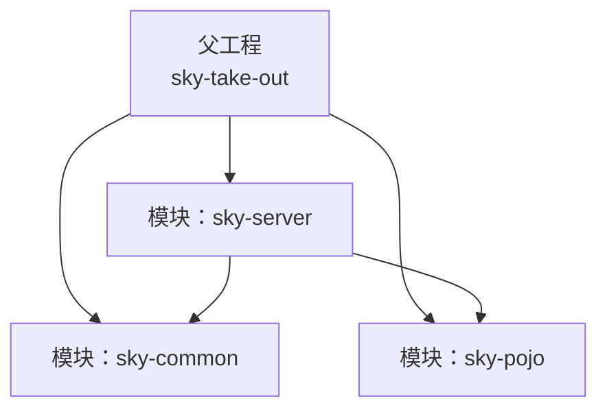
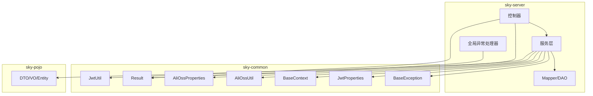
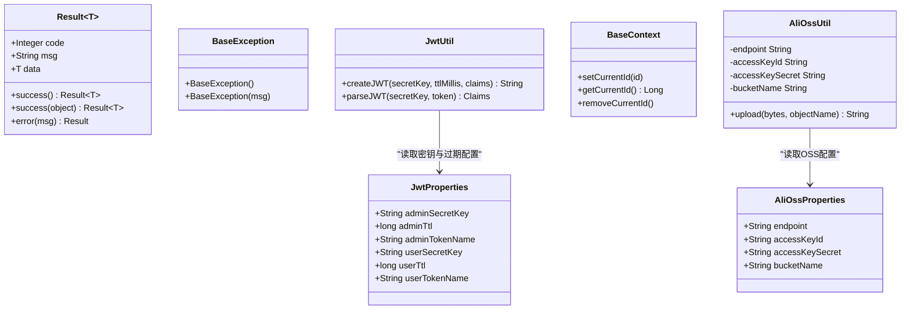
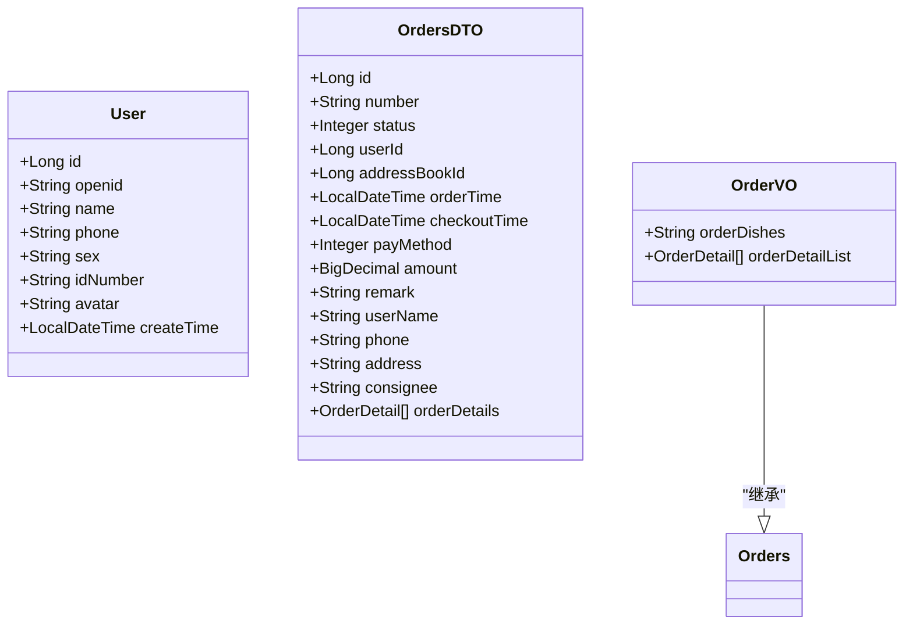
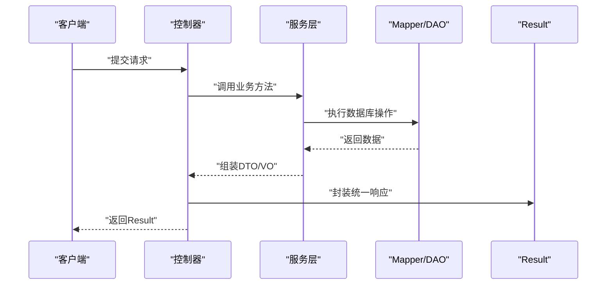
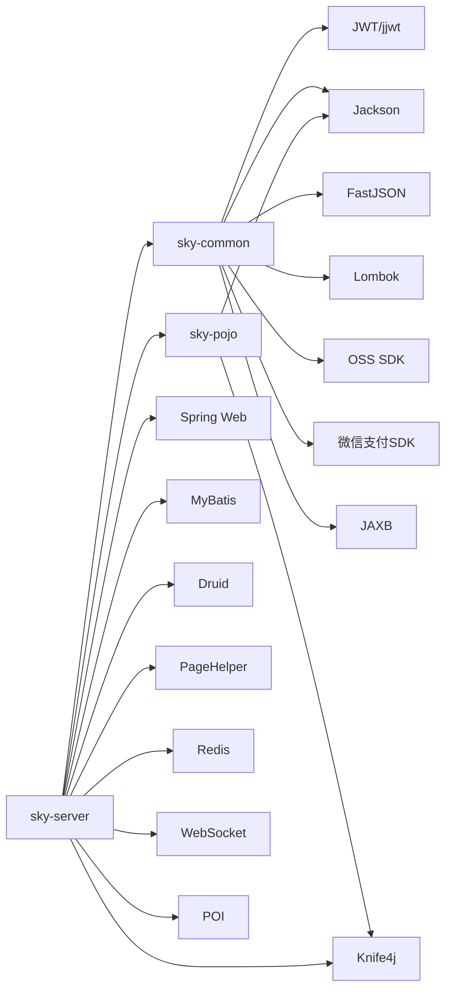

# 核心模块

<cite>
**本文引用的文件**
- [pom.xml（sky-common）](file://sky-common/pom.xml)
- [pom.xml（sky-pojo）](file://sky-pojo/pom.xml)
- [pom.xml（sky-server）](file://sky-server/pom.xml)
- [JwtClaimsConstant.java](file://sky-common/src/main/java/com/sky/constant/JwtClaimsConstant.java)
- [MessageConstant.java](file://sky-common/src/main/java/com/sky/constant/MessageConstant.java)
- [BaseContext.java](file://sky-common/src/main/java/com/sky/context/BaseContext.java)
- [Result.java](file://sky-common/src/main/java/com/sky/result/Result.java)
- [JwtUtil.java](file://sky-common/src/main/java/com/sky/utils/JwtUtil.java)
- [BaseException.java](file://sky-common/src/main/java/com/sky/exception/BaseException.java)
- [JwtProperties.java](file://sky-common/src/main/java/com/sky/properties/JwtProperties.java)
- [AliOssProperties.java](file://sky-common/src/main/java/com/sky/properties/AliOssProperties.java)
- [AliOssUtil.java](file://sky-common/src/main/java/com/sky/utils/AliOssUtil.java)
- [User.java](file://sky-pojo/src/main/java/com/sky/entity/User.java)
- [OrdersDTO.java](file://sky-pojo/src/main/java/com/sky/dto/OrdersDTO.java)
- [OrderVO.java](file://sky-pojo/src/main/java/com/sky/vo/OrderVO.java)
- [SkyApplication.java](file://sky-server/src/main/java/com/sky/SkyApplication.java)
</cite>

## 目录
1. [简介](#简介)
2. [项目结构](#项目结构)
3. [核心组件](#核心组件)
4. [架构总览](#架构总览)
5. [详细组件分析](#详细组件分析)
6. [依赖分析](#依赖分析)
7. [性能考虑](#性能考虑)
8. [故障排查指南](#故障排查指南)
9. [结论](#结论)
10. [附录](#附录)

## 简介
本文件面向“苍穹外卖点餐系统”的核心模块，系统性梳理以下三个模块的设计与实现：
- sky-common：通用工具与基础设施模块，提供统一响应体、异常体系、JWT 工具、配置属性、对象映射器、常用工具类等。
- sky-pojo：数据模型模块，定义实体、传输对象 DTO、视图对象 VO，以及查询条件 DTO，支撑前后端交互与业务建模。
- sky-server：业务应用模块，基于 Spring Boot 的后端服务入口，整合通用与数据模型模块，提供控制器、拦截器、全局异常处理、MyBatis Mapper 等。

目标是帮助读者快速理解各模块职责边界、接口定义、集成方式、配置选项、扩展机制与最佳实践，并给出典型使用场景与数据流转示意。

## 项目结构
该工程采用多模块 Maven 结构，父工程聚合三个子模块：
- sky-common：通用能力沉淀，被 sky-server 引用。
- sky-pojo：数据模型定义，被 sky-server 引用。
- sky-server：业务应用入口，依赖 sky-common 与 sky-pojo，并引入 Web、数据库、缓存、分页、Redis、Knife4j 等生态依赖。

图表来源
- [pom.xml（sky-server）第14-24行:14-24](file://sky-server/pom.xml#L14-L24)
- [pom.xml（sky-common）第12-52行:12-52](file://sky-common/pom.xml#L12-L52)
- [pom.xml（sky-pojo）第12-26行:12-26](file://sky-pojo/pom.xml#L12-L26)

章节来源
- [pom.xml（sky-server）第1-130行:1-130](file://sky-server/pom.xml#L1-L130)
- [pom.xml（sky-common）第1-54行:1-54](file://sky-common/pom.xml#L1-L54)
- [pom.xml（sky-pojo）第1-28行:1-28](file://sky-pojo/pom.xml#L1-L28)

## 核心组件
本节从职责边界、接口定义与使用方法三个维度，对三大模块进行概览式说明。

- sky-common
  - 统一响应体与异常：提供 Result<T> 统一返回结构与 BaseException 业务异常基类，便于服务端对外输出一致的数据格式与错误语义。
  - 上下文与常量：BaseContext 提供线程级上下文存储；JwtClaimsConstant、MessageConstant 提供 JWT 声明键名与系统提示信息常量。
  - 安全与认证：JwtUtil 提供 JWT 生成与解析；JwtProperties 提供 yml 配置绑定，支持管理端与用户端两套密钥与过期策略。
  - 对象序列化：JacksonObjectMapper 提供自定义 JSON 映射器（以源码为准，具体实现文件见对应路径）。
  - 外部集成：AliOssUtil 封装阿里云 OSS 上传；AliOssProperties 提供 OSS 配置绑定；HttpClientUtil、WeChatPayUtil 提供 HTTP 与微信支付工具（以源码为准，具体实现文件见对应路径）。
  - 配置属性：WeChatProperties 提供微信支付相关配置绑定（以源码为准，具体实现文件见对应路径）。

- sky-pojo
  - 实体层：如 User、Orders、OrderDetail、Category、Dish、Setmeal 等，承载持久化字段与业务实体语义。
  - DTO 层：如 OrdersDTO、EmployeeDTO、CategoryDTO、SetmealDTO 等，用于控制器与服务层之间的参数传递与装配。
  - VO 层：如 OrderVO、DishVO、SetmealVO、BusinessDataVO 等，用于向前端展示的聚合视图对象。
  - 查询条件 DTO：如 OrdersPageQueryDTO、EmployeePageQueryDTO、DishPageQueryDTO 等，封装分页与筛选条件。

- sky-server
  - 应用入口：SkyApplication 作为 Spring Boot 启动类，启用事务管理。
  - Web 层：控制器、拦截器、全局异常处理器等。
  - 数据访问：MyBatis Mapper 与 XML 映射文件。
  - 配置：application.yml 及开发环境配置文件。

章节来源
- [Result.java 第1-39行:1-39](file://sky-common/src/main/java/com/sky/result/Result.java#L1-L39)
- [BaseException.java 第1-16行:1-16](file://sky-common/src/main/java/com/sky/exception/BaseException.java#L1-L16)
- [JwtClaimsConstant.java 第1-12行:1-12](file://sky-common/src/main/java/com/sky/constant/JwtClaimsConstant.java#L1-L12)
- [MessageConstant.java 第1-28行:1-28](file://sky-common/src/main/java/com/sky/constant/MessageConstant.java#L1-L28)
- [BaseContext.java 第1-20行:1-20](file://sky-common/src/main/java/com/sky/context/BaseContext.java#L1-L20)
- [JwtUtil.java 第1-59行:1-59](file://sky-common/src/main/java/com/sky/utils/JwtUtil.java#L1-L59)
- [JwtProperties.java 第1-27行:1-27](file://sky-common/src/main/java/com/sky/properties/JwtProperties.java#L1-L27)
- [AliOssProperties.java 第1-18行:1-18](file://sky-common/src/main/java/com/sky/properties/AliOssProperties.java#L1-L18)
- [AliOssUtil.java 第1-69行:1-69](file://sky-common/src/main/java/com/sky/utils/AliOssUtil.java#L1-L69)
- [User.java 第1-43行:1-43](file://sky-pojo/src/main/java/com/sky/entity/User.java#L1-L43)
- [OrdersDTO.java 第1-57行:1-57](file://sky-pojo/src/main/java/com/sky/dto/OrdersDTO.java#L1-L57)
- [OrderVO.java 第1-23行:1-23](file://sky-pojo/src/main/java/com/sky/vo/OrderVO.java#L1-L23)
- [SkyApplication.java 第1-17行:1-17](file://sky-server/src/main/java/com/sky/SkyApplication.java#L1-L17)

## 架构总览
下图展示了三模块的依赖关系与典型调用链路：sky-server 依赖 sky-common 与 sky-pojo；服务层通过 DTO/VO 与控制器交互；控制器返回 Result 统一响应体；异常由全局异常处理器捕获并转换为 Result。

图表来源
- [pom.xml（sky-server）第14-24行:14-24](file://sky-server/pom.xml#L14-L24)
- [Result.java 第18-36行:18-36](file://sky-common/src/main/java/com/sky/result/Result.java#L18-L36)
- [BaseException.java 第6-13行:6-13](file://sky-common/src/main/java/com/sky/exception/BaseException.java#L6-L13)
- [JwtUtil.java 第21-56行:21-56](file://sky-common/src/main/java/com/sky/utils/JwtUtil.java#L21-L56)
- [JwtProperties.java 第10-24行:10-24](file://sky-common/src/main/java/com/sky/properties/JwtProperties.java#L10-L24)
- [BaseContext.java 第7-17行:7-17](file://sky-common/src/main/java/com/sky/context/BaseContext.java#L7-L17)
- [AliOssUtil.java 第29-66行:29-66](file://sky-common/src/main/java/com/sky/utils/AliOssUtil.java#L29-L66)
- [AliOssProperties.java 第10-15行:10-15](file://sky-common/src/main/java/com/sky/properties/AliOssProperties.java#L10-L15)
- [OrdersDTO.java 第11-54行:11-54](file://sky-pojo/src/main/java/com/sky/dto/OrdersDTO.java#L11-L54)
- [OrderVO.java 第14-20行:14-20](file://sky-pojo/src/main/java/com/sky/vo/OrderVO.java#L14-L20)

## 详细组件分析

### sky-common 组件分析
- 统一响应体 Result<T>
  - 职责：封装接口返回的 code、msg、data，提供 success/error 工厂方法，确保前后端一致的响应格式。
  - 使用建议：服务层返回数据时优先使用 Result.success(data)，异常时使用 Result.error(msg)。
  - 复杂度：O(1) 时间与空间。
- 异常体系 BaseException
  - 职责：业务异常基类，配合全局异常处理器统一处理。
  - 扩展：可新增具体业务异常类型（如订单异常、地址异常等），继承 BaseException 并在处理器中捕获。
- JWT 工具与配置
  - JwtUtil：提供 createJWT 与 parseJWT，支持 HS256 签名与过期时间控制。
  - JwtProperties：通过 yml 绑定管理端与用户端密钥、过期时间与 Token 名称。
  - 使用建议：登录成功后生成 Token，拦截器校验 Token 并将用户 ID 写入 BaseContext。
- 上下文存储 BaseContext
  - 职责：ThreadLocal 存储当前用户或员工 ID，贯穿一次请求生命周期。
  - 使用建议：在拦截器中设置 ID，在业务层读取 ID，避免显式传参。
- 对象映射与外部集成
  - JacksonObjectMapper：自定义 JSON 映射器（以源码为准）。
  - AliOssUtil/AliOssProperties：封装 OSS 上传与配置绑定，返回可访问 URL。
  - HttpClientUtil/WeChatPayUtil：HTTP 与微信支付工具（以源码为准）。
  - WeChatProperties：微信支付配置绑定（以源码为准）。

图表来源
- [Result.java 第12-36行:12-36](file://sky-common/src/main/java/com/sky/result/Result.java#L12-L36)
- [BaseException.java 第6-13行:6-13](file://sky-common/src/main/java/com/sky/exception/BaseException.java#L6-L13)
- [JwtUtil.java 第21-56行:21-56](file://sky-common/src/main/java/com/sky/utils/JwtUtil.java#L21-L56)
- [JwtProperties.java 第10-24行:10-24](file://sky-common/src/main/java/com/sky/properties/JwtProperties.java#L10-L24)
- [BaseContext.java 第7-17行:7-17](file://sky-common/src/main/java/com/sky/context/BaseContext.java#L7-L17)
- [AliOssUtil.java 第15-66行:15-66](file://sky-common/src/main/java/com/sky/utils/AliOssUtil.java#L15-L66)
- [AliOssProperties.java 第10-15行:10-15](file://sky-common/src/main/java/com/sky/properties/AliOssProperties.java#L10-L15)

章节来源
- [Result.java 第1-39行:1-39](file://sky-common/src/main/java/com/sky/result/Result.java#L1-L39)
- [BaseException.java 第1-16行:1-16](file://sky-common/src/main/java/com/sky/exception/BaseException.java#L1-L16)
- [JwtUtil.java 第1-59行:1-59](file://sky-common/src/main/java/com/sky/utils/JwtUtil.java#L1-L59)
- [JwtProperties.java 第1-27行:1-27](file://sky-common/src/main/java/com/sky/properties/JwtProperties.java#L1-L27)
- [BaseContext.java 第1-20行:1-20](file://sky-common/src/main/java/com/sky/context/BaseContext.java#L1-L20)
- [AliOssUtil.java 第1-69行:1-69](file://sky-common/src/main/java/com/sky/utils/AliOssUtil.java#L1-L69)
- [AliOssProperties.java 第1-18行:1-18](file://sky-common/src/main/java/com/sky/properties/AliOssProperties.java#L1-L18)

### sky-pojo 组件分析
- 实体层（Entity）
  - 示例：User、Orders、OrderDetail、Category、Dish、Setmeal 等，承载数据库字段与业务实体。
- DTO 层（DTO）
  - 示例：OrdersDTO、EmployeeDTO、CategoryDTO、SetmealDTO 等，用于控制器与服务层之间的参数传递。
- VO 层（VO）
  - 示例：OrderVO、DishVO、SetmealVO、BusinessDataVO 等，用于前端展示的聚合视图。
- 查询条件 DTO（PageQueryDTO）
  - 示例：OrdersPageQueryDTO、EmployeePageQueryDTO、DishPageQueryDTO 等，封装分页与筛选条件。

图表来源
- [User.java 第20-42行:20-42](file://sky-pojo/src/main/java/com/sky/entity/User.java#L20-L42)
- [OrdersDTO.java 第13-54行:13-54](file://sky-pojo/src/main/java/com/sky/dto/OrdersDTO.java#L13-L54)
- [OrderVO.java 第14-20行:14-20](file://sky-pojo/src/main/java/com/sky/vo/OrderVO.java#L14-L20)

章节来源
- [User.java 第1-43行:1-43](file://sky-pojo/src/main/java/com/sky/entity/User.java#L1-L43)
- [OrdersDTO.java 第1-57行:1-57](file://sky-pojo/src/main/java/com/sky/dto/OrdersDTO.java#L1-L57)
- [OrderVO.java 第1-23行:1-23](file://sky-pojo/src/main/java/com/sky/vo/OrderVO.java#L1-L23)

### sky-server 组件分析
- 应用入口
  - SkyApplication：Spring Boot 启动类，启用事务管理，记录启动日志。
- 控制器与拦截器
  - 控制器：接收请求，调用服务层，返回 Result。
  - 拦截器：校验 Token，将用户 ID 写入 BaseContext。
- 全局异常处理
  - 捕获 BaseException 及其他运行时异常，统一转为 Result 错误响应。
- 数据访问
  - MyBatis Mapper 与 XML 映射文件，结合分页插件与 Redis 缓存。
- 配置
  - application.yml 与 application-dev.yml，加载 sky-common 与 sky-pojo 中的配置绑定类。

图表来源
- [SkyApplication.java 第8-15行:8-15](file://sky-server/src/main/java/com/sky/SkyApplication.java#L8-L15)
- [Result.java 第18-36行:18-36](file://sky-common/src/main/java/com/sky/result/Result.java#L18-L36)

章节来源
- [SkyApplication.java 第1-17行:1-17](file://sky-server/src/main/java/com/sky/SkyApplication.java#L1-L17)

## 依赖分析
- 模块间依赖
  - sky-server 依赖 sky-common 与 sky-pojo，二者不互相依赖。
- 外部依赖
  - sky-common：JWT、Jackson、FastJSON、Lombok、OSS SDK、微信支付 SDK、JAXB。
  - sky-pojo：Jackson、Knife4j。
  - sky-server：Spring Boot Web、MyBatis、Druid、PageHelper、Redis、WebSocket、POI、Knife4j 等。

图表来源
- [pom.xml（sky-server）第12-118行:12-118](file://sky-server/pom.xml#L12-L118)
- [pom.xml（sky-common）第12-52行:12-52](file://sky-common/pom.xml#L12-L52)
- [pom.xml（sky-pojo）第12-26行:12-26](file://sky-pojo/pom.xml#L12-L26)

章节来源
- [pom.xml（sky-server）第1-130行:1-130](file://sky-server/pom.xml#L1-L130)
- [pom.xml（sky-common）第1-54行:1-54](file://sky-common/pom.xml#L1-L54)
- [pom.xml（sky-pojo）第1-28行:1-28](file://sky-pojo/pom.xml#L1-L28)

## 性能考虑
- 统一响应体与异常处理
  - 使用 Result 统一返回，减少分支判断与重复封装，提升接口一致性与可维护性。
- 线程上下文 BaseContext
  - 使用 ThreadLocal 存储用户 ID，避免跨层传参，降低耦合，但需在请求结束时清理，防止内存泄漏。
- 分页与缓存
  - PageHelper 与 Spring Cache 结合使用，合理设置缓存键与过期时间，避免热点数据频繁查询数据库。
- IO 与网络
  - OSS 上传建议复用客户端实例与连接池，上传完成后及时关闭；对外部 HTTP 请求设置超时与重试策略。
- JSON 序列化
  - JacksonObjectMapper 自定义配置应避免大对象深度递归与循环引用，必要时使用 VO 层裁剪字段。

## 故障排查指南
- 登录与鉴权
  - 现象：用户未登录或 Token 过期。
  - 排查：确认 JwtProperties 配置正确、密钥一致、过期时间合理；拦截器是否正确解析 Token 并写入 BaseContext。
  - 参考路径：[JwtProperties.java 第10-24行:10-24](file://sky-common/src/main/java/com/sky/properties/JwtProperties.java#L10-L24)、[JwtUtil.java 第21-56行:21-56](file://sky-common/src/main/java/com/sky/utils/JwtUtil.java#L21-L56)、[BaseContext.java 第7-17行:7-17](file://sky-common/src/main/java/com/sky/context/BaseContext.java#L7-L17)
- 统一异常处理
  - 现象：业务异常未按预期返回。
  - 排查：确认服务层抛出 BaseException 或其子类；全局异常处理器是否捕获并转换为 Result.error。
  - 参考路径：[BaseException.java 第6-13行:6-13](file://sky-common/src/main/java/com/sky/exception/BaseException.java#L6-L13)、[Result.java 第31-36行:31-36](file://sky-common/src/main/java/com/sky/result/Result.java#L31-L36)
- 文件上传
  - 现象：OSS 上传失败或返回空路径。
  - 排查：检查 AliOssProperties 配置项；OSS 客户端初始化与 finally 关闭；日志输出与异常堆栈。
  - 参考路径：[AliOssProperties.java 第10-15行:10-15](file://sky-common/src/main/java/com/sky/properties/AliOssProperties.java#L10-L15)、[AliOssUtil.java 第29-66行:29-66](file://sky-common/src/main/java/com/sky/utils/AliOssUtil.java#L29-L66)
- 数据模型与分页
  - 现象：查询结果为空或分页异常。
  - 排查：确认 DTO/VO 字段与数据库映射一致；PageHelper 插件版本与配置；Mapper XML 是否正确。
  - 参考路径：[OrdersDTO.java 第13-54行:13-54](file://sky-pojo/src/main/java/com/sky/dto/OrdersDTO.java#L13-L54)、[OrderVO.java 第14-20行:14-20](file://sky-pojo/src/main/java/com/sky/vo/OrderVO.java#L14-L20)

章节来源
- [JwtProperties.java 第1-27行:1-27](file://sky-common/src/main/java/com/sky/properties/JwtProperties.java#L1-L27)
- [JwtUtil.java 第1-59行:1-59](file://sky-common/src/main/java/com/sky/utils/JwtUtil.java#L1-L59)
- [BaseContext.java 第1-20行:1-20](file://sky-common/src/main/java/com/sky/context/BaseContext.java#L1-L20)
- [BaseException.java 第1-16行:1-16](file://sky-common/src/main/java/com/sky/exception/BaseException.java#L1-L16)
- [Result.java 第1-39行:1-39](file://sky-common/src/main/java/com/sky/result/Result.java#L1-L39)
- [AliOssProperties.java 第1-18行:1-18](file://sky-common/src/main/java/com/sky/properties/AliOssProperties.java#L1-L18)
- [AliOssUtil.java 第1-69行:1-69](file://sky-common/src/main/java/com/sky/utils/AliOssUtil.java#L1-L69)
- [OrdersDTO.java 第1-57行:1-57](file://sky-pojo/src/main/java/com/sky/dto/OrdersDTO.java#L1-L57)
- [OrderVO.java 第1-23行:1-23](file://sky-pojo/src/main/java/com/sky/vo/OrderVO.java#L1-L23)

## 结论
- sky-common 提供统一的响应、异常、安全、配置与工具能力，是系统稳定性的基石。
- sky-pojo 以清晰的分层模型（Entity/DTO/VO/PageQueryDTO）支撑前后端交互与业务建模。
- sky-server 作为应用入口，整合通用与数据模型能力，提供 Web、数据访问、缓存与分页等完整能力。
- 建议在实际开发中遵循“DTO/VO 分层、统一响应、异常收敛、配置外置、上下文隔离”的最佳实践，持续优化性能与可维护性。

## 附录
- 配置选项示例（基于现有配置绑定类）
  - JWT 配置（yml）：参考 [JwtProperties.java 第8-24行:8-24](file://sky-common/src/main/java/com/sky/properties/JwtProperties.java#L8-L24)
  - OSS 配置（yml）：参考 [AliOssProperties.java 第8-15行:8-15](file://sky-common/src/main/java/com/sky/properties/AliOssProperties.java#L8-L15)
- 扩展机制
  - 新增业务异常：继承 BaseException，配合全局异常处理器统一处理。
  - 新增工具类：放入 sky-common，保持无业务侵入性。
  - 新增数据模型：在 sky-pojo 下按 Entity/DTO/VO 分层新增，确保命名规范与字段映射一致。
- 最佳实践
  - 控制器只负责编排，业务逻辑下沉至服务层；服务层通过 DTO/VO 与控制器交互。
  - 统一使用 Result 返回，异常统一收敛。
  - 使用 PageHelper 与缓存提升查询性能，注意缓存键设计与失效策略。
  - 线程上下文在请求结束后务必清理，避免线程复用导致的数据污染。