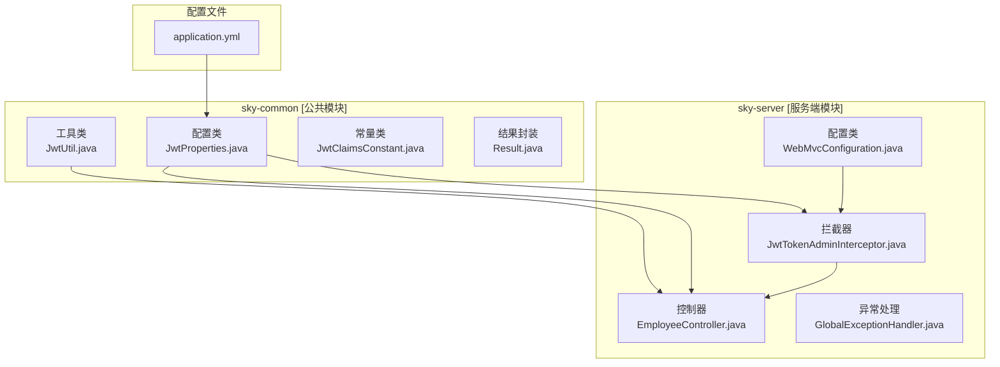
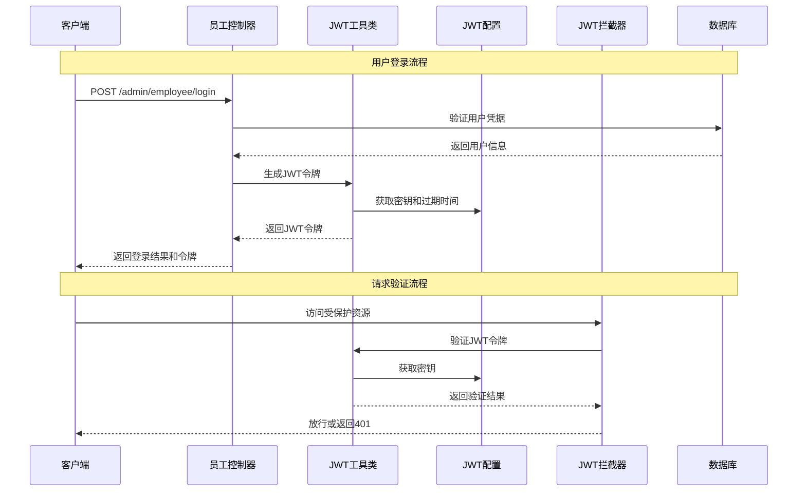
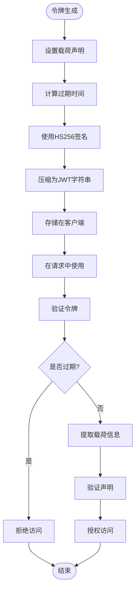
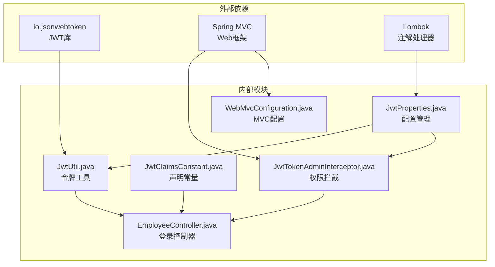

# JWT令牌认证

<cite>
**本文档引用的文件**
- [JwtUtil.java](file://sky-common/src/main/java/com/sky/utils/JwtUtil.java)
- [JwtProperties.java](file://sky-common/src/main/java/com/sky/properties/JwtProperties.java)
- [JwtClaimsConstant.java](file://sky-common/src/main/java/com/sky/constant/JwtClaimsConstant.java)
- [JwtTokenAdminInterceptor.java](file://sky-server/src/main/java/com/sky/interceptor/JwtTokenAdminInterceptor.java)
- [EmployeeController.java](file://sky-server/src/main/java/com/sky/controller/admin/EmployeeController.java)
- [WebMvcConfiguration.java](file://sky-server/src/main/java/com/sky/config/WebMvcConfiguration.java)
- [application.yml](file://sky-server/src/main/resources/application.yml)
- [EmployeeLoginVO.java](file://sky-pojo/src/main/java/com/sky/vo/EmployeeLoginVO.java)
- [Result.java](file://sky-common/src/main/java/com/sky/result/Result.java)
</cite>

## 目录
1. [简介](#简介)
2. [项目结构](#项目结构)
3. [核心组件](#核心组件)
4. [架构概览](#架构概览)
5. [详细组件分析](#详细组件分析)
6. [依赖关系分析](#依赖关系分析)
7. [性能考虑](#性能考虑)
8. [故障排除指南](#故障排除指南)
9. [结论](#结论)

## 简介

本项目实现了基于JWT（JSON Web Token）的认证机制，为管理员端提供了完整的令牌生成、验证和管理功能。JWT是一种开放标准（RFC 7519），用于在网络应用间安全地传输信息。该实现采用HS256对称加密算法，确保令牌的安全性和完整性。

系统的核心特性包括：
- 安全的令牌生成和验证机制
- 可配置的过期时间和密钥管理
- 统一的拦截器进行权限控制
- 完整的登录流程集成
- 错误处理和异常管理

## 项目结构

该项目采用分层架构设计，JWT认证功能分布在以下模块中：

**图表来源**
- [JwtUtil.java:1-59](file://sky-common/src/main/java/com/sky/utils/JwtUtil.java#L1-L59)
- [JwtProperties.java:1-27](file://sky-common/src/main/java/com/sky/properties/JwtProperties.java#L1-L27)
- [JwtTokenAdminInterceptor.java:1-59](file://sky-server/src/main/java/com/sky/interceptor/JwtTokenAdminInterceptor.java#L1-L59)

**章节来源**
- [JwtUtil.java:1-59](file://sky-common/src/main/java/com/sky/utils/JwtUtil.java#L1-L59)
- [JwtProperties.java:1-27](file://sky-common/src/main/java/com/sky/properties/JwtProperties.java#L1-L27)
- [WebMvcConfiguration.java:1-69](file://sky-server/src/main/java/com/sky/config/WebMvcConfiguration.java#L1-L69)

## 核心组件

### JWT工具类 (JwtUtil)

JwtUtil是JWT认证机制的核心工具类，提供了令牌的生成和解析功能：

**主要功能**：
- 令牌生成：使用HS256算法和指定密钥生成JWT
- 令牌解析：验证并解析JWT令牌，提取载荷信息
- 时间管理：自动计算过期时间

**关键方法**：
- `createJWT(String secretKey, long ttlMillis, Map<String, Object> claims)`
- `parseJWT(String secretKey, String token)`

**章节来源**
- [JwtUtil.java:11-59](file://sky-common/src/main/java/com/sky/utils/JwtUtil.java#L11-L59)

### JWT配置类 (JwtProperties)

JwtProperties负责管理JWT相关的配置参数：

**配置项**：
- `adminSecretKey`: 管理端员工JWT密钥
- `adminTtl`: 管理端令牌过期时间（毫秒）
- `adminTokenName`: 前端传递令牌的请求头名称
- `userSecretKey`: 用户端微信用户JWT密钥
- `userTtl`: 用户端令牌过期时间（毫秒）
- `userTokenName`: 用户端令牌请求头名称

**章节来源**
- [JwtProperties.java:10-26](file://sky-common/src/main/java/com/sky/properties/JwtProperties.java#L10-L26)

### JWT拦截器 (JwtTokenAdminInterceptor)

拦截器负责在请求到达控制器之前进行JWT验证：

**工作流程**：
1. 从请求头中提取令牌
2. 使用配置的密钥验证令牌有效性
3. 解析载荷信息并提取用户标识
4. 验证通过则放行，否则返回401状态码

**章节来源**
- [JwtTokenAdminInterceptor.java:20-59](file://sky-server/src/main/java/com/sky/interceptor/JwtTokenAdminInterceptor.java#L20-L59)

## 架构概览

JWT认证系统的整体架构如下：

**图表来源**
- [EmployeeController.java:40-62](file://sky-server/src/main/java/com/sky/controller/admin/EmployeeController.java#L40-L62)
- [JwtTokenAdminInterceptor.java:34-57](file://sky-server/src/main/java/com/sky/interceptor/JwtTokenAdminInterceptor.java#L34-L57)

## 详细组件分析

### JWT生成算法详解

JWT令牌采用HS256对称加密算法，具有以下特点：

**算法选择**：
- HS256：基于HMAC-SHA256的对称加密
- 密钥长度：256位
- 性能优势：加密和解密速度较快
- 安全性：需要妥善保管共享密钥

**令牌结构**：
JWT由三部分组成，用点号分隔：
1. **Header（头部）**：包含算法和令牌类型
2. **Payload（载荷）**：包含声明信息
3. **Signature（签名）**：用于验证令牌完整性

**章节来源**
- [JwtUtil.java:21-39](file://sky-common/src/main/java/com/sky/utils/JwtUtil.java#L21-L39)

### 载荷信息结构

载荷部分包含JWT携带的声明信息，系统使用以下标准声明：

**标准声明**：
- `iss` (issuer)：令牌签发者
- `iat` (issued at)：签发时间
- `exp` (expiration time)：过期时间
- `aud` (audience)：接收方

**自定义声明**：
- `empId`：员工ID（来自JwtClaimsConstant）
- `userId`：用户ID
- `phone`：手机号
- `username`：用户名
- `name`：姓名

**章节来源**
- [JwtClaimsConstant.java:3-12](file://sky-common/src/main/java/com/sky/constant/JwtClaimsConstant.java#L3-L12)

### 令牌生命周期管理

系统实现了完整的令牌生命周期管理：

**图表来源**
- [JwtUtil.java:21-56](file://sky-common/src/main/java/com/sky/utils/JwtUtil.java#L21-L56)

### 配置管理与密钥安全

**配置文件设置**：
- 密钥管理：通过application.yml集中管理
- 过期时间：支持毫秒级精确控制
- 请求头配置：灵活的令牌传递方式

**密钥管理最佳实践**：
- 使用强随机密钥
- 定期轮换密钥
- 环境隔离配置
- 最小权限原则

**章节来源**
- [application.yml:32-40](file://sky-server/src/main/resources/application.yml#L32-L40)
- [JwtProperties.java:15-24](file://sky-common/src/main/java/com/sky/properties/JwtProperties.java#L15-L24)

### 权限拦截机制

系统通过Spring MVC拦截器实现统一的权限控制：

**拦截规则**：
- 拦截路径：`/admin/**`
- 排除路径：`/admin/employee/login`
- 验证时机：请求进入控制器前

**验证流程**：
1. 提取请求头中的令牌
2. 使用配置密钥验证签名
3. 解析载荷并提取用户ID
4. 设置用户上下文信息

**章节来源**
- [WebMvcConfiguration.java:33-38](file://sky-server/src/main/java/com/sky/config/WebMvcConfiguration.java#L33-L38)
- [JwtTokenAdminInterceptor.java:34-57](file://sky-server/src/main/java/com/sky/interceptor/JwtTokenAdminInterceptor.java#L34-L57)

## 依赖关系分析

JWT认证系统的依赖关系如下：

**图表来源**
- [JwtUtil.java:3-6](file://sky-common/src/main/java/com/sky/utils/JwtUtil.java#L3-L6)
- [JwtTokenAdminInterceptor.java:3-6](file://sky-server/src/main/java/com/sky/interceptor/JwtTokenAdminInterceptor.java#L3-L6)

**章节来源**
- [JwtUtil.java:1-10](file://sky-common/src/main/java/com/sky/utils/JwtUtil.java#L1-L10)
- [JwtTokenAdminInterceptor.java:1-14](file://sky-server/src/main/java/com/sky/interceptor/JwtTokenAdminInterceptor.java#L1-L14)

## 性能考虑

### 令牌生成性能

**优化策略**：
- 使用HS256算法确保快速加密
- 避免不必要的载荷声明
- 合理设置过期时间减少验证开销

**内存管理**：
- 令牌字符串直接返回，避免额外对象创建
- 使用UTF-8字符集确保兼容性

### 验证性能

**优化措施**：
- 单次解析操作完成验证
- 缓存已验证的令牌信息
- 异常处理避免重复验证

### 安全性能平衡

**折衷考虑**：
- 过短的过期时间影响用户体验
- 过长的过期时间增加安全风险
- 建议采用2小时的默认过期时间

## 故障排除指南

### 常见问题及解决方案

**令牌验证失败**：
- 检查密钥是否正确配置
- 验证令牌是否过期
- 确认请求头名称匹配

**401未授权错误**：
- 确认令牌格式正确
- 检查签名算法一致性
- 验证载荷声明完整性

**配置问题**：
- 检查application.yml配置项
- 确认环境变量正确设置
- 验证配置类属性映射

**章节来源**
- [JwtTokenAdminInterceptor.java:52-56](file://sky-server/src/main/java/com/sky/interceptor/JwtTokenAdminInterceptor.java#L52-L56)
- [application.yml:32-40](file://sky-server/src/main/resources/application.yml#L32-L40)

### 调试建议

**日志记录**：
- 启用JWT验证日志
- 记录令牌生成和验证时间
- 监控异常情况

**测试策略**：
- 单元测试验证令牌生成
- 集成测试验证完整流程
- 性能测试评估系统能力

## 结论

本JWT认证系统实现了安全、高效的令牌管理机制，具有以下优势：

**技术优势**：
- 基于标准JWT规范，兼容性强
- HS256算法提供良好性能平衡
- 分层架构便于维护和扩展

**安全特性**：
- 对称加密确保令牌完整性
- 可配置的过期时间控制
- 统一的权限拦截机制

**实用性**：
- 简洁的API设计
- 灵活的配置选项
- 完善的错误处理

该系统为管理员端提供了可靠的认证基础，可根据实际需求进一步扩展用户端认证功能和更复杂的权限管理机制。