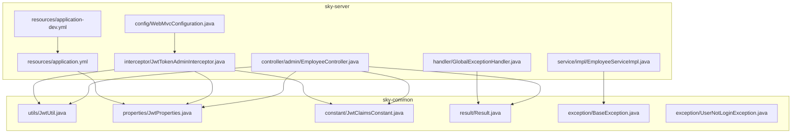
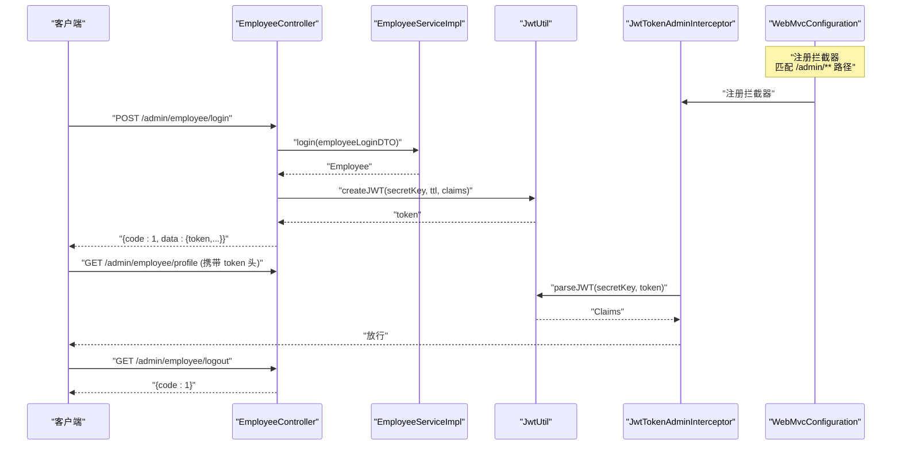
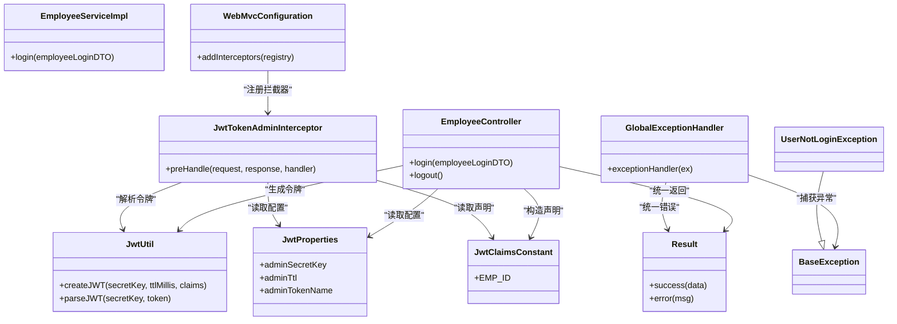
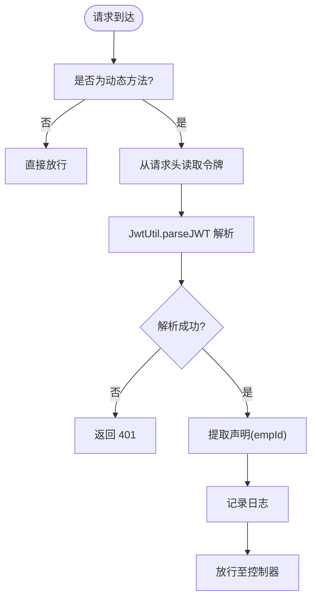

# 认证授权系统

<cite>
**本文档引用的文件**
- [JwtUtil.java](file://sky-common/src/main/java/com/sky/utils/JwtUtil.java)
- [JwtProperties.java](file://sky-common/src/main/java/com/sky/properties/JwtProperties.java)
- [JwtClaimsConstant.java](file://sky-common/src/main/java/com/sky/constant/JwtClaimsConstant.java)
- [JwtTokenAdminInterceptor.java](file://sky-server/src/main/java/com/sky/interceptor/JwtTokenAdminInterceptor.java)
- [WebMvcConfiguration.java](file://sky-server/src/main/java/com/sky/config/WebMvcConfiguration.java)
- [EmployeeController.java](file://sky-server/src/main/java/com/sky/controller/admin/EmployeeController.java)
- [EmployeeServiceImpl.java](file://sky-server/src/main/java/com/sky/service/impl/EmployeeServiceImpl.java)
- [GlobalExceptionHandler.java](file://sky-server/src/main/java/com/sky/handler/GlobalExceptionHandler.java)
- [application.yml](file://sky-server/src/main/resources/application.yml)
- [application-dev.yml](file://sky-server/src/main/resources/application-dev.yml)
- [Result.java](file://sky-common/src/main/java/com/sky/result/Result.java)
- [BaseException.java](file://sky-common/src/main/java/com/sky/exception/BaseException.java)
- [UserNotLoginException.java](file://sky-common/src/main/java/com/sky/exception/UserNotLoginException.java)
</cite>

## 目录
1. [简介](#简介)
2. [项目结构](#项目结构)
3. [核心组件](#核心组件)
4. [架构总览](#架构总览)
5. [详细组件分析](#详细组件分析)
6. [依赖关系分析](#依赖关系分析)
7. [性能考虑](#性能考虑)
8. [故障排除指南](#故障排除指南)
9. [结论](#结论)
10. [附录](#附录)

## 简介
本文件面向“苍穹外卖点餐系统”的认证授权子系统，聚焦于基于 JWT 的令牌认证机制与 Spring MVC 拦截器的权限控制策略。文档将深入解释：
- JWT 令牌的生成、验证与过期处理
- 拦截器如何在请求生命周期中执行权限校验
- 安全配置项与异常处理机制
- 完整的认证流程图与时序图
- 认证相关的 API 接口说明与使用示例

## 项目结构
认证授权系统主要分布在以下模块：
- sky-common：通用工具与常量、异常、返回体等
- sky-server：控制器、拦截器、配置、服务与异常处理

图表来源
- [JwtUtil.java:1-59](file://sky-common/src/main/java/com/sky/utils/JwtUtil.java#L1-L59)
- [JwtProperties.java:1-27](file://sky-common/src/main/java/com/sky/properties/JwtProperties.java#L1-L27)
- [JwtClaimsConstant.java:1-12](file://sky-common/src/main/java/com/sky/constant/JwtClaimsConstant.java#L1-L12)
- [WebMvcConfiguration.java:1-69](file://sky-server/src/main/java/com/sky/config/WebMvcConfiguration.java#L1-L69)
- [JwtTokenAdminInterceptor.java:1-59](file://sky-server/src/main/java/com/sky/interceptor/JwtTokenAdminInterceptor.java#L1-L59)
- [EmployeeController.java:1-75](file://sky-server/src/main/java/com/sky/controller/admin/EmployeeController.java#L1-L75)
- [EmployeeServiceImpl.java:1-58](file://sky-server/src/main/java/com/sky/service/impl/EmployeeServiceImpl.java#L1-L58)
- [GlobalExceptionHandler.java:1-28](file://sky-server/src/main/java/com/sky/handler/GlobalExceptionHandler.java#L1-L28)
- [application.yml:1-40](file://sky-server/src/main/resources/application.yml#L1-L40)
- [application-dev.yml:1-9](file://sky-server/src/main/resources/application-dev.yml#L1-L9)

章节来源
- [WebMvcConfiguration.java:1-69](file://sky-server/src/main/java/com/sky/config/WebMvcConfiguration.java#L1-L69)
- [application.yml:1-40](file://sky-server/src/main/resources/application.yml#L1-L40)

## 核心组件
- JWT 工具类：负责令牌生成与解析
- JWT 属性配置：集中管理密钥、过期时间与令牌头名
- JWT 声明常量：标准化载荷键名
- 管理端 JWT 拦截器：在请求进入控制器前进行令牌校验
- WebMVC 配置：注册拦截器并设置路径匹配规则
- 员工登录控制器：完成登录校验并通过 JWT 返回令牌
- 全局异常处理器：统一捕获业务异常并返回标准响应

章节来源
- [JwtUtil.java:1-59](file://sky-common/src/main/java/com/sky/utils/JwtUtil.java#L1-L59)
- [JwtProperties.java:1-27](file://sky-common/src/main/java/com/sky/properties/JwtProperties.java#L1-L27)
- [JwtClaimsConstant.java:1-12](file://sky-common/src/main/java/com/sky/constant/JwtClaimsConstant.java#L1-L12)
- [JwtTokenAdminInterceptor.java:1-59](file://sky-server/src/main/java/com/sky/interceptor/JwtTokenAdminInterceptor.java#L1-L59)
- [WebMvcConfiguration.java:1-69](file://sky-server/src/main/java/com/sky/config/WebMvcConfiguration.java#L1-L69)
- [EmployeeController.java:1-75](file://sky-server/src/main/java/com/sky/controller/admin/EmployeeController.java#L1-L75)
- [GlobalExceptionHandler.java:1-28](file://sky-server/src/main/java/com/sky/handler/GlobalExceptionHandler.java#L1-L28)

## 架构总览
下图展示了认证授权的整体交互流程：客户端发起登录请求，服务端完成身份校验后签发 JWT；后续请求携带令牌，拦截器解析并校验令牌，通过后放行至控制器。

图表来源
- [EmployeeController.java:1-75](file://sky-server/src/main/java/com/sky/controller/admin/EmployeeController.java#L1-L75)
- [EmployeeServiceImpl.java:1-58](file://sky-server/src/main/java/com/sky/service/impl/EmployeeServiceImpl.java#L1-L58)
- [JwtUtil.java:1-59](file://sky-common/src/main/java/com/sky/utils/JwtUtil.java#L1-L59)
- [JwtTokenAdminInterceptor.java:1-59](file://sky-server/src/main/java/com/sky/interceptor/JwtTokenAdminInterceptor.java#L1-L59)
- [WebMvcConfiguration.java:1-69](file://sky-server/src/main/java/com/sky/config/WebMvcConfiguration.java#L1-L69)

## 详细组件分析

### JWT 工具类（JwtUtil）
- 功能职责
  - 生成 JWT：使用 HS256 签名算法，结合密钥与过期时间，将自定义声明放入载荷
  - 解析 JWT：使用相同密钥解析并返回 Claims
- 关键点
  - 密钥以 UTF-8 字节形式参与签名与解析
  - 过期时间由调用方传入毫秒数
  - Claims 作为 Map 传入，支持扩展业务字段
- 性能与安全
  - HS256 为对称加密，计算开销低
  - 密钥需严格保密，避免泄露导致伪造风险

章节来源
- [JwtUtil.java:1-59](file://sky-common/src/main/java/com/sky/utils/JwtUtil.java#L1-L59)

### JWT 属性配置（JwtProperties）
- 功能职责
  - 统一管理管理端与用户端的密钥、过期时间与令牌头名
- 配置项
  - 管理端：secretKey、ttl、tokenName
  - 用户端：secretKey、ttl、tokenName
- 作用范围
  - 控制登录时签发令牌的参数
  - 控制拦截器从请求头读取令牌的键名

章节来源
- [JwtProperties.java:1-27](file://sky-common/src/main/java/com/sky/properties/JwtProperties.java#L1-L27)
- [application.yml:32-40](file://sky-server/src/main/resources/application.yml#L32-L40)

### JWT 声明常量（JwtClaimsConstant）
- 功能职责
  - 规范化 JWT 载荷中的键名，如员工 ID、用户 ID、手机号、用户名、姓名
- 作用
  - 保证前后端约定一致，避免硬编码字符串带来的维护成本

章节来源
- [JwtClaimsConstant.java:1-12](file://sky-common/src/main/java/com/sky/constant/JwtClaimsConstant.java#L1-L12)

### 管理端 JWT 拦截器（JwtTokenAdminInterceptor）
- 功能职责
  - 在进入控制器方法前，从请求头读取令牌并进行校验
  - 校验通过放行，否则返回 401 状态码
- 校验逻辑
  - 仅拦截动态方法，静态资源直接放行
  - 从请求头读取令牌（键名来自配置）
  - 使用 JwtUtil 解析并提取声明
  - 将关键声明（如员工 ID）记录日志
- 异常处理
  - 解析失败或异常均视为未授权，返回 401

章节来源
- [JwtTokenAdminInterceptor.java:1-59](file://sky-server/src/main/java/com/sky/interceptor/JwtTokenAdminInterceptor.java#L1-L59)

### WebMVC 配置（WebMvcConfiguration）
- 功能职责
  - 注册自定义拦截器
  - 设置拦截路径与排除路径
  - 配置 Knife4j 文档生成
- 拦截规则
  - 对 /admin/** 路径生效
  - 排除 /admin/employee/login，允许未登录访问
- 文档配置
  - 生成 Swagger 文档，扫描控制器包

章节来源
- [WebMvcConfiguration.java:1-69](file://sky-server/src/main/java/com/sky/config/WebMvcConfiguration.java#L1-L69)

### 员工登录控制器（EmployeeController）
- 功能职责
  - 处理员工登录请求
  - 登录成功后生成 JWT 并返回
- 流程
  - 调用服务层完成登录校验
  - 构造声明（包含员工 ID 等）
  - 使用 JwtUtil 生成 token
  - 返回统一结果包装

章节来源
- [EmployeeController.java:1-75](file://sky-server/src/main/java/com/sky/controller/admin/EmployeeController.java#L1-L75)

### 员工服务实现（EmployeeServiceImpl）
- 功能职责
  - 执行登录业务逻辑
  - 校验用户名、密码与账户状态
  - 抛出相应业务异常
- 异常类型
  - 账号不存在、密码错误、账号被锁定
- 返回实体
  - 登录成功返回员工实体

章节来源
- [EmployeeServiceImpl.java:1-58](file://sky-server/src/main/java/com/sky/service/impl/EmployeeServiceImpl.java#L1-L58)

### 全局异常处理器（GlobalExceptionHandler）
- 功能职责
  - 捕获业务异常（继承自 BaseException）
  - 记录日志并返回统一错误响应
- 返回格式
  - 使用 Result 错误封装，code=0，msg 为异常消息

章节来源
- [GlobalExceptionHandler.java:1-28](file://sky-server/src/main/java/com/sky/handler/GlobalExceptionHandler.java#L1-L28)
- [Result.java:1-39](file://sky-common/src/main/java/com/sky/result/Result.java#L1-L39)
- [BaseException.java:1-16](file://sky-common/src/main/java/com/sky/exception/BaseException.java#L1-L16)

## 依赖关系分析
- 组件耦合
  - 控制器依赖 JwtUtil、JwtProperties、JwtClaimsConstant 与 Result
  - 拦截器依赖 JwtUtil、JwtProperties、JwtClaimsConstant
  - WebMvcConfiguration 依赖拦截器
  - 服务层依赖 Mapper 与异常类
  - 全局异常处理器依赖 Result 与 BaseException
- 外部依赖
  - JWT 解析库（HS256）
  - Spring MVC 拦截器机制
  - Knife4j 文档生成

图表来源
- [EmployeeController.java:1-75](file://sky-server/src/main/java/com/sky/controller/admin/EmployeeController.java#L1-L75)
- [EmployeeServiceImpl.java:1-58](file://sky-server/src/main/java/com/sky/service/impl/EmployeeServiceImpl.java#L1-L58)
- [JwtUtil.java:1-59](file://sky-common/src/main/java/com/sky/utils/JwtUtil.java#L1-L59)
- [JwtProperties.java:1-27](file://sky-common/src/main/java/com/sky/properties/JwtProperties.java#L1-L27)
- [JwtClaimsConstant.java:1-12](file://sky-common/src/main/java/com/sky/constant/JwtClaimsConstant.java#L1-L12)
- [JwtTokenAdminInterceptor.java:1-59](file://sky-server/src/main/java/com/sky/interceptor/JwtTokenAdminInterceptor.java#L1-L59)
- [WebMvcConfiguration.java:1-69](file://sky-server/src/main/java/com/sky/config/WebMvcConfiguration.java#L1-L69)
- [GlobalExceptionHandler.java:1-28](file://sky-server/src/main/java/com/sky/handler/GlobalExceptionHandler.java#L1-L28)
- [Result.java:1-39](file://sky-common/src/main/java/com/sky/result/Result.java#L1-L39)
- [BaseException.java:1-16](file://sky-common/src/main/java/com/sky/exception/BaseException.java#L1-L16)
- [UserNotLoginException.java:1-13](file://sky-common/src/main/java/com/sky/exception/UserNotLoginException.java#L1-L13)

## 性能考虑
- JWT 解析复杂度
  - HS256 为对称算法，解析与验证开销较小，适合高并发场景
- 过期时间设置
  - 管理端默认过期时间为 2 小时（毫秒），可根据业务调整
- 缓存与会话
  - 当前实现为无状态 JWT，无需服务端存储会话，减少内存占用
- 日志与异常
  - 拦截器与异常处理器记录日志，便于监控但需注意日志级别与敏感信息脱敏

## 故障排除指南
- 401 未授权
  - 可能原因：缺少令牌、令牌无效、签名不匹配、过期
  - 排查步骤：确认请求头是否包含令牌、令牌是否正确、密钥是否一致、时间是否正确
- 登录失败
  - 可能原因：用户名不存在、密码错误、账号被锁定
  - 排查步骤：检查服务层异常类型与消息，确认数据库状态
- 统一错误响应
  - 全局异常处理器会捕获业务异常并返回 code=0 的错误结果，便于前端统一处理

章节来源
- [JwtTokenAdminInterceptor.java:44-56](file://sky-server/src/main/java/com/sky/interceptor/JwtTokenAdminInterceptor.java#L44-L56)
- [EmployeeServiceImpl.java:36-51](file://sky-server/src/main/java/com/sky/service/impl/EmployeeServiceImpl.java#L36-L51)
- [GlobalExceptionHandler.java:21-25](file://sky-server/src/main/java/com/sky/handler/GlobalExceptionHandler.java#L21-L25)
- [Result.java:31-36](file://sky-common/src/main/java/com/sky/result/Result.java#L31-L36)

## 结论
本认证授权系统采用无状态 JWT 与 Spring MVC 拦截器相结合的方式，实现了管理端的统一鉴权。通过集中配置密钥、过期时间与令牌头名，配合拦截器对特定路径进行保护，既保证了安全性，又具备良好的可维护性。建议在生产环境中进一步强化密钥管理、引入刷新令牌机制与更细粒度的权限控制。

## 附录

### 认证流程图（登录与拦截）

图表来源
- [JwtTokenAdminInterceptor.java:34-57](file://sky-server/src/main/java/com/sky/interceptor/JwtTokenAdminInterceptor.java#L34-L57)

### 安全配置选项
- 管理端配置（application.yml）
  - sky.jwt.admin-secret-key：JWT 签名密钥
  - sky.jwt.admin-ttl：JWT 过期时间（毫秒）
  - sky.jwt.admin-token-name：前端传递令牌的请求头键名
- 开发环境配置（application-dev.yml）
  - 数据源连接参数（用于登录与业务数据）

章节来源
- [application.yml:32-40](file://sky-server/src/main/resources/application.yml#L32-L40)
- [application-dev.yml:1-9](file://sky-server/src/main/resources/application-dev.yml#L1-L9)
- [JwtProperties.java:10-25](file://sky-common/src/main/java/com/sky/properties/JwtProperties.java#L10-L25)

### 令牌过期处理与刷新策略
- 当前实现
  - 登录时签发带过期时间的 JWT
  - 拦截器在每次请求时校验令牌有效性
- 建议方案
  - 引入刷新令牌（Refresh Token）：登录成功同时下发短期访问令牌与长期刷新令牌
  - 刷新流程：访问令牌过期时，使用刷新令牌换取新的访问令牌
  - 注意事项：刷新令牌应单独存储、限制使用次数、设置有效期与绑定设备信息

### 异常情况处理
- 未登录异常
  - 类型：UserNotLoginException（继承 BaseException）
  - 行为：全局异常处理器捕获并返回统一错误响应
- 其他业务异常
  - 如账号不存在、密码错误、账号被锁定等
  - 服务层抛出对应异常，全局异常处理器统一处理

章节来源
- [UserNotLoginException.java:1-13](file://sky-common/src/main/java/com/sky/exception/UserNotLoginException.java#L1-L13)
- [GlobalExceptionHandler.java:21-25](file://sky-server/src/main/java/com/sky/handler/GlobalExceptionHandler.java#L21-L25)
- [Result.java:31-36](file://sky-common/src/main/java/com/sky/result/Result.java#L31-L36)

### 认证相关 API 接口文档
- 登录接口
  - 方法：POST
  - 路径：/admin/employee/login
  - 请求体：EmployeeLoginDTO（包含用户名与密码）
  - 成功响应：Result<EmployeeLoginVO>，包含 token 与用户信息
  - 失败响应：Result.error(msg)，code=0
- 退出接口
  - 方法：POST
  - 路径：/admin/employee/logout
  - 成功响应：Result.success()
- 请求头
  - Authorization 或自定义令牌头（由配置决定）
  - 示例：Authorization: Bearer <token> 或 X-Token: <token>

章节来源
- [EmployeeController.java:40-72](file://sky-server/src/main/java/com/sky/controller/admin/EmployeeController.java#L40-L72)
- [WebMvcConfiguration.java:33-38](file://sky-server/src/main/java/com/sky/config/WebMvcConfiguration.java#L33-L38)
- [application.yml:38-39](file://sky-server/src/main/resources/application.yml#L38-L39)

### 使用示例
- 登录获取令牌
  - POST /admin/employee/login
  - 请求体：{username: "...", password: "..."}
  - 成功后从响应 data.token 获取令牌
- 携带令牌访问受保护接口
  - 在请求头中添加令牌键名（例如 token: <your_token>）
  - 访问 /admin/** 下的受保护接口
- 退出登录
  - POST /admin/employee/logout
  - 服务端不做撤销处理（无状态 JWT），客户端删除本地令牌即可

章节来源
- [EmployeeController.java:40-72](file://sky-server/src/main/java/com/sky/controller/admin/EmployeeController.java#L40-L72)
- [JwtTokenAdminInterceptor.java:42-56](file://sky-server/src/main/java/com/sky/interceptor/JwtTokenAdminInterceptor.java#L42-L56)
- [application.yml:38-39](file://sky-server/src/main/resources/application.yml#L38-L39)