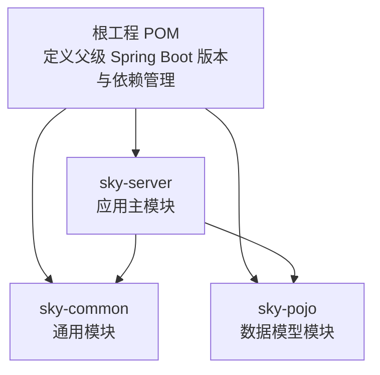
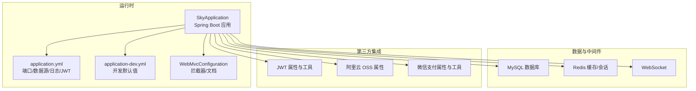

# 环境要求

<cite>
**本文引用的文件**
- [根工程 POM](file://pom.xml)
- [服务模块 POM](file://sky-server/pom.xml)
- [公共模块 POM](file://sky-common/pom.xml)
- [POJO 模块 POM](file://sky-pojo/pom.xml)
- [应用主类](file://sky-server/src/main/java/com/sky/SkyApplication.java)
- [应用配置（生产）](file://sky-server/src/main/resources/application.yml)
- [应用配置（开发）](file://sky-server/src/main/resources/application-dev.yml)
- [Web 配置与文档](file://sky-server/src/main/java/com/sky/config/WebMvcConfiguration.java)
- [JWT 属性配置](file://sky-common/src/main/java/com/sky/properties/JwtProperties.java)
- [阿里云 OSS 属性配置](file://sky-common/src/main/java/com/sky/properties/AliOssProperties.java)
- [微信支付属性配置](file://sky-common/src/main/java/com/sky/properties/WeChatProperties.java)
- [微信支付工具类](file://sky-common/src/main/java/com/sky/utils/WeChatPayUtil.java)
- [Git 忽略规则](file://.gitignore)
</cite>

## 目录
1. [简介](#简介)
2. [项目结构](#项目结构)
3. [核心组件](#核心组件)
4. [架构概览](#架构概览)
5. [详细组件分析](#详细组件分析)
6. [依赖分析](#依赖分析)
7. [性能考虑](#性能考虑)
8. [故障排查指南](#故障排查指南)
9. [结论](#结论)
10. [附录](#附录)

## 简介
本文件面向“苍穹外卖点餐系统”的部署与运维团队，提供从硬件资源、软件环境、网络与防火墙到环境检查清单与兼容性测试方法的完整环境要求说明，并对比开发与生产环境的差异，帮助快速完成环境准备与上线验证。

## 项目结构
本项目采用多模块 Maven 结构，核心模块如下：
- sky-common：通用工具、配置属性与第三方集成（如 JWT、阿里云 OSS、微信支付）
- sky-pojo：数据模型与 VO/DTO 定义
- sky-server：Spring Boot 应用主模块，负责业务接口、数据库连接、缓存与 WebSocket 等

图表来源
- [根工程 POM:1-128](file://pom.xml#L1-L128)
- [服务模块 POM:1-130](file://sky-server/pom.xml#L1-L130)
- [公共模块 POM:1-53](file://sky-common/pom.xml#L1-L53)
- [POJO 模块 POM:1-27](file://sky-pojo/pom.xml#L1-L27)

章节来源
- [根工程 POM:1-128](file://pom.xml#L1-L128)
- [服务模块 POM:1-130](file://sky-server/pom.xml#L1-L130)
- [公共模块 POM:1-53](file://sky-common/pom.xml#L1-L53)
- [POJO 模块 POM:1-27](file://sky-pojo/pom.xml#L1-L27)

## 核心组件
- 应用入口与启动
  - 主类位于 [应用主类:1-17](file://sky-server/src/main/java/com/sky/SkyApplication.java#L1-L17)，使用 Spring Boot 启动，开启注解式事务管理。
- 配置与环境
  - 默认端口与激活配置见 [应用配置（生产）:1-40](file://sky-server/src/main/resources/application.yml#L1-L40)；开发环境默认值见 [应用配置（开发）:1-9](file://sky-server/src/main/resources/application-dev.yml#L1-L9)。
- 数据访问与缓存
  - MyBatis Starter、Druid 连接池、Redis 与缓存、WebSocket 在服务模块中声明。
- 第三方集成
  - JWT、阿里云 OSS、微信支付相关属性与工具在公共模块中定义与使用。

章节来源
- [应用主类:1-17](file://sky-server/src/main/java/com/sky/SkyApplication.java#L1-L17)
- [应用配置（生产）:1-40](file://sky-server/src/main/resources/application.yml#L1-L40)
- [应用配置（开发）:1-9](file://sky-server/src/main/resources/application-dev.yml#L1-L9)
- [服务模块 POM:1-130](file://sky-server/pom.xml#L1-L130)

## 架构概览
系统运行时的关键技术栈与交互如下：

图表来源
- [应用主类:1-17](file://sky-server/src/main/java/com/sky/SkyApplication.java#L1-L17)
- [应用配置（生产）:1-40](file://sky-server/src/main/resources/application.yml#L1-L40)
- [应用配置（开发）:1-9](file://sky-server/src/main/resources/application-dev.yml#L1-L9)
- [Web 配置与文档:35-68](file://sky-server/src/main/java/com/sky/config/WebMvcConfiguration.java#L35-L68)
- [JWT 属性配置:1-26](file://sky-common/src/main/java/com/sky/properties/JwtProperties.java#L1-L26)
- [阿里云 OSS 属性配置:1-17](file://sky-common/src/main/java/com/sky/properties/AliOssProperties.java#L1-L17)
- [微信支付属性配置:1-23](file://sky-common/src/main/java/com/sky/properties/WeChatProperties.java#L1-L23)
- [微信支付工具类:37-134](file://sky-common/src/main/java/com/sky/utils/WeChatPayUtil.java#L37-L134)

## 详细组件分析

### 硬件资源需求（生产环境）
- CPU
  - 低负载：2 核心以上
  - 中负载：4 核心以上
  - 高并发场景：建议 8 核心或更高
- 内存
  - 低负载：4 GB 以上
  - 中负载：8 GB 以上
  - 高并发场景：建议 16 GB 或更高
- 磁盘空间
  - 应用包体与日志：建议 2–5 GB 可用空间
  - MySQL 数据库：按业务数据量估算，建议预留至少 2–3 倍增长空间
  - Redis 缓存：根据键值数量与过期策略，建议至少 1–2 GB 可用空间
- 网络
  - 出站访问：需可访问 MySQL、Redis、阿里云 OSS、微信支付 API
  - 入站端口：对外提供服务需开放应用端口（默认 8080）

说明
- 上述为通用建议，实际应结合压测结果与监控指标进行容量规划。

### 软件环境要求
- Java 运行时
  - Spring Boot 版本：2.7.3（由父 POM 统一管理）
  - 推荐 JDK 版本：JDK 8 或 11（与 Spring Boot 2.7.x 兼容）
- 数据库
  - MySQL Connector：在服务模块中声明，用于连接 MySQL
  - 建议 MySQL 版本：MySQL 5.7+ 或 8.0+
- 操作系统
  - Linux（推荐 CentOS/Ubuntu）、Windows（开发/测试可用）
- 中间件
  - Redis：用于缓存与会话
  - MySQL：持久化存储
- 第三方 SDK
  - 阿里云 OSS SDK：用于对象存储
  - 微信支付 SDK：用于支付与退款接口

章节来源
- [根工程 POM:6-10](file://pom.xml#L6-L10)
- [服务模块 POM:44-47](file://sky-server/pom.xml#L44-L47)
- [应用配置（生产）:9-14](file://sky-server/src/main/resources/application.yml#L9-L14)

### 网络环境与防火墙配置
- 应用端口
  - 默认监听端口：8080（可在配置中调整）
- 出站访问
  - MySQL：3306
  - Redis：6379
  - 阿里云 OSS：443
  - 微信支付：443（下单、退款等接口域名）
- 入站访问
  - 对外提供服务需放通 8080 端口
  - 如使用反向代理（Nginx/Tengine），需确保转发路径与健康检查可达

章节来源
- [应用配置（生产）:1-2](file://sky-server/src/main/resources/application.yml#L1-L2)
- [应用配置（生产）:9-14](file://sky-server/src/main/resources/application.yml#L9-L14)
- [微信支付工具类:37-42](file://sky-common/src/main/java/com/sky/utils/WeChatPayUtil.java#L37-L42)

### 开发环境与生产环境差异
- 环境激活
  - 生产配置默认激活 dev 环境（可通过 profiles 切换）
- 数据源
  - 开发默认值指向本地 MySQL（localhost:3306），生产环境应通过环境变量注入真实地址与凭据
- 日志级别
  - 生产环境建议提升至 info 或 warn，避免过多 debug 输出
- 文档与拦截器
  - 开发环境提供 Knife4j 文档与拦截器，生产环境可按需关闭或限制访问

章节来源
- [应用配置（生产）:4-6](file://sky-server/src/main/resources/application.yml#L4-L6)
- [应用配置（开发）:1-9](file://sky-server/src/main/resources/application-dev.yml#L1-L9)
- [Web 配置与文档:35-68](file://sky-server/src/main/java/com/sky/config/WebMvcConfiguration.java#L35-L68)

### 环境检查清单
- 基础设施
  - CPU/内存/磁盘满足上述建议
  - 系统时间同步（Asia/Shanghai）
- 运行时
  - JDK 版本符合要求
  - 应用端口未被占用
- 数据库
  - MySQL 可连通，账号具备读写权限
  - 字符集与时区设置正确（serverTimezone=Asia/Shanghai）
- 中间件
  - Redis 可连通，具备读写能力
- 第三方集成
  - 阿里云 OSS：endpoint、AK、bucket 可用
  - 微信支付：商户号、证书、回调地址配置正确
- 网络
  - 出站 443 可访问 OSS 与微信支付域名
  - 入站 8080 放通
- 配置
  - application.yml 中的数据库、Redis、JWT、OSS、微信支付参数已按生产环境替换
  - 日志级别与敏感信息脱敏

章节来源
- [应用配置（生产）:9-14](file://sky-server/src/main/resources/application.yml#L9-L14)
- [JWT 属性配置:1-26](file://sky-common/src/main/java/com/sky/properties/JwtProperties.java#L1-L26)
- [阿里云 OSS 属性配置:1-17](file://sky-common/src/main/java/com/sky/properties/AliOssProperties.java#L1-L17)
- [微信支付属性配置:1-23](file://sky-common/src/main/java/com/sky/properties/WeChatProperties.java#L1-L23)

### 兼容性测试方法
- 基础连通性
  - 使用 telnet 或 nc 测试 3306（MySQL）、6379（Redis）、443（OSS/微信）
- 应用启动自检
  - 启动后访问健康检查端点（若实现），或直接访问接口验证
- 功能回归
  - 登录、下单、支付（沙箱/测试）、退款、上传图片（OSS）、消息推送（WebSocket）
- 性能与稳定性
  - 压测工具模拟并发请求，观察响应时间、错误率与资源占用
- 配置覆盖验证
  - 通过环境变量覆盖 application.yml 中的占位符，验证数据库连接与第三方参数生效

章节来源
- [应用配置（生产）:9-14](file://sky-server/src/main/resources/application.yml#L9-L14)
- [微信支付工具类:37-134](file://sky-common/src/main/java/com/sky/utils/WeChatPayUtil.java#L37-L134)

## 依赖分析
系统运行时的核心依赖关系如下：

```mermaid
graph TB
ServerPom["服务模块 POM"] --> BootWeb["spring-boot-starter-web"]
ServerPom --> BootRedis["spring-boot-starter-data-redis"]
ServerPom --> BootCache["spring-boot-starter-cache"]
ServerPom --> BootWS["spring-boot-starter-websocket"]
ServerPom --> MyBatis["mybatis-spring-boot-starter"]
ServerPom --> Druid["druid-spring-boot-starter"]
ServerPom --> MySQLConn["mysql-connector-java"]
ServerPom --> Knife4j["knife4j-spring-boot-starter"]
ServerPom --> POJO["sky-pojo"]
ServerPom --> Common["sky-common"]
CommonPom["公共模块 POM"] --> Lombok["lombok"]
CommonPom --> FastJSON["fastjson"]
CommonPom --> JWT["jjwt"]
CommonPom --> JAXB["jaxb-api"]
CommonPom --> AliOSS["aliyun-sdk-oss"]
CommonPom --> WeChatPay["wechatpay-apache-httpclient"]
```

图表来源
- [服务模块 POM:1-130](file://sky-server/pom.xml#L1-L130)
- [公共模块 POM:1-53](file://sky-common/pom.xml#L1-L53)
- [POJO 模块 POM:1-27](file://sky-pojo/pom.xml#L1-L27)

章节来源
- [服务模块 POM:1-130](file://sky-server/pom.xml#L1-L130)
- [公共模块 POM:1-53](file://sky-common/pom.xml#L1-L53)
- [POJO 模块 POM:1-27](file://sky-pojo/pom.xml#L1-L27)

## 性能考虑
- JVM 参数建议
  - 堆大小：根据内存与 GC 行为调整，优先保证停顿可控
  - GC 策略：G1GC 或 ZGC（取决于 JDK 版本）
- 连接池与数据库
  - Druid 连接池参数需结合并发与超时策略优化
  - MySQL 连接数与缓冲池大小按业务峰值配置
- 缓存策略
  - Redis 缓存热点数据，合理设置过期时间与淘汰策略
- 并发与限流
  - 对外接口建议增加限流与熔断，防止雪崩
- 日志与监控
  - 生产环境降低日志级别，避免 IO 抖动；接入链路追踪与指标采集

## 故障排查指南
- 启动失败
  - 检查端口是否被占用（默认 8080）
  - 查看日志输出，确认数据库连接参数是否正确
- 数据库连接异常
  - 校验 JDBC URL、用户名、密码与时区参数
  - 确认 MySQL 服务可达且账号具备权限
- Redis 连接异常
  - 校验主机、端口与认证信息
- 第三方集成异常
  - 阿里云 OSS：校验 endpoint、AK、bucket
  - 微信支付：校验证书路径、商户号、回调地址
- 网络访问异常
  - 出站 443 是否被阻断；入站 8080 是否放通
- 配置覆盖问题
  - 确认环境变量已正确注入 application.yml 的占位符

章节来源
- [应用配置（生产）:9-14](file://sky-server/src/main/resources/application.yml#L9-L14)
- [应用配置（开发）:1-9](file://sky-server/src/main/resources/application-dev.yml#L1-L9)
- [微信支付工具类:37-134](file://sky-common/src/main/java/com/sky/utils/WeChatPayUtil.java#L37-L134)

## 结论
本环境要求文档基于仓库中的配置与依赖，给出了生产环境的硬件与软件建议、网络与防火墙要求、开发与生产差异对比以及检查清单与兼容性测试方法。建议在部署前完成全面的连通性与配置验证，并结合压测结果持续优化资源与参数。

## 附录
- 关键配置位置索引
  - 应用端口与配置激活：[应用配置（生产）:1-6](file://sky-server/src/main/resources/application.yml#L1-L6)
  - 数据源占位符与 JDBC URL：[应用配置（生产）:9-14](file://sky-server/src/main/resources/application.yml#L9-L14)
  - 开发默认数据源：[应用配置（开发）:1-9](file://sky-server/src/main/resources/application-dev.yml#L1-L9)
  - JWT 参数：[JWT 属性配置:1-26](file://sky-common/src/main/java/com/sky/properties/JwtProperties.java#L1-L26)
  - OSS 参数：[阿里云 OSS 属性配置:1-17](file://sky-common/src/main/java/com/sky/properties/AliOssProperties.java#L1-L17)
  - 微信支付参数：[微信支付属性配置:1-23](file://sky-common/src/main/java/com/sky/properties/WeChatProperties.java#L1-L23)
  - 微信支付调用示例常量：[微信支付工具类:37-42](file://sky-common/src/main/java/com/sky/utils/WeChatPayUtil.java#L37-L42)
- 构建与打包
  - 使用 Maven 构建，产物包含可执行 jar（Spring Boot 插件）
  - Git 忽略规则：[Git 忽略规则:1-6](file://.gitignore#L1-L6)