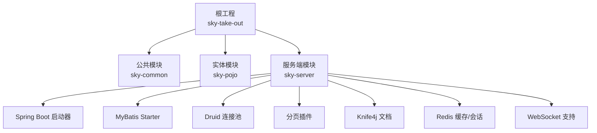
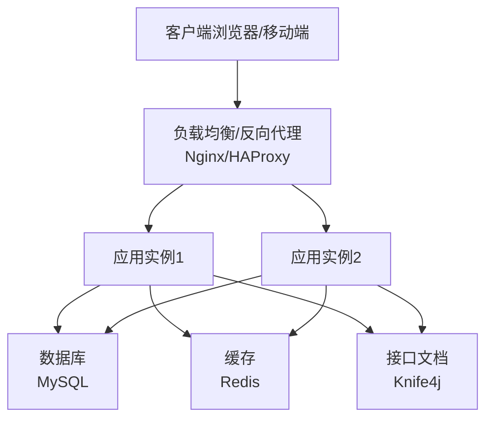
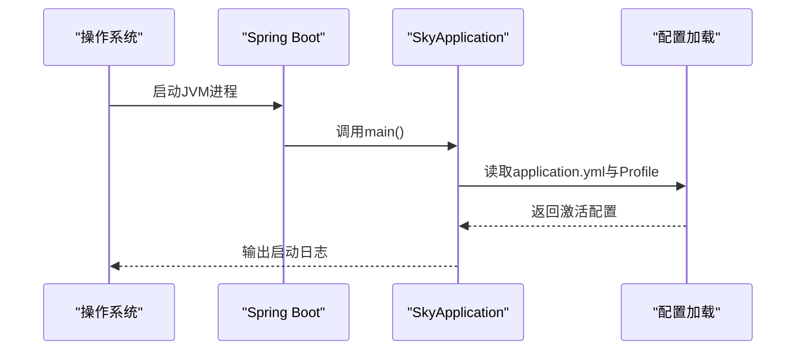
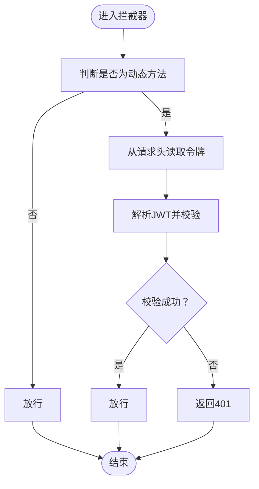
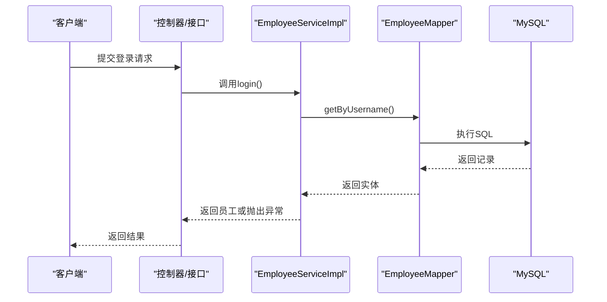
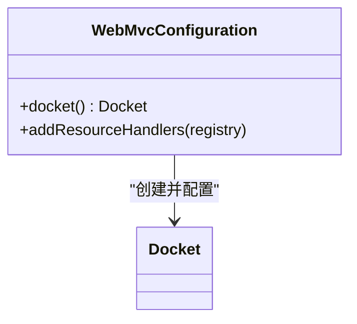
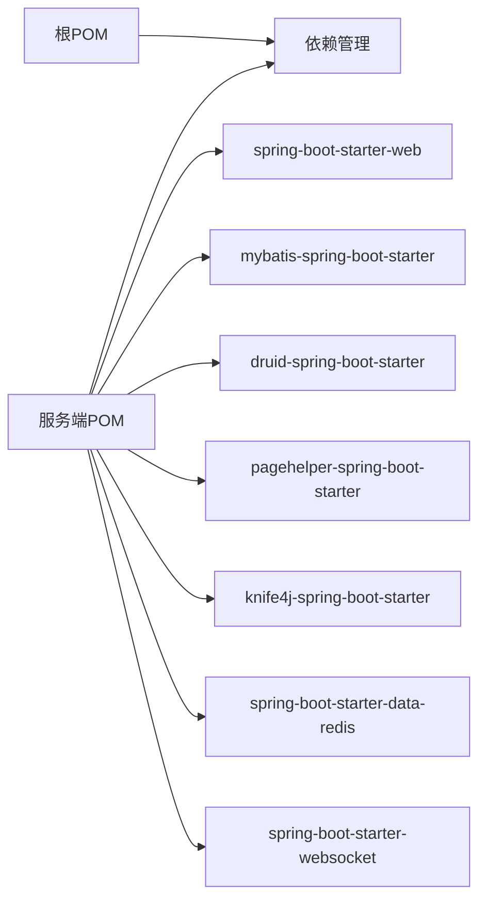

# 部署指南

<cite>
**本文引用的文件**
- [pom.xml](file://pom.xml)
- [sky-server/pom.xml](file://sky-server/pom.xml)
- [application.yml](file://sky-server/src/main/resources/application.yml)
- [application-dev.yml](file://sky-server/src/main/resources/application-dev.yml)
- [SkyApplication.java](file://sky-server/src/main/java/com/sky/SkyApplication.java)
- [WebMvcConfiguration.java](file://sky-server/src/main/java/com/sky/config/WebMvcConfiguration.java)
- [JwtTokenAdminInterceptor.java](file://sky-server/src/main/java/com/sky/interceptor/JwtTokenAdminInterceptor.java)
- [EmployeeMapper.java](file://sky-server/src/main/java/com/sky/mapper/EmployeeMapper.java)
- [EmployeeServiceImpl.java](file://sky-server/src/main/java/com/sky/service/impl/EmployeeServiceImpl.java)
- [JwtClaimsConstant.java](file://sky-common/src/main/java/com/sky/constant/JwtClaimsConstant.java)
- [JwtProperties.java](file://sky-common/src/main/java/com/sky/properties/JwtProperties.java)
- [JwtUtil.java](file://sky-common/src/main/java/com/sky/utils/JwtUtil.java)
</cite>

## 目录
1. [简介](#简介)
2. [项目结构](#项目结构)
3. [核心组件](#核心组件)
4. [架构总览](#架构总览)
5. [详细组件分析](#详细组件分析)
6. [依赖分析](#依赖分析)
7. [性能考虑](#性能考虑)
8. [故障排查指南](#故障排查指南)
9. [结论](#结论)
10. [附录](#附录)

## 简介
本指南面向生产环境部署“苍穹外卖点餐系统”，目标是帮助运维与开发团队完成从硬件准备、操作系统与中间件配置，到数据库初始化、应用打包、服务器配置、容器化与Kubernetes编排、负载均衡与SSL证书、监控告警、部署验证与故障恢复的全流程落地。  
本项目基于Spring Boot多模块工程，后端采用MySQL与Redis，使用JWT进行鉴权，集成Knife4j用于接口文档。

## 项目结构
- 顶层Maven聚合工程，包含公共模块、POJO模块与服务端模块。
- 服务端模块依赖Spring Web、MyBatis、Druid连接池、分页插件、Knife4j、Redis、WebSocket等。
- 应用启动入口位于服务端模块，配置文件通过Spring Profile加载，支持dev环境默认配置。

**图表来源**
- [pom.xml:15-19](file://pom.xml#L15-L19)
- [sky-server/pom.xml:26-102](file://sky-server/pom.xml#L26-L102)

**章节来源**
- [pom.xml:1-128](file://pom.xml#L1-L128)
- [sky-server/pom.xml:1-130](file://sky-server/pom.xml#L1-L130)

## 核心组件
- 应用启动类：负责引导Spring Boot应用启动与日志输出。
- Web配置：注册拦截器、Swagger接口文档与静态资源映射。
- JWT鉴权：拦截器读取请求头令牌，校验失败返回401。
- 数据访问：基于MyBatis Mapper接口，按用户名查询员工信息。
- 登录服务：实现员工登录逻辑，包含异常处理与状态检查。
- JWT工具与属性：封装JWT生成与解析，以及密钥、过期时间、令牌名等配置。

**章节来源**
- [SkyApplication.java:1-17](file://sky-server/src/main/java/com/sky/SkyApplication.java#L1-L17)
- [WebMvcConfiguration.java:1-69](file://sky-server/src/main/java/com/sky/config/WebMvcConfiguration.java#L1-L69)
- [JwtTokenAdminInterceptor.java:1-59](file://sky-server/src/main/java/com/sky/interceptor/JwtTokenAdminInterceptor.java#L1-L59)
- [EmployeeMapper.java:1-19](file://sky-server/src/main/java/com/sky/mapper/EmployeeMapper.java#L1-L19)
- [EmployeeServiceImpl.java:1-58](file://sky-server/src/main/java/com/sky/service/impl/EmployeeServiceImpl.java#L1-L58)
- [JwtClaimsConstant.java:1-12](file://sky-common/src/main/java/com/sky/constant/JwtClaimsConstant.java#L1-L12)
- [JwtProperties.java:1-27](file://sky-common/src/main/java/com/sky/properties/JwtProperties.java#L1-L27)
- [JwtUtil.java:1-59](file://sky-common/src/main/java/com/sky/utils/JwtUtil.java#L1-L59)

## 架构总览
下图展示生产环境典型拓扑：反向代理/Nginx作为入口，后端多实例通过负载均衡分发，应用访问MySQL与Redis，对外提供REST与WebSocket能力。

[此图为概念性架构示意，无需图表来源]

## 详细组件分析

### 组件一：应用启动与配置加载
- 启动类负责应用启动与日志输出。
- 配置文件通过Profile切换环境，默认dev；生产环境需设置实际数据源与Redis地址。
- 日志级别已配置，便于生产问题定位。

**图表来源**
- [SkyApplication.java:12-14](file://sky-server/src/main/java/com/sky/SkyApplication.java#L12-L14)
- [application.yml:1-40](file://sky-server/src/main/resources/application.yml#L1-L40)
- [application-dev.yml:1-9](file://sky-server/src/main/resources/application-dev.yml#L1-L9)

**章节来源**
- [SkyApplication.java:1-17](file://sky-server/src/main/java/com/sky/SkyApplication.java#L1-L17)
- [application.yml:1-40](file://sky-server/src/main/resources/application.yml#L1-L40)
- [application-dev.yml:1-9](file://sky-server/src/main/resources/application-dev.yml#L1-L9)

### 组件二：JWT鉴权拦截流程
- 拦截器从请求头读取令牌名，解析JWT，提取员工ID，失败返回401。
- 该流程贯穿管理端接口，除登录接口外均受保护。

**图表来源**
- [JwtTokenAdminInterceptor.java:34-56](file://sky-server/src/main/java/com/sky/interceptor/JwtTokenAdminInterceptor.java#L34-L56)
- [JwtProperties.java:15-17](file://sky-common/src/main/java/com/sky/properties/JwtProperties.java#L15-L17)
- [JwtUtil.java:48-56](file://sky-common/src/main/java/com/sky/utils/JwtUtil.java#L48-L56)
- [JwtClaimsConstant.java:5](file://sky-common/src/main/java/com/sky/constant/JwtClaimsConstant.java#L5)

**章节来源**
- [JwtTokenAdminInterceptor.java:1-59](file://sky-server/src/main/java/com/sky/interceptor/JwtTokenAdminInterceptor.java#L1-L59)
- [JwtProperties.java:1-27](file://sky-common/src/main/java/com/sky/properties/JwtProperties.java#L1-L27)
- [JwtUtil.java:1-59](file://sky-common/src/main/java/com/sky/utils/JwtUtil.java#L1-L59)
- [JwtClaimsConstant.java:1-12](file://sky-common/src/main/java/com/sky/constant/JwtClaimsConstant.java#L1-L12)

### 组件三：登录服务与数据访问
- 登录服务根据用户名查询员工，比对密码与状态，异常时抛出业务异常。
- Mapper通过注解查询员工信息，配合MyBatis自动映射。

**图表来源**
- [EmployeeServiceImpl.java:28-55](file://sky-server/src/main/java/com/sky/service/impl/EmployeeServiceImpl.java#L28-L55)
- [EmployeeMapper.java:15-16](file://sky-server/src/main/java/com/sky/mapper/EmployeeMapper.java#L15-L16)

**章节来源**
- [EmployeeServiceImpl.java:1-58](file://sky-server/src/main/java/com/sky/service/impl/EmployeeServiceImpl.java#L1-L58)
- [EmployeeMapper.java:1-19](file://sky-server/src/main/java/com/sky/mapper/EmployeeMapper.java#L1-L19)

### 组件四：Knife4j接口文档
- Web配置注册Knife4j Docket，扫描指定包路径，提供在线接口文档与测试能力。
- 静态资源映射支持/doc.html与webjars访问。

**图表来源**
- [WebMvcConfiguration.java:44-67](file://sky-server/src/main/java/com/sky/config/WebMvcConfiguration.java#L44-L67)

**章节来源**
- [WebMvcConfiguration.java:1-69](file://sky-server/src/main/java/com/sky/config/WebMvcConfiguration.java#L1-L69)

## 依赖分析
- 顶层POM统一管理版本与依赖范围，服务端模块引入Web、MyBatis、Druid、分页、Knife4j、Redis、WebSocket等。
- 配置文件通过占位符引用外部变量，便于在不同环境注入真实值。

**图表来源**
- [pom.xml:34-126](file://pom.xml#L34-L126)
- [sky-server/pom.xml:12-118](file://sky-server/pom.xml#L12-L118)

**章节来源**
- [pom.xml:1-128](file://pom.xml#L1-L128)
- [sky-server/pom.xml:1-130](file://sky-server/pom.xml#L1-L130)

## 性能考虑
- 连接池与SQL优化：启用Druid连接池与日志，结合慢查询分析与索引优化。
- 分页与缓存：使用分页插件控制结果集大小；Redis用于热点数据与会话缓存，降低数据库压力。
- 并发与线程：合理设置JVM堆大小与GC参数，避免频繁Full GC。
- 接口文档：生产环境建议关闭或限制访问Knife4j，减少不必要的资源消耗。

[本节为通用指导，无需章节来源]

## 故障排查指南
- 启动失败
  - 检查配置文件Profile与数据源变量是否正确注入。
  - 查看应用日志输出与端口占用情况。
- 登录异常
  - 核对用户名是否存在、密码是否一致、账户状态是否正常。
  - 关注登录服务抛出的具体异常类型。
- JWT鉴权失败
  - 确认请求头中携带的令牌名与密钥配置一致。
  - 校验令牌是否过期或被篡改。
- 数据库连接问题
  - 检查MySQL连通性、账号权限与字符集设置。
- 接口文档不可用
  - 确认Knife4j静态资源映射与访问路径。

**章节来源**
- [application.yml:1-40](file://sky-server/src/main/resources/application.yml#L1-L40)
- [application-dev.yml:1-9](file://sky-server/src/main/resources/application-dev.yml#L1-L9)
- [EmployeeServiceImpl.java:36-51](file://sky-server/src/main/java/com/sky/service/impl/EmployeeServiceImpl.java#L36-L51)
- [JwtTokenAdminInterceptor.java:42-56](file://sky-server/src/main/java/com/sky/interceptor/JwtTokenAdminInterceptor.java#L42-L56)

## 结论
本部署指南提供了从环境准备到生产上线的完整路径。建议在生产环境中严格区分配置、强化安全（JWT密钥、SSL、白名单）、完善监控与告警，并制定标准化的发布与回滚流程，以确保系统稳定运行。

[本节为总结性内容，无需章节来源]

## 附录

### A. 生产环境部署清单
- 硬件与操作系统
  - CPU：建议≥2核；内存：建议≥4GB；磁盘：建议SSD，容量满足日志与备份需求。
  - 操作系统：Linux（如CentOS 7+/Ubuntu 18+）。
- 中间件
  - MySQL：独立实例或高可用集群，字符集utf8mb4，推荐主从或Galera/Group Replication。
  - Redis：哨兵或Cluster模式，持久化策略按业务选择RDB/AOF。
- 应用
  - JDK：建议OpenJDK 8/11/17（与Spring Boot版本兼容）。
  - 容器化：Docker镜像建议基于Alpine或Debian Slim，精简体积。
- 网络与安全
  - 反向代理：Nginx/HAProxy，开启Gzip、超时与限流。
  - SSL：申请并部署证书，强制HTTPS。
  - 防火墙：仅开放必要端口（80/443/8080/3306/6379）。
- 监控与日志
  - 指标：CPU/内存/磁盘/网络/应用QPS/错误率/数据库连接数。
  - 日志：集中采集（ELK/Fluentd），按天切割与归档。
  - 告警：阈值告警与异常检测（如401/5xx占比、慢查询）。

[本节为通用指导，无需章节来源]

### B. 数据库初始化步骤
- 创建数据库与账号
  - 新建数据库与用户，授权读写权限。
- 初始化表结构
  - 导入DDL脚本（如存在），或由ORM框架自动建表（需确认迁移策略）。
- 校验连接
  - 在应用配置中填写主机、端口、数据库名、用户名、密码，验证连通性。

[本节为通用指导，无需章节来源]

### C. 应用打包与服务器配置
- 打包
  - 使用Maven构建，生成可执行JAR（Spring Boot Maven Plugin已配置）。
- 部署
  - 将JAR与配置文件部署至目标服务器，设置JVM参数与系统环境变量。
  - 使用systemd或PM2等进程管理器守护进程。
- 端口与防火墙
  - 默认端口8080，确保防火墙放行。

**章节来源**
- [sky-server/pom.xml:120-127](file://sky-server/pom.xml#L120-L127)
- [application.yml:1-40](file://sky-server/src/main/resources/application.yml#L1-L40)

### D. Docker容器化部署方案
- 构建镜像
  - 基于官方JRE镜像，复制JAR与配置，暴露端口8080。
- 运行容器
  - 挂载配置目录，映射端口，连接外部MySQL与Redis。
  - 使用环境变量注入数据库与Redis地址、账号密码等敏感信息。
- 健康检查
  - 配置HTTP健康检查，探测接口存活。

[本节为通用指导，无需章节来源]

### E. Kubernetes集群部署策略
- 资源对象
  - Deployment：副本数、滚动更新策略、探针。
  - Service：ClusterIP/NodePort/LB暴露服务。
  - ConfigMap：存放非敏感配置（如日志级别、Mapper路径）。
  - Secret：存放数据库与Redis密码、JWT密钥等敏感信息。
  - Ingress：统一入口，配置TLS证书与路由规则。
- 存储
  - 数据库与Redis使用托管服务或StatefulSet持久化卷。
- 策略
  - HPA：按CPU/自定义指标扩缩容。
  - PodDisruptionBudget：保证最小可用副本。
  - InitContainer：数据库初始化脚本或等待依赖就绪。

[本节为通用指导，无需章节来源]

### F. 负载均衡与SSL证书
- 负载均衡
  - Nginx/HAProxy：轮询/权重/健康检查；开启会话亲和（如需）。
- SSL
  - 申请证书（Let’s Encrypt/商业CA），配置强密码套件与协议版本。
  - 强制跳转HTTPS与HSTS。

[本节为通用指导，无需章节来源]

### G. 监控告警设置
- 指标
  - JVM：堆使用率、GC次数与耗时。
  - 应用：请求耗时、错误率、线程池状态。
  - 数据库：连接数、慢查询、锁等待。
- 告警
  - 阈值触发与趋势异常检测，分级告警与通知渠道（邮件/IM/电话）。

[本节为通用指导，无需章节来源]

### H. 部署验证清单
- 功能验证
  - 登录接口、核心业务接口调用成功。
- 性能验证
  - 压测通过，响应时间与吞吐达标。
- 安全验证
  - HTTPS生效，JWT校验通过，接口文档访问受限。
- 运维验证
  - 日志采集、指标上报、告警通道畅通。

[本节为通用指导，无需章节来源]

### I. 故障恢复方案
- 快速回滚
  - 保留上一版本镜像/包，一键回滚。
- 热修复
  - 临时补丁或配置开关，快速止损。
- 数据恢复
  - 基于备份的增量恢复，演练恢复流程。
- 应急预案
  - 多机房容灾、熔断降级与限流策略。

[本节为通用指导，无需章节来源]