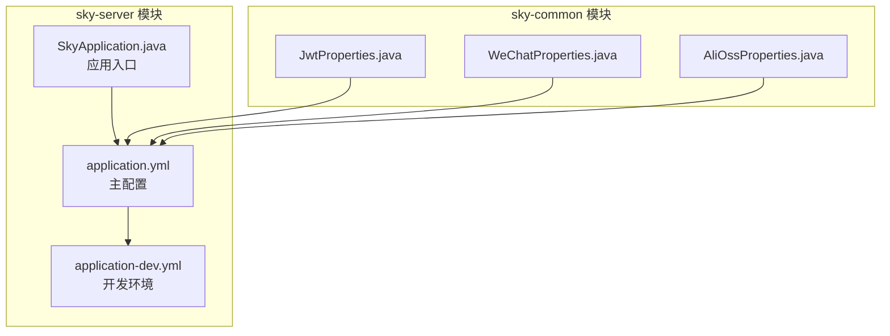
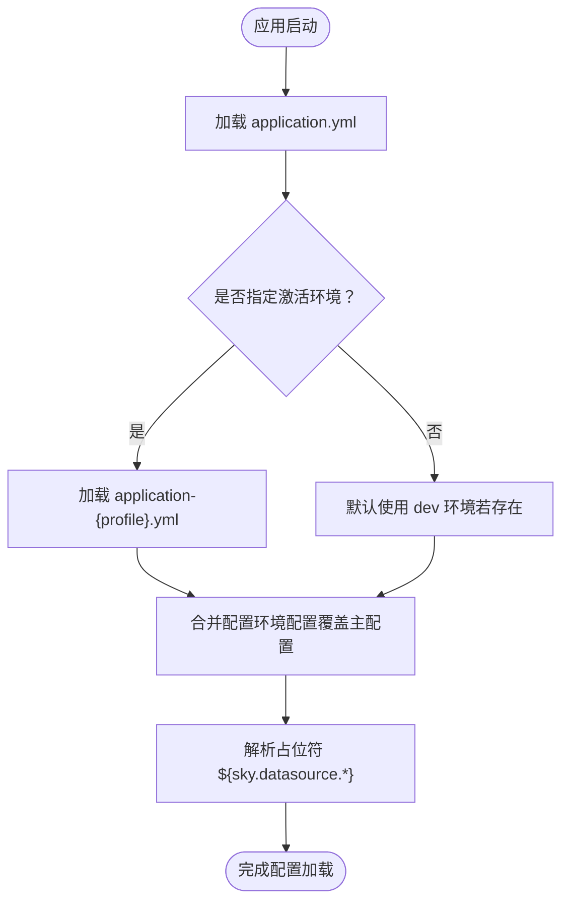
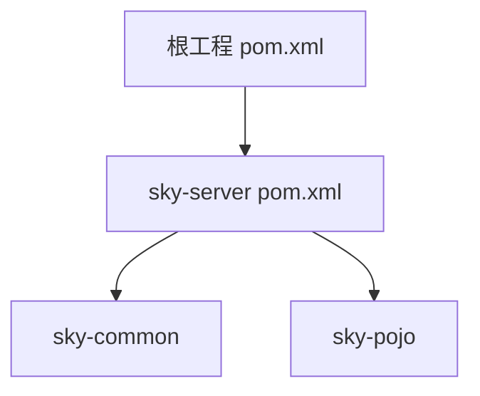

# 多环境配置

<cite>
**本文引用的文件**
- [application.yml](file://sky-server/src/main/resources/application.yml)
- [application-dev.yml](file://sky-server/src/main/resources/application-dev.yml)
- [SkyApplication.java](file://sky-server/src/main/java/com/sky/SkyApplication.java)
- [pom.xml（sky-server）](file://sky-server/pom.xml)
- [pom.xml（根工程）](file://pom.xml)
- [JwtProperties.java](file://sky-common/src/main/java/com/sky/properties/JwtProperties.java)
- [WeChatProperties.java](file://sky-common/src/main/java/com/sky/properties/WeChatProperties.java)
- [AliOssProperties.java](file://sky-common/src/main/java/com/sky/properties/AliOssProperties.java)
</cite>

## 目录
1. [简介](#简介)
2. [项目结构](#项目结构)
3. [核心组件](#核心组件)
4. [架构总览](#架构总览)
5. [详细组件分析](#详细组件分析)
6. [依赖分析](#依赖分析)
7. [性能考虑](#性能考虑)
8. [故障排查指南](#故障排查指南)
9. [结论](#结论)
10. [附录](#附录)

## 简介
本文件面向“苍穹外卖点餐系统”的多环境配置，围绕开发（dev）、测试（test）、生产（prod）三类环境，系统性说明以下主题：
- application.yml 中的环境激活机制与 profiles.active 的作用
- 如何通过环境变量覆盖数据库连接参数（如 sky.datasource.host、sky.datasource.port 等）
- 不同环境下的配置最佳实践与切换方法
- 配置文件优先级与覆盖规则

当前仓库中已提供开发环境配置文件 application-dev.yml；测试与生产环境可按相同命名规范扩展（例如 application-test.yml、application-prod.yml），并在 application.yml 中通过 profiles.active 指定。

## 项目结构
- sky-server 模块包含 Spring Boot 主配置与各环境配置文件，以及应用入口类 SkyApplication。
- sky-common 模块包含若干基于 @ConfigurationProperties 的属性模型类，用于读取 sky.* 命名空间下的配置项。
- 根工程 pom.xml 统一管理版本与依赖，sky-server 的 pom.xml 引入 web、mybatis、druid、knife4j 等常用依赖。

**图表来源**
- [application.yml:1-40](file://sky-server/src/main/resources/application.yml#L1-L40)
- [application-dev.yml:1-9](file://sky-server/src/main/resources/application-dev.yml#L1-L9)
- [SkyApplication.java:1-17](file://sky-server/src/main/java/com/sky/SkyApplication.java#L1-L17)
- [JwtProperties.java:1-27](file://sky-common/src/main/java/com/sky/properties/JwtProperties.java#L1-L27)
- [WeChatProperties.java:1-24](file://sky-common/src/main/java/com/sky/properties/WeChatProperties.java#L1-L24)
- [AliOssProperties.java:1-18](file://sky-common/src/main/java/com/sky/properties/AliOssProperties.java#L1-L18)

**章节来源**
- [application.yml:1-40](file://sky-server/src/main/resources/application.yml#L1-L40)
- [application-dev.yml:1-9](file://sky-server/src/main/resources/application-dev.yml#L1-L9)
- [SkyApplication.java:1-17](file://sky-server/src/main/java/com/sky/SkyApplication.java#L1-L17)
- [pom.xml（sky-server）:1-130](file://sky-server/pom.xml#L1-L130)
- [pom.xml（根工程）:1-128](file://pom.xml#L1-L128)

## 核心组件
- 环境激活与主配置：application.yml 使用 spring.profiles.active 指定当前激活的环境配置文件（不含前缀 application- 与后缀 .yml）。当前默认激活 dev。
- 数据源占位符：application.yml 中的数据库驱动、URL、用户名、密码均使用占位符 ${sky.datasource.*}，这些值由对应环境配置文件提供。
- 开发环境配置：application-dev.yml 提供了 sky.datasource.* 的具体取值，用于本地开发。
- 应用入口：SkyApplication.java 启动 Spring Boot 应用，加载上述配置。

**章节来源**
- [application.yml:4-14](file://sky-server/src/main/resources/application.yml#L4-L14)
- [application-dev.yml:1-9](file://sky-server/src/main/resources/application-dev.yml#L1-L9)
- [SkyApplication.java:11-16](file://sky-server/src/main/java/com/sky/SkyApplication.java#L11-L16)

## 架构总览
下图展示了多环境配置在启动时的加载顺序与覆盖关系（概念示意）：

[此图为概念流程图，不直接映射到具体源码文件，故不附加图表来源]

## 详细组件分析

### application.yml（主配置）
- 环境激活：spring.profiles.active 指定当前激活的 profile 名称（不含 application- 前缀与 .yml 后缀）。
- 数据源占位符：spring.datasource.druid.* 使用 ${sky.datasource.*} 占位符，实际值由环境配置文件提供。
- 日志级别：对 mapper/service/controller 包设置了不同日志级别，便于开发调试。
- 其他命名空间：sky.jwt.* 等配置项由 sky-common 中的属性类读取。

**章节来源**
- [application.yml:1-40](file://sky-server/src/main/resources/application.yml#L1-L40)

### application-dev.yml（开发环境）
- 提供 sky.datasource.* 的具体取值，用于本地 MySQL 连接。
- 可按需在此文件中添加或调整其他开发专用配置项。

**章节来源**
- [application-dev.yml:1-9](file://sky-server/src/main/resources/application-dev.yml#L1-L9)

### SkyApplication.java（应用入口）
- 作为 Spring Boot 启动类，负责加载配置并启动服务。
- 启动后输出日志提示服务已启动。

**章节来源**
- [SkyApplication.java:11-16](file://sky-server/src/main/java/com/sky/SkyApplication.java#L11-L16)

### sky-common 属性类（配置读取）
- JwtProperties：读取 sky.jwt.* 命名空间的 JWT 相关配置。
- WeChatProperties：读取 sky.wechat.* 命名空间的微信相关配置。
- AliOssProperties：读取 sky.alioss.* 命名空间的 OSS 相关配置。

这些类通过 @ConfigurationProperties 注解绑定到对应的命名空间，配合 application.yml 中的 sky.* 配置生效。

**章节来源**
- [JwtProperties.java:1-27](file://sky-common/src/main/java/com/sky/properties/JwtProperties.java#L1-L27)
- [WeChatProperties.java:1-24](file://sky-common/src/main/java/com/sky/properties/WeChatProperties.java#L1-L24)
- [AliOssProperties.java:1-18](file://sky-common/src/main/java/com/sky/properties/AliOssProperties.java#L1-L18)

## 依赖分析
- sky-server 依赖 sky-common 与 sky-pojo，以及 Spring Boot Starter、MyBatis、Druid、Knife4j、Redis、WebSocket、POI 等。
- 根工程 pom.xml 使用 spring-boot-starter-parent 管理版本，统一依赖版本与插件。

**图表来源**
- [pom.xml（sky-server）:1-130](file://sky-server/pom.xml#L1-L130)
- [pom.xml（根工程）:1-128](file://pom.xml#L1-L128)

**章节来源**
- [pom.xml（sky-server）:1-130](file://sky-server/pom.xml#L1-L130)
- [pom.xml（根工程）:1-128](file://pom.xml#L1-L128)

## 性能考虑
- 配置加载顺序与覆盖：主配置与环境配置的合并遵循“环境配置覆盖主配置”的原则，避免在主配置中硬编码敏感信息，提高运行时灵活性。
- 日志级别：开发环境可开启更细粒度的日志（如 mapper debug），生产环境建议降低日志级别以减少 IO 压力。
- 数据库连接池：使用 Druid 连接池时，建议结合环境配置调优连接数、超时等参数，避免在高并发场景下出现连接瓶颈。

[本节为通用指导，不直接分析具体文件，故不附加章节来源]

## 故障排查指南
- 环境未正确激活
  - 症状：未加载预期的 application-{profile}.yml 或占位符未解析。
  - 排查：确认 application.yml 中 spring.profiles.active 是否设置为目标 profile 名称；确保对应 application-{profile}.yml 文件存在于资源目录。
  - 参考
    - [application.yml:5-6](file://sky-server/src/main/resources/application.yml#L5-L6)
- 数据库连接失败
  - 症状：无法建立数据库连接。
  - 排查：确认 sky.datasource.* 在目标环境配置文件中已定义；检查占位符 ${sky.datasource.*} 是否被正确解析；核对数据库主机、端口、库名、账号与密码。
  - 参考
    - [application.yml:9-14](file://sky-server/src/main/resources/application.yml#L9-L14)
    - [application-dev.yml:2-8](file://sky-server/src/main/resources/application-dev.yml#L2-L8)
- 环境变量覆盖数据库参数
  - 方法：通过 JVM 启动参数或操作系统环境变量设置 sky.datasource.*，实现对 application-{profile}.yml 的覆盖。
  - 示例（概念说明）
    - VM 参数：-Dsky.datasource.host=xxx -Dsky.datasource.port=yyy
    - 系统环境变量：export SKY_DATASOURCE_HOST=xxx；export SKY_DATASOURCE_PORT=yyy
  - 规则：Spring Boot 的外部化配置支持多种来源，且具有优先级；命令行参数 > 系统环境变量 > application-{profile}.yml > application.yml。因此，若需要强制覆盖，可在 CI/CD 或容器编排中注入环境变量或使用命令行参数。
  - 参考
    - [application.yml:11-13](file://sky-server/src/main/resources/application.yml#L11-L13)
- JWT/微信/OSS 配置读取异常
  - 症状：sky.jwt.*、sky.wechat.*、sky.alioss.* 对应属性类无法注入或为空。
  - 排查：确认 application.yml 中对应命名空间已配置；确保属性类上 @ConfigurationProperties(prefix="...") 与命名空间一致；检查包扫描路径是否包含该类所在包。
  - 参考
    - [application.yml:32-40](file://sky-server/src/main/resources/application.yml#L32-L40)
    - [JwtProperties.java:8-9](file://sky-common/src/main/java/com/sky/properties/JwtProperties.java#L8-L9)
    - [WeChatProperties.java:9-10](file://sky-common/src/main/java/com/sky/properties/WeChatProperties.java#L9-L10)
    - [AliOssProperties.java:8-9](file://sky-common/src/main/java/com/sky/properties/AliOssProperties.java#L8-L9)

**章节来源**
- [application.yml:5-14](file://sky-server/src/main/resources/application.yml#L5-L14)
- [application-dev.yml:2-8](file://sky-server/src/main/resources/application-dev.yml#L2-L8)
- [JwtProperties.java:8-9](file://sky-common/src/main/java/com/sky/properties/JwtProperties.java#L8-L9)
- [WeChatProperties.java:9-10](file://sky-common/src/main/java/com/sky/properties/WeChatProperties.java#L9-L10)
- [AliOssProperties.java:8-9](file://sky-common/src/main/java/com/sky/properties/AliOssProperties.java#L8-L9)

## 结论
- 当前项目采用 Spring Boot 的多环境配置模式：application.yml 负责环境激活与占位符，application-{profile}.yml 负责具体环境参数。
- 开发环境默认激活 dev，数据库连接参数通过 sky.datasource.* 命名空间集中管理。
- 生产与测试环境可通过新增 application-test.yml、application-prod.yml 并修改 profiles.active 实现快速切换。
- 建议将敏感信息（如数据库密码）置于环境变量或外部配置中心，避免提交至版本控制。

[本节为总结性内容，不直接分析具体文件，故不附加章节来源]

## 附录

### 不同环境的配置策略与差异
- 开发环境（dev）
  - 特点：本地数据库、较低日志级别、便于调试。
  - 建议：开启 MyBatis Mapper 日志，使用本地 MySQL。
  - 参考
    - [application-dev.yml:1-9](file://sky-server/src/main/resources/application-dev.yml#L1-L9)
- 测试环境（test）
  - 特点：独立测试数据库、模拟第三方服务参数。
  - 建议：使用只读账号、隔离数据；启用必要的日志以便回归测试定位问题。
  - 参考
    - [application.yml:24-30](file://sky-server/src/main/resources/application.yml#L24-L30)
- 生产环境（prod）
  - 特点：高可用数据库、严格的日志与安全策略、外部化配置。
  - 建议：通过环境变量或配置中心覆盖敏感参数；开启生产级监控与日志采样。

[本节为通用指导，不直接分析具体文件，故不附加章节来源]

### profiles.active 的作用与切换方法
- 作用：指定当前激活的 profile 名称，Spring Boot 将自动加载 application-{profile}.yml。
- 切换方法
  - 修改 application.yml 中的 spring.profiles.active。
  - 使用命令行参数：--spring.profiles.active=test。
  - 使用环境变量：SPRING_PROFILES_ACTIVE=test。
  - 参考
    - [application.yml:5-6](file://sky-server/src/main/resources/application.yml#L5-L6)

**章节来源**
- [application.yml:5-6](file://sky-server/src/main/resources/application.yml#L5-L6)

### 通过环境变量覆盖数据库连接参数
- 覆盖范围：sky.datasource.host、sky.datasource.port、sky.datasource.database、sky.datasource.username、sky.datasource.password 等。
- 覆盖原理：Spring Boot 外部化配置优先级使环境变量高于 application-{profile}.yml，从而实现动态覆盖。
- 参考
  - [application.yml:11-14](file://sky-server/src/main/resources/application.yml#L11-L14)
  - [application-dev.yml:2-8](file://sky-server/src/main/resources/application-dev.yml#L2-L8)

**章节来源**
- [application.yml:11-14](file://sky-server/src/main/resources/application.yml#L11-L14)
- [application-dev.yml:2-8](file://sky-server/src/main/resources/application-dev.yml#L2-L8)

### 配置文件优先级与覆盖规则（Spring Boot 外部化配置）
- 优先级（从高到低）
  1. 命令行参数
  2. 系统环境变量（如 SPRING_APPLICATION_JSON、OS 级别环境变量）
  3. application-{profile}.yml
  4. application.yml
- 覆盖规则：后加载的配置会覆盖先前加载的同名键值；占位符 ${sky.datasource.*} 最终由最高优先级来源决定。
- 参考
  - [application.yml:5-14](file://sky-server/src/main/resources/application.yml#L5-L14)

**章节来源**
- [application.yml:5-14](file://sky-server/src/main/resources/application.yml#L5-L14)