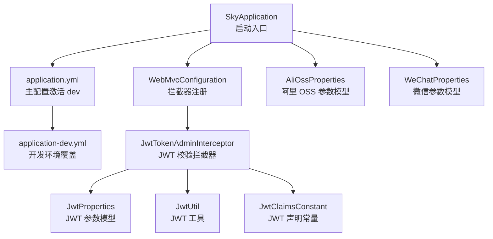
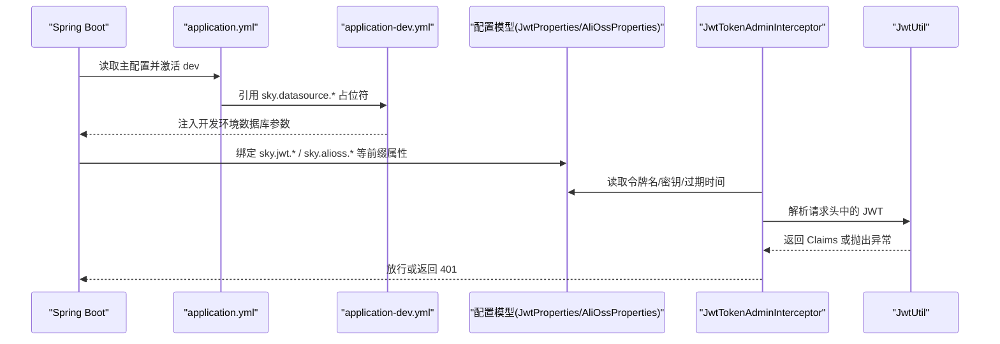
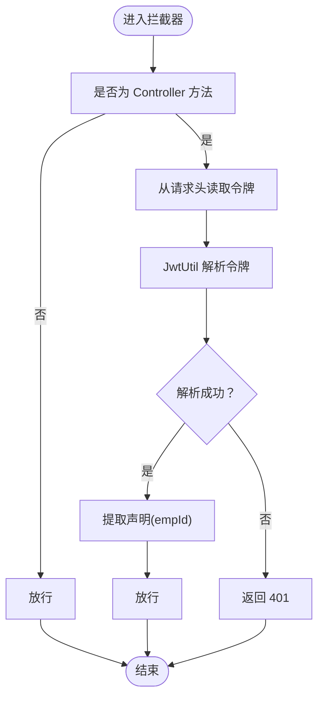
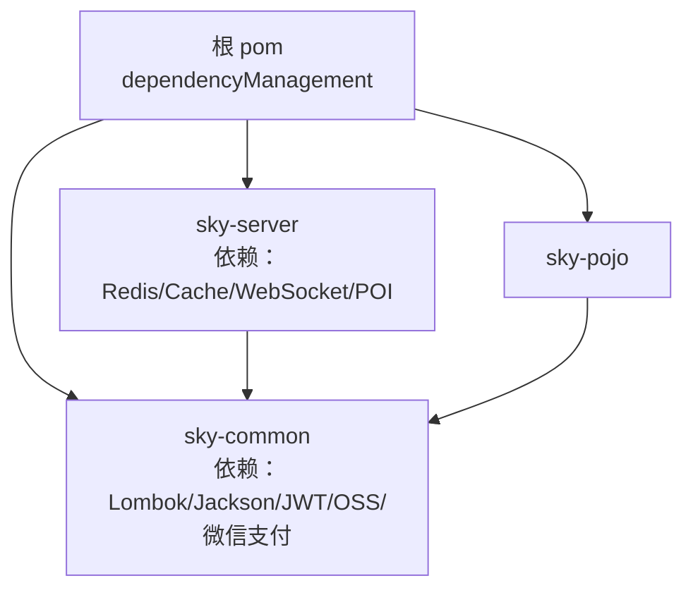

# 配置管理

<cite>
**本文引用的文件**
- [application.yml](file://sky-server/src/main/resources/application.yml)
- [application-dev.yml](file://sky-server/src/main/resources/application-dev.yml)
- [SkyApplication.java](file://sky-server/src/main/java/com/sky/SkyApplication.java)
- [WebMvcConfiguration.java](file://sky-server/src/main/java/com/sky/config/WebMvcConfiguration.java)
- [JwtTokenAdminInterceptor.java](file://sky-server/src/main/java/com/sky/interceptor/JwtTokenAdminInterceptor.java)
- [JwtProperties.java](file://sky-common/src/main/java/com/sky/properties/JwtProperties.java)
- [AliOssProperties.java](file://sky-common/src/main/java/com/sky/properties/AliOssProperties.java)
- [WeChatProperties.java](file://sky-common/src/main/java/com/sky/properties/WeChatProperties.java)
- [JwtUtil.java](file://sky-common/src/main/java/com/sky/utils/JwtUtil.java)
- [JwtClaimsConstant.java](file://sky-common/src/main/java/com/sky/constant/JwtClaimsConstant.java)
- [pom.xml（根）](file://pom.xml)
- [pom.xml（sky-server）](file://sky-server/pom.xml)
- [pom.xml（sky-common）](file://sky-common/pom.xml)
</cite>

## 目录
1. [简介](#简介)
2. [项目结构](#项目结构)
3. [核心组件](#核心组件)
4. [架构总览](#架构总览)
5. [详细组件分析](#详细组件分析)
6. [依赖分析](#依赖分析)
7. [性能考量](#性能考量)
8. [故障排查指南](#故障排查指南)
9. [结论](#结论)
10. [附录](#附录)

## 简介
本文件系统性梳理“苍穹外卖”点餐系统的配置管理方案，重点覆盖：
- 多环境配置策略与差异（开发、测试、生产）
- 关键配置项的作用与设置方法（数据库连接、JWT 参数、文件存储等）
- 配置文件优先级与覆盖规则
- 最佳实践与安全注意事项
- 配置验证与常见问题排查

## 项目结构
系统采用 Spring Boot 多模块结构，配置集中在 sky-server 的 resources 下，通过 Spring Profile 切换不同环境；公共配置模型位于 sky-common 的 properties 包中。

图表来源
- [SkyApplication.java:11-16](file://sky-server/src/main/java/com/sky/SkyApplication.java#L11-L16)
- [application.yml:1-40](file://sky-server/src/main/resources/application.yml#L1-L40)
- [application-dev.yml:1-9](file://sky-server/src/main/resources/application-dev.yml#L1-L9)
- [WebMvcConfiguration.java:23-38](file://sky-server/src/main/java/com/sky/config/WebMvcConfiguration.java#L23-L38)
- [JwtTokenAdminInterceptor.java:20-58](file://sky-server/src/main/java/com/sky/interceptor/JwtTokenAdminInterceptor.java#L20-L58)
- [JwtProperties.java:7-26](file://sky-common/src/main/java/com/sky/properties/JwtProperties.java#L7-L26)
- [AliOssProperties.java:7-17](file://sky-common/src/main/java/com/sky/properties/AliOssProperties.java#L7-L17)
- [WeChatProperties.java:8-23](file://sky-common/src/main/java/com/sky/properties/WeChatProperties.java#L8-L23)

章节来源
- [SkyApplication.java:11-16](file://sky-server/src/main/java/com/sky/SkyApplication.java#L11-L16)
- [application.yml:1-40](file://sky-server/src/main/resources/application.yml#L1-L40)
- [application-dev.yml:1-9](file://sky-server/src/main/resources/application-dev.yml#L1-L9)

## 核心组件
- 多环境配置
  - 主配置文件 application.yml 激活 dev 环境，并通过占位符引用 sky.datasource.* 与 sky.jwt.* 等命名空间下的变量。
  - 开发环境配置 application-dev.yml 覆盖 sky.datasource.* 的具体值，实现本地开发数据库连接。
- JWT 配置与使用
  - JwtProperties 提供管理端与用户端的密钥、过期时间、令牌名等参数。
  - JwtTokenAdminInterceptor 读取请求头中的令牌名并调用 JwtUtil 解析校验。
  - JwtClaimsConstant 定义 JWT 中的关键声明键名。
- 文件存储与微信支付配置
  - AliOssProperties 提供 OSS 访问所需的 endpoint、凭证与桶名。
  - WeChatProperties 提供小程序 appId/secret、商户号、证书路径、回调地址等。
- MyBatis 与日志
  - application.yml 中配置了 MyBatis 的 Mapper 映射位置、类型别名包以及驼峰命名开关。
  - 日志级别对 mapper/service/controller 分层输出，便于定位问题。

章节来源
- [application.yml:1-40](file://sky-server/src/main/resources/application.yml#L1-L40)
- [application-dev.yml:1-9](file://sky-server/src/main/resources/application-dev.yml#L1-L9)
- [JwtProperties.java:7-26](file://sky-common/src/main/java/com/sky/properties/JwtProperties.java#L7-L26)
- [JwtTokenAdminInterceptor.java:20-58](file://sky-server/src/main/java/com/sky/interceptor/JwtTokenAdminInterceptor.java#L20-L58)
- [JwtUtil.java:11-59](file://sky-common/src/main/java/com/sky/utils/JwtUtil.java#L11-L59)
- [JwtClaimsConstant.java:3-11](file://sky-common/src/main/java/com/sky/constant/JwtClaimsConstant.java#L3-L11)
- [AliOssProperties.java:7-17](file://sky-common/src/main/java/com/sky/properties/AliOssProperties.java#L7-L17)
- [WeChatProperties.java:8-23](file://sky-common/src/main/java/com/sky/properties/WeChatProperties.java#L8-L23)

## 架构总览
下图展示配置在系统中的加载与使用流程，体现“主配置 + 环境覆盖 + 属性模型 + 拦截器校验”的整体关系。

图表来源
- [application.yml:1-40](file://sky-server/src/main/resources/application.yml#L1-L40)
- [application-dev.yml:1-9](file://sky-server/src/main/resources/application-dev.yml#L1-L9)
- [JwtProperties.java:7-26](file://sky-common/src/main/java/com/sky/properties/JwtProperties.java#L7-L26)
- [JwtTokenAdminInterceptor.java:20-58](file://sky-server/src/main/java/com/sky/interceptor/JwtTokenAdminInterceptor.java#L20-L58)
- [JwtUtil.java:41-56](file://sky-common/src/main/java/com/sky/utils/JwtUtil.java#L41-L56)

## 详细组件分析

### 多环境配置策略与差异
- 激活方式
  - application.yml 中通过 spring.profiles.active 指定当前激活的环境为 dev。
- 数据库连接差异
  - application.yml 使用占位符 sky.datasource.*，实际值由 application-dev.yml 提供。
  - 开发环境示例中明确 driver-class-name、host、port、database、username、password。
- 其他配置差异
  - 可按需在各环境 yml 中覆盖 sky.jwt.*、sky.alioss.*、sky.wechat.* 等命名空间下的参数，形成“主配置 + 环境覆盖”的分层结构。

章节来源
- [application.yml:4-14](file://sky-server/src/main/resources/application.yml#L4-L14)
- [application-dev.yml:1-9](file://sky-server/src/main/resources/application-dev.yml#L1-L9)

### 数据库连接配置
- 占位符绑定
  - application.yml 中 datasource.druid.* 通过 ${sky.datasource.*} 引用，避免硬编码。
- 开发环境覆盖
  - application-dev.yml 提供具体的主机、端口、数据库名、账号与密码。
- MyBatis 配置
  - application.yml 指定 Mapper XML 位置、实体包扫描与驼峰命名转换，确保 SQL 与 Java 字段映射一致。

章节来源
- [application.yml:9-22](file://sky-server/src/main/resources/application.yml#L9-L22)
- [application-dev.yml:2-8](file://sky-server/src/main/resources/application-dev.yml#L2-L8)

### JWT 参数与拦截器校验
- 参数模型
  - JwtProperties 提供管理端与用户端的密钥、过期时间、令牌名等字段。
- 拦截器逻辑
  - JwtTokenAdminInterceptor 从请求头读取令牌名对应的值，调用 JwtUtil 解析并提取声明，失败时返回 401。
- 声明常量
  - JwtClaimsConstant 定义了 empId 等关键声明键名，保证前后端一致。

图表来源
- [JwtTokenAdminInterceptor.java:34-56](file://sky-server/src/main/java/com/sky/interceptor/JwtTokenAdminInterceptor.java#L34-L56)
- [JwtUtil.java:41-56](file://sky-common/src/main/java/com/sky/utils/JwtUtil.java#L41-L56)
- [JwtClaimsConstant.java:3-11](file://sky-common/src/main/java/com/sky/constant/JwtClaimsConstant.java#L3-L11)

章节来源
- [JwtProperties.java:7-26](file://sky-common/src/main/java/com/sky/properties/JwtProperties.java#L7-L26)
- [JwtTokenAdminInterceptor.java:20-58](file://sky-server/src/main/java/com/sky/interceptor/JwtTokenAdminInterceptor.java#L20-L58)
- [JwtUtil.java:11-59](file://sky-common/src/main/java/com/sky/utils/JwtUtil.java#L11-L59)
- [JwtClaimsConstant.java:3-11](file://sky-common/src/main/java/com/sky/constant/JwtClaimsConstant.java#L3-L11)

### 文件存储配置（阿里云 OSS）
- 配置模型
  - AliOssProperties 提供 endpoint、accessKeyId、accessKeySecret、bucketName 等字段。
- 使用场景
  - 在业务代码中注入 AliOssProperties，结合 OSS SDK 进行对象上传、下载与管理。

章节来源
- [AliOssProperties.java:7-17](file://sky-common/src/main/java/com/sky/properties/AliOssProperties.java#L7-L17)

### 微信支付配置
- 配置模型
  - WeChatProperties 提供小程序 appId/secret、商户号、证书序列号、私钥/证书文件路径、APIv3 密钥、回调地址等。
- 使用场景
  - 在支付流程中读取这些参数完成微信支付相关操作。

章节来源
- [WeChatProperties.java:8-23](file://sky-common/src/main/java/com/sky/properties/WeChatProperties.java#L8-L23)

### 日志与 MyBatis 配置
- 日志级别
  - application.yml 对 com.sky.mapper、service、controller 分层设置日志级别，便于开发调试。
- MyBatis
  - Mapper XML 位置、实体包扫描与驼峰命名转换均在 application.yml 中集中配置。

章节来源
- [application.yml:24-31](file://sky-server/src/main/resources/application.yml#L24-L31)

## 依赖分析
- 模块依赖
  - 根 pom 定义了 sky-common、sky-pojo、sky-server 三个模块，其中 sky-server 为主应用模块。
- 依赖管理
  - 根 pom 的 dependencyManagement 统一管理 MyBatis、Druid、PageHelper、Knife4j、JWT、OSS、POI、微信支付等版本。
- sky-server 依赖
  - sky-server 的 pom 引入了 Redis、Cache、WebSocket、POI 等依赖，用于缓存、会话与报表导出等能力。
- sky-common 依赖
  - sky-common 引入 Lombok、Fastjson、Jackson、JWT、OSS SDK、微信支付客户端等，支撑通用工具与第三方集成。

图表来源
- [pom.xml（根）:34-125](file://pom.xml#L34-L125)
- [pom.xml（sky-server）:89-118](file://sky-server/pom.xml#L89-L118)
- [pom.xml（sky-common）:12-52](file://sky-common/pom.xml#L12-L52)

章节来源
- [pom.xml（根）:15-19](file://pom.xml#L15-L19)
- [pom.xml（根）:34-125](file://pom.xml#L34-L125)
- [pom.xml（sky-server）:89-118](file://sky-server/pom.xml#L89-L118)
- [pom.xml（sky-common）:12-52](file://sky-common/pom.xml#L12-L52)

## 性能考量
- 数据库连接池
  - application.yml 使用 Druid 连接池，建议在生产环境结合监控指标（最大活跃数、空闲连接、等待超时）进行调优。
- MyBatis 驼峰映射
  - 已启用驼峰命名转换，减少手动映射开销，提升开发效率。
- 日志级别
  - 开发阶段可提高 mapper 日志级别辅助定位 SQL 性能问题；生产环境建议适度降低以减少 IO。

## 故障排查指南
- 环境未生效
  - 确认 application.yml 中 spring.profiles.active 是否正确指向目标环境文件（如 dev）。
  - 确认 application-{env}.yml 是否存在且命名规范一致。
- 数据库连接失败
  - 检查 application-dev.yml 中 driver-class-name、host、port、database、username、password 是否与本地/目标数据库一致。
  - 若使用占位符，请确认主配置 application.yml 中 sky.datasource.* 是否存在对应占位符。
- JWT 校验失败
  - 检查请求头中令牌名是否与 JwtProperties.adminTokenName 一致。
  - 确认密钥与过期时间配置是否匹配生成端。
  - 查看拦截器日志与 401 返回原因。
- 文件存储/微信支付异常
  - 校验 AliOssProperties 与 WeChatProperties 的参数是否完整、路径是否正确。
  - 生产环境注意敏感信息脱敏与只读权限控制。

章节来源
- [application.yml:4-14](file://sky-server/src/main/resources/application.yml#L4-L14)
- [application-dev.yml:1-9](file://sky-server/src/main/resources/application-dev.yml#L1-L9)
- [JwtTokenAdminInterceptor.java:34-56](file://sky-server/src/main/java/com/sky/interceptor/JwtTokenAdminInterceptor.java#L34-L56)
- [JwtProperties.java:7-26](file://sky-common/src/main/java/com/sky/properties/JwtProperties.java#L7-L26)
- [AliOssProperties.java:7-17](file://sky-common/src/main/java/com/sky/properties/AliOssProperties.java#L7-L17)
- [WeChatProperties.java:8-23](file://sky-common/src/main/java/com/sky/properties/WeChatProperties.java#L8-L23)

## 结论
本系统通过“主配置 + 环境覆盖 + 属性模型 + 拦截器校验”的方式实现了清晰、可维护的配置管理。建议在团队内统一约定命名空间与覆盖规则，并在 CI/CD 中严格管控敏感参数，确保开发、测试与生产的配置一致性与安全性。

## 附录

### 配置项清单与作用说明
- server.port
  - 作用：服务监听端口
  - 示例路径：[application.yml:1-2](file://sky-server/src/main/resources/application.yml#L1-L2)
- spring.profiles.active
  - 作用：激活的环境标识
  - 示例路径：[application.yml:4-6](file://sky-server/src/main/resources/application.yml#L4-L6)
- spring.datasource.druid.*
  - 作用：数据源连接池配置（驱动、URL、用户名、密码）
  - 示例路径：[application.yml:9-14](file://sky-server/src/main/resources/application.yml#L9-L14)
- sky.datasource.*
  - 作用：数据库连接参数占位符，由环境 yml 覆盖
  - 示例路径：[application.yml:11-14](file://sky-server/src/main/resources/application.yml#L11-L14)、[application-dev.yml:2-8](file://sky-server/src/main/resources/application-dev.yml#L2-L8)
- mybatis.mapper-locations / type-aliases-package / configuration.map-underscore-to-camel-case
  - 作用：MyBatis Mapper XML 位置、实体包扫描、驼峰命名转换
  - 示例路径：[application.yml:16-22](file://sky-server/src/main/resources/application.yml#L16-L22)
- logging.level.com.sky.*
  - 作用：分层日志级别
  - 示例路径：[application.yml:24-30](file://sky-server/src/main/resources/application.yml#L24-L30)
- sky.jwt.admin-secret-key / admin-ttl / admin-token-name
  - 作用：管理端 JWT 密钥、过期时间、请求头令牌名
  - 示例路径：[application.yml:32-39](file://sky-server/src/main/resources/application.yml#L32-L39)、[JwtProperties.java:14-17](file://sky-common/src/main/java/com/sky/properties/JwtProperties.java#L14-L17)
- sky.alioss.endpoint / accessKeyId / accessKeySecret / bucketName
  - 作用：阿里云 OSS 访问参数
  - 示例路径：[AliOssProperties.java:11-15](file://sky-common/src/main/java/com/sky/properties/AliOssProperties.java#L11-L15)
- sky.wechat.*
  - 作用：微信小程序与支付相关参数
  - 示例路径：[WeChatProperties.java:12-21](file://sky-common/src/main/java/com/sky/properties/WeChatProperties.java#L12-L21)

### 配置文件优先级与覆盖规则
- 优先级顺序（从高到低）
  1) 命令行参数
  2) SPRING_APPLICATION_JSON
  3) 操作系统环境变量
  4) application-{profile}.yml
  5) application.yml
- 覆盖规则
  - application.yml 定义默认值与占位符；application-dev.yml 覆盖 sky.datasource.* 与 sky.jwt.* 等命名空间下的同名键，最终生效值以更高优先级为准。

章节来源
- [application.yml:4-14](file://sky-server/src/main/resources/application.yml#L4-L14)
- [application-dev.yml:1-9](file://sky-server/src/main/resources/application-dev.yml#L1-L9)