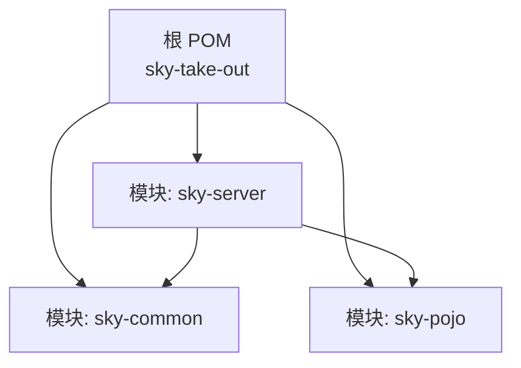
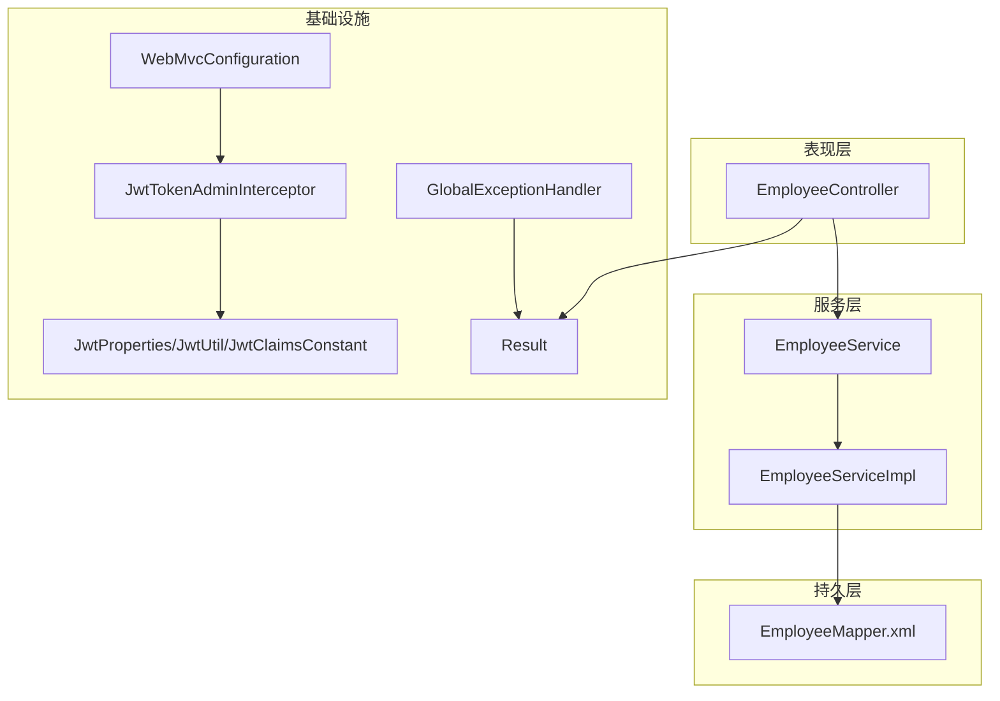
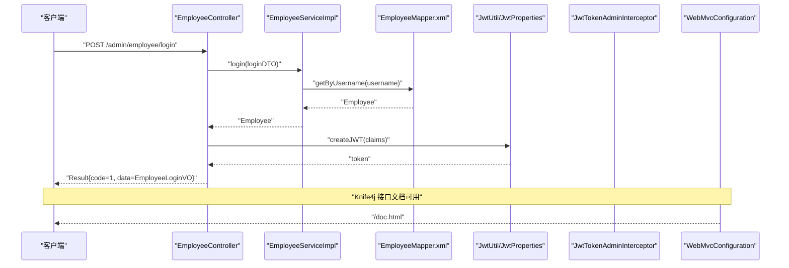
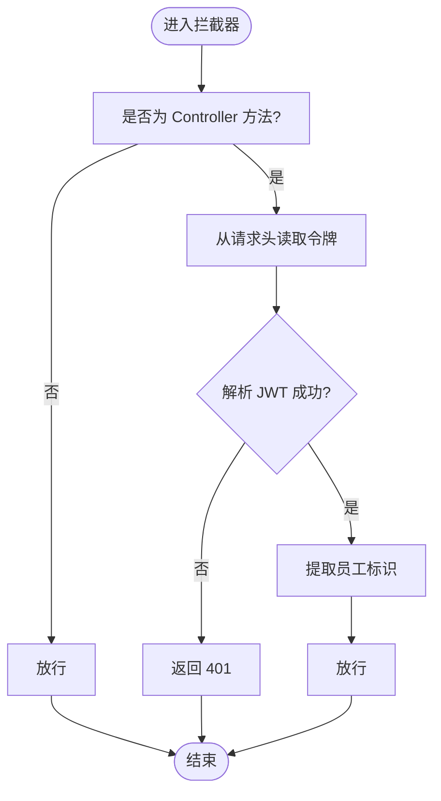
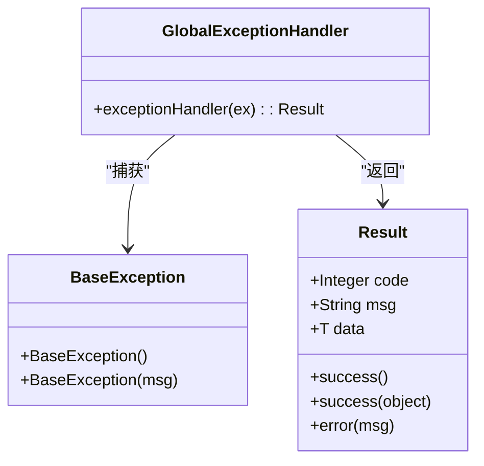
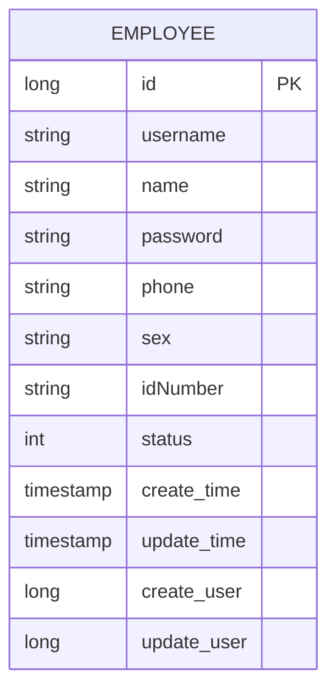
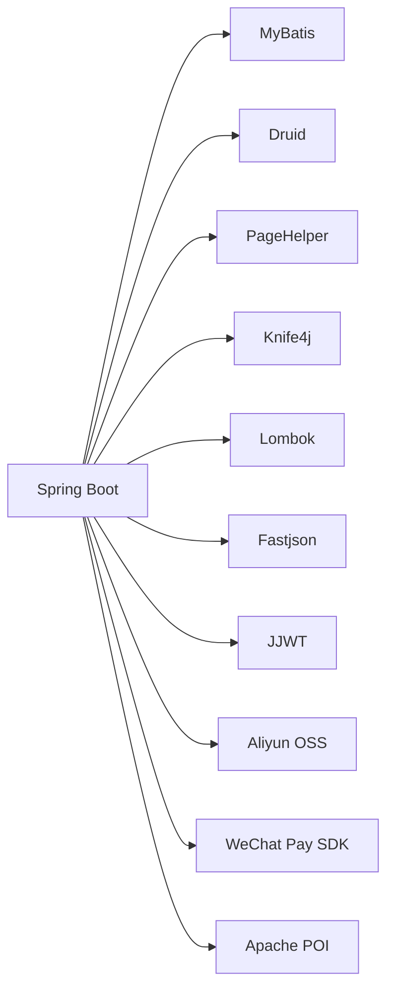

# 项目概述

<cite>
**本文引用的文件**
- [pom.xml](file://pom.xml)
- [SkyApplication.java](file://sky-server/src/main/java/com/sky/SkyApplication.java)
- [application.yml](file://sky-server/src/main/resources/application.yml)
- [application-dev.yml](file://sky-server/src/main/resources/application-dev.yml)
- [EmployeeController.java](file://sky-server/src/main/java/com/sky/controller/admin/EmployeeController.java)
- [EmployeeService.java](file://sky-server/src/main/java/com/sky/service/EmployeeService.java)
- [EmployeeServiceImpl.java](file://sky-server/src/main/java/com/sky/service/impl/EmployeeServiceImpl.java)
- [Employee.java](file://sky-pojo/src/main/java/com/sky/entity/Employee.java)
- [EmployeeLoginDTO.java](file://sky-pojo/src/main/java/com/sky/dto/EmployeeLoginDTO.java)
- [WebMvcConfiguration.java](file://sky-server/src/main/java/com/sky/config/WebMvcConfiguration.java)
- [JwtTokenAdminInterceptor.java](file://sky-server/src/main/java/com/sky/interceptor/JwtTokenAdminInterceptor.java)
- [GlobalExceptionHandler.java](file://sky-server/src/main/java/com/sky/handler/GlobalExceptionHandler.java)
- [Result.java](file://sky-common/src/main/java/com/sky/result/Result.java)
- [BaseException.java](file://sky-common/src/main/java/com/sky/exception/BaseException.java)
- [JwtProperties.java](file://sky-common/src/main/java/com/sky/properties/JwtProperties.java)
- [JwtClaimsConstant.java](file://sky-common/src/main/java/com/sky/constant/JwtClaimsConstant.java)
- [JwtUtil.java](file://sky-common/src/main/java/com/sky/utils/JwtUtil.java)
- [sky-common/pom.xml](file://sky-common/pom.xml)
- [sky-pojo/pom.xml](file://sky-pojo/pom.xml)
- [sky-server/pom.xml](file://sky-server/pom.xml)
</cite>

## 目录
1. [引言](#引言)
2. [项目结构](#项目结构)
3. [核心组件](#核心组件)
4. [架构总览](#架构总览)
5. [详细组件分析](#详细组件分析)
6. [依赖分析](#依赖分析)
7. [性能考虑](#性能考虑)
8. [故障排查指南](#故障排查指南)
9. [结论](#结论)
10. [附录](#附录)

## 引言
本项目为“苍穹外卖点餐系统”，是一个基于 Java 的企业级外卖平台后端工程，采用多模块分层架构设计，围绕管理员端与用户端的典型业务场景展开，重点实现员工登录认证、统一结果返回、全局异常处理、JWT 令牌校验等核心能力。项目通过 Spring Boot、MyBatis、MySQL、Redis、Knife4j 等现代化技术栈构建，具备清晰的模块边界、良好的可扩展性与可维护性，适合在中小型互联网公司或教育场景中作为实战学习与二次开发的基础。

## 项目结构
项目采用 Maven 多模块聚合结构，包含以下三大模块：
- sky-common：通用工具与常量、异常、配置属性、JSON 工具、JWT 工具等公共能力封装。
- sky-pojo：领域模型与 DTO/VO 定义，承载业务数据结构。
- sky-server：应用服务模块，包含启动类、控制器、服务、拦截器、全局异常处理、Web MVC 配置以及数据库连接配置等。

图表来源
- [pom.xml:15-19](file://pom.xml#L15-L19)
- [sky-server/pom.xml:14-24](file://sky-server/pom.xml#L14-L24)

章节来源
- [pom.xml:15-19](file://pom.xml#L15-L19)
- [sky-common/pom.xml:1-54](file://sky-common/pom.xml#L1-L54)
- [sky-pojo/pom.xml:1-28](file://sky-pojo/pom.xml#L1-L28)
- [sky-server/pom.xml:1-130](file://sky-server/pom.xml#L1-L130)

## 核心组件
- 统一结果包装：Result 类提供统一的响应结构，简化前后端交互。
- 全局异常处理：GlobalExceptionHandler 捕获业务异常并返回统一格式。
- JWT 认证体系：JwtProperties、JwtClaimsConstant、JwtUtil 提供密钥、声明与签发/解析能力；JwtTokenAdminInterceptor 在管理端接口上进行令牌校验。
- 控制器与服务：EmployeeController 负责员工登录/登出；EmployeeService 及其实现负责登录业务逻辑与数据库交互。
- Web 配置：WebMvcConfiguration 注册拦截器与 Knife4j 文档，提供接口调试与测试能力。
- 数据模型与传输对象：Employee、EmployeeLoginDTO 等支撑登录流程的数据结构。

章节来源
- [Result.java:11-39](file://sky-common/src/main/java/com/sky/result/Result.java#L11-L39)
- [GlobalExceptionHandler.java:12-28](file://sky-server/src/main/java/com/sky/handler/GlobalExceptionHandler.java#L12-L28)
- [JwtProperties.java:10-27](file://sky-common/src/main/java/com/sky/properties/JwtProperties.java#L10-L27)
- [JwtClaimsConstant.java:3-12](file://sky-common/src/main/java/com/sky/constant/JwtClaimsConstant.java#L3-L12)
- [JwtUtil.java:11-59](file://sky-common/src/main/java/com/sky/utils/JwtUtil.java#L11-L59)
- [JwtTokenAdminInterceptor.java:20-59](file://sky-server/src/main/java/com/sky/interceptor/JwtTokenAdminInterceptor.java#L20-L59)
- [EmployeeController.java:27-75](file://sky-server/src/main/java/com/sky/controller/admin/EmployeeController.java#L27-L75)
- [EmployeeService.java:6-16](file://sky-server/src/main/java/com/sky/service/EmployeeService.java#L6-L16)
- [EmployeeServiceImpl.java:17-58](file://sky-server/src/main/java/com/sky/service/impl/EmployeeServiceImpl.java#L17-L58)
- [WebMvcConfiguration.java:23-69](file://sky-server/src/main/java/com/sky/config/WebMvcConfiguration.java#L23-L69)
- [Employee.java:15-46](file://sky-pojo/src/main/java/com/sky/entity/Employee.java#L15-L46)
- [EmployeeLoginDTO.java:11-20](file://sky-pojo/src/main/java/com/sky/dto/EmployeeLoginDTO.java#L11-L20)

## 架构总览
系统采用典型的分层架构：
- 表现层：Spring MVC 控制器，负责接收请求、参数校验、调用服务层并返回统一结果。
- 服务层：业务逻辑编排与异常处理，必要时访问持久层。
- 持久层：MyBatis Mapper 访问数据库，结合 Druid 连接池与 PageHelper 分页。
- 基础设施：JWT 认证、全局异常处理、Knife4j 文档、日志与配置。

图表来源
- [EmployeeController.java:27-75](file://sky-server/src/main/java/com/sky/controller/admin/EmployeeController.java#L27-L75)
- [EmployeeService.java:6-16](file://sky-server/src/main/java/com/sky/service/EmployeeService.java#L6-L16)
- [EmployeeServiceImpl.java:17-58](file://sky-server/src/main/java/com/sky/service/impl/EmployeeServiceImpl.java#L17-L58)
- [WebMvcConfiguration.java:23-69](file://sky-server/src/main/java/com/sky/config/WebMvcConfiguration.java#L23-L69)
- [JwtTokenAdminInterceptor.java:20-59](file://sky-server/src/main/java/com/sky/interceptor/JwtTokenAdminInterceptor.java#L20-L59)
- [GlobalExceptionHandler.java:12-28](file://sky-server/src/main/java/com/sky/handler/GlobalExceptionHandler.java#L12-L28)
- [Result.java:11-39](file://sky-common/src/main/java/com/sky/result/Result.java#L11-L39)
- [JwtProperties.java:10-27](file://sky-common/src/main/java/com/sky/properties/JwtProperties.java#L10-L27)
- [JwtUtil.java:11-59](file://sky-common/src/main/java/com/sky/utils/JwtUtil.java#L11-L59)
- [JwtClaimsConstant.java:3-12](file://sky-common/src/main/java/com/sky/constant/JwtClaimsConstant.java#L3-L12)

## 详细组件分析

### 员工登录流程（序列图）
该流程展示了管理端登录的完整链路：控制器接收请求、服务层执行登录、JWT 生成与返回、拦截器校验与文档配置。

图表来源
- [EmployeeController.java:40-62](file://sky-server/src/main/java/com/sky/controller/admin/EmployeeController.java#L40-L62)
- [EmployeeServiceImpl.java:28-55](file://sky-server/src/main/java/com/sky/service/impl/EmployeeServiceImpl.java#L28-L55)
- [JwtUtil.java:21-39](file://sky-common/src/main/java/com/sky/utils/JwtUtil.java#L21-L39)
- [JwtProperties.java:15-17](file://sky-common/src/main/java/com/sky/properties/JwtProperties.java#L15-L17)
- [WebMvcConfiguration.java:44-58](file://sky-server/src/main/java/com/sky/config/WebMvcConfiguration.java#L44-L58)

章节来源
- [EmployeeController.java:27-75](file://sky-server/src/main/java/com/sky/controller/admin/EmployeeController.java#L27-L75)
- [EmployeeServiceImpl.java:17-58](file://sky-server/src/main/java/com/sky/service/impl/EmployeeServiceImpl.java#L17-L58)
- [Employee.java:15-46](file://sky-pojo/src/main/java/com/sky/entity/Employee.java#L15-L46)
- [EmployeeLoginDTO.java:11-20](file://sky-pojo/src/main/java/com/sky/dto/EmployeeLoginDTO.java#L11-L20)
- [JwtUtil.java:11-59](file://sky-common/src/main/java/com/sky/utils/JwtUtil.java#L11-L59)
- [JwtProperties.java:10-27](file://sky-common/src/main/java/com/sky/properties/JwtProperties.java#L10-L27)

### JWT 令牌校验流程（拦截器）
管理端接口通过拦截器进行统一校验，除登录接口外，所有 /admin/** 请求均需携带有效令牌。

图表来源
- [JwtTokenAdminInterceptor.java:34-57](file://sky-server/src/main/java/com/sky/interceptor/JwtTokenAdminInterceptor.java#L34-L57)
- [JwtUtil.java:48-56](file://sky-common/src/main/java/com/sky/utils/JwtUtil.java#L48-L56)
- [JwtClaimsConstant.java:5-9](file://sky-common/src/main/java/com/sky/constant/JwtClaimsConstant.java#L5-L9)
- [WebMvcConfiguration.java:33-38](file://sky-server/src/main/java/com/sky/config/WebMvcConfiguration.java#L33-L38)

章节来源
- [JwtTokenAdminInterceptor.java:18-59](file://sky-server/src/main/java/com/sky/interceptor/JwtTokenAdminInterceptor.java#L18-L59)
- [WebMvcConfiguration.java:23-69](file://sky-server/src/main/java/com/sky/config/WebMvcConfiguration.java#L23-L69)

### 统一结果与异常处理
- Result：统一返回结构，成功/失败/错误信息标准化。
- GlobalExceptionHandler：捕获 BaseException 子类并返回 Result.error，避免异常穿透。

图表来源
- [Result.java:11-39](file://sky-common/src/main/java/com/sky/result/Result.java#L11-L39)
- [BaseException.java:6-16](file://sky-common/src/main/java/com/sky/exception/BaseException.java#L6-L16)
- [GlobalExceptionHandler.java:12-28](file://sky-server/src/main/java/com/sky/handler/GlobalExceptionHandler.java#L12-L28)

章节来源
- [Result.java:11-39](file://sky-common/src/main/java/com/sky/result/Result.java#L11-L39)
- [BaseException.java:6-16](file://sky-common/src/main/java/com/sky/exception/BaseException.java#L6-L16)
- [GlobalExceptionHandler.java:12-28](file://sky-server/src/main/java/com/sky/handler/GlobalExceptionHandler.java#L12-L28)

### 数据模型与传输对象
- Employee：员工实体，包含基础字段与时间戳。
- EmployeeLoginDTO：登录请求 DTO，用于接收用户名与密码。

图表来源
- [Employee.java:15-46](file://sky-pojo/src/main/java/com/sky/entity/Employee.java#L15-L46)

章节来源
- [Employee.java:15-46](file://sky-pojo/src/main/java/com/sky/entity/Employee.java#L15-L46)
- [EmployeeLoginDTO.java:11-20](file://sky-pojo/src/main/java/com/sky/dto/EmployeeLoginDTO.java#L11-L20)

## 依赖分析
- 技术栈与版本：
  - Spring Boot 2.7.3、MyBatis、Druid、PageHelper、Knife4j、Lombok、Fastjson、JWT(JJWT)、阿里 OSS、微信支付 SDK、POI。
- 模块间依赖：
  - sky-server 依赖 sky-common 与 sky-pojo。
  - sky-common 与 sky-pojo 不互相依赖，保持高内聚低耦合。
- 外部集成：
  - MySQL 数据源通过 Druid 连接池配置。
  - Redis 与缓存 Starter 已引入，便于后续扩展。
  - Knife4j 提供在线接口文档能力。

图表来源
- [pom.xml:34-126](file://pom.xml#L34-L126)
- [sky-server/pom.xml:12-118](file://sky-server/pom.xml#L12-L118)
- [sky-common/pom.xml:12-52](file://sky-common/pom.xml#L12-L52)
- [sky-pojo/pom.xml:12-26](file://sky-pojo/pom.xml#L12-L26)

章节来源
- [pom.xml:20-126](file://pom.xml#L20-L126)
- [sky-server/pom.xml:12-118](file://sky-server/pom.xml#L12-L118)
- [sky-common/pom.xml:12-52](file://sky-common/pom.xml#L12-L52)
- [sky-pojo/pom.xml:12-26](file://sky-pojo/pom.xml#L12-L26)

## 性能考虑
- 连接池与分页：Druid 连接池与 PageHelper 分页可降低数据库压力，提升查询效率。
- 缓存与会话：已引入 Redis 与缓存 Starter，建议在热点数据与会话存储场景中启用，减少数据库访问。
- 日志与监控：合理配置日志级别，避免生产环境过多 debug 输出影响性能。
- 序列化：统一使用 Fastjson，注意大对象序列化开销，必要时采用流式输出或分页策略。

## 故障排查指南
- 登录失败：
  - 检查用户名是否存在与密码是否正确，确认数据库中员工状态正常。
  - 关注服务层异常抛出与全局异常处理器返回。
- 401 未授权：
  - 确认请求头中携带正确的令牌名称与令牌值。
  - 校验 JWT 密钥与过期时间配置是否一致。
- 接口文档不可用：
  - 检查 Knife4j 配置与静态资源映射路径。
- 数据库连接问题：
  - 校验 application.yml 中的数据库连接参数与环境变量。

章节来源
- [EmployeeServiceImpl.java:36-51](file://sky-server/src/main/java/com/sky/service/impl/EmployeeServiceImpl.java#L36-L51)
- [GlobalExceptionHandler.java:21-25](file://sky-server/src/main/java/com/sky/handler/GlobalExceptionHandler.java#L21-L25)
- [JwtTokenAdminInterceptor.java:42-56](file://sky-server/src/main/java/com/sky/interceptor/JwtTokenAdminInterceptor.java#L42-L56)
- [WebMvcConfiguration.java:64-67](file://sky-server/src/main/java/com/sky/config/WebMvcConfiguration.java#L64-L67)
- [application.yml:9-14](file://sky-server/src/main/resources/application.yml#L9-L14)

## 结论
“苍穹外卖点餐系统”以多模块分层架构为基础，结合 JWT 认证、统一结果与异常处理、Knife4j 文档等现代化实践，形成了清晰、稳定且易于扩展的后端骨架。其模块划分明确、依赖关系简单、技术栈成熟，既满足教学与实战演练需求，也为后续在菜品、订单、套餐、配送等业务模块的扩展提供了良好基础。

## 附录
- 启动入口：SkyApplication 作为 Spring Boot 启动类，开启事务注解。
- 配置文件：application.yml 与 application-dev.yml 分离环境配置，便于本地与生产部署。
- 业务定位：面向餐厅/商户后台的员工管理与运营支撑，强调登录认证与接口规范。

章节来源
- [SkyApplication.java:11-16](file://sky-server/src/main/java/com/sky/SkyApplication.java#L11-L16)
- [application.yml:1-40](file://sky-server/src/main/resources/application.yml#L1-L40)
- [application-dev.yml:1-9](file://sky-server/src/main/resources/application-dev.yml#L1-L9)